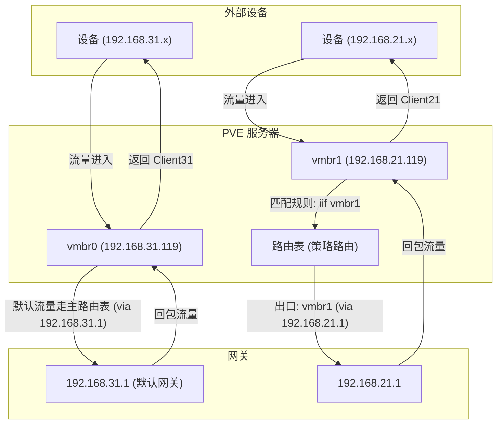

<!-- markdownlint-disable-next-line MD033 -->
<meta name="referrer" content="no-referrer"/>


## 简介

本文汇总了我在三台联想 M920x 上搭建和使用 **PVE**（Proxmox Virtual Environment）过程中的心得与遇到的问题。

在选择虚拟化平台时，我倾向于 **PVE** 而非 **ESXi**（vSphere Hypervisor）。

这一选择基于 PVE 的开源性及其基于 Debian 的架构，这为它带来了相比 ESXi 更多的可玩性和折腾空间。

> 选择 PVE 或 ESXi 并不在于哪个更优秀，而在于哪个更能满足个人的特定需求。

## 安装完成后 IP 不对

启动后出现了一张 `vmbr0` 网卡, 这个是桥接网卡, 可以查看绑定的物理网卡:

```bash
ip link show master vmbr0
```

修改一下 3 个文件:

```bash
# /etc/network/interfaces

auto lo
iface lo inet loopback

iface enp92s0 inet manual

auto vmbr0
iface vmbr0 inet static
	address 192.168.100.100/24
	gateway 192.168.100.1
	bridge-ports enp92s0
	bridge-stp off
	bridge-fd 0

# /etc/issue
Welcome to the Proxmox Virtual Environment. Please use your web browser to
configure this server - connect to:

  https://192.168.100.100:8006/

# /etc/hosts

127.0.0.1 localhost.localdomain localhost
192.168.100.100 nuc.ihome nuc
```

**参考:**

- https://www.zhihu.com/tardis/zm/art/492484833?source_id=1003

---

## 更换源

```bash
apt install apt-transport-https ca-certificates

wget https://mirrors.ustc.edu.cn/proxmox/debian/proxmox-release-bookworm.gpg -O /etc/apt/trusted.gpg.d/proxmox-release-bookworm.gpg
```

### 通用软件源

```bash
cp /etc/apt/sources.list /etc/apt/sources.list.bak
vim /etc/apt/sources.list
```

```bash
# 默认注释了源码镜像以提高 apt update 速度，如有需要可自行取消注释
deb https://mirrors.tuna.tsinghua.edu.cn/debian/ bookworm main contrib non-free-firmware

# deb-src https://mirrors.tuna.tsinghua.edu.cn/debian/ bookworm main contrib non-free-firmware
deb https://mirrors.tuna.tsinghua.edu.cn/debian/ bookworm-updates main contrib non-free-firmware
# deb-src https://mirrors.tuna.tsinghua.edu.cn/debian/ bookworm-updates main contrib non-free-firmware
deb https://mirrors.tuna.tsinghua.edu.cn/debian/ bookworm-backports main contrib non-free-firmware
# deb-src https://mirrors.tuna.tsinghua.edu.cn/debian/ bookworm-backports main contrib non-free-firmware
deb https://mirrors.tuna.tsinghua.edu.cn/debian-security bookworm-security main contrib non-free-firmware
# deb-src https://mirrors.tuna.tsinghua.edu.cn/debian-security bookworm-security main contrib non-free-firmware
```

### pve 软件源

```bash
cp /etc/apt/sources.list.d/pve-enterprise.list /etc/apt/sources.list.d/pve-enterprise.list.bak

# 清空 /etc/apt/sources.list.d/pve-enterprise.list
```

```bash
# 使用Proxmox非企业版源
echo "deb https://mirrors.ustc.edu.cn/proxmox/debian bookworm pve-no-subscription" > /etc/apt/sources.list.d/pve-no-subscription.list
```

### Ceph 源

```bash
cp /etc/apt/sources.list.d/ceph.list /etc/apt/sources.list.d/ceph.list.bak

echo "deb https://mirrors.ustc.edu.cn/proxmox/debian/ceph-quincy bookworm no-subscription" > /etc/apt/sources.list.d/ceph.list
```

### CT 镜像下载源

将 /usr/share/perl5/PVE/APLInfo.pm 文件中默认的源地址 http://download.proxmox.com 替换为 https://mirrors.tuna.tsinghua.edu.cn/proxmox 即可。

```bash
cp /usr/share/perl5/PVE/APLInfo.pm /usr/share/perl5/PVE/APLInfo.pm.bak

sed -i 's|http://download.proxmox.com|https://mirrors.ustc.edu.cn/proxmox|g' /usr/share/perl5/PVE/APLInfo.pm
```

```
{
    host => "mirrors.ustc.edu.cn",
    url => "https://mirrors.ustc.edu.cn/turnkeylinux/metadata/pve",
    file => 'aplinfo.dat',
}
```

```bash
systemctl restart pvedaemon.service && pveam update && pveam available
```

## 删除订阅弹窗

```bash
sed -Ezi.bak "s/(Ext.Msg.show\(\{\s+title: gettext\('No valid sub)/void\(\{ \/\/\1/g" /usr/share/javascript/proxmox-widget-toolkit/proxmoxlib.js && systemctl restart pveproxy.service
```

---

## oh-my-zsh

```bash

apt update && apt install git zsh curl \
	&& sh -c "$(curl -fsSL https://raw.githubusercontent.com/ohmyzsh/ohmyzsh/master/tools/install.sh)"

git clone https://github.com/zsh-users/zsh-syntax-highlighting.git ${ZSH_CUSTOM:-~/.oh-my-zsh/custom}/plugins/zsh-syntax-highlighting \
	&& git clone https://github.com/zsh-users/zsh-autosuggestions ${ZSH_CUSTOM:-~/.oh-my-zsh/custom}/plugins/zsh-autosuggestions \
  && git clone https://github.com/zsh-users/zsh-completions ${ZSH_CUSTOM:-${ZSH:-~/.oh-my-zsh}/custom}/plugins/zsh-completions
```

---

## 连接 WiFi

```bash
apt-get install wpasupplicant wireless-tools -y

ip link set wlp91s0 up
iwlist wlp91s0 scanning | grep "ESSID"

wpa_passphrase [WIFI名称] [WIFI密码]
```

> [No wpa_supplicant executable](https://raspberrypi.stackexchange.com/questions/137121/no-wpa-supplicant-executable)

会得到类似以下的输出(也可以使用网页工具计算: https://www.wireshark.org/tools/wpa-psk.html:

```
network={
    ssid="[WIFI名称]"
    #psk="[WIFI密码]"
    psk=[WIFI密码的密钥值]
}
```

我们需要复制这个 PSK 值。

---

1. 打开`/etc/network/interfaces`文件
2. 添加以下内容

```
auto [网卡名称]

# 如果你使用静态IP
iface [网卡名称] inet static
    address [你要分配的IP地址，如192.168.4.1/24]
    gateway [网关地址]
    wpa-ssid [WIFI名称]
    wpa-psk [WIFI密码的密钥值]

# 如果你使用动态IP
iface [网卡名称] inet dhcp
    wpa-ssid [WIFI名称]
    wpa-psk [WIFI密码的密钥值]
```

> 为了方便管理，我们推荐你使用静态 IP 3. 重启网络

```
ifdown [网卡名称]
ifup [网卡名称]
```

**安装 iw 工具**

```bash
apt install iw -y
```

**查看 WiFi 信息**

```bash
$ iwconfig wlp91s0
wlp91s0   IEEE 802.11  ESSID:"xxxxx"
          Mode:Managed  Frequency:5.745 GHz  Access Point: 9C:9D:7E:7C:90:19
          Bit Rate=29.2 Mb/s   Tx-Power=22 dBm
          Retry short limit:7   RTS thr:off   Fragment thr:off
          Encryption key:off
          Power Management:on
          Link Quality=48/70  Signal level=-62 dBm
          Rx invalid nwid:0  Rx invalid crypt:0  Rx invalid frag:0
          Tx excessive retries:0  Invalid misc:92   Missed beacon:0
```

**参考**

- [基于 PVE 与 AX210 无线网卡的 NAS 主机调试记录](https://www.bilibili.com/opus/938437808628957191)
- [proxmox 中使用 ax210 连接无线网络](https://foxi.buduanwang.vip/virtualization/pve/1939.html/)

---

## Web 打不开

`501 no such file '/PVE/StdWorkspace.js'`

```bash
apt install --reinstall proxmox-widget-toolkit

apt update && apt upgrade
apt install -f

apt dist-upgrade
pvecm updatecerts --force
service pveproxy restart
```

---

## pve_source 脚本

https://bbs.x86pi.cn/thread?topicId=20

**稳定版**

```bash
wget -q -O /root/pve_source.tar.gz 'https://bbs.x86pi.cn/file/topic/2023-11-28/file/01ac88d7d2b840cb88c15cb5e19d4305b2.gz' && tar zxvf /root/pve_source.tar.gz && /root/./pve_source
```

开发版 (PVE 系统配置 IOMMU、核显直通、核显 SR-IOV 调整为定制向导+推荐方案)

```bash
wget -q -O /root/pve_source.tar.gz 'https://bbs.x86pi.cn/file/topic/2024-01-06/file/24f723efc6ab4913b1f99c97a1d1a472b2.gz' && tar zxvf /root/pve_source.tar.gz && /root/./pve_source
```

---

## 迁移 Ubuntu 系统到 PVE

**列举一下已存在的 M.2 固态硬盘信息:**


一共 1T \*4 M.2 固态硬盘, 其中 **nvme0n1** 安装的 PVE, 其他 3 根还未使用.

### 镜像打包

原来安装 Ubuntu 的 M.2 500G 固态硬盘已经从机器上拔下来了, 为了将此固态硬盘中的系统打包成镜像然后恢复到 PVE 中, 这里使用了 Clonezilla 来完成这项工作.

使用到的工具:

1. [Clonezilla](https://clonezilla.org/)
2. [Ventoy](https://www.ventoy.net/)


执行完成后会在指定的 U 盘生成一些系统文件, 但是这个还不能直接使用, 所以我又使用 Clonezilla 将这些文件打包成 ISO.

> 最终的目的是将 Ubuntu 系统打包成 ISO, 然后在 PVE 中使用虚拟机安装.

**参考**

- [clonezilla(再生龙)克隆 linux 系统 操作指南](https://blog.csdn.net/weixin_36432129/article/details/130502411)
- [使用再生龙 CloneZilla 进行 Linux 系统的镜像完全封装和还原](https://zhuanlan.zhihu.com/p/354584111)

### 安装到 PVE

在 PVE 下查看 P40 显卡的信息：

```bash
lspci |  grep 3D
81:00.0 3D controller: NVIDIA Corporation GP102 [P102-100] (rev a1)
```

要直通这块卡给 Ubuntu 24.04 虚拟机，需要准备：

- 开启 pcie 直通
- 安装 Ubuntu 24.04 虚拟机(就是上一步打包的 ISO)

---

## 安装 Windows

https://www.mulingyuer.com/archives/1027/

https://willxup.top/archives/pve-install-win11

https://imacos.top/2023/09/07/pve-windows-11/

### 核显直通与虚拟核显直通

**物理核显直通 vs SRIOV vGPU 的优缺点对比：**

|                    | 优点                                                                              | 缺点                                                                                                                                                                                                                                                                                                                                                                        |
| ------------------ | --------------------------------------------------------------------------------- | --------------------------------------------------------------------------------------------------------------------------------------------------------------------------------------------------------------------------------------------------------------------------------------------------------------------------------------------------------------------------- |
| 物理核显直通       | 1、性能强 2、支持物理显示输出 (VGA/DP/HDMI/Type-C) 3、兼容性好，不妨碍 PVE 升级。 | 独占（不支持直通给多个虚拟机） 直通后，PVE 宿主不能同时用核显。                                                                                                                                                                                                                                                                                                             |
| SRIOV 虚拟核显直通 | 可分为多个 VF 虚拟显卡， 给不同的虚拟机使用。                                     | 1、性能拆分（分成多个 VF 显卡具体如何分配性能不详） 如 N100 等不建议超过 3 个 VF 显卡，具有性能高核显的处理器可以分为最高 7 个）； 2、不支持物理显示输出，虽可使用 Todesk 等软件远程桌面，但 CPU 占用率较高。在作为服务器的小主机上，让原本紧张的资源更加捉襟见肘。 3、对内核 header 依赖（6.1-6.5），PVE 升级受限。 4、兼容性稳定性一般，部分流媒体软件硬解/转码功能受限。 |

### 虚拟核显直通

```bash
apt install pve-kernel-$(uname -r)
proxmox-boot-tool kernel pin $(uname -r)
apt install pve-headers-$(uname -r)

wget https://github.com/moetayuko/intel-gpu-i915-backports/releases/download/I915MT65-24.1.19-6/intel-i915-dkms_1.24.1.19.240119.1.nodrm+i6-1_all.deb

apt update & apt install build-* pve-headers-$(uname -r) git dkms sysfsutils flex bison -y

wget -O /lib/firmware/updates/i915/tgl_guc_70.9.1.bin https://github.com/intel-gpu/intel-gpu-firmware/blob/main/firmware/tgl_guc_70.9.1.bin

dpkg -i intel-i915-dkms_1.24.1.19.240119.1.nodrm+i6-1_all.deb

vim /etc/default/grub
```

在 `quiet` 后添加 `intel_iommu=on iommu=pt i915.enable_guc=3 i915.max_vfs=7`

```bash
update-grub
update-initramfs -u

apt install -y sysfsutils
```

```bash
echo "devices/pci0000:00/0000:00:02.0/sriov_numvfs = 3" > /etc/sysfs.conf

----------------
#有修改虚拟核显数量的需求
nano /etc/sysfs.conf
#将原来写入的参数注释掉
#devices/pci0000:00/0000:00:02.0/sriov_numvfs = 3
#改成你需要的数量，例如下述为5个
devices/pci0000:00/0000:00:02.0/sriov_numvfs = 5
```

```bash
reboot
```

```bash
$ dkms status
intel-i915-dkms/1.24.1.19.240119.1.nodrm, 6.8.12-8-pve, x86_64: installed
```

```bash
$ dmesg |grep i915

...
[    4.564128] i915 0000:00:02.0: Enabled 3 VFs
```

```bash
vim /etc/pve/qemu-server/100.conf

args: -set device.hostpci0.addr=02.0 -set device.hostpci0.x-igd-gms=0x2
```

**参考**

- [【PVE】All in One 的快乐之系统配置及核显 SR-IOV 直通](https://www.cloudstaymoon.com/2024/04/10/all-in-one-1)

- [一边原神一边 galgame ：同时独显直通和核显虚拟化](https://zhuanlan.zhihu.com/p/571224296)

- [玩转 AIGC：打造本地大模型地基，PVE 配置显卡直通](https://juejin.cn/post/7364224622681112610)
- [PVE8 直通 ubuntu 22.04](https://skyao.io/learning-computer-hardware/graphics/p102/pve-ubuntu2204/)
- [Proxmox VE (Tesla P40) vGPU 配置](https://azhuge233.com/proxmox-ve-tesla-p40-vgpu-%e9%85%8d%e7%bd%ae/)
- [Proxmox VE 8 Tesla P40 vGPU 配置](https://azhuge233.com/proxmox-ve-8-tesla-p40-vgpu-%E9%85%8D%E7%BD%AE/)
- [Proxmox VE 显卡（Tesla P40）直通](https://azhuge233.com/proxmox-ve-%E6%98%BE%E5%8D%A1%EF%BC%88tesla-p40%EF%BC%89%E7%9B%B4%E9%80%9A/)
- [PVE 直通显卡 & Intel SRIOV](https://juejin.cn/post/7330920549771837481)
- [PCI Passthrough](https://pve.proxmox.com/wiki/PCI_Passthrough)

---

## 安装 Ubuntu

PVE（Proxmox VE）中的网络模型选择取决于 **虚拟机的用途和性能需求**。不同的网卡模型有不同的**兼容性**和**性能**，以下是对比：

**1. VirtIO（半虚拟化）（✅ 推荐）**

- **优点**：

  - **性能最佳**，支持 **高吞吐量**，**低 CPU 开销**。
  - **延迟最低**，适合高性能服务器、数据库、Web 服务等应用。
  - 现代 Linux（Ubuntu、Debian、CentOS）**自带 VirtIO 驱动**，无需额外安装。

- **缺点**：
  - Windows 需要 **手动安装 VirtIO 驱动**（可以从[这里](https://fedorapeople.org/groups/virt/virtio-win/direct-downloads/)下载）。

✅ **推荐用于：Linux 虚拟机、Windows（安装 VirtIO 驱动）、高性能应用**

**2. Intel E1000 / E1000E（🟡 兼容性好，但性能一般）**

- **优点**：

  - 兼容性**非常好**，几乎所有操作系统都**自带驱动**，无需额外安装。
  - 适用于**老旧操作系统**（如 Windows XP/2003）。

- **缺点**：
  - **CPU 开销大**，数据包处理效率低。
  - **带宽限制在 1Gbps**，无法发挥现代硬件的最大性能。

🟡 **适用于：老旧操作系统（如 Windows XP/2003）、兼容性优先的环境**

**3. Realtek RTL8139（⚠️ 极老，几乎不推荐）**

- **优点**：

  - 兼容性好，适用于一些**极老的操作系统**（如 Windows 98）。

- **缺点**：
  - **性能最差**，带宽 **100Mbps**，完全跟不上现代网络需求。
  - 高 CPU 负载，不适合生产环境。

❌ **不推荐，除非你要运行 Windows 98 这类老系统。**

**4. VMware vmxnet3（🟡 适用于 VMware 兼容环境）**

- **优点**：

  - **适合从 VMware 迁移的虚拟机**，可无缝兼容 VMware 环境。
  - 低 CPU 开销，性能比 Intel E1000 好。

- **缺点**：
  - 需要安装 **VMware Tools** 才能正常工作，否则性能低下。
  - 如果不是从 VMware 迁移过来的 VM，**VirtIO 仍然是更好的选择**。

🟡 **适用于：从 VMware 迁移过来的虚拟机**

**总结**

| **选项**               | **性能**    | **兼容性**                             | **适用场景**                                | **推荐度** |
| ---------------------- | ----------- | -------------------------------------- | ------------------------------------------- | ---------- |
| **VirtIO（半虚拟化）** | **✅ 最佳** | 需要驱动（Linux 自带，Windows 需安装） | 现代 Linux、Windows（安装驱动）、高吞吐应用 | ⭐⭐⭐⭐⭐ |
| **Intel E1000/E1000E** | 🟡 一般     | **无需驱动**                           | 老旧 Windows/Linux 兼容性优先               | ⭐⭐⭐     |
| **Realtek RTL8139**    | ❌ 最差     | **无需驱动**                           | **极老系统（Windows 98/2000）**             | ⭐         |
| **VMware vmxnet3**     | 🟡 较好     | 需要 VMware Tools                      | 从 VMware 迁移的 VM                         | ⭐⭐⭐     |

**推荐**

- **Linux（Ubuntu、Debian、CentOS）→ 选 VirtIO**
- **Windows（10/11/Server）→ 选 VirtIO（安装 VirtIO 驱动）**
- **Windows XP/2003 → 选 Intel E1000**
- **VMware 迁移过来的 VM → 选 vmxnet3**

**✅ 最终建议：如果是 Linux 或现代 Windows，**请使用 **VirtIO（半虚拟化）**，它的性能最佳。

---

### 开启 SSH 登录

1. 安装 openssh-server

   ```bash
   sudo apt install openssh-server
   ```

2. 安装完成后，SSH 服务默认自动启动，你可以通过以下命令校验服务运行状态：

   ```bash
   sudo systemctl status ssh
   ```

3. 如果你启用了防火墙，请确保防火墙打开了 SSH 端口，命令如下：

   ```bash
   sudo ufw allow ssh
   ```

4. 允许远程登录

   ```bash
   sudo nano /etc/ssh/sshd_config
   # 修改配置
   PubkeyAuthentication yes
   ```

5. 重启 ssh 服务

   ```bash
   service ssh restart
   ```

### 开启远程桌面

因为通过 PVE 控制台链接 Ubuntu 后, 进入设置页面打开远程桌面老是卡死, 所以直接通过命令行操作.

```bash
sudo apt update && sudo apt install xrdp -y && sudo systemctl enable --now xrdp
```

### 安装 docker

> 执行前先开启代理

```bash
apt remove -y docker docker-engine docker.io containerd runc || echo "Docker components may not be installed, skipping removal" \
  && apt update \
  && apt install -y gpg \
  && mkdir -p /etc/apt/keyrings \
  && curl -fsSL https://download.docker.com/linux/ubuntu/gpg | tee /etc/apt/keyrings/docker.asc > /dev/null \
  && chmod a+r /etc/apt/keyrings/docker.asc \
  && gpg --dearmor -o /etc/apt/keyrings/docker.gpg /etc/apt/keyrings/docker.asc \
  && echo "deb [arch=$(dpkg --print-architecture) signed-by=/etc/apt/keyrings/docker.gpg] https://download.docker.com/linux/ubuntu $(lsb_release -cs) stable" | tee /etc/apt/sources.list.d/docker.list > /dev/null \
  && apt update \
  && apt install -y docker-ce docker-ce-cli containerd.io docker-buildx-plugin docker-compose-plugin
```

#### docker 镜像源

```bash
# 将内容写入 /etc/docker/daemon.json 文件，root 用户可以去掉 sudo
# 配置 Docker 镜像，使用多个镜像源来提高镜像下载速度
echo '{
  "registry-mirrors": [
    "https://docker.1ms.run",
    "https://proxy.1panel.live",
    "https://docker.ketches.cn"
  ]
}' | sudo tee /etc/docker/daemon.json
# 重启 Docker 服务以使配置生效
sudo systemctl restart docker
```

### 修改时区

```bash
timedatectl set-timezone Asia/Shanghai
```

### 终端支持中文显示

```bash
apt update && apt install -y language-pack-zh-hans && localectl set-locale LANG=zh_CN.UTF-8 && source /etc/default/locale
```

### 直通 nvme

因为同品牌 nvme 固态硬盘在 PVE WebUI 的硬件列表中无法区分, 所以需要在命令行在找到具体的 PCI ID 才能直通给虚拟机, 避免错误的将安装了 PVE 系统的 nvem 分配给虚拟机导致 PVE 崩溃.

```bash
# 查看 nvme 的 PCI 列表
$ lspci | grep -i nvme

01:00.0 Non-Volatile memory controller: Yangtze Memory Technologies Co.,Ltd ZHITAI TiPro5000 NVMe SSD (rev 01)
81:00.0 Non-Volatile memory controller: Yangtze Memory Technologies Co.,Ltd ZHITAI TiPro5000 NVMe SSD (rev 01)

# 查看系统安装在哪块盘
$ lsblk -o NAME,MAJ:MIN,RM,TYPE,SIZE,MOUNTPOINT,UUID

NAME                         MAJ:MIN RM TYPE   SIZE MOUNTPOINT UUID
nvme0n1                      259:0    0 disk 953.9G
└─nvme0n1p1                  259:2    0 part 953.9G            1a8fd1dd-021a-4e59-bcde-d77502ecc0e7
nvme1n1                      259:1    0 disk 953.9G
├─nvme1n1p1                  259:3    0 part  1007K
├─nvme1n1p2                  259:4    0 part     1G /boot/efi  4773-0652
└─nvme1n1p3                  259:5    0 part 952.9G            5v5ZMp-dJCX-EEep-rBgv-U5ry-q4E4-8vGhuC
  ├─pve-swap                 252:0    0 lvm      8G [SWAP]     ad3ef0fd-b31a-49a3-b72d-8a059358f99a
  ├─pve-root                 252:1    0 lvm     96G /          877cad13-9e68-4d5c-b4bf-fe92ffc241d8
  ├─pve-data_tmeta           252:2    0 lvm    8.3G
  │ └─pve-data-tpool         252:4    0 lvm  816.2G
  │   ├─pve-data             252:5    0 lvm  816.2G
  │   └─pve-vm--102--disk--0 252:6    0 lvm     32G
  └─pve-data_tdata           252:3    0 lvm  816.2G
    └─pve-data-tpool         252:4    0 lvm  816.2G
      ├─pve-data             252:5    0 lvm  816.2G
      └─pve-vm--102--disk--0 252:6    0 lvm     32G
```

上面的输出得知 PVE 安装在 **nvme1n1**, 因此 **nvme0n1** 就是应该直通给虚拟机的盘, 让我们找出它的 PCI ID:

```bash
$ udevadm info -q path -n /dev/nvme0n1 | grep -oP '\d+:\d+\.\d+'

00:01.0
01:00.0
```

找到了: **01:00.0**.

> 或者这样也行:
>
> ```bash
> $ cd /sys/block/nvme0n1/device && ls -al
>
> ...
> lrwxrwxrwx  1 root root    0 Feb 19 17:23 device -> ../../../0000:01:00.0
> ...
> ```

### LVM 扩容

刚开始只给了 32G 磁盘, 后面光安装显卡驱动就不够用了, 所以在 PVE 控制天新添加了 100G 空间给 Ubuntu:

```bash
➜  ~ lsblk
NAME                      MAJ:MIN RM   SIZE RO TYPE MOUNTPOINTS
loop0                       7:0    0  73.9M  1 loop /snap/core22/1748
loop1                       7:1    0  44.4M  1 loop /snap/snapd/23545
sda                         8:0    0    32G  0 disk
├─sda1                      8:1    0     1M  0 part
├─sda2                      8:2    0     2G  0 part /boot
└─sda3                      8:3    0    30G  0 part
  ├─ubuntu--vg-ubuntu--lv 252:0    0    15G  0 lvm  /
  └─ubuntu--vg-lv--0      252:1    0    15G  0 lvm  /home
sdb                         8:16   0   100G  0 disk
sr0                        11:0    1   2.6G  0 rom
nvme0n1                   259:0    0 953.9G  0 disk
└─nvme0n1p1               259:1    0 953.9G  0 part
```

其中 **sdb** 是新增的磁盘, 需要将这 100G 空间添加到根分区中:

```bash
# 将 sdb 添加为一个物理卷（PV）：
sudo pvcreate /dev/sdb
# 将新创建的物理卷添加到现有的卷组中
sudo vgextend ubuntu-vg /dev/sdb
# 扩展的是根分区（/dev/ubuntu-vg/ubuntu-lv）
sudo lvextend -l +100%FREE /dev/ubuntu-vg/ubuntu-lv
# 扩展完逻辑卷后，需要扩展文件系统，使其能够使用新的空间(ext4 文件系统)
sudo resize2fs /dev/ubuntu-vg/ubuntu-lv
# xfs 文件系统
# sudo xfs_growfs /dev/ubuntu-vg/ubuntu-lv
# 检查文件系统是否成功扩展
df -h
```

**参考**:

- [PVE 系列教程(二十二)、安装 Ubuntu24.04(桌面版)](http://www.huerpu.cc:7000/?p=729)
- [玩转 AIGC：打造本地 AI 大模型地基，PVE 制作 Ubuntu 24.04 LTS 模板](https://juejin.cn/post/7365764222838210598)

---

## 磁盘共享

### 测试 NVMe 读写速度

可以使用 **fio、dd、nvme-cli** 等工具，下面是具体的推荐及使用方法：

**🔥 推荐工具 1：fio（最佳选择，适用于真实负载）**

**fio** 是专业的存储测试工具，可以模拟多线程、高并发读写，适合评估 NVMe 的真实性能。

**1️⃣ 安装 fio**

```
sudo apt update && sudo apt install fio -y
```

**2️⃣ 测试 NVMe 顺序写（最大写入速度）**

```
fio --name=write_test --filename=/mnt/nvme/testfile --size=10G --rw=write --bs=1M --numjobs=4 --ioengine=libaio --direct=1
```

- bs=1M（块大小 1MB）
- numjobs=4（4 线程并发）
- direct=1（绕过系统缓存）
- rw=write（顺序写）

**预期结果**

```
WRITE: bw=3000MiB/s, iops=3000, runt=3000ms
```

**NVMe Gen3 x4**：写入 2.5GB/s ~ 3.2GB/s

**NVMe Gen4 x4**：写入 4GB/s ~ 7GB/s

**3️⃣ 测试 NVMe 顺序读取（最大读取速度）**

```
fio --name=read_test --filename=/mnt/nvme/testfile --size=10G --rw=read --bs=1M --numjobs=4 --ioengine=libaio --direct=1
```

- rw=read（顺序读取）

**预期结果**

```
READ: bw=3500MiB/s, iops=3500, runt=3000ms
```

读取速度一般高于写入速度。

**4️⃣ 测试 NVMe 随机 4K 读写（I/O 性能）**

```
fio --name=random_test --filename=/mnt/nvme/testfile --size=10G --rw=randrw --bs=4K --numjobs=4 --iodepth=32 --ioengine=libaio --direct=1 --rwmixread=70
```

- rw=randrw（随机读写）
- bs=4K（4KB 块大小）
- iodepth=32（深度 32）
- rwmixread=70（70% 读，30% 写）

**随机读写主要看 IOPS**，高端 NVMe 可能达到 **500K IOPS+**。

**🔹 推荐工具 2：dd（快速测试）**

dd 可以用于简单的读写测试，但不能准确反映真实 NVMe 性能。

**1️⃣ 顺序写**

```
dd if=/dev/zero of=/mnt/nvme/testfile bs=1G count=10 oflag=direct
```

**输出示例**

```
10+0 records in
10+0 records out
10737418240 bytes (10 GB) copied, 3.42 s, 3.1 GB/s
```

**NVMe Gen3 x4**：2.5GB/s ~ 3.5GB/s

**NVMe Gen4 x4**：5GB/s ~ 7GB/s

**2️⃣ 顺序读**

```
dd if=/mnt/nvme/testfile of=/dev/null bs=1G count=10 iflag=direct
```

读取速度通常比写入更快。

**🔹 推荐工具 3：nvme-cli（查看驱动和硬件信息）**

```
sudo apt install nvme-cli -y
nvme list
```

**可以查看 NVMe 型号、协议、接口速度**

```
nvme smart-log /dev/nvme0n1
```

**查看 NVMe 的寿命、温度、错误统计**

**🎯 结论**

| **测试方式** | **优点**                   | **适用场景**                 |
| ------------ | -------------------------- | ---------------------------- |
| fio          | 专业级，支持多线程、高并发 | **最精准的 NVMe 测试**       |
| dd           | 简单易用，适合快速测试     | **快速测试顺序读写**         |
| nvme-cli     | 适用于 NVMe 设备管理       | **查看 NVMe 信息和健康状态** |

---

### Ceph 节点简介

- Ceph MON：Ceph 监视器（**Mon**itor），负责维护集群状态映射，帮助协调 Ceph 守护进程，并负责管理守护进程与客户端之间的身份验证。通常需要至少三个 MON 节点。
- Ceph MGR：Ceph 管理器守护进程（**M**ana**g**e**r** Daemon），负责跟踪运行时指标和 Ceph 当前运行状态，并负责管理和公开 Ceph 集群信息。通常需要至少两个 MAN 节点。
- Ceph OSD：Ceph 对象存储守护进程（**O**bject **S**torage **D**aemon），负责存储数据、处理数据复制、恢复、重新平衡，并通过检查其他 OSD 心跳向 Ceph 监视器和管理器提供监视信息。通常需要至少三个 OSD 节点。
- Ceph MDS：Ceph 元数据服务器（**M**eta**d**ata **S**erver），负责存储元数据，并允许 CephFS 用户运行基本命令，而不为 Ceph 存储集群带来负担。

#### 时间同步

```bash
apt install chrony -y && systemctl enable chronyd && systemctl start chronyd
```

修改 NTP 服务器地址:

`/etc/chrony/chrony.conf`

```bash
server ntp.aliyun.com minpoll 4 maxpoll 10 iburst
server ntp1.aliyun.com minpoll 4 maxpoll 10 iburst
server ntp2.aliyun.com minpoll 4 maxpoll 10 iburst
server ntp3.aliyun.com minpoll 4 maxpoll 10 iburst
server ntp4.aliyun.com minpoll 4 maxpoll 10 iburst
server ntp5.aliyun.com minpoll 4 maxpoll 10 iburst
server ntp6.aliyun.com minpoll 4 maxpoll 10 iburst
server ntp7.aliyun.com minpoll 4 maxpoll 10 iburst
# 允许NTP客户同步 ip 段  NTP同步时需要配置
allow 192.168.0.0/16
```

```bash
systemctl restart chronyd.service

# 手动同步
chronyc makestep
# 查看本机时间同步状态
chronyc tracking
# 查看时间同步服务器列表
chronyc -n sources -v
```

**参考**

- [管理时间同步服务](https://help.aliyun.com/zh/ecs/user-guide/alibaba-cloud-ntp-server)

### 安装 Ceph

直接在 PVE Web 端安装, 但是安装后报错:

```
rados_connect failed - No such file or directory (500)
```

原因是 MON 节点启动失败, 但是在 Web 端有没有 MON 节点显示, 创建的时候报错:

```
Multiple IPs for ceph public network '192.168.31.99/24' detected on nuc: 192.168.31.99 192.168.31.9 use 'mon-address' to specify one of them. (500)
```

所以直接使用命令行来处理:

```bash
# NUC 节点
pveceph mon create --mon-address 192.168.31.99
# Station 节点
pveceph mon create --mon-address 192.168.31.66
```

### 配置 Ceph

NUC 节点上的 nvme:

```bash
$ lsblk
NAME                         MAJ:MIN RM   SIZE RO TYPE MOUNTPOINTS
nvme3n1                      259:0    0 953.9G  0 disk
nvme2n1                      259:1    0 953.9G  0 disk
nvme1n1                      259:2    0 931.5G  0 disk
├─nvme1n1p1                  259:3    0  1007K  0 part
├─nvme1n1p2                  259:4    0     1G  0 part /boot/efi
└─nvme1n1p3                  259:5    0 930.5G  0 part
  ├─pve-swap                 252:0    0     8G  0 lvm  [SWAP]
  ├─pve-root                 252:1    0    96G  0 lvm  /
  ├─pve-data_tmeta           252:2    0   8.1G  0 lvm
  │ └─pve-data-tpool         252:4    0 794.3G  0 lvm
  │   ├─pve-data             252:5    0 794.3G  1 lvm
  │   ├─pve-vm--100--disk--0 252:6    0     4M  0 lvm
  │   ├─pve-vm--100--disk--1 252:7    0   200G  0 lvm
  │   ├─pve-vm--100--disk--2 252:8    0     4M  0 lvm
  │   └─pve-vm--103--disk--0 252:9    0   128G  0 lvm
  └─pve-data_tdata           252:3    0 794.3G  0 lvm
    └─pve-data-tpool         252:4    0 794.3G  0 lvm
      ├─pve-data             252:5    0 794.3G  1 lvm
      ├─pve-vm--100--disk--0 252:6    0     4M  0 lvm
      ├─pve-vm--100--disk--1 252:7    0   200G  0 lvm
      ├─pve-vm--100--disk--2 252:8    0     4M  0 lvm
      └─pve-vm--103--disk--0 252:9    0   128G  0 lvm
nvme0n1                      259:6    0 931.5G  0 disk
```

所以有 `nvme0n1`, `nvme2n1` 和 `nvme3n1` 可以使用, Station 上的 nvme:

```bash
$ lsblk
NAME                         MAJ:MIN RM   SIZE RO TYPE MOUNTPOINTS
nvme0n1                      259:0    0 953.9G  0 disk
├─nvme0n1p1                  259:1    0  1007K  0 part
├─nvme0n1p2                  259:2    0     1G  0 part /boot/efi
└─nvme0n1p3                  259:3    0 952.9G  0 part
  ├─pve-swap                 252:0    0     8G  0 lvm  [SWAP]
  ├─pve-root                 252:1    0    96G  0 lvm  /
  ├─pve-data_tmeta           252:2    0   8.3G  0 lvm
  │ └─pve-data-tpool         252:4    0 816.2G  0 lvm
  │   ├─pve-data             252:5    0 816.2G  1 lvm
  │   ├─pve-vm--102--disk--0 252:6    0    32G  0 lvm
  │   └─pve-vm--102--disk--1 252:7    0   100G  0 lvm
  └─pve-data_tdata           252:3    0 816.2G  0 lvm
    └─pve-data-tpool         252:4    0 816.2G  0 lvm
      ├─pve-data             252:5    0 816.2G  1 lvm
      ├─pve-vm--102--disk--0 252:6    0    32G  0 lvm
      └─pve-vm--102--disk--1 252:7    0   100G  0 lvm
```

上面是 PVE 系统盘, 另一块直通给 Ubuntu 使用了, 所以没有显示出来, 这个在数据迁移完成后再处理, 我们先将 NUC 节点的 3 块 nvme 添加到 OSD.

这里将每块 NVMe 盘拆分为 4 个分区，然后 将这些分区分别添加为独立的 OSD。这样可以让 Ceph 更加 高效利用 NVMe 资源，同时 减少 IO 阻塞，提高并发性能。

```bash
for disk in /dev/nvme0n1 /dev/nvme2n1 /dev/nvme3n1; do
  parted --script $disk mklabel gpt
  parted --script $disk mkpart primary 0% 25%
  parted --script $disk mkpart primary 25% 50%
  parted --script $disk mkpart primary 50% 75%
  parted --script $disk mkpart primary 75% 100%
done
```

```bash
$ lsblk
NAME                         MAJ:MIN RM   SIZE RO TYPE MOUNTPOINTS
nvme3n1                      259:0    0 953.9G  0 disk
├─nvme3n1p1                  259:11   0 238.5G  0 part
├─nvme3n1p2                  259:16   0 238.5G  0 part
├─nvme3n1p3                  259:21   0 238.5G  0 part
└─nvme3n1p4                  259:22   0 238.5G  0 part
nvme2n1                      259:1    0 953.9G  0 disk
├─nvme2n1p1                  259:12   0 238.5G  0 part
├─nvme2n1p2                  259:13   0 238.5G  0 part
├─nvme2n1p3                  259:17   0 238.5G  0 part
└─nvme2n1p4                  259:18   0 238.5G  0 part
nvme1n1                      259:2    0 931.5G  0 disk
├─nvme1n1p1                  259:3    0  1007K  0 part
├─nvme1n1p2                  259:4    0     1G  0 part /boot/efi
└─nvme1n1p3                  259:5    0 930.5G  0 part
  └─ ...
nvme0n1                      259:6    0 931.5G  0 disk
├─nvme0n1p1                  259:8    0 232.9G  0 part
├─nvme0n1p2                  259:9    0 232.9G  0 part
├─nvme0n1p3                  259:10   0 232.9G  0 part
└─nvme0n1p4                  259:14   0 232.9G  0 part
```

**使用 pveceph osd create 命令，将这些分区作为 OSD：**

```bash
$ for part in {1..4}; do
  pveceph osd create /dev/nvme0n1p$part
  pveceph osd create /dev/nvme2n1p$part
  pveceph osd create /dev/nvme3n1p$part
done
```

**检查结果**

```bash
$ ceph osd tree
ID  CLASS  WEIGHT   TYPE NAME       STATUS  REWEIGHT  PRI-AFF
-1         2.77271  root default
-3         2.77271      host nuc
 0    ssd  0.22739          osd.0       up   1.00000  1.00000
 1    ssd  0.23289          osd.1       up   1.00000  1.00000
 2    ssd  0.23289          osd.2       up   1.00000  1.00000
 3    ssd  0.22739          osd.3       up   1.00000  1.00000
 4    ssd  0.23289          osd.4       up   1.00000  1.00000
 5    ssd  0.23289          osd.5       up   1.00000  1.00000
 6    ssd  0.22739          osd.6       up   1.00000  1.00000
 7    ssd  0.23289          osd.7       up   1.00000  1.00000
 8    ssd  0.23289          osd.8       up   1.00000  1.00000
 9    ssd  0.22739          osd.9       up   1.00000  1.00000
10    ssd  0.23289          osd.10      up   1.00000  1.00000
11    ssd  0.23289          osd.11      up   1.00000  1.00000
```

接下来还需要配置存储池, 并将存储池添加到 RBD 和 CephFS.

### 使用

#### 在 PVE 虚拟机中挂载 CephFS

1. 创建 CephFS：

   ```javascript
   ceph fs new cephfs cephfs_metadata cephfs_data
   ```

2. 添加到 PVE Web UI 中的 CephFS：

3. 在 VM 或 LXC 中挂载 CephFS：

   ```bash
   mkdir /mnt/cephfs
   mount -t ceph 192.168.31.99:6789:/ /mnt/cephfs -o name=admin,secret=<ceph-secret>
   ```

#### 在虚拟机中使用 RBD（块存储）

1. 查看 Ceph 存储池：

   ```bash
   rbd pool ls
   ```

2. 创建 RBD：

   ```sql
   rbd create --size 10G vm_storage/test-disk
   ```

3. 在 VM 内部映射 RBD 磁盘并进行基本设置：

   ```bash
   rbd map vm_storage/test-disk --name client.admin
   mkfs.ext4 /dev/rbd0
   mount /dev/rbd0 /mnt
   ```

**参考**:

- [部署超融合 Ceph 集群](https://pve-doc-cn.readthedocs.io/zh-cn/latest/chapter_pveceph/index.html)

- [Proxmox VE + Ceph 超融合集群部署实录](https://macesuted.moe/article/hyper-convergence)
- [proxmox+ceph 集群完整方案/完整方案](https://zhuanlan.zhihu.com/p/617024637)

> PVE 上使用 Ceph 的想法算了总结了, 太复杂了, 现在 12 个 OSD 跑了一晚上数据还没有同步完成, 所以打算玩玩 ZFS, 家用应该也够了.
>
> [For Best Performance - Proxmox Cluster with CEPH or ZFS?](https://forum.proxmox.com/threads/for-best-performance-proxmox-cluster-with-ceph-or-zfs.129635/)

---

### Dashboard

```bash
apt install ceph-mgr-dashboard (on all service manager nodes)
ceph mgr module enable dashboard

# generate new pw and paste it in the dashboard-pw file
cd /etc/ceph
vim dashboard-pw
chmod 600 /etc/ceph/dashboard-pw

# ceph dashboard ac-user-create <user> -i <pw file> <role>
ceph dashboard set-login-credentials username -i dashboard
ceph config-key set mgr/dashboard/server_addr ::

# generate certificate
openssl req -newkey rsa:4096 -nodes -x509 \
-keyout /etc/ceph/dashboard-key.pem -out /etc/ceph/dashboard-crt.pem -sha512 \
-days 3650 -subj "/CN=IT/O=ceph-mgr-dashboard" -utf8

ceph config-key set mgr/dashboard/key -i /etc/ceph/dashboard-key.pem
ceph config-key set mgr/dashboard/crt -i /etc/ceph/dashboard-crt.pem

ceph mgr module disable dashboard
ceph mgr module enable dashboard
systemctl restart ceph-mgr@[servername].service

Afterwards, go to the dashboard URL: https://[IP or FQDN]:8443 or http://[IP or FQDN]:8080
```

**参考**

- [ProxmoxVE 启用 Ceph Dashboard 仪表盘，配置 Object Getaway 对象网关](https://blog.csdn.net/qq_35485875/article/details/128906403)

### 卸载 Ceph 🙉

**1. 停止并禁用 Ceph 服务**

首先，确保停止所有与 Ceph 相关的服务，包括 **Monitor（mon）**、**OSD**、**MDS**、**Manager（mgr）** 等：

```
systemctl stop ceph-mon.target
systemctl stop ceph-osd.target
systemctl stop ceph-mgr.target
systemctl stop ceph-mds.target
```

然后，禁用这些服务，以确保它们不会在系统重启后自动启动：

```
systemctl disable ceph-mon.target
systemctl disable ceph-osd.target
systemctl disable ceph-mgr.target
systemctl disable ceph-mds.target
```

**2. 卸载 Ceph 软件包**

卸载所有 Ceph 相关的包：

```
apt-get remove --purge ceph ceph-common ceph-mds ceph-mon ceph-osd ceph-mgr ceph-fuse librados2 librgw1 libcephfs1 librados-dev librgw-dev libboost-iostreams1.58.0 libboost-filesystem1.58.0 libboost-system1.58.0 librados2 librgw1
```

这将删除所有 Ceph 相关的软件包及其依赖。

**3. 删除 Ceph 配置和数据**

删除 Ceph 的配置文件和数据目录：

```
rm -rf /etc/ceph
rm -rf /var/lib/ceph
rm -rf /var/log/ceph
```

这些目录包含了 Ceph 的所有配置、日志和数据文件。

**4. 清理 LVM 卷和 Ceph OSD 数据**

如果您使用了 **LVM** 来管理 Ceph OSD，确保删除所有的 LVM 卷和卷组。首先，查看当前的 LVM 配置：

```
sudo lvdisplay
sudo vgdisplay
sudo pvdisplay
```

如果存在 Ceph 使用的 **LVM 逻辑卷**，**卷组** 或 **物理卷**，可以使用以下命令删除它们：

1. 删除 LVM 逻辑卷：

```
sudo lvremove /dev/ceph/<volume_group>/<logical_volume>
```

2. 删除 LVM 卷组：

```
sudo vgremove <volume_group>
```

3. 删除物理卷：

```
sudo pvremove /dev/<device>
```

4. 删除 Ceph OSD 设备：

```
sudo wipefs -a /dev/<device>   # 用实际的设备路径替换 <device>
```

**5. 删除 Ceph 相关的系统服务文件**

清理 Ceph 服务文件，确保没有服务文件残留：

```
rm -f /etc/systemd/system/ceph-*
rm -f /etc/systemd/system/ceph-mgr@*.service
rm -f /etc/systemd/system/ceph-mon@*.service
rm -f /etc/systemd/system/ceph-mds@*.service
rm -f /etc/systemd/system/ceph-osd@*.service
```

**6. 清除 Ceph 集群配置和密钥**

如果还没有删除 Ceph 集群的密钥环和配置文件，可以手动清理：

```
rm -f /etc/ceph/ceph.client.admin.keyring
rm -f /etc/ceph/ceph.mon.keyring
rm -f /etc/ceph/ceph-osd.keyring
```

**7. 删除 ceph-crash**

```bash
systemctl stop ceph-crash
systemctl disable ceph-crash
systemctl mask ceph-crash

rm -rf /etc/systemd/system/multi-user.target.wants/ceph-crash.service
rm -rf /var/lib/ceph/crash
rm -f /usr/bin/ceph-crash
```

**8. 清理网络和存储设置**

如果配置了 Ceph 使用的特定 **网络接口** 或 **防火墙规则**，请手动清理这些设置：

- 清理防火墙规则：使用 iptables 或 firewalld 清理 Ceph 使用的端口。

- 删除 **虚拟网络接口**（如 virtio 等）和 **存储挂载点**。

**9. 重启系统**

完成以上步骤后，最好重启系统以确保所有 Ceph 组件完全卸载：

```
reboot
```

**10. 检查系统状态**

重启后，可以使用以下命令检查系统中是否仍然存在与 Ceph 相关的进程或配置：

1. 检查是否有 Ceph 相关的进程：

```
ps aux | grep ceph
```

2. 检查 Ceph 配置是否被完全清除：

```
ls /etc/ceph
ls /var/lib/ceph
```

3. 检查 LVM 是否有残留的 Ceph 卷：

```
sudo lvdisplay
```

4. 使用以下命令检查系统日志是否仍有 Ceph 相关的错误：

```
tail -f /var/log/syslog
```

---

## ZFS

我 2 块 1T 的 pcie4 Gen3 的 nvme 固态硬盘, 分别是 nvme2n1 和 nvme3n1, 还有一块 1T 的 pcie4 Gen4: nvme0n1. 而且后期我可能还会增加其他 nvme 和 ssd. 现在我想在 pve 集群中使用 ZFS, 初步计划是让 nvme0n1 划分为 2 个分区, 分别作为 zfs 的读写缓存, 而其他盘作为数据盘.

下面是具体操作:

```bash
parted /dev/nvme0n1

(parted) mklabel gpt
(parted) print
(parted) mkpart primary 0GB 500GB
(parted) mkpart primary 500GB 100%
(parted) quit
```

```bash
zpool create nvmes mirror /dev/nvme2n1 /dev/nvme3n1

zfs set secondarycache=all nvmes
zfs set recordsize=128k  nvmes

zpool add nvmes cache /dev/nvme0n1p1
zpool add nvmes log /dev/nvme0n1p2
```


### 使用

**1. 在 PVE 宿主机中使用 ZFS 存储**

PVE 支持直接在宿主机中使用 ZFS 存储池。可以将 ZFS 存储池挂载到宿主机的特定目录，然后将虚拟机和 LXC 容器配置为使用该存储。

**挂载 ZFS 存储：**

```
zfs set mountpoint=/mnt/nvmes nvmes
```

这将把你的 mypool ZFS 存储池挂载到 /mnt/nvmes 目录。可以在这个目录下创建文件并访问。

**创建 ZFS 快照：**

如果你想对 ZFS 存储池进行快照，可以使用：

```
zfs snapshot nvmes@snapshot_name
```

**2. 在虚拟机中使用 ZFS 存储**

要在虚拟机中使用 ZFS 存储，可以通过以下两种方式：

**方式 1: 使用 ZFS 作为虚拟机的磁盘**

在宿主机中创建一个 ZFS 数据集作为虚拟机的磁盘：

```
zfs create nvmes/nvmes-disk
```

在 PVE 中的虚拟机配置中，将 nvmes/nvmes-disk 数据集作为虚拟磁盘挂载给虚拟机。例如，通过 PVE Web 界面，可以在虚拟机的硬盘设置中选择该数据集，或者通过命令行使用：

```
qm set VMID -ide0 /dev/zvol/nvmes/nvmes-disk
```

**方式 2: 使用 ZFS 文件共享给虚拟机**

如果不希望直接将 ZFS 存储池作为虚拟磁盘，可以将 ZFS 存储池中的某个目录挂载为共享目录，虚拟机通过网络访问。

1. 在宿主机中创建目录：

```
mkdir /mnt/nvmes/share
```

2. 设置权限：

```
chmod -R 777 /mnt/nvmes/share
```

3. 在虚拟机内挂载 NFS 或 Samba 共享（见下面的“共享 ZFS 存储到局域网”部分）。

**3. 在 LXC 容器中使用 ZFS 存储**

LXC 容器与虚拟机类似，也可以直接访问宿主机上的 ZFS 存储池。可以通过以下方式将 ZFS 存储挂载到容器内部：

1. **挂载 ZFS 存储到容器目录：**

可以将宿主机上的 ZFS 存储池挂载到容器的某个目录。假设将 nvmes/share 挂载到容器中的 /mnt/storage，可以在容器配置中添加以下配置：

编辑 /etc/pve/lxc/VMID.conf 配置文件，添加：

```
mp0: /mnt/nvmes/share,mp=/mnt/storage
```

2. **重新启动容器：**

```
pct restart VMID
```

容器就能访问宿主机上的 ZFS 存储了。

**4. 在局域网中共享 ZFS 存储**

如果希望将 ZFS 存储共享给局域网中的其他设备（比如其他计算机、服务器或虚拟机），可以使用 NFS 或 Samba。

**使用 NFS 共享 ZFS 存储：**

1. 安装 NFS 服务：

```
apt install nfs-kernel-server
```

2. 配置 NFS 共享目录：

在 /etc/exports 文件中添加 ZFS 存储目录：

```
/mnt/nvmes/share *(rw,sync,no_subtree_check)
```

3. 重新启动 NFS 服务：

```
systemctl restart nfs-kernel-server
```

4. 在客户端（其他计算机）挂载共享：

```
mount -t nfs <宿主机_IP>:/mnt/nvmes/share /mnt/nfs_share
```

- [macOS 上通过 NFS 挂载 PVE ZFS 的问题](https://www.cnblogs.com/wangmo/p/15048045.html)
- [在 macOS 上读取 ZFS 硬盘](https://ecnelises.com/2022/08/reading-zfs-on-macos/)

- [How to mount nfs drive on macOS with read+write access?](https://apple.stackexchange.com/questions/285390/how-to-mount-nfs-drive-on-macos-with-readwrite-access)

- [Proxmox VE pve 添加 nfs/smb/iscsi/NTFS 储存](https://foxi.buduanwang.vip/virtualization/270.html/)

**使用 Samba 共享 ZFS 存储：**

1. 安装 Samba：

```
apt install samba
```

2. 配置共享目录：

编辑 /etc/samba/smb.conf 文件，添加以下配置：

```
[nvmes]
   path = /mnt/nvmes
   browsable = yes
   read only = no
   guest ok = yes        # 允许匿名访问
   create mask = 0775    # 设置文件的创建权限
   directory mask = 0775 # 设置目录的创建权限
```

```bash
chmod -R 775 /mnt/nvmes
chown -R nobody:nogroup /mnt/nvmes
```

3. 重启 Samba 服务：

```
systemctl restart smbd
```

4. 在客户端（其他计算机）访问共享：

通过 smb:// 协议挂载共享：

```
smbclient //宿主机_IP/nvmes
```

---

## 网络

### 策略路由

每台 PVE 都有至少 2 个网卡, 且分别链接到电信和联通宽带, 因为 PVE 只能设置一个网关, 所以需要通过策略路由的方式让第二块网卡可以链接外网.

比如 **vmbr0** 是第一块网卡, 且能够成功链接外网, **vmbr1** 是另一块网卡, 需要配置策略路由:

```bash
# 添加第二个默认路由
ip route add default via 192.168.21.1 dev vmbr1 table 100

# 创建规则
ip rule add from 192.168.21.0/24 table 100
```

然后使用 curl 测试不同的网卡:

```bash
curl --interface vmbr0 https://4.ipw.cn ; curl --interface vmbr1 https://4.ipw.cn
```

能够成功返回正确的外网 IP 地址.

**持久化**

编辑 `/etc/network/interfaces`:

```bash
auto vmbr1
iface vmbr1 inet static
				...
        post-up ip route add default via 192.168.21.1 dev vmbr1 table 100
        post-up ip rule add from 192.168.21.0/24 table 100
        pre-down ip rule del from 192.168.21.0/24 table 100
        pre-down ip route del default via 192.168.21.1 dev vmbr1 table 100
```

```bash
systemctl restart systemd-networkd
```

#### 基于 debian 的虚拟机配置

同上, 需要修改一下网卡名

#### 基于 ubuntu 的虚拟机配置

编辑 `/etc/systemd/network/eth1.network`

```bash
[Match]
Name = eth1

[Network]
Description = Interface eth1 autoconfigured by PVE
Address = 192.168.21.100/24
Gateway=192.168.21.1
DHCP=ipv6
IPv6AcceptRA=false

[RoutingPolicyRule]
Priority=1000
From=192.168.21.0/24
Table=100

[Route]
Destination=0.0.0.0/0
Gateway=192.168.21.1
Table=100
```

```bash
systemctl restart systemd-networkd
```

```bash
curl --interface eth0 https://4.ipw.cn ; curl --interface eth1 https://4.ipw.cn
```

#### 问题

上述配置后, 虽然能够通过两张网卡同时访问外网, 但是局域网的其他设备则无法通过网卡 2 访问 pve 和 虚拟机.

问题在于没有上述配置时, 如果从其他设备访问 PVE 时, PVE 知道请求来自 vmbr1，直接通过 vmbr1 返回 `192.168.21.x`，因为**同网段的流量不会走路由表**，只要 vmbr1 有 IP，流量就会正常往返.

为了能让第二块网卡也能访问外网, 我们添加了如下配置:

```bash
# 定义 table 100，让它的默认网关是 192.168.21.1
post-up ip route add default via 192.168.21.1 dev vmbr1 table 100
# 让 从 192.168.21.x 发出的流量 走 table 100，也就是 vmbr1
post-up ip rule add from 192.168.21.0/24 table 100
```

这样，**如果 PVE 通过 192.168.21.119 访问外网，它就会从 vmbr1 走 192.168.21.1**，从而实现两张网卡都能访问外网的目标.

但是当局域网设备访问 `192.168.21.x` 时, **Linux 的路由策略默认使用“主路由表”决定回包路径**, 而默认路由定义的是网卡 1, 所以会把默认从网卡 1 出去, 导致请求的设备无法正确接收数据.

**为什么 192.168.21.x 设备无法正确接收数据？**

**1. PVE 收到 192.168.21.x 设备的请求**

比如 192.168.21.50 想访问 PVE（192.168.21.119），它发送数据包：

```
src: 192.168.21.50  → dst: 192.168.21.119
```

这个包会通过 vmbr1 接收。

**2. PVE 的默认路由选择 31.x 出口**

- PVE 既有 192.168.21.119，也有 192.168.31.119（假设）。

- 因为 PVE **的默认网关是 192.168.31.1**，所以它的默认路由是：

```
default via 192.168.31.1 dev vmbr0
```

- **Linux 默认使用 “主路由表” 进行路由查找，而不是基于入口接口回包**

- 于是 PVE 发送回包：

```
src: 192.168.21.119  → dst: 192.168.21.50
```

但是, **它从 31.x 的网关 192.168.31.1 出去了**.

**3. 回包从 31.x 出去，导致 NAT 失败**

- 192.168.21.50 设备本来期望：

  - **请求**：21.50 -> 21.119
  - **回包**：21.119 -> 21.50

- 但实际上发生了：
  - **请求**：21.50 -> 21.119
  - **回包**：21.119 -> 21.50（**却从 31.x 出去**）

这导致 192.168.21.50 **收到的回包源 IP 还是 21.119**，但路由器可能会 **丢弃该包**，因为：

- 它的**入站连接不是从 31.x 发出的**，而是从 21.x 来的，**这导致 NAT 不匹配**。

- 许多防火墙（特别是企业路由器）默认会**丢弃”非对称路由”的回包**，因为它可能是伪造流量。

---

#### 解决办法

为了满足以下要求:

1. PVE 的两张网卡都能访问外网;
2. 局域网能够正常访问 PVE 的两张网卡;

我们需要做如下配置.

##### 基于 debian

```bash
post-up ip route add 192.168.21.0/24 dev vmbr1 table 100
post-up ip route add default via 192.168.21.1 dev vmbr1 table 100
post-up ip rule add from 192.168.21.0/24 table 100
post-up ip rule add to 192.168.21.0/24 table 100
post-up ip rule add iif vmbr1 table 100

post-down ip rule del from all iif vmbr1 lookup 100
post-down ip rule del from all to 192.168.21.0/24 lookup 100
post-down ip rule del from 192.168.21.0/24 lookup 100
post-down ip route del 192.168.21.0/24 dev vmbr1 scope link table 100
post-down ip route del default via 192.168.21.1 dev vmbr1 table 100
```

> LXC 或虚拟机中, 只需要修改一下网卡名称

##### 基于 ubuntu

```bash
[Match]
Name=eth1

[Network]
Description=Interface eth1 autoconfigured by PVE
Address=192.168.21.103/24
Gateway=192.168.21.1
DHCP=ipv6
IPv6AcceptRA=false

[RoutingPolicyRule]
Priority=1000
From=192.168.21.0/24
Table=100

[RoutingPolicyRule]
Priority=1001
To=192.168.21.0/24
Table=100

[RoutingPolicyRule]
Priority=1002
IncomingInterface=eth1
Table=100

[Route]
Destination=192.168.21.0/24
Table=100

[Route]
Destination=0.0.0.0/0
Gateway=192.168.21.1
Table=100
```

最后我们可以以下命令验证:

```bash
$ ip rule show
0:      from all lookup local
1000:   from 192.168.21.0/24 lookup 100 proto static
1001:   from all to 192.168.21.0/24 lookup 100 proto static
1002:   from all iif eth1 lookup 100 proto static
32766:  from all lookup main
32767:  from all lookup default

$ ip route show table 100
default via 192.168.21.1 dev eth1 proto static
192.168.21.0/24 dev eth1 proto static scope link
```

---

##### 流程图



---

### qemu-guest-agent

虚拟机执行命令:

```bash
sudo apt install qemu-guest-agent -y

sudo systemctl start qemu-guest-agent
```

不过报错了:

```
(base) ➜  ~ sudo systemctl start qemu-guest-agent
^@A dependency job for qemu-guest-agent.service failed. See 'journalctl -xe' for details.

Feb 20 06:26:26 ai systemd[1]: dev-virtio\x2dports-org.qemu.guest_agent.0.device: Job dev-virtio\x2dports-org.qemu.guest_agent.0.device/start timed out.
Feb 20 06:26:26 ai systemd[1]: Timed out waiting for device dev-virtio\x2dports-org.qemu.guest_agent.0.device - /dev/virtio-ports/org.qemu.guest_agent.0.
```

**虚拟机内的 QEMU Guest Agent 无法找到 /dev/virtio-ports/org.qemu.guest_agent.0 设备**，通常是因为 **PVE 的 VM 配置没有正确启用 QEMU Guest Agent**。

所以需要在 PVE 宿主机上开启虚拟机的 Guest Agent:

```bash
qm set 102 --agent enabled=1

qm reboot 102
```

然后还是启动失败:

```bash
(base) ➜  ~ sudo systemctl status qemu-guest-agent
○ qemu-guest-agent.service - QEMU Guest Agent
     Loaded: loaded (/usr/lib/systemd/system/qemu-guest-agent.service; static)
     Active: inactive (dead)

Feb 20 06:34:46 ai systemd[1]: qemu-guest-agent.service: Bound to unit dev-virtio\x2dports-org.qemu.guest_agent.0.device, but unit isn't active.
Feb 20 06:34:46 ai systemd[1]: Dependency failed for qemu-guest-agent.service - QEMU Guest Agent.
Feb 20 06:34:46 ai systemd[1]: qemu-guest-agent.service: Job qemu-guest-agent.service/start failed with result 'dependency'.
```

查阅资料后发现是需要添加一个 **virtio-serial** 的设备:

```bash
qm set 102 -serial0 socket

qm reboot 102
```

然后再次启动 agent:

```bash
(base) ➜  ~ sudo systemctl status qemu-guest-agent
● qemu-guest-agent.service - QEMU Guest Agent
     Loaded: loaded (/usr/lib/systemd/system/qemu-guest-agent.service; static)
     Active: active (running) since Thu 2025-02-20 06:37:46 UTC; 3s ago
   Main PID: 1549 (qemu-ga)
      Tasks: 2 (limit: 38427)
     Memory: 416.0K (peak: 840.0K)
        CPU: 5ms
     CGroup: /system.slice/qemu-guest-agent.service
             └─1549 /usr/sbin/qemu-ga

Feb 20 06:37:46 ai systemd[1]: Started qemu-guest-agent.service - QEMU Guest Agent.
```

显示启动成功了, 能够正常获取 IP 信息:


服务器上查看虚拟机信息:

```bash
qm agent <vmid> <cmd>

    fsfreeze-freeze
    fsfreeze-status
    fsfreeze-thaw
    fstrim                      #查看ssd——trim
    get-fsinfo                  #查看磁盘信息
    get-host-name               #查看主机名
    get-memory-block-info       #查看内存块 信息
    get-memory-blocks           #查看您内存
    get-osinfo                  #查看系统信息
    get-time                    #查看时间
    get-timezone                #查看时区
    get-users                   #用户
    get-vcpus                   #查看CPU数量
    info                        #查看支持的命令
    network-get-interfaces      #查看网络
    ping                        #不明
    shutdown                    #关机
    suspend-disk                #休眠，储存到硬盘
    suspend-hybrid              #休眠，混合
    suspend-ram                 #挂起/休眠 内存
```

**参考:**

- [PVE 中 qemu guest agent 的安装和使用](https://foxi.buduanwang.vip/virtualization/pve/530.html/)

### 删减 PCIe 设备后网卡名称变更

网卡名称发生变化是因为系统使用了 **udev**（设备管理器）来自动为网络接口分配名称，默认使用 **Predictable Network Interface Names**（可预测的网络接口名称）规则。这个规则基于网卡的硬件地址（MAC 地址）或者设备路径（例如 PCI 地址）来命名网卡。

当拔掉 GPU 后，系统可能重新分配了网卡接口的名称，这主要是因为 PCI 插槽顺序、设备初始化顺序等因素的变化，导致了 udev 给网卡分配了不同的名称。

这会导致 PVE 系统中已经配置好的网络会无法获取 IP.

我们可以 **通过 udev 规则固定网卡名称**:

```bash
vim /etc/udev/rules.d/99-network.rules

SUBSYSTEM=="net", ACTION=="add", ATTR{address}=="1c:69:7a:d0:c5:11", NAME="enp92s0"
SUBSYSTEM=="net", ACTION=="add", ATTR{address}=="18:9b:a5:80:5a:22", NAME="enp2s0f0"
SUBSYSTEM=="net", ACTION=="add", ATTR{address}=="18:9b:a5:80:5a:33", NAME="enp2s0f1"
SUBSYSTEM=="net", ACTION=="add", ATTR{address}=="28:df:eb:5c:ab:44", NAME="wlp91s0"
```

重新加载 udev 规则:

```bash
udevadm control --reload
```

> 我重新加载后没有生效, 是重启解决的

这样，系统每次启动时，都会根据这个规则将指定的网卡名称固定为你指定的名称。

---

### 4G 网卡拨号(qmi_wwan)

```
sudo apt update
sudo apt install libqmi-utils udhcpc
```

**配置 4G 网卡并拨号上网**

```
# 查看系统中识别到的 QMI 设备
qmicli -d /dev/cdc-wdm0 --device-open-proxy --dms-get-model

# 获取 4G 卡的设备 ID 信息
qmicli -d /dev/cdc-wdm0 --device-open-proxy --dms-get-ids

# 获取 4G 卡的 SIM 卡状态
qmicli -d /dev/cdc-wdm0 --device-open-proxy --uim-get-card-status

# 获取网络信号强度信息
qmicli -d /dev/cdc-wdm0 --device-open-proxy --nas-get-signal-strength

# 获取运营商网络状态
qmicli -d /dev/cdc-wdm0 --device-open-proxy --nas-get-serving-system

# 设置 APN 并启动拨号连接（替换 `your_apn` 为实际 APN）[中国移动：cmnet 中国联通：3gnet 中国电信：ctnet]
qmicli -d /dev/cdc-wdm0 --device-open-proxy --wds-start-network="apn=your_apn,ip-type=4" --client-no-release-cid
```

**获取拨号后的网络配置**

```
# 获取当前网络配置，包括 IP 地址、子网掩码和网关
qmicli -d /dev/cdc-wdm0 --device-open-proxy --wds-get-current-settings
```

**配置动态获取 IP（DHCP）**

```
# 为 wwan0 接口配置 DHCP 动态获取 IP 地址
sudo nano /etc/network/interfaces

# 在文件中添加以下内容
# 配置 wwan0 使用 DHCP 动态获取 IP 地址
auto wwan0
iface wwan0 inet dhcp
```

**启动并检查网络接口**

```
# 重启网络服务以使配置生效
sudo systemctl restart networking

# 确认 wwan0 接口已正确获取 IP 地址
ip a show wwan0

# 查看网络路由，确保默认路由通过 4G 网卡
ip route show
```

**手动请求 DHCP 获取 IP（可选）**

```
# 使用 dhclient 手动请求 DHCP 服务器分配 IP 地址
sudo dhclient wwan0

# 再次检查接口状态，确认是否已获取到 IP 地址
ip a show wwan0
```

**添加默认路由（如果需要）**

```
# 如果 IP 地址已正确分配，但默认路由没有设置，可以手动添加默认路由
sudo ip route add default via <your_gateway> dev wwan0
```

**配置 DNS（可选）**

```
# 手动添加 DNS 服务器
echo "nameserver 218.6.200.139" | sudo tee /etc/resolv.conf
echo "nameserver 61.139.2.69" | sudo tee -a /etc/resolv.conf
```

**配置虚拟网络桥接（PVE）**

```
# 编辑网络配置文件，确保 wwan0 接口桥接到虚拟网桥 vmbr0
sudo nano /etc/network/interfaces

# 添加如下配置，使虚拟机通过 4G 网络连接
auto vmbr0
iface vmbr0 inet static
    address 10.165.54.10
    netmask 255.255.255.0
    gateway 10.165.54.153
    bridge_ports wwan0
    bridge_stp off
    bridge_fd 0
```

**测试网络连接**

```
# 测试网络是否能正常连接到外部地址
ping 8.8.8.8

# 测试 DNS 是否能解析域名
dig @218.6.200.139 google.com
```

**动态更新 IP 地址和路由（如果需要静态配置）**

```
# 创建脚本来动态更新 IP 地址和路由（当 IP 变化时）
sudo nano /etc/network/if-up.d/update-wwan0-ip

# 添加以下内容
#!/bin/bash
if [ "$IFACE" == "wwan0" ]; then
    IP=$(ip addr show wwan0 | grep 'inet ' | awk '{print $2}' | cut -d/ -f1)
    GATEWAY=$(ip route show dev wwan0 | grep default | awk '{print $3}')
    DNS1="218.6.200.139"
    DNS2="61.139.2.69"

    # 更新 resolv.conf
    echo "nameserver $DNS1" > /etc/resolv.conf
    echo "nameserver $DNS2" >> /etc/resolv.conf

    # 更新默认路由
    ip route del default
    ip route add default via "$GATEWAY"

    # 更新 wwan0 的 IP 地址（仅在你使用静态 IP 时才需要）
    ip addr add "$IP/30" dev wwan0
fi

# 赋予脚本执行权限
sudo chmod +x /etc/network/if-up.d/update-wwan0-ip
```

#### 自动拨号

```bash
vim /etc/systemd/system/qmi-network.service

[Unit]
Description=QMI 4G Network
After=network.target

[Service]
ExecStart=/usr/bin/qmicli -d /dev/cdc-wdm0 --device-open-proxy --wds-start-network="apn=ctnet,ip-type=4" --client-no-release-cid
ExecStartPost=/sbin/udhcpc -i wwan0
Restart=always
RestartSec=5

[Install]
WantedBy=multi-user.target
```

```bash
sudo systemctl daemon-reload
sudo systemctl enable qmi-network
sudo systemctl start qmi-network
```

**参考**

- [debian-QMICLI](https://manpages.debian.org/testing/libqmi-utils/qmicli.1.en.html)

---

### 4G 网卡拨号(wvdial)

```bash
apt install wvdial

# 打开配置文件
vim /etc/wvdial.conf
```

```bash
# 电信
[Dialer T]
Init1 = ATZ
Init2 = ATQ0 V1 E1 S0=0 &C1 &D2 +FCLASS=0
Modem Type = Analog Modem
Baud = 9600
New PPPD = yes
Modem = /dev/ttyUSB3
ISDN = 0
Phone = *99#
Password = card
Username = card
```

**拨号**

```bash
$ wvdial  T
--> WvDial: Internet dialer version 1.61
--> Initializing modem.
--> Sending: ATZ
ATZ
OK
--> Sending: ATQ0 V1 E1 S0=0 &C1 &D2 +FCLASS=0
ATQ0 V1 E1 S0=0 &C1 &D2 +FCLASS=0
OK
--> Modem initialized.
--> Sending: ATDT*99#
--> Waiting for carrier.
ATDT*99#
CONNECT 150000000
--> Carrier detected.  Waiting for prompt.
--> Don't know what to do!  Starting pppd and hoping for the best.
--> Starting pppd at Mon Feb 24 18:23:27 2025
--> Pid of pppd: 6407
--> Using interface ppp0
--> local  IP address 10.165.54.154
--> remote IP address 10.64.64.64
--> primary   DNS address 218.6.200.139
--> secondary DNS address 61.139.2.69
```

#### 自动拨号

```bash
#! /bin/bash

#运行步骤变量初始化
ec20_step=0

#超时计数初始化
over_time=0

#循环
while [ 1 ]
do
	#第一步先检查驱动
	if [ $ec20_step -eq 0 ]; then
	#使用lsusb查看是否有ec20驱动 grep查询结果是否包含Quectel
		result=$(lsusb | grep Quectel)
		echo "1. 检查驱动: " $result
		if [[ $result =~ "EC25" ]]; then
			ec20_step=1

		else
			ec20_step=0
		fi
		#延时2s
		sleep 2
	#第二步 开始使用 wvdial 拨号
	elif [ $ec20_step -eq 1 ]; then
		echo "2. wvdial 拨号"
		echo "password" | sudo nohup wvdial T &
		ec20_step=2

		sleep 2
	#第三步 查询路由是否包含 ppp0 网卡，拨号成功则会包含有 ppp0 网卡
	elif [ $ec20_step -eq 2 ]; then
		result=$(route -n | grep ppp0)

		echo "3. 检查是否存在 ppp0 网卡" $result

		if [[ $result =~ "ppp0" ]]; then
			echo "3.1 包含网卡，添加默认路由"
			#若包含网卡，则添加默认路由
			echo "password" | sudo route add default dev ppp0
			ec20_step=3
			over_time=0
		else
			echo "3.2 不包含网卡, 再次循环查询, 循环次数:" $over_time
			#超时计数
			let over_time++
		fi
		#若一分钟都没有路由网卡则说明没有拨号成功
		if [ $over_time -eq 12 ]; then
			echo "12 次检查不存在路由网卡, 说明没有拨号成功, 进入重启逻辑"
			over_time=0
			#超时拨号则跳入重启步骤
			ec20_step=4
		fi

		sleep 5
	#第四步 通过 ping 命令检查网络状态
	elif [ $ec20_step -eq 3 ]; then
		result=$(ping -I ppp0 -c 1 www.baidu.com)

		echo "4. 通过 ping 命令检查网络状态" $result

		if [[ $result =~ "1 received" ]]; then
			echo "4.1 ping 成功"
			over_time=0
		else
			echo "4.2 ping 失败, 再次循环查询"
			let over_time++

		fi
		#超时则杀掉拨号线程，并进入重启步骤
		if [ $over_time -eq 6 ]; then
			echo "6 次 ping 失败, 进入重启逻辑"
			over_time=0
			ec20_step=4
			echo "password" | sudo pkill wvdial
		fi
		sleep 5

	#第五步重启模块
	elif [ $ec20_step -eq 4 ]; then
		echo "重启网卡"
		echo -e "AT+CFUN=1,1\r\n" > /dev/ttyUSB2
		ec20_step=0
		#重启命令后延时稍微长一点
		sleep 15
	fi

done
exit 0
```

---

### 搭建 40G/56G 内网

#### 40G

购买的 迈络思 354A-FCCT 默认为 ETH 模式, 所以直接连接然后测试:

```bash
iperf -c 1.0.0.18 -t 30 -i 1 -P 10
------------------------------------------------------------
Client connecting to 1.0.0.18, TCP port 5001
TCP window size: 16.0 KByte (default)
------------------------------------------------------------
[  2] local 1.0.0.19 port 39866 connected with 1.0.0.18 port 5001 (icwnd/mss/irtt=87/8948/370)
[  9] local 1.0.0.19 port 39958 connected with 1.0.0.18 port 5001 (icwnd/mss/irtt=87/8948/193)
[  5] local 1.0.0.19 port 39870 connected with 1.0.0.18 port 5001 (icwnd/mss/irtt=87/8948/343)
[ 10] local 1.0.0.19 port 39954 connected with 1.0.0.18 port 5001 (icwnd/mss/irtt=87/8948/196)
[  7] local 1.0.0.19 port 39952 connected with 1.0.0.18 port 5001 (icwnd/mss/irtt=87/8948/394)
[  8] local 1.0.0.19 port 39936 connected with 1.0.0.18 port 5001 (icwnd/mss/irtt=87/8948/411)
[  6] local 1.0.0.19 port 39922 connected with 1.0.0.18 port 5001 (icwnd/mss/irtt=87/8948/320)
[  1] local 1.0.0.19 port 39864 connected with 1.0.0.18 port 5001 (icwnd/mss/irtt=87/8948/381)
[  4] local 1.0.0.19 port 39862 connected with 1.0.0.18 port 5001 (icwnd/mss/irtt=87/8948/369)
[  3] local 1.0.0.19 port 39868 connected with 1.0.0.18 port 5001 (icwnd/mss/irtt=87/8948/364)
[ ID] Interval       Transfer     Bandwidth
[  6] 0.0000-1.0000 sec   794 MBytes  6.66 Gbits/sec
[  9] 0.0000-1.0000 sec   802 MBytes  6.73 Gbits/sec
[ 10] 0.0000-1.0000 sec   399 MBytes  3.34 Gbits/sec
[  1] 0.0000-1.0000 sec   159 MBytes  1.33 Gbits/sec
[  7] 0.0000-1.0000 sec   403 MBytes  3.38 Gbits/sec
[  8] 0.0000-1.0000 sec   651 MBytes  5.46 Gbits/sec
[  3] 0.0000-1.0000 sec   420 MBytes  3.53 Gbits/sec
[  4] 0.0000-1.0000 sec   472 MBytes  3.96 Gbits/sec
[  5] 0.0000-1.0000 sec   385 MBytes  3.23 Gbits/sec
[  2] 0.0000-1.0000 sec   195 MBytes  1.64 Gbits/sec
[SUM] 0.0000-1.0000 sec  4.57 GBytes  39.3 Gbits/sec
```

基本上跑满了 40G 带宽.

#### 56G

56G 需要设置成 IB 模式.

##### 安装 MFT

[Mellanox Firmware Tools (MFT) (nvidia.com)](https://network.nvidia.com/products/adapter-software/firmware-tools/)

安装依赖:

```bash
apt install -y dkms "build-*" pve-headers pve-headers-`uname -r`
```

安装 MFT 时报错:

```
➜  mft-4.30.1-113-x86_64-deb mst start
Starting MST (Mellanox Software Tools) driver set
Loading MST PCI modulemodprobe: ERROR: could not insert 'mst_pci': Key was rejected by service
 - Failure: 1
Loading MST PCI configuration modulemodprobe: ERROR: could not insert 'mst_pciconf': Key was rejected by service
 - Failure: 1
Create devices

mst_pci driver not found
Unloading MST PCI module (unused) - Success
Unloading MST PCI configuration module (unused) - Success
```

我在另一台 PVE 上安装则没有问题, AI 给我的回答是 **Secure Boot 阻止了未签名的驱动**, 所以查看一下两台 PVE 的 **Secure Boot** 的状态:

```bash
$ mokutil --sb-state
SecureBoot enabled
```

报错的这台开启了 `SecureBoot`, 另一台则没有开启, 所以基本上确认是这个问题, 需要去 BIOS 禁用 **SecureBoot**, 然后重新安装 MFT.

第一次安装的是 4.30 版本, 安装后使用 `mst start` 出现如下问题:

```bash
$ mst start
Starting MST (Mellanox Software Tools) driver set
Loading MST PCI module - Success
Loading MST PCI configuration module - Success
Create devices
Unloading MST PCI module (unused) - Success
Unloading MST PCI configuration module (unused) - Success
```

加载模块后又自动卸载了, 且使用 `mst status` 无法获取网卡信息:

```bash
mst status
MST modules:
------------
    MST PCI module is not loaded
    MST PCI configuration module is not loaded

PCI Devices:
------------

	No devices were found.
```

查阅相关信息后, 是因为 MFT 版本问题, 在尝试了多个版本后, 确认 4.24 版本可行(**我的网卡是 HP544+ 和 354A-FCCT**):

```bash
$ mst status
MST modules:
------------
    MST PCI module loaded
    MST PCI configuration module loaded

MST devices:
------------
/dev/mst/mt4103_pciconf0         - PCI configuration cycles access.
                                   domain:bus:dev.fn=0000:01:00.0 addr.reg=88 data.reg=92 cr_bar.gw_offset=-1
                                   Chip revision is: 00
/dev/mst/mt4103_pci_cr0          - PCI direct access.
                                   domain:bus:dev.fn=0000:01:00.0 bar=0x6c600000 size=0x100000
                                   Chip revision is: 00
```

##### 查询固件信息

**MCX354A-FCCT**

```bash
$ mlxfwmanager
Querying Mellanox devices firmware ...

Device #1:
----------

  Device Type:      ConnectX3Pro
  Part Number:      MCX354A-FCC_Ax
  Description:      ConnectX-3 Pro VPI adapter card; dual-port QSFP; FDR IB (56Gb/s) and 40GigE;PCIe3.0 x8 8GT/s;RoHS R6
  PSID:             MT_1090111019
  PCI Device Name:  /dev/mst/mt4103_pci_cr0
  Port1 GUID:       e41d2d03004ab0c1
  Port2 GUID:       e41d2d03004ab0c2
  Versions:         Current        Available
     FW             2.42.5000      N/A
     PXE            3.4.0752       N/A

  Status:           No matching image found
```

**HP544+**

```bash
$ mlxfwmanager
Querying Mellanox devices firmware ...

Device #1:
----------

  Device Type:      ConnectX3Pro
  Part Number:      764285-B21_Ax
  Description:      HP InfiniBand FDR/Ethernet 10Gb/40Gb 2-port 544+FLR-QSFP Adapter
  PSID:             HP_1380110017
  PCI Device Name:  /dev/mst/mt4103_pci_cr0
  Port1 GUID:       88e9a4ffff1241a1
  Port2 MAC:        88e9a41241a2
  Versions:         Current        Available
     FW             2.42.5700      N/A
     CLP            8025           N/A
     PXE            3.4.0754       N/A
     UEFI           14.11.0049     N/A

  Status:           No matching image found
```

##### 切换 IB/Ethernet 模式

首先查询当前连接模式:

```bash
mlxconfig -d /dev/mst/mt4103_pci_cr0 query

Device #1:
----------

Device type:    ConnectX3Pro
Device:         /dev/mst/mt4103_pci_cr0

Configurations:                                      Next Boot
         SRIOV_EN                                    True(1)
         NUM_OF_VFS                                  8
         LINK_TYPE_P1                                ETH(2)
         LINK_TYPE_P2                                ETH(2)
         LOG_BAR_SIZE                                3
         BOOT_PKEY_P1                                0
         BOOT_PKEY_P2                                0
         BOOT_OPTION_ROM_EN_P1                       True(1)
         BOOT_VLAN_EN_P1                             False(0)
         BOOT_RETRY_CNT_P1                           0
         LEGACY_BOOT_PROTOCOL_P1                     PXE(1)
         BOOT_VLAN_P1                                1
         BOOT_OPTION_ROM_EN_P2                       True(1)
         BOOT_VLAN_EN_P2                             False(0)
         BOOT_RETRY_CNT_P2                           0
         LEGACY_BOOT_PROTOCOL_P2                     PXE(1)
         BOOT_VLAN_P2                                1
         IP_VER_P1                                   IPv4(0)
         IP_VER_P2                                   IPv4(0)
         CQ_TIMESTAMP                                True(1)
```

其中 **LINK_TYPE_P1** 为 ETH, 修改为 IB 模式:

```bash
mlxconfig -d /dev/mst/mt4103_pciconf0 set LINK_TYPE_P1=1
mlxconfig -d /dev/mst/mt4103_pciconf0 set LINK_TYPE_P2=1
```

1. IB 模式
2. ETH 模式
3. VPI 模式

##### IB 组网

```bash
# 安装相关依赖
apt update
apt install -y infiniband-diags rdma-core ibverbs-providers perftest
```

**检查 InfiniBand 设备是否可用**

```bash
ibstat

CA 'mlx4_0'
	CA type: MT4103
	Number of ports: 2
	Firmware version: 2.42.5700
	Hardware version: 0
	Node GUID: 0x88e9a4ffff1241a0
	System image GUID: 0x88e9a4ffff1241a3
	Port 1:
		State: Initializing
		Physical state: LinkUp
		Rate: 56
		Base lid: 0
		LMC: 0
		SM lid: 0
		Capability mask: 0x02514868
		Port GUID: 0x88e9a4ffff1241a1
		Link layer: InfiniBand
	Port 2:
		State: Down
		Physical state: Disabled
		Rate: 10
		Base lid: 0
		LMC: 0
		SM lid: 0
		Capability mask: 0x00010000
		Port GUID: 0x8ae9a4fffe1241a2
		Link layer: Ethernet
```

##### InfiniBand 子网管理器

ibstat 输出显示 **Port 1 仍然处于 “Initializing” 状态**，说明 InfiniBand 连接还没有完全建立，因为 InfiniBand 网络需要 **Subnet Manager (SM)** 来管理连接。默认情况下，如果网络中没有运行 InfiniBand 交换机（支持 SM），则需要在 **至少一台 PVE 服务器上运行 SM**。

> 所有 InfiniBand 网络都必须运行子网管理器才能正常工作。即使两台机器没有使用交换机直接进行连接，也是如此。
>
> 有可能有一个以上的子网管理器。在这种情况下，一个 master 充当一个主子网管理器，另一个子网管理器充当从属子网管理器，当主子网管理器出现故障时将接管。
>
> Red Hat Enterprise Linux 提供 `OpenSM`，这是 InfiniBand 子网管理器的实现。但是，`Open` SM 的功能是有限的，没有活跃的上游开发。通常，InfiniBand 交换机中嵌入的子网管理器提供更多功能，并支持最新的 InfiniBand 硬件。详情请查看 [安装和配置 OpenSM InfiniBand 子网管理器](https://access.redhat.com/articles/7087953?extIdCarryOver=true&sc_cid=701f2000001Css5AAC)。

```bash
apt install -y opensm
systemctl enable --now opensm
```

```bash
$ ibstat
CA 'mlx4_0'
	CA type: MT4103
	Number of ports: 2
	Firmware version: 2.42.5700
	Hardware version: 0
	Node GUID: 0x88e9a4ffff1241a0
	System image GUID: 0x88e9a4ffff1241a3
	Port 1:
		State: Active
		Physical state: LinkUp
		Rate: 56
		Base lid: 1
		LMC: 0
		SM lid: 1
		Capability mask: 0x0251486a
		Port GUID: 0x88e9a4ffff1241a1
		Link layer: InfiniBand
	Port 2:
		State: Down
		Physical state: Disabled
		Rate: 10
		Base lid: 0
		LMC: 0
		SM lid: 0
		Capability mask: 0x00010000
		Port GUID: 0x8ae9a4fffe1241a2
		Link layer: Ethernet
```

现在显示连接正常, 且自动新增了一个 IB 网络:

```bash
ip a

...
5: ibp1s0: <BROADCAST,MULTICAST> mtu 4092 qdisc noop state DOWN group default qlen 256
    link/infiniband 80:00:02:08:fe:80:00:00:00:00:00:00:e4:1d:2d:03:00:4a:b0:c1 brd 00:ff:ff:ff:ff:12:40:1b:ff:ff:00:00:00:00:00:00:ff:ff:ff:ff
...
```

接下来就是配置静态 IP, 将两台 PVE 通过 IB 网络连接.

##### IP over Infiniband

InfiniBand 是一种高速网络通信技术，用于在计算机系统和数据中心中连接高性能计算、存储和网络设备。InfiniBand 提供了一种高效的低延迟和高带宽的解决方案，通过使用专用硬件和协议来提高数据传输的速度和可靠性。与传统的以太网技术相比，InfiniBand 提供了更高的带宽和更低的延迟。

然而，不是所有的软件都支持 Infiniband，因此赋予 infiniband 一个 IP 则可以让它兼容大部分的软件协议，这种方法就是 IP over Infiniband(IPoIB)。

**HP544+**

```bash
auto ibp1s0
iface ibp1s0 inet static
    address 1.0.0.1
    netmask 255.255.255.0
    mtu 65520
# IB
```

**MCX354A-FCCT**

```bash
auto ibp1s0
iface ibp1s0 inet static
    address 1.0.0.2
    netmask 255.255.255.0
    mtu 65520
# IB
```

**自动加载模块**

```bash
vim /etc/modules

+ ib_ipoib
+ ib_umad
```

**重启网络**

```bash
ip link set ibp1s0 down && ip link set ibp1s0 up
```

**测试**

```bash
ping -c 4 1.0.0.2  # 在 PVE1 上
ping -c 4 1.0.0.1  # 在 PVE2 上
```

**ibping 测试**

首先在 HP544+ 的服务器(节点为 **NUC**)上启动服务端:

```bash
ibping -S
```

然后查询相关信息:

```bash
$ ibnetdiscover

#
# Topology file: generated on Tue Mar  4 14:51:01 2025
#
# Initiated from node e41d2d03004ab0c0 port e41d2d03004ab0c1

vendid=0x2c9
devid=0x1007
sysimgguid=0x88e9a4ffff1241a3
caguid=0x88e9a4ffff1241a0
Ca	2 "H-88e9a4ffff1241a0"		# "nuc mlx4_0"
[1](88e9a4ffff1241a1) 	"H-e41d2d03004ab0c0"[1] (e41d2d03004ab0c1) 		# lid 1 lmc 0 "alpha mlx4_0" lid 2 4xFDR

vendid=0x2c9
devid=0x1007
sysimgguid=0xe41d2d03004ab0c3
caguid=0xe41d2d03004ab0c0
Ca	2 "H-e41d2d03004ab0c0"		# "alpha mlx4_0"
[1](e41d2d03004ab0c1) 	"H-88e9a4ffff1241a0"[1] (88e9a4ffff1241a1) 		# lid 2 lmc 0 "nuc mlx4_0" lid 1 4xFDR
```

显示有 2 个节点, 分别是 **nuc(lid = 1)** 和 **alpha(lid = 2)**, 所以我们可以在节点 **alpha** 上作为客户端启动测试:

```bash
$ ibping -L 1
Pong from nuc.(none) (Lid 1): time 0.040 ms
Pong from nuc.(none) (Lid 1): time 0.057 ms
Pong from nuc.(none) (Lid 1): time 0.045 ms
```

##### 测试 IB 网络速度

在 **NUC** 节点上运行:

```bash
$ ib_send_bw -d ibp1s0 -i 1

************************************
* Waiting for client to connect... *
************************************
```

在 **Aplha** 节点上运行:

```bash
$ ib_send_bw -d ibp1s0 -i 1 1.0.0.1
---------------------------------------------------------------------------------------
                    Send BW Test
 Dual-port       : OFF		Device         : mlx4_0
 Number of qps   : 1		Transport type : IB
 Connection type : RC		Using SRQ      : OFF
 PCIe relax order: ON
 ibv_wr* API     : OFF
 TX depth        : 128
 CQ Moderation   : 1
 Mtu             : 2048[B]
 Link type       : IB
 Max inline data : 0[B]
 rdma_cm QPs	 : OFF
 Data ex. method : Ethernet
---------------------------------------------------------------------------------------
 local address: LID 0x02 QPN 0x020a PSN 0x749791
 remote address: LID 0x01 QPN 0x021a PSN 0xbd4c28
---------------------------------------------------------------------------------------
 #bytes     #iterations    BW peak[MB/sec]    BW average[MB/sec]   MsgRate[Mpps]
Conflicting CPU frequency values detected: 4511.015000 != 800.000000. CPU Frequency is not max.
 65536      1000             5757.44            5757.29		   0.092117
---------------------------------------------------------------------------------------
```

BW 速率接近 **56Gbps**，说明 IB 速率正常。

##### 使用 RDMA 提升 IB 网络性能

```bash
modprobe ib_ipoib
echo "options ib_ipoib ipoib_cm=1" > /etc/modprobe.d/ib_ipoib.conf
update-initramfs -u
reboot
```

然后检查 RDMA 是否启用：

```bash
cat /sys/module/ib_ipoib/parameters/ipoib_cm
```

如果返回 Y，说明 RDMA 已开启，可以进一步提升 InfiniBand 网络性能 🚀

> 服务器有多个网卡并且已经配置好运行当中，却没记得 eth0、eth1、eth2…..分别对应的是哪个物理的网卡，此时可以使用如下命令
>
> ```bash
> ethtool -p eth0
> ```
>
> 此时就会看到 eth0 对应的物理口一个灯在不停的**闪烁**

**参考**:

- [电脑硬件学习笔记-HP544+-固件](https://skyao.io/learning-computer-hardware/nic/hp544/firmware/mft/)
- [ZFS:从 10Gbps 升级到 40Gbps 网络](https://blog.xjn819.com/post/Upgrade-from-10Gbps-to-40Gbps-network.html)
- [家用万兆网络指南 1 - 不如先来个最简单的 100G 网络](https://zhuanlan.zhihu.com/p/74082377)
- [HP544+ 网卡测速](https://skyao.io/learning-computer-hardware/nic/hp544/speedtest/)
- [在 PVE8 中使用 HPE 544+FLR(ConnectX-3 Pro)](https://xsl.sh/2023/09/pve8-hpe-544-flr/)
- [配置 InfiniBand 和 RDMA 网络](https://docs.redhat.com/zh-cn/documentation/red_hat_enterprise_linux/8/html-single/configuring_infiniband_and_rdma_networks/index)
- [ib 网络中 NFS 走 RDMA 协议](http://bbs.keinsci.com/thread-26947-1-1.html)
- [Mellanox 网卡安装教程](https://www.hua-hang.cn/case/292.html)

---

### 82599ES 网卡 开启 SR-IOV

**参考**

- [PVE8.X 开启网卡 SR-IOV 虚拟化--基于英特尔 Intel 82576 网卡](https://yangwenqing.com/archives/1875/)
- [**PVE 7.x-8.x Proxmox VE 7 8 网卡 Sriov 开启 保姆级教程**](https://www.bilibili.com/opus/929162659226452001)

## 连接 USB 摄像头

```bash
$ lsusb

Bus 003 Device 004: ID 1bcf:2c6a Sunplus Innovation Technology Inc. 5M Cam
```

**加载驱动**

```bash
modprobe uvcvideo
```

**检查摄像头设备文件**

```bash
$ ls /dev/video*

/dev/video0  /dev/video1
```

**安装 v4l-utils**

v4l-utils 是用于视频设备的工具，可以测试和配置摄像头：

```bash
$ apt install v4l-utils

$ v4l2-ctl --list-devices
5M Cam: 5M Cam (usb-0000:00:14.0-6):
	/dev/video0
	/dev/video1
	/dev/media0
```

**推流**:

```bash
ffmpeg -f v4l2 -i /dev/video0 -vcodec libx264 -preset ultrafast -tune zerolatency -f flv rtmp://192.168.31.7/live/stream
```

如果需要修改分辨率, 我们需要先支持摄像头支持哪些分辨率:

```bash
$ v4l2-ctl --list-formats-ext
ioctl: VIDIOC_ENUM_FMT
	Type: Video Capture

	[0]: 'YUYV' (YUYV 4:2:2)
		Size: Discrete 640x480
			Interval: Discrete 0.033s (30.000 fps)
		Size: Discrete 800x600
			Interval: Discrete 0.067s (15.000 fps)
		Size: Discrete 320x240
			Interval: Discrete 0.033s (30.000 fps)
		Size: Discrete 352x288
			Interval: Discrete 0.033s (30.000 fps)
		Size: Discrete 1024x768
			Interval: Discrete 0.125s (8.000 fps)
		Size: Discrete 1280x720
			Interval: Discrete 0.100s (10.000 fps)
		Size: Discrete 1280x960
			Interval: Discrete 0.125s (8.000 fps)
		Size: Discrete 1600x1200
			Interval: Discrete 0.200s (5.000 fps)
		Size: Discrete 1920x1080
			Interval: Discrete 0.200s (5.000 fps)
		Size: Discrete 2592x1944
			Interval: Discrete 0.333s (3.000 fps)
		Size: Discrete 2048x1536
			Interval: Discrete 0.333s (3.000 fps)
	[1]: 'MJPG' (Motion-JPEG, compressed)
		Size: Discrete 640x480
			Interval: Discrete 0.033s (30.000 fps)
		Size: Discrete 800x600
			Interval: Discrete 0.033s (30.000 fps)
		Size: Discrete 320x240
			Interval: Discrete 0.033s (30.000 fps)
		Size: Discrete 352x288
			Interval: Discrete 0.033s (30.000 fps)
		Size: Discrete 1024x768
			Interval: Discrete 0.033s (30.000 fps)
		Size: Discrete 1280x720
			Interval: Discrete 0.033s (30.000 fps)
		Size: Discrete 1280x960
			Interval: Discrete 0.033s (30.000 fps)
		Size: Discrete 1600x1200
			Interval: Discrete 0.067s (15.000 fps)
		Size: Discrete 1920x1080
			Interval: Discrete 0.033s (30.000 fps)
		Size: Discrete 2592x1944
			Interval: Discrete 0.067s (15.000 fps)
		Size: Discrete 2048x1536
			Interval: Discrete 0.067s (15.000 fps)
```

### 推流

```bash
ffmpeg -f v4l2 -i /dev/video0 -vcodec libx264 -preset ultrafast -tune zerolatency -s 1280x720 -f flv rtmp://192.168.31.7/live/stream
```

**参数解析：**

**1. -f v4l2**

- **作用**：指定输入格式为 v4l2，即使用 Video4Linux2 驱动来捕获视频流。

- **背景**：v4l2 是 Linux 系统中处理视频设备（例如 USB 摄像头）的视频驱动标准。此参数告诉 ffmpeg 使用 v4l2 驱动来捕获摄像头的实时视频流。

**2. -i /dev/video0**

- **作用**：指定输入视频源，这里是 /dev/video0，表示连接的 USB 摄像头设备。

- **背景**：在 Linux 系统中，视频设备通常以 /dev/videoX 的形式表示（X 是数字）。你可以通过 ls /dev/video\* 命令查看设备名称，通常第一个摄像头是 /dev/video0。

**3. -vcodec libx264**

- **作用**：指定视频编码器使用 libx264，即 H.264 编码格式。

- **背景**：libx264 是一种高效的 H.264 视频编码器，广泛用于视频流和视频文件的压缩。H.264 是现代视频流媒体中的常见编码格式，因为它可以提供较高的压缩效率和质量。

**4. -preset ultrafast**

- **作用**：设置编码预设为 ultrafast，这是一个编码速度最快的设置，但会牺牲一定的视频压缩率。

- **背景**：preset 控制 libx264 编码的速度和压缩效率，选择较快的编码预设可以减少延迟。ultrafast 是最快的预设，但会使文件体积相对较大，适合低延迟的实时流。

**5. -tune zerolatency**

- **作用**：优化编码器以减少延迟。

- **背景**：tune 选项控制 libx264 编码器的调优模式。zerolatency 是一种专门用于低延迟流的设置，适用于直播、视频会议等实时应用。

**6. -s 1280x720**

- **作用**：设置输出视频的分辨率为 1280x720。

- **背景**：-s 选项用于设置输出视频的分辨率，1280x720 是常见的高清分辨率。如果你的摄像头支持更高的分辨率，可以根据需要进行调整。

**7. -f flv**

- **作用**：设置输出格式为 flv（Flash Video 格式）。

- **背景**：flv 是一种常用于流媒体传输的格式，尤其是在 RTMP（Real-Time Messaging Protocol）流媒体传输中。大部分流媒体服务器（如 NGINX 和 RTMP）支持这种格式。

**8. rtmp://192.168.31.7/live/stream**

- **作用**：指定 RTMP 服务器地址。

- **背景**：这是你要推送流的 RTMP 服务器地址。rtmp://192.168.31.7/live/stream 表示推送流到 IP 地址 192.168.31.7 上的 live/stream 路径。你可以根据自己的服务器地址和路径进行修改。

---

## Cloud-init

**参考**

- [在 PVE 8 中使用 Cloud-init 初始化 ubuntu cloud-image 并创建模板](https://never666.uk/2107/)
- [一键变身！Cloud-Init 让 PVE 镜像华丽转身，快来看看怎么做！](https://blog.csdn.net/sinat_28521487/article/details/140126760)

---

## 使用域名并添加 SSL 证书

```bash
mkcert "alpha.pve" 192.168.1.119

mkcert -install
```

在 PVE 控制台添加 SSL 证书: **系统->凭证**

在 Surge 设置自定义 Hosts:

```bash
alpha.pve = 192.168.1.119
```

在 Surge 设置规则:

```bash
[Rule]
DOMAIN-SUFFIX,*.pve,DIRECT
```

**参考**

https://post.smzdm.com/p/an3on89p/

---

## 自制 CT 模版

**清理无用软件包**

```bash
apt autoremove -y --purge
apt clean
```

**清除 DNS 和主机名配置**

```bash
rm /etc/resolv.conf
rm /etc/hostname
```

**清除操作命令**

```bash
history -c
```

#### 创建容器备份

```bash
vzdump 100 --dumpdir /var/lib/vz/dump --compress zstd
```

**移动到 CT 模板目录**

```bash
mv /var/lib/vz/dump/vzdump-lxc-100-2025_03_06-12_35_47.tar.zst /var/lib/vz/template/cache/ubuntu-24.04-base.tar.zst
```

**参考**:

- [Ubuntu 22 环境初始化](https://blog.hellowood.dev/posts/ubuntu-22-%E7%8E%AF%E5%A2%83%E5%88%9D%E5%A7%8B%E5%8C%96/)

- [Proxmox VE 创建自定义的 LXC 容器 CT 模板](https://blog.hellowood.dev/posts/proxmox-ve-%E5%88%9B%E5%BB%BA%E8%87%AA%E5%AE%9A%E4%B9%89%E7%9A%84-lxc-%E5%AE%B9%E5%99%A8-ct-%E6%A8%A1%E6%9D%BF/)

---

## 备份

https://zhuanlan.zhihu.com/p/661921259

https://kb.synology.cn/zh-cn/DSM/tutorial/back_up_restore_proxmox_vm

- [Proxmox Backup Server](https://www.proxmox.com/en/products/proxmox-backup-server/overview)
- [使用 Proxmox Backup Server 备份 Proxmox VE 的客户机与宿主机](https://blog.men.ci/backup-pve-with-pbs/)

---

## 集群

### 退出集群

在集群节点上执行一面的命令:

```bash
systemctl stop pve-cluster.service
systemctl stop corosync.service
pmxcfs -l
rm /etc/pve/corosync.conf
rm -rf /etc/corosync/*
killall pmxcfs
systemctl start pve-cluster.service
```

停止 PVE 和集群的服务，并设置本机操作的宿主为「本地模式」，删除之前的集群配置文件和进程，再次启动单独的 PVE 服务。

还需要删除本机以外的其他集群节点（Node），以便从 Web UI 中移除：

```
cd /etc/pve/nodes
rm -rf [本机之外的其他节点]
```

---

## 优化

### 功耗节能

**参考**

- [**国光的 PVE 环境搭建教程**- CPU 节能模式](https://pve.sqlsec.com/4/6/)

## 问题汇总

### ERROR Verification failed: (0x1A) Security Violation

https://www.mculoop.com/thread-201-1-1.html

### daemons have recently crashed

**参考**

https://blog.csdn.net/QTM_Gitee/article/details/106004435

---

## 运维脚本

- [Proxmox_VE_Status](https://github.com/KoolCore/Proxmox_VE_Status)
- **[ProxmoxVE](https://github.com/community-scripts/ProxmoxVE)**
- [Make managing your Homelab a breeze](https://community-scripts.github.io/ProxmoxVE/)

## 参考

- [2024 年 PVE8 最新安装使用指南|新手入门|安装|优化|Proxmox VE 8.1](https://post.smzdm.com/p/akle62mk/)
- [NUC11 AIO 折腾小记](https://taplus.me/nuc11-aio-tinkering/)

- [**国光的 PVE 环境搭建教程**](https://github.com/sqlsec/PVE)
- [PVE 学习笔记](https://skyao.io/learning-pve/) https://github.com/skyao/learning-pve
- [PVE doc](https://pve.proxmox.com/pve-docs/)
- [配置 & 探索 Proxmox VE WebGUI 管理页面](https://quentin-blog.vercel.app/post/2---proxmox-ve-webgui-)
- [PVE 系统最佳实践](https://tendcode.com/subject/article/pve-used/)

---