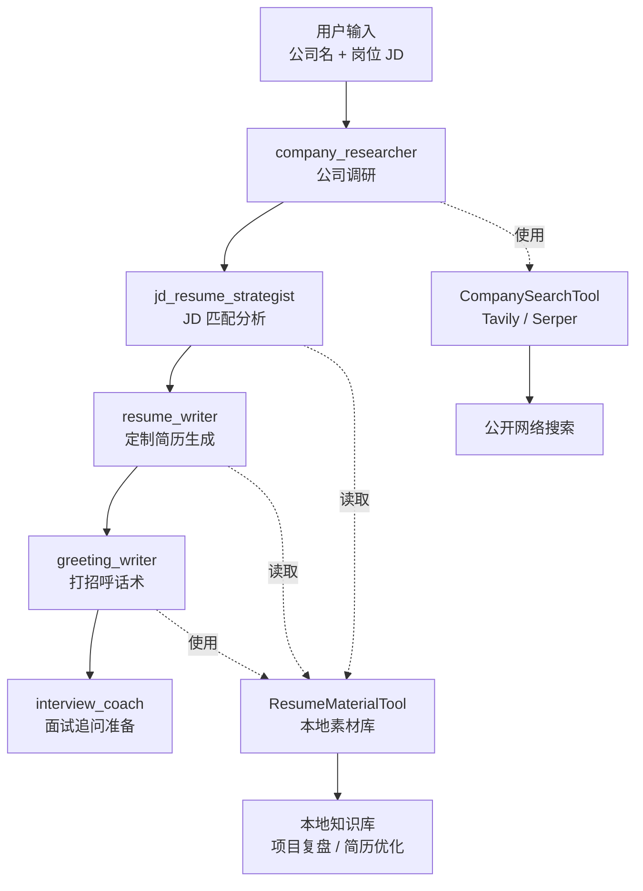
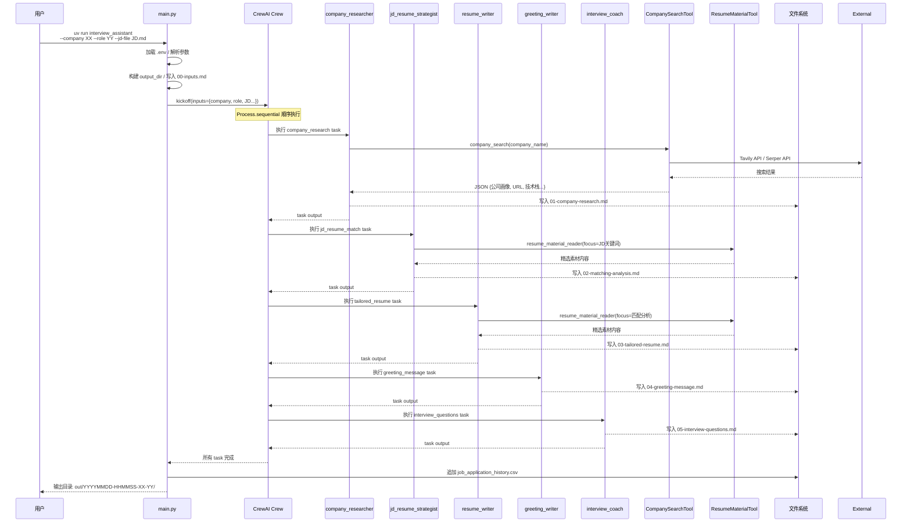

## 背景

最近在找工作。

我觉得自己的简历写得还算可以——项目经历、技术栈、工作职责，该写的都写了。但 BOSS 上投出去，十有七八已读不回。姑且不说「HR 只是占坑不拉屎」，我更偏向于: 简历是不是写得不够 match JD？

我倾向于相信：一份简历应该「面向 JD 定制」，而不是用同一份简历广撒网。所以每次投递之前，我都会根据 JD 重排技能关键词、调整项目侧重点。但问题是：如果每个公司都这么手动来，工作量太大了。

另一方面，我有个习惯——投递之前会先去意向公司的官网看看，顺便试用一下他们的产品，然后用一些合理的技术手段了解一下公司用的技术栈，甚至看看有没有什么常见的漏洞。这些信息对写简历有帮助，但收集起来是个体力活儿。

所以我想：**能不能把这些重复劳动自动化？** 每次看到感兴趣的 JD，跑一条命令，自动生成一套材料：公司调研、JD 匹配分析、定制简历、打招呼话术、面试追问——全部搞定。

## 前提：个人 Wiki 知识库

但这里有个前提：如果想让 AI 生成有质量的定制简历，AI 必须「了解你」。如果只是让 LLM 从零开始编，它要么瞎编，要么写出来的东西跟市面上千篇一律的简历没什么区别。

我的做法是：对过往项目进行深度复盘，用 [Karpathy 提出的 LLM 知识库思路](https://gist.github.com/karpathy/442a6bf555914893e9891c11519de94f)，将个人工作经历全部拆解、沉淀。使用 Obsidian 构建 Wiki，每个项目都有对应的复盘笔记：背景是什么、做了什么、用了什么技术、取得了什么成果、遇到了什么困难、如何解决的。

这些笔记就是 Agent 的「弹药库」。当需要面向某个 JD 生成简历时，Agent 从中选取最匹配的经历，重组、压缩、强调，而不是编造。有了这个素材基础，后续的简历定制才有可能做到「真实、可追问」。

## 设计思路

最初的想法很简单：让一个 LLM 直接生成简历。但试过就知道这条路走不通——LLM 不知道你做过什么，生成的简历要么太通用，要么在瞎编；而且写完简历之后，面试准备还得自己来。

后来我想明白了：不是 LLM 不够聪明，而是单个 Agent 的能力边界太窄。它什么都能做，但什么都做不精。所以与其让一个 Agent 什么都做，不如让多个 Agent 分工——每个 Agent 专注自己的领域，通过有序的工作流串联起来。这就引出了 CrewAI 的核心思想：Multi-Agent System。

这基本上就是 CrewAI 的核心思想：**Multi-Agent System（多智能体系统）**。

## CrewAI 是什么

[CrewAI](https://crewai.com/) 是一个用于构建多 Agent 协作的框架。它的几个核心概念：

- **Agent（智能体）**：有角色（role）、目标（goal）和背景故事（backstory）的 AI 执行单元。每个 Agent 知道自己是谁、该做什么。
- **Task（任务）**：具体要完成的工作，有描述和期望输出。
- **Crew（团队）**：一组 Agent + 他们的 Task + 执行流程（Process）。
- **Process（流程）**：目前支持 `sequential`（顺序）和 `hierarchical`（层级）。

我选择顺序流程，因为简历生成有明显的依赖链：**先了解公司，再分析 JD，再写简历，最后准备面试。**

### CrewAI 的特点

相比 LangGraph 或 Autogen，我选择 CrewAI 有几个原因。首先是它的声明式配置风格——Agent 和 Task 通过 YAML 定义，代码只负责组装逻辑，这样调整 Agent 行为不需要改 Python 代码。其次是它的 role、goal、backstory 三件套设计，让 Agent 的行为边界非常清晰，不容易出现职责混乱。最后是工具集成机制——Agent 可以挂载自定义工具，工具继承 BaseTool，支持 Pydantic schema 校验。

来看一个简化的例子，对应项目中 `company_researcher` Agent 的定义：

**agents.yaml** 中的配置：
```yaml
company_researcher:
  role: "{company_name} 公司研究员"
  goal: "通过公开网络信息梳理公司业务、产品、行业和技术能力"
  backstory: |
    你擅长从官网、招聘信息、新闻和公开资料中提炼公司画像。
    你不会把未经证实的信息写成事实，会保留来源 URL。
```

**crew.py** 中的 Agent 创建：
```python
@CrewBase
class InterviewAssistant:
    agents_config = "config/agents.yaml"
    tasks_config = "config/tasks.yaml"

    @agent
    def company_researcher(self) -> Agent:
        return Agent(
            config=self.agents_config["company_researcher"],
            llm=build_llm("company_researcher"),  # 使用哪个 LLM profile
            tools=[CompanySearchTool()],           # 挂载工具
            verbose=True,
        )
```

对应的 Task 定义（tasks.yaml）：
```yaml
company_research:
  description: >
    研究目标公司：{company_name}。
    请使用公司信息搜索工具，围绕业务、产品、技术栈做调研。
  expected_output: >
    输出公司画像、业务关键词、可能关注的技术能力、信息来源 URL。
  agent: company_researcher  # 分配给哪个 Agent
```

组装成 Crew（顺序执行）：
```python
@crew
def crew(self) -> Crew:
    return Crew(
        agents=self.agents,
        tasks=self.tasks,
        process=Process.sequential,  # 顺序执行
        verbose=True,
    )
```

启动执行：
```python
inputs = {"company_name": "某公司", "target_role": "Java 架构师"}
InterviewAssistant().crew().kickoff(inputs=inputs)
```

整个流程就是：**YAML 定义 → Python 组装 → kickoff 执行**。

## 系统架构

先放一张架构图，对整体有个感知：


整个系统的数据流是这样的：



对应的时序图（一次完整运行的执行顺序）：



## 五个 Agent 的设计

### 1. company_researcher（公司调研）

这个 Agent 的职责是在写简历之前，先搞清楚目标公司是什么。它会搜索公司业务、产品/解决方案、行业场景和技术栈、招聘线索和团队信息、近期动态和融资情况。输出的《公司画像》会说明：这家公司可能更关注业务交付？还是平台架构？AI 工程化？还是研发管理？这些洞察直接影响简历的侧重点。工具是 CompanySearchTool，支持 Tavily（优先）和 Serper（兜底），保留来源 URL。

**输出产物**：`01-company-research.md`——公司画像、业务关键词、可能关注的技术能力、信息来源 URL、不确定性说明。

### 2. jd_resume_strategist（JD 匹配分析）

这是最关键的一个环节——把 JD 拆解，然后匹配到你的个人经历。它会拆解 JD 的必须项、加分项、软性要求和隐含要求，从本地素材库中找到匹配的经历，建立「JD 要求 → 可用经历 → 来源文件 → 简历写法」的四层映射，并标出 `[待补]` 数据（未确认的时间、指标、团队规模等）。一个重要约束是：这个 Agent 不能编造，只能重组已有的材料，所有经历必须有据可查。工具是 ResumeMaterialTool，读取精选的本地 Markdown 文件，而非全库扫描。

**输出产物**：`02-matching-analysis.md`——JD 要求拆解、经历匹配矩阵、推荐保留的工作/项目顺序、不建议写入的内容、`[待补]` 数据清单。

### 3. resume_writer（定制简历生成）

基于前两个阶段的输出，这个 Agent 生成面向这家公司的定制简历。规则包括：保留真实经历边界，未确认数据用 `[待补]` 标注；技能关键词、工作经历、项目经历都面向 JD 重排；外部公司信息不会被误写成个人经历；每条 bullet 都能被面试追问支撑。工具同样挂载 ResumeMaterialTool，因为它需要参考优化版简历和项目复盘。

**输出产物**：`03-tailored-resume.md`——个人定位、技能关键词、工作经历、项目经历、面试自我介绍、`[待补]` 数据、素材来源提示。

### 4. greeting_writer（打招呼话术）

这是很多人会忽略但其实很重要的环节：招聘 App 上的第一句话。它需要语气自然、像真人，不要营销腔；突出 2-3 个与 JD 最匹配的能力点；附上个人链接（GitHub / 博客 / Zeka Stack），但首句最多 1-2 个；长度控制在 120-220 字。这个 Agent 会生成多个版本：标准版、短版、偏技术负责人版、偏 AI 工程化版。

**输出产物**：`04-greeting-message.md`——推荐打招呼语、更短版本、偏技术负责人版本、偏 AI 工程化版本、匹配点说明。

### 5. interview_coach（面试追问准备）

基于定制简历，预测面试官会问什么。覆盖范围包括：每段工作经历的可能追问、每个重点项目的技术深挖、JD 强相关技术主题、行为面试 / 压力面试 / HR 常见问题，以及 `[待补]` 内容的风险提示和兜底回答。

**输出产物**：`05-interview-questions.md`——高频追问总览、按工作经历/项目组织的问题和回答抓手、JD 强相关技术主题复习清单、行为面试问题、风险问题和兜底建议。

## 工具设计

### CompanySearchTool

```python
from crewai.tools import BaseTool
from pydantic import BaseModel, Field

class CompanySearchInput(BaseModel):
    company_name: str = Field(..., description="要调研的公司名称")
    focus: str | None = Field(default=None, description="可选聚焦方向")

class CompanySearchTool(BaseTool):
    name: str = "company_search"  # 必须 ASCII
    description: str = "公司信息搜索工具：优先 Tavily，失败时自动降级 Serper"
    args_schema: type[BaseModel] = CompanySearchInput

    def _run(self, company_name: str, focus: str | None = None) -> str:
        # 1. 构造多组查询
        queries = self._build_queries(company_name, focus)
        # 2. 优先 Tavily，失败则 fallback 到 Serper
        try:
            results = self._search_tavily(queries)
        except Exception:
            results = self._search_serper(queries)
        # 3. 返回结构化 JSON
        return json.dumps({"results": results, "provider": provider}, ensure_ascii=False)
```

这里有几个细节需要注意：`name` 必须是 ASCII 字符，因为 CrewAI 内部会调用 `sanitize_tool_name()` 把非 ASCII 字符丢掉，可能导致 name 变成空字符串；`args_schema` 用 Pydantic 定义，CrewAI 会自动生成工具调用的界面；`_run` 是实际执行逻辑，返回字符串供 Agent 使用。

### ResumeMaterialTool

```python
class ResumeMaterialTool(BaseTool):
    name: str = "resume_material_reader"
    description: str = "本地简历素材读取工具：读取候选人已优化的简历底稿..."
    args_schema: type[BaseModel] = ResumeMaterialInput

    def _run(self, focus: str = "") -> str:
        sections = ["# 本地简历素材读取结果", f"focus: {focus}"]

        # 只读精选入口，避免全库扫描
        core_files = [
            PROJECT_REVIEW_DIR / "简历工作经历素材库.md",
            PROJECT_REVIEW_DIR / "简历项目描述-STAR法则.md",
        ]
        for file_path in core_files:
            sections.append(self._read_file_section(file_path, limit=18000))

        # glob 匹配项目复盘概览
        for file_path in self._overview_files():
            sections.append(self._read_file_section(file_path, limit=6000))

        return "\n\n".join(sections)

    def _overview_files(self) -> list[Path]:
        patterns = ["*/01. *项目复盘概览.md"]
        files = []
        for pattern in patterns:
            files.extend(PROJECT_REVIEW_DIR.glob(pattern))
        return sorted(set(files))
```

这个工具的设计原则是精选入口而非全库扫描。它只读取几个关键位置：简历工作经历素材库、STAR 法则模板、优化版简历，以及项目复盘的概览索引，而不是去扫整个 Wiki 知识库。

## LLM Profile 体系

项目支持多 profile 差异化配置，不同 Agent 使用不同档次的模型：

- **LOW**：gpt-5.4-mini，用于 company_researcher 和 greeting_writer，因为这两个任务相对简单，LOW 档足够
- **MEDIUM**：gpt-5.5，作为默认 profile
- **HIGH**：gpt-5.5，用于 jd_resume_strategist、resume_writer 和 interview_coach，因为 JD 匹配分析、简历写作、面试追问需要更强的推理能力

这样分配的原因是 LOW 的 token 费用大概是 HIGH 的一半，能省则省。

```bash
LLM_DEFAULT_PROFILE=medium
LLM_LOW_BASE_URL=http://127.0.0.1:8317/v1
LLM_LOW_MODEL=gpt-5.4-mini
LLM_HIGH_BASE_URL=http://127.0.0.1:8317/v1
LLM_HIGH_MODEL=gpt-5.5
```

## 求职历史追踪

每次运行会向 CSV 追加一条记录，包含：

- run_id、时间戳、公司、岗位
- JD 哈希（用于去重）
- 各输出文件路径和大小
- 状态（success / failed）

重复判断基于 `company_name + target_role + jd_sha256`。如果历史中已有相同记录，程序会提示而非重复执行。这个 CSV 的价值在于积累求职数据，方便后续做统计、分析和优化。

## 一些设计原则

回顾这个项目的设计，有几个我觉得值得坚持的原则：

1. **工具约束要写在 Tool 里，不是写在 Prompt 里。** 很多 Agent 项目把「不能编造」「保留 [待补]」这类规则塞在 Prompt 中，但 Prompt 会漂移。CrewAI 的做法是：Tool 的 description 就是约束，Agent 看到 Tool 的 schema 就知道能用做什么、不能做什么。

2. **精选素材入口，而非全库扫描。** 本地知识库可能很大，但如果每次都读全部内容，噪声太多、token 消耗太大。设计工具时，我刻意限制了读取范围：只读精选入口文件 + 项目概览索引。如果某个 Agent 确实需要更详细内容，再手动补充。

3. **输出结构化，而非自由文本。** 每个 Agent 的输出都是固定格式的 Markdown：分节、有编号、有来源标注。这样后续 Agent 可以更容易地解析前一个 Agent 的输出，也方便人工复核。

4. **简历内容必须可追问。** 每条 bullet 都要能回答「这个数据从哪来」「这个成果是怎么做到的」。不能追问我就不会写。这是「定制简历」和「编造简历」的本质区别。

## 技术栈

- **框架**：[CrewAI](https://github.com/crewaiinc/crewai)，Python 实现
- **依赖管理**：uv（Python >= 3.10 < 3.14）
- **搜索**：Tavily API / Serper API（自动 fallback）
- **本地素材**：Markdown 文件（Obsidian 知识库格式）
- **输出**：Markdown 简历 + CSV 求职历史 + ANSI 清洗后的运行日志

## 总结

这个项目的核心思路是：把「投一个公司」当成一个小型的信息处理流水线——输入公司名和 JD，经过公司调研、JD 分析、简历定制、话术生成、面试准备五个阶段，输出一套完整的求职材料。

CrewAI 提供的 Multi-Agent 框架让这种流水线变得易于维护：每个 Agent 的职责清晰，通过 YAML 配置就能调整行为，新增一个阶段也只需要加一个 Agent + Task。

最终想实现的效果是：**每次想投一个新公司，只需要准备好 JD，跑一条命令，等几分钟，然后人工复核输出的简历**——而不是从零开始想怎么写。

---

如果你也在思考如何用 AI 辅助求职，或者对 Multi-Agent 系统有兴趣，欢迎交流。