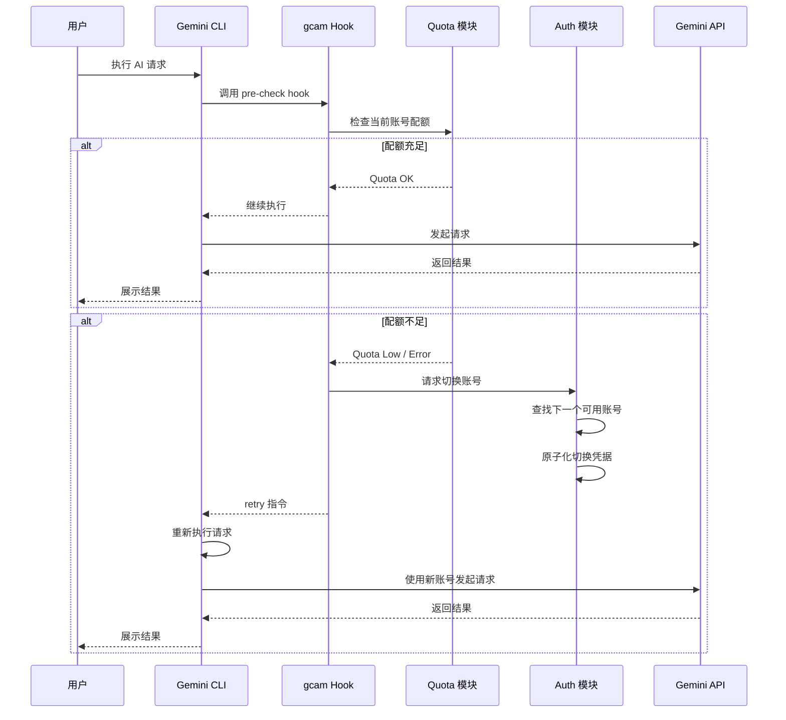
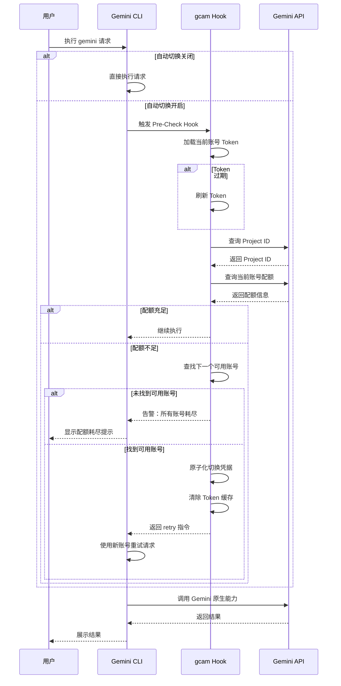

作为一个天天泡在终端里的开发者，我对 Gemini CLI 这类 AI 编程助手是有依赖的。但问题来了——我之前订阅的 Gemini 即将到期，偏偏因为学生认证的限制没法续订。于是我用另一个账号重新订阅了 Gemini Pro，这下手头就有了两个付费账号。两个账号放着不用太浪费，但在不同项目间手动切换实在折腾：关掉当前任务、切换认证凭据、重新跑命令，节奏一断思路也跟着断了。**gcam（Gemini CLI Account Manager）** 就是来解决这个问题的——它让你的多个账号组成一个池子，需要时自动切换，整个过程对使用者完全透明。项目落地页在 [gcam.dong4j.site](https://gcam.dong4j.site)。

## 背景：为什么需要多账号管理

Gemini CLI 的付费订阅（Google AI Pro）每天大约有 1500 次请求配额，每分钟也有请求频率限制。对于日常开发来说这个量通常够用，但当你像我一样因为续订限制而持有两个付费账号时，手动管理就变成了一个麻烦事——更不用说在多个项目间频繁切换的场景了。

手动切换账号的流程本身并不复杂：改个配置、重新认证一下就好。但问题在于它把一个本该自动化的决策强加给了使用者。你得记着当前在用哪个账号、另一个账号还剩多少配额、要不要留到真正紧急的时候用。这些心智负担累积起来，其实比切换本身更费精力。

gcam 的思路很简单：**让机器管理状态，让人专注创作**。它不替代 Gemini CLI，而是作为一个智能中间层存在，在后台默默监控配额，预判是否需要切换，需要的时候自动完成切换。

## 整体架构

gcam 的设计哲学是**零侵入**。它不修改 Gemini CLI 本身的任何代码，而是通过 hook 机制挂载到 Gemini CLI 的生命周期中。以下是整体架构的示意图：


从图中可以看到，gcam 由三个核心模块组成：**Auth 模块**负责 OAuth 登录和账号管理，**Config 模块**维护账号池和切换策略，**Quota 模块**则承担配额检查和 hook 执行的职责。三个模块各司其职，通过配置文件进行协作。

外部交互方面，Auth 模块与 Google OAuth 服务通信完成身份认证，Quota 模块直接查询 Gemini API 获取实时配额数据。当用户执行 `gemini` 命令时，gcam 的 hook 机制会在请求发出前和收到响应后介入，根据预设策略决定是否需要切换账号。整个数据流向是：用户 → gcam CLI → Gemini CLI → Gemini API，gcam 在中间做了大量的状态维护和智能路由工作。

## OAuth 登录流程

gcam 支持通过浏览器 OAuth 一键登录，这比手动粘贴 API Key 优雅得多。流程如下：


用户执行 `gcam pool login` 后，gcam 会在本地启动一个临时 HTTP 服务器，然后打开系统浏览器跳转到 Google 的 OAuth 授权页面。用户完成登录授权后，Google 会将浏览器重定向回本地服务器，带回一个授权码。本地服务器收到授权码后，立即与 Google 的 Token 端点交换得到 Access Token 和 Refresh Token，最后把这些凭证存入账号池。

整个流程走的是标准的 OAuth 2.0 授权码模式，支持 offline access，所以能拿到 Refresh Token。这意味着理论上一次授权可以长期使用，不需要反复登录。

## 技术选型：为什么是 Go

这个项目的上游 [Gemini-CLI-Auth-Manager](https://github.com/Besty0728/Gemini-CLI-Auth-Manager) 是用 Python 写的，功能已经很完整了。那为什么我选择用 Go 重写？

最核心的理由是**分发体验**。Python 项目的用户在首次使用时往往需要面对一连串的环境配置问题：系统有没有安装 Python、版本对不对、要不要建虚拟环境、pip 装上了但依赖报错怎么办。这些问题对于一个只想「下载下来就用」的 CLI 工具来说，是完全可以避免的。Go 编译出来的是一个静态链接的二进制文件，macOS、Linux、Windows 各平台的都有，下载下来加个执行权限就能跑，没有任何运行时依赖。

其次是**执行效率**。gcam 的 hook 机制在每次 Gemini CLI 请求前后都会介入，如果 gcam 本身启动太慢或者执行开销太大，就会明显拖慢整个交互节奏。Go 的启动时间是毫秒级的，基本感觉不到它的存在，这对 CLI 工具来说是非常重要的体验。

最后是**交叉编译的便利性**。我用一条命令就能同时构建出三个平台的二进制文件，CI/CD 发布流程非常简洁。这不是 Python 不能做到，而是 Go 原生支持得更好。

当然，Go 也不是没有代价的。Go 的错误处理比较显式，没有 Python 那种轻便的异常机制，某些场景写起来会啰嗦一些。但对于一个相对小型的 CLI 工具来说，这个代价完全可以接受。

## 快速入门

安装 gcam 非常简单，推荐使用一键安装脚本：

```bash
# macOS / Linux
curl -sSL https://gcam.dong4j.site/install.sh | bash
```

也可以从 [Release 页面](https://github.com/dong4j/gemini-cli-account-manager/releases) 下载对应平台的二进制文件，或者从源码构建：

```bash
git clone https://github.com/dong4j/gemini-cli-account-manager.git
cd gemini-cli-account-manager
go build -o gcam cmd/gcam/main.go
```

安装完成后，需要执行一次初始化，把 gcam 的 hook 机制注入到 Gemini CLI 的生命周期中：

```bash
gcam install
```

这个命令会在你的 Gemini 配置目录下安装必要的钩子脚本，并配置好环境变量。安装成功后，你的 `gemini` 命令行为不会改变——只是在背后多了 gcam 这层代理在默默工作。

接下来添加你的第一个账号：

```bash
gcam pool login
```

这条命令会打开浏览器引导你完成 Google 账号的 OAuth 授权。授权完成后，账号会自动进入你的账号池，并且 gcam 会自动切换到新账号作为当前账号。

添加多个账号后，可以用以下命令查看账号池状态：

```bash
gcam
```

输出大概是这个样子：

```
┌─ 账号池 ────────────────────────────────┐
│ #  │ 账号                    │ 状态    │
├───┼─────────────────────────┼─────────┤
│ 1  │ alice@gmail.com         │ 当前 ✓  │
│ 2  │ bob@gmail.com           │ 空闲    │
│ 3  │ carol@gmail.com         │ 空闲    │
└────────────────────────────────────────┘
```

遇到配额限制时，gcam 会自动切换到下一个空闲账号，整个过程不需要你手动干预。以下是一些常用的手动操作：

| 命令 | 说明 |
|:---|:---|
| `gcam next` | 切换到下一个可用账号 |
| `gcam 2` | 按编号切换到指定账号 |
| `gcam alice@gmail.com` | 按邮箱切换到指定账号 |
| `gcam quota` | 查看当前账号所有模型的配额使用情况 |
| `gcam menu` | 打开交互式管理菜单 |
| `gcam uninstall` | 移除 hook 和斜杠命令 |

安装 hook 后，在 Gemini CLI 内也可以直接使用 `/gcam` 斜杠命令来切换账号或查询配额，不需要退出当前会话。

## 高阶使用：让切换更智能

gcam 的配置文件位于 `~/.gemini/auth_config.json`，里面有几个可以深度定制的参数。

**轮换策略**控制了 gcam 如何判断一个账号是否「额度不足」。默认策略是 `gemini3.1-series-only`，它只检查 Gemini 3.1 系列模型的配额，因为大多数重度使用场景都在用这个系列。如果你对配额比较敏感，`conservative` 策略会更合适——它会检查所有模型的配额，确保在任何模型上都有余量。

**阈值**参数决定了什么时候触发切换。默认是 10%，意味着当某个模型的剩余配额低于 10% 时就会切换。这个值可以根据你的使用强度调整：如果请求比较稀疏，可以设低一点省着用；如果请求密集，设高一点可以避免频繁触发限制。

**最大重试次数**决定了单次会话中自动切换的上限，默认是 3 次。超过这个次数后，gcam 会停止切换并报告配额耗尽，避免无限重试。

配置示例：

```yaml
strategy: gemini3.1-series-only
threshold: 10
max_retries: 3
```

## 关键实现细节

理解几个核心实现，能更好地使用 gcam 的高级特性。

**原子化账号切换**。切换账号本质上是在修改一个配置文件——把当前使用的 OAuth 凭证从 A 账号换成 B 账号。直接写入文件在极端情况下可能造成数据损坏（比如写了一半程序崩溃了）。gcam 使用的是「写临时文件再 rename」的策略：先把新内容写到一个临时文件，确认写成功后，再原子性地 rename 覆盖原文件。操作系统对 rename 的保证是原子的——要么完全成功，要么完全不变。

**配额查询的容错设计**。查询配额依赖 Gemini Code Assist 的内部 API，这个 API 本身并不在官方文档中。gcam 会先调用 `loadCodeAssist` 接口获取当前项目 ID，再通过 `retrieveUserQuota` 查询配额。如果 Token 过期，会自动触发一次 `gemini -p "/model list"` 来刷新。整个过程对用户是不可见的，但保证了查询的准确性。

**Hook 的生命周期**。gcam 支持三个 hook 节点：`pre-check` 在请求发出前执行，用于预检配额；`after-agent` 在收到响应后执行，用于检测是否遇到了配额错误；`auto-switch` 负责执行真正的切换逻辑并返回重试指令。这种分离设计让每一步都可以独立配置和调试。

下面是一段配额检查的核心逻辑，展示了 gcam 如何判断是否需要切换账号：

```go
// CheckQuota 根据配置策略判断当前账号是否需要切换
func CheckQuota(cfg *config.Config) ([]QuotaBucket, bool, string, error) {
    // 1. 加载当前 Token
    token, err := LoadToken()
    if err != nil {
        // Token 过期时尝试刷新
        if strings.Contains(err.Error(), "expired") || os.IsNotExist(err) {
            _ = RefreshToken()
            token, err = LoadToken()
        }
        if err != nil {
            return nil, false, "", err
        }
    }

    // 2. 获取项目 ID
    projectID, err := GetProjectID(token)
    if err != nil && strings.Contains(err.Error(), "unauthorized") {
        _ = RefreshToken()
        token, _ = LoadToken()
        projectID, err = GetProjectID(token)
    }
    if err != nil {
        return nil, false, "", err
    }

    // 3. 查询配额
    buckets, err := GetUserQuota(token, projectID)
    if err != nil {
        return nil, false, "", err
    }

    // 4. 根据策略筛选目标模型
    var targets []QuotaBucket
    for _, b := range buckets {
        match := matchStrategy(b.ModelID, cfg.AutoSwitch.Strategy,
            cfg.AutoSwitch.CustomModelPattern)
        if match {
            targets = append(targets, b)
        }
    }

    // 5. 判断是否所有目标模型配额都低于阈值
    threshold := cfg.AutoSwitch.Threshold / 100.0
    allLow := true
    var lowDetails []string
    for _, b := range targets {
        if b.RemainingFraction > threshold {
            allLow = false
            break
        }
        lowDetails = append(lowDetails,
            fmt.Sprintf("%s: %.1f%%", b.ModelID, b.RemainingFraction*100))
    }

    if allLow && len(targets) > 0 {
        return buckets, true, strings.Join(lowDetails, ", "), nil
    }
    return buckets, false, "Quota OK", nil
}
```

## 账号切换工作流程

gcam 检测到配额不足时，会触发自动切换流程。以下是完整的时序图：



gcam 的核心工作流也可以用以下时序图表示，展示了从请求发起到配额检查再到自动切换的完整链路：



当 gcam 检测到配额不足时，会从当前账号平滑过渡到下一个可用账号。如果所有账号都耗尽了，会输出警告信息而不是静默失败。这种 fail-fast 的设计确保你始终知道系统的真实状态。

### 智能切换策略

gcam 支持多种切换策略，适应不同的使用场景：

| 策略 | 说明 | 适用场景 |
|:---|:---|:---|
| `conservative` | 检查所有模型配额 | 全面保守 |
| `gemini3-first` | 优先使用 Gemini 3 系列 | 追求最新模型 |
| `gemini3.1-series-only` | 只使用 3.1 系列 | 平衡性价比 |
| `custom` | 自定义模型匹配 | 精准控制 |

### 错误检测模式

gcam 会捕获以下配额相关错误模式：

```go
var QuotaErrorPatterns = []string{
    `429`,                      // Too Many Requests
    `403.*quota`,               // Quota Forbidden
    `Resource exhausted`,        // 资源耗尽
    `Quota exceeded`,           // 超出配额
    `rate limit`,               // 速率限制
    `RESOURCE_EXHAUSTED`,       // Google API 错误码
    `Usage limit reached`,      // 使用限制
    `limit reached for all.*models`,  // 所有模型限制
    `Access resets at`,         // 访问重置时间
    `PERMISSION_DENIED.*VALIDATION_REQUIRED`,  // 账户验证
    `Please verify your account` // 账户需验证
}
```

## 写在最后

这个项目的起点是上游的 [Gemini-CLI-Auth-Manager](https://github.com/Besty0728/Gemini-CLI-Auth-Manager)，它证明了多账号切换这个需求是真实存在的，而且用 Python 可以实现出一个可用的原型。我在它的基础上用 Go 重写，主要是希望把「可用」变成「好用」——更快的启动速度、更简单的分发、更好的跨平台体验。

如果你也在用 Gemini CLI 且被配额问题困扰，欢迎试试 gcam。项目的 GitHub 地址在下方，欢迎 Star、Issue 和 PR。

---

**项目地址**: [github.com/dong4j/gemini-cli-account-manager](https://github.com/dong4j/gemini-cli-account-manager)
**落地页**: [gcam.dong4j.site](https://gcam.dong4j.site)

感谢上游项目 [Gemini-CLI-Auth-Manager](https://github.com/Besty0728/Gemini-CLI-Auth-Manager) 提供的思路和灵感。