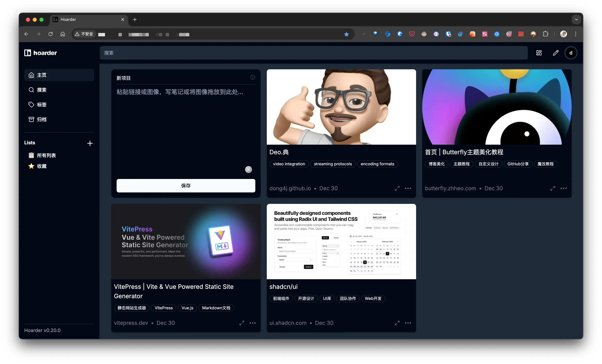

**是的，3W 方法是一种非常有效且简洁的产品介绍方式，它包括三个核心部分：What（是什么）、Why（为什么）、How（如何）。以下是如何使用 3W 方法来介绍一个产品的步骤：**

### 1. What（是什么）

- **定义产品**：首先，明确地告诉听众这个产品是什么。包括产品的名称、类型、基本功能等。
- **特点概述**：简要介绍产品的主要特点和独特之处，让听众对产品有一个初步的了解。
  **示例**：Hoarder 是一款基于 AI 的书签和个人知识库管理工具，专为 NAS 部署设计，旨在帮助用户高效地阅读和收藏信息。

### 2. Why（为什么）

- **解决痛点**：解释为什么需要这个产品，它解决了什么问题或满足了什么需求。
- **优势突出**：强调产品的优势，比如与其他产品的区别、带来的好处等。
  **示例**：在信息爆炸的时代，我们经常面临信息过载和难以有效管理的挑战。Hoarder 通过 AI 技术，智能分类、整理和推荐内容，大大提高了阅读和收藏的效率，同时保证了知识的安全存储和便捷访问。

### 3. How（如何）

- **使用方法**：简要介绍如何使用这个产品，包括基本操作流程、关键步骤等。
- **效果展示**：如果可能，通过案例、数据或演示来展示产品是如何工作的，以及它能达到的效果。
  **示例**：使用 Hoarder 非常简单，只需在 NAS 上部署后，通过浏览器访问即可。用户可以轻松添加书签、创建知识库，并通过 AI 助手进行智能管理和推荐。例如，我们的用户反馈显示，使用 Hoarder 后，信息整理时间减少了 50%，同时找到了更多有价值的内容。

### 补充

- **Who（谁适用）**：有时，根据需要，还可以添加一个“Who”部分，介绍产品的目标用户或适用人群。
- **Where（在哪里获取）**：提供产品的获取途径，如官方网站、应用商店等。
  **示例**：Hoarder 适用于所有希望提高阅读和知识管理效率的用户，特别是研究人员、学生和知识工作者。你可以在我们的官方网站或主流 NAS 应用商店中下载并安装 Hoarder。
  通过这样的 3W 方法，你可以清晰、有条理地介绍一个产品，使听众能够快速理解并产生兴趣。

## 简介

[Hoarder](https://github.com/hoarder-app/hoarder) 是一个开源的 “Bookmark Everything” 应用程序，它使用 AI 自动标记您扔给它的内容。该应用程序是以自托管作为一等公民构建的。

## Features 特征[](https://docs.hoarder.app/#features)

- 🔗 Bookmark links, take simple notes and store images and pdfs.
  🔗 为链接添加书签、做简单的笔记并存储图像和 pdf。
- ⬇️ Automatic fetching for link titles, descriptions and images.
  ⬇️ 自动获取链接标题、描述和图像。
- 📋 Sort your bookmarks into lists.
  📋 将书签排序到列表中。
- 🔎 Full text search of all the content stored.
  🔎 对存储的所有内容进行全文搜索。
- ✨ AI-based (aka chatgpt) automatic tagging. With supports for local models using ollama!
  ✨ 基于 AI（又名 chatgpt）的自动标记。支持使用 ollama 的本地模型！
- 🎆 OCR for extracting text from images.
  🎆 OCR 用于从图像中提取文本。
- 🔖 [Chrome plugin](https://chromewebstore.google.com/detail/hoarder/kgcjekpmcjjogibpjebkhaanilehneje) and [Firefox addon](https://addons.mozilla.org/en-US/firefox/addon/hoarder/) for quick bookmarking.
  🔖 用于快速书签的 [Chrome 插件](https://chromewebstore.google.com/detail/hoarder/kgcjekpmcjjogibpjebkhaanilehneje)和 [Firefox 插件](https://addons.mozilla.org/en-US/firefox/addon/hoarder/)。
- 📱 An [iOS app](https://apps.apple.com/us/app/hoarder-app/id6479258022), and an [Android app](https://play.google.com/store/apps/details?id=app.hoarder.hoardermobile&pcampaignid=web_share).
  📱 一个 [iOS 应用程序和](https://apps.apple.com/us/app/hoarder-app/id6479258022)一个 [Android 应用程序](https://play.google.com/store/apps/details?id=app.hoarder.hoardermobile&pcampaignid=web_share)。
- 📰 Auto hoarding from RSS feeds.
  📰 来自 RSS 源的自动囤积。
- 🌐 REST API. 🌐 REST API 的 API 中。
- 🗄️ Full page archival (using [monolith](https://github.com/Y2Z/monolith)) to protect against link rot. Auto video archiving using [youtube-dl](https://github.com/marado/youtube-dl).
  🗄️ 整页存档（使用[单体](https://github.com/Y2Z/monolith)）以防止链接腐烂。使用 [youtube-dl](https://github.com/marado/youtube-dl) 自动存档视频。
- ☑️ Bulk actions support. ☑️ 批量操作支持。
- 🔐 SSO support. 🔐 SSO 支持。
- 🌙 Dark mode support. 🌙 深色模式支持。
- 💾 Self-hosting first. 💾 首先是自托管。
- [Planned] Downloading the content for offline reading.
  [计划]下载内容以供离线阅读。




## 本地部署


```yml
version: "3.8"
services:
  web:
    image: ghcr.io/hoarder-app/hoarder:${HOARDER_VERSION:-release}
    restart: unless-stopped
    volumes:
      - ./data:/data
    ports:
      - 3333:3000
    env_file:
      - .env
    environment:
      MEILI_ADDR: http://meilisearch:7700
      BROWSER_WEB_URL: http://chrome:9222
      # OPENAI_API_KEY: ...
      OLLAMA_BASE_URL: http://192.168.31.5:11434
      INFERENCE_TEXT_MODEL: glm4
      INFERENCE_LANG: chinese
      DATA_DIR: /data
  chrome:
    image: gcr.io/zenika-hub/alpine-chrome:123
    restart: unless-stopped
    command:
      - --no-sandbox
      - --disable-gpu
      - --disable-dev-shm-usage
      - --remote-debugging-address=0.0.0.0
      - --remote-debugging-port=9222
      - --hide-scrollbars
  meilisearch:
    image: getmeili/meilisearch:v1.11.1
    restart: unless-stopped
    env_file:
      - .env
    environment:
      # 禁用匿名数据收集
      MEILI_NO_ANALYTICS: "true"
    volumes:
      - ./meili:/meili_data

volumes:
  meilisearch:
  data:
version: "3.8"
services:
  web:
    image: ghcr.io/hoarder-app/hoarder:${HOARDER_VERSION:-release}
    restart: unless-stopped
    volumes:
      - ./data:/data
    ports:
      - 3333:3000
    env_file:
      - .env
    environment:
      MEILI_ADDR: http://meilisearch:7700
      BROWSER_WEB_URL: http://chrome:9222
      # OPENAI_API_KEY: ...
      OLLAMA_BASE_URL: http://192.168.31.5:11434
      INFERENCE_TEXT_MODEL: glm4
      INFERENCE_LANG: chinese
      DATA_DIR: /data
  chrome:
    image: gcr.io/zenika-hub/alpine-chrome:123
    restart: unless-stopped
    command:
      - --no-sandbox
      - --disable-gpu
      - --disable-dev-shm-usage
      - --remote-debugging-address=0.0.0.0
      - --remote-debugging-port=9222
      - --hide-scrollbars
  meilisearch:
    image: getmeili/meilisearch:v1.11.1
    restart: unless-stopped
    env_file:
      - .env
    environment:
      # 禁用匿名数据收集
      MEILI_NO_ANALYTICS: "true"
    volumes:
      - ./meili:/meili_data

volumes:
  meilisearch:
  data:
```

**.env**

```
HOARDER_VERSION=release
NEXTAUTH_SECRET=[36 位随机字符串]
MEILI_MASTER_KEY=[36 位随机字符串]
NEXTAUTH_URL=http://localhost:3000
```


## AI 加持


### Ollama


```
HTTPS_PROXY
HTTP_PROXY
NO_PROXY
OLLAMA_DEBUG:false
OLLAMA_FLASH_ATTENTION:false
OLLAMA_GPU_OVERHEAD:0 
OLLAMA_HOST:http://0.0.0.0:11434 
OLLAMA_KEEP_ALIVE:5m0s 
OLLAMA_KV_CACHE_TYPE: 
OLLAMA_LLM_LIBRARY: 
OLLAMA_LOAD_TIMEOUT:5m0s 
OLLAMA_MAX_LOADED_MODELS:0 
OLLAMA_MAX_QUEUE:512 
OLLAMA_MODELS:/Volumes/AI/models/ollama 
OLLAMA_MULTIUSER_CACHE:false 
OLLAMA_NOHISTORY:false 
OLLAMA_NOPRUNE:false 
OLLAMA_NUM_PARALLEL:0 
OLLAMA_ORIGINS:[http://localhost https://localhost http://localhost:* https://localhost:* http://127.0.0.1 https://127.0.0.1 http://127.0.0.1:* https://127.0.0.1:* http://0.0.0.0 https://0.0.0.0 http://0.0.0.0:* https://0.0.0.0:* app://* file://* tauri://* vscode-webview://*] 
OLLAMA_SCHED_SPREAD:false 
http_proxy: 
https_proxy: 
no_proxy:

```


- **OLLAMA_HOST：**设置网络监听端口。当我们设置OLLAMA_HOST为0.0.0.0时，就相当于开放端口，可以让人意外部网络访问。
- **OLLAMA_MODELS：**设置模型的存储路径。当我们设置OLLAMA_MODELS=F:\OllamaCache，就相当于给模型们在F盘建了一个仓库，让它们远离C盘。
- **OLLAMA_KEEP_ALIVE：** 它决定了我们的模型们可以在内存里的存活时间。设置OLLAMA_KEEP_ALIVE=24h，就好比给模型们装上了一块超大容量电池，让它们可以连续工作24小时，时刻待命。
- **OLLAMA_PORT：**用来修改ollama的默认端口，默认是11434，可以在这里改为你想要的端口。
- **OLLAMA_NUM_PARALLEL：**限制了Ollama可以同时加载的模型数量
- **OLLAMA_MAX_LOADED_MODELS：**可以确保系统资源得到合理分配。


### 本地部署


### ⚠️ 如果你使用 Docker 部署 Dify 和 Ollama，你可能会遇到以下错误:

```
httpconnectionpool(host=127.0.0.1, port=11434): max retries exceeded with url:/cpi/chat (Caused by NewConnectionError('<urllib3.connection.HTTPConnection object at 0x7f8562812c20>: fail to establish a new connection:[Errno 111] Connection refused'))

httpconnectionpool(host=localhost, port=11434): max retries exceeded with url:/cpi/chat (Caused by NewConnectionError('<urllib3.connection.HTTPConnection object at 0x7f8562812c20>: fail to establish a new connection:[Errno 111] Connection refused'))
```

这个错误是因为 Docker 容器无法访问 Ollama 服务。localhost 通常指的是容器本身，而不是主机或其他容器。要解决此问题，你需要将 Ollama 服务暴露给网络。

### 在 Mac 上设置环境变量

如果 `Ollama` 作为 `macOS` 应用程序运行，则应使用以下命令设置环境变量`launchctl`：

1. 通过调用`launchctl setenv`设置环境变量：

   ```
   launchctl setenv OLLAMA_HOST "0.0.0.0"
   ```

2. 重启 Ollama 应用程序。

3. 如果以上步骤无效，可以使用以下方法：

   问题是在 docker 内部，你应该连接到`host.docker.internal`，才能访问 docker 的主机，所以将`localhost`替换为`host.docker.internal`服务就可以生效了：

   ```
   http://host.docker.internal:11434
   ```

### 在 Linux 上设置环境变量

如果 Ollama 作为 systemd 服务运行，应该使用`systemctl`设置环境变量：

1. 通过调用`systemctl edit ollama.service`编辑 systemd 服务。这将打开一个编辑器。

2. 对于每个环境变量，在`[Service]`部分下添加一行`Environment`：

   ```
   [Service]
   Environment="OLLAMA_HOST=0.0.0.0"
   ```

3. 保存并退出。

4. 重载`systemd`并重启 Ollama：

   ```
   systemctl daemon-reload
   systemctl restart ollama
   ```

###  


## 客户端

[Alfred 插件](https://www.alfredforum.com/topic/22528-hoarder-workflow-for-self-hosted-bookmark-management/)

## 参看:

[体验高效的阅读和收藏，NAS部署基于AI的书签和个人知识库管理工具『Hoarder』](https://post.smzdm.com/p/adm85p5d/)