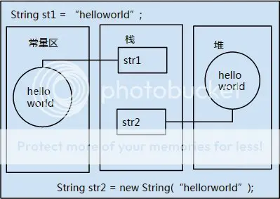

字符串操作在编程中我们会大量使用, 所以掌握字符串相关类对我们来说很重要.  
Java 为我们提供了 3 种操作字符串的类. 由于 `String` 类的特殊, 有必要了解一下 Java 运行时内存的概念, 才能更好的理解字符串相关类的底层操作.

### Java 中内存知识

在反射中我们学到, 对于每一个被 JVM 加载到内存中的类, 都会在方法区保存一份这个类的信息;  
包括:

- 类的基本信息
  - 类的全名, 直接父类的全民
  - 该类的接口
  - 该类的访问修饰符
- 类的详细信息
  - 运行时常量池 –> 字符串, 常量, 类名和方法名常量.
  - 字段信息 –> 字段名, 类型, 修饰符
  - 方法信息 –> 方法名, 返回值类型, 参数类型, 修饰符, 异常, 方法的字节码
  - 静态变量 –> 在方法区中的静态区保存被类的所有实例共享的变量和静态快
  - 到类 classloader 的引用
  - 到类 class 的引用 JVM 为每一个被加载到内存的类型创建一个 class 实例, 用实例代表这个被加载的类

由此引出反射的概念:  
在加载类的时候, 加入方法区的所有信息, 最后都会影城 Class 类的实例, 代表这个被加载的类. 方法去中的所有信息, 都是可以通过这个 Class 类对象反射得到.

#### Java 运行时数据区的划分

- 程序计数器（Program Counter Register）
- 本地方法栈 (Native Method Stacks)
- Java 虚拟机栈 (Java Visual Machine Stacks)
  - 局部变量, 引用名等保存在栈中
  - 不共享, 每个线程会有属于自己的栈
- Java 堆 (Java Heap)
  - 被 `new` 关键字所创建出来的所有实例对象
  - 被各个线程共享
- 方法区 (Method Area)
  - 被各个线程共享
  - 存储类信息, 常量, 静态变量, 以及编译后的代码等数据

### String 类

#### String 类的声明

`public final class String extends Object implements Serializable, Comparable<String>, CharSequence`  
String 类声明中, 是被 final 修饰, 所以可以看出字符串的内容是不可变的, 而且是不能被继承的类; 一旦一个 String 对象被创建, 包含在这个对象中的内容是不可改变的, 直至这个对象被回收;  
其实 String 类在底层就是通过字符数组来实现的, 对于数组, 我们知道它的长度不可变, 自然而然的 String 类也不可变了.

#### String 类在内存中的表现形式

1. 隐式创建  
   `String str1 = "helloworld";`

   - 在栈中声明一个 str1 的引用, 然后在**常量区**中查找是否有”helloworld” 这个常量;
     - 如果有, 则直接返回一个引用给 str1;
     - 如果没有, 则先在常量区中创建 ‘helloworld” 字符串, 然后返回引用;

2. 显式创建  
   `String str2 = new String("张三");`

   - 在栈中声明一个 str2 的引用, 然后在**堆**中创建一个字符串对象, 里面的值是” 张三”;
   - 返回这个对象的引用;

然后我们可以通过 对象调用 String 类的方法, 但是问题来了, `"helloworld".toCharArray()` 这句代码不会报错, 说明 `"helloworld"` 可以当一个对象来使用, 那么堆中的 `"helloworld"` 和常量池中的 `"helloworld"` 是什么关系呢?  
那就让我们来说说他们 2 个之间不得不说的故事.

```java
1. String str1 = "helloworld";//helloworld在常量区中
2. String str2 = new String("helloworld");//对象在堆中
```



对于上面 2 行代码, 会在不同的区域创建 2 个对象.

- 执行第一行时,
  - 在栈中声明一个 str1 的引用, 然后在**常量区**中查找是否有”helloworld” 这个常量;
    - 如果有, 则直接返回一个引用给 str1;
    - 如果没有, 则先在常量区中创建 ‘helloworld” 字符串, 然后返回引用;
- 执行第二行时, 会在堆中创建一个字符串对象, 这个对象的值为 `"helloworld"`, 然后再去常量区参看是否有 `"helloworld"` 这个常量字符串;
  - 如果没有, 就在常量区创建一个 `"helloworld"` 字符串常量, 然后与这个对象关联;
  - 如果有, 则把常量区的 `"helloworld"` 引用同堆中对象关联起来;

无论如何, 只要用 new 关键字实例化一个个字符串对象, 都会在堆中创建实例, 而隐式创建的话则不一定新建一个字符串常量;

那么问题来了  
`String str2 = new String("helloworld");` 会在内存中创建几个对象, 几个引用?  
答案是 3 个对象, 2 个引用;

- 对象
  - String 这个类的对象 (反射机制)
  - String 实例化对象 (堆中)
  - 常量区中的字符串对象
- 引用
  - 堆中字符串对象的引用
  - 常量区中字符串的引用

我们可以通过 String 类的 intern() 方法来实验一下  
当调用 intern 方法时，如果常量池中已经包含一个等于此 String 对象的字符串（用 equals(Object) 方法确定），则返回池中的字符串。否则，将此 String 对象添加到池中，并返回此 String 对象的引用

```java
public static void main (String[] args) {
    String s1 = "osEye.net";
    String s2 = new String ("osEye.net");
    if (s1 == s2) {
        System.out.println ("字符串引用s1和字符串引用s2所指向的是同一个对象");
    } else {
        System.out.println ("字符串引用s1和字符串引用s2所指向的不是同一个对象");
        if (s1.intern() == s2.intern() ) {
            System.out.println ("字符串引用s1和字符串引用s2在字符串常量池中联系的是同一个对象");
        } else {
            System.out.println ("字符串引用s1和字符串引用s2在字符串常量池中联系的不是同一个对象");
        }
    }
}
```

> 输出  
> 字符串引用 s1 和字符串引用 s2 所指向的不是同一个对象  
> 字符串引用 s1 和字符串引用 s2 在字符串常量池中联系的是同一个对象

这种机制很好的实现了共享和节省内存空间, 当我需要使用字符串时, 如果内存中有这个字符串了, 就不会再创建, 而是直接返回已存在的字符串的引用.

对于  
`String s = "hello" + "world"` 的分析  
在 JDK1.5 之前, 这条语句会生成 2 个字符串常量,  
但是在 JDK1.5 之后, 编译器对此做出了优化, 最终只有一个字符串常量”helloworld” 存入常量区中.  
这种优化就是默认的调用了 StringBuilder.append() 方法;

#### String 类的使用

介绍几个常用的字符串操作的方法

- `charAt(int index)` 返回指定索引处的 char 值。
- `equals(Object anObject)` 将此字符串与指定的对象比较。
- `equalsIgnoreCase(String anotherString)` 将此 String 与另一个 String 比较，不考虑大小写
- `indexOf(int ch)` 返回指定字符在此字符串中第一次出现处的索引。
- `length()` 返回此字符串的长度。
- `matches(String regex)` 告知此字符串是否匹配给定的正则表达式。
- `replace(char oldChar, char newChar)` 返回一个新的字符串，它是通过用 newChar 替换此字符串中出现的所有 oldChar 得到的。
- `split(String regex)` 根据给定正则表达式的匹配拆分此字符串。
- `substring(int beginIndex)` 返回一个新的字符串，它是此字符串的一个子字符串。
- `trim()` 返回字符串的副本，忽略前导空白和尾部空白。
- `toCharArray()` 将此字符串转换为一个新的字符数组。

判断是否为空字符串

`s != null && s != “”;  `

**注意**判断不能为空必须放在前面, 因为可能会报空指针异常

### StringBuffer 类

- 为了能让 String 里面的内容能够改变, 所以用 StringBuffer 类封装了 String 类;
- 使用 append() 方法向字符串末尾添加字符串,
- 线程安全的, 效率比 String 高
- 经常使用在字符串拼接的地方, 比如说数据库语句

### StringBuilder 类

#### 与 StringBuffer 类的对比

```java
//StringBuilder类的append()方法
public synchronized StringBuffer append(String str){
    super.append(str);
    return this;
}

//StringBuffer类的append()方法
public StringBuffer append(String str){
    super.append(str);
    return this;
}
```

StringBuffer 是线程不安全的, 效率比 StringBuffer 高, 在不考虑线程安全的时候优先考虑使用 StringBuffer.

### 3 种字符串对比

- 异同点
  - 都是 `final` 类, 都不允许被继承;
  - `String` 长度不可改变, 其他 2 种长度可变;
  - `StringBuffer` 是线程安全的, 但是效率低, `StringBuilder` 线程不安全但是效率高
  - 性能: `StringBuilder > StringBuffer > String`
- 使用策略
  - 基本原则:
    - 如果操作少量的数据, 用 `String` ;
    - 单线程操作大量数据, 使用 `StringBuilder` ;
    - 多线程操作大量数据, 使用 `StringBuffer` ;
  - 不建议使用 `String` 类的 “+” 进行频繁的字符串拼接, 而是使用 `StringBuilder` 或者 `StringBuffer` 类;
  - `StringBuilder` 一般使用在方法内部来完成类似”+” 功能, 因为线程不安全, 用完后丢弃;
  - `StringBuffer` 主要用在全局变量中;
  - 相同情况下使用 `StirngBuilder` 相比使用 `StringBuffer` 仅能获得 10%~15% 左右的性能提升，但却要冒多线程不安全的风险。而在现实的模块化编程中，负责某一模块的程序员不一定能清晰地判断该模块是否会放入多线程的环境中运行，因此：除非确定系统的瓶颈是在 `StringBuffer` 上，并且确定你的模块不会运行在多线程模式下，才可以采用 `StringBuilder` ；否则还是用 `StringBuffer` 。
