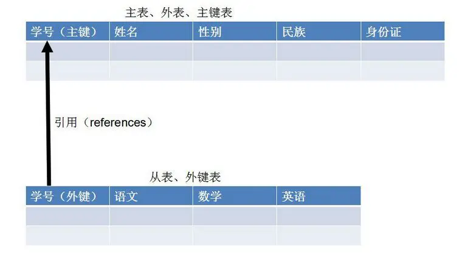

<!-- markdownlint-disable-next-line MD033 -->
<meta name="referrer" content="no-referrer"/>


操作表结构

#### create (创建)

- 创建表

```sql
create table [if not exists] 表名(
    列名 列类型,
    列名 列类型,
    ...
);
```

- 创建表并从其他表中复制数据

```sql
create table 表名
as
select * from 表名
```

#### alter (修改)

- 添加列定义 (列名必须是原表中不存在的)

```sql
alter table 表名 add(
    列名 数据类型 ,
    ...
);
```

- 修改列定义 (列名必须是原表中存在的)

```sql
alter table 表名 modify 列名 数据类型;
```

MySQL 中 一次只能修改一个列定义

如果修改数据列的默认值, 只会对以后插入操作有作用, 对以前已经存在的数据不会有任何影响

- 删除列

```sql
alter table 表名 drop 列名;
```

- 重命名数据表

```sql
alter table 旧表名 rename to/as 新表名;
```

- 改列名

```sql
alter table 表名 change 旧列名 新列名 type;
```

- 改列名并修改数据类型

```sql
alter table 表名 change 旧表名 新表名 type [default expr] [first | after 列名];
```

1. 修改数据库成 utf8 的.  
   `mysql> alter database 数据库名 character set utf8;`
2. 修改表默认用 utf8.  
   `mysql> alter table 表名 character set utf8;`
3. 修改字段用 utf8  
   `mysql> alter table 表名 modify type_name varchar(50) CHARACTER SET utf8;`

#### drop (删除)

- 删除表

```sql
drop table 表名
```

1. 表结构被删除, 表对象不再存在
2. 表里的数据也被删除
3. 该表的所有相关索引, 约束也被删除

##### drop 和 delete 的区别

- drop 只是针对表结构  
   `drop table 表名;`  
   从数据库中删除这张表

- delete 针对表数据  
   `delete table 表名;`  
   清空这张表中的所有数据

#### truncate

```sql
truncate 表名;
```

删除表中的全部数据, 但保留表数据.  
相对于 delete 而言, 速度更快,  
不能像 delete 能删除指定的记录, truncate 只能一次性删除整个表中的全部记录

### DML (数据操作语言)

操作数据表中的数据

#### insert (插入数据)

- 按列的地理顺序插入

```sql
insert into students values(
    1,'张三','男',25,'123467890'
);
```

- 当只需要插入部分数据, 或者不按照顺序插入

```sql
insert into students (name,sex,age) values('田七','男',30);
```

- 从其他表中一次插入多条数据

```sql
inster into 表名 (列名1,列名2,...)
select 列名 from 表名;
```

要求选择出来的数据列和插入目的地的数据列个数相同, 类型匹配.  
MySQL 提供了一种扩展语句, 可以一次插入多条语句

```sql
insert into students values
    (1,'张三','男',25,'123467890'),
    (2,'李四','男',22,'0987654321'),
    (3,'王五','男',20,'0984324321'),
    (4,'赵六','男',29,'0944654321');
```

#### update (修改已有数据)

upadte 用于修改数据表的记录, 每次可以修改多条记录. 通过使用 `where` 子句限定修改哪些记录.  
`where` 类似于 Java 中的 `if`, 只有符合条件的记录才会被修改, 没有 `where` 限定的值总是为 `true`,  
表示该表的的所有记录都会被修改

```sql
update 表名 set
列名1=值1,
列名2=值2,
...
[where 条件];
```

#### delete from(删除表中数据)

`delete from` 语句用于删除指定数据表记录, 使用 `delete from` 时不需要指定列名, 因为总是整行的删除.

```sql
delete from 表名 [where 条件];
```

使用 `where` 指定删除满足条件的记录, 不使用 `where` 时删除全部记录

### 数据库约束

- 通过约束可以更好的保证数据表中数据的完整性.
- 约束是在表上强制执行的数据校验规则.
- 当表中数据存在相互依赖性时, 可以保护相关的数据不被错误的删除.
- 约束分为表级约束和列级约束
- 约束类型包括
  - not null (非空约束);
  - primary key (主键约束);
  - unique key (唯一约束);
  - default (默认约束);
  - foreign key (外键约束);
  - check (检查) mysql 中不支持

#### 空值与非空

- NULL , 字段值可以为空
- NOT NULL, 字段值不允许为空
- 创建表的时候添加约束

```sql
create table tb(
    username varchar(20) not null,
    age tinyint unsigned null
);
```

- 表创建好之后增加删除非空约束

```sql
--增加非空约束
alter table tb
modify age tinyint unsigned not null;
--删除非空约束
alter table tb
modify username carchar(20) null;
--取消非空约束并制定默认值
alter tabel tb
modify age tinyint unsigned null default 90;
```

#### primary key

- 主键约束相当于非空约束和唯一约束, 即不能出现重复值, 也不允许出现 null 值
- 每张数据表只能存在一个主键
- 主键保证记录的唯一性
- 主键自动为 `not null`

- 创建表时使用列级约束语法

```sql
create table primary_test(
    --创建主键约束
    test_id int primary key,
    test_name varchar(255)
)
```

- 创建表时使用表级约束语法

```sql
create table primary_tset2(
    test_id not null,
    test_name varchar(255),
    test_pass carchar(255),
    --指定主键约束名为test2_pk,对大部分数据库有效,但对mysql无效,
    --mysql数据库中该主键约束名依然是PRI
    constraint test2_pk primary key(test_id)
);
```

- 创建表时建立组合主键约束

```sql
create table primary_test3(
    test_name varchar(255),
    test_pass varchar(255),
    primary key(test_name,test_pass)
);
```

- 表被创建好之后添加主键约束

```sql
--使用add关键字
alter table primary_tset3
add primary key(test_name,test_pass);
--使用modify关键字
--为单独的列添加主键约束
alter table primary_test3
modify test_name varchar(255) primary key;
```

- 删除数据表的主键约束

```sql
alter table primary_test3
drop primary key;
```

#### auto_increment

- 自动编号, 且必须和主键组合使用
- 默认情况下, 起始值为 1, 每次的增量为 1

```sql
create table tb2(
    id smallint unsigned auto_increment primary key,
    username varchar(20) not null
);
```

一旦指定了某列具有自增长特性, 则向该表插入记录的时候不可为该列指定值,  
该列的值由数据库系统自动生成

#### unique

- 唯一约束保证了记录的唯一性
- 唯一约束的字段可以为空
- 每张数据表可以存在多个唯一约束

- 建表时创建唯一约束 使用列级约束语法

```sql
create tabel unique_test(
    test_id int not null ,
    --建立唯一约束,test_name不能出现相同的值
    test_name varchar(255) unique
);
```

- 建表时使用表级约束为多列组合建立唯一约束

```sql
create table nuique_test2(
    test_id int not null,
    test_name varchar(255),
    test_pass varchar(255),
    --使用表级约束语法建立唯一约束
    unique (test_name),
    --使用表级约束语法建立唯一约束,并指定约束名
    constraint test2_nk unique (test_pass)
);
```

上面分别为 name 和 pass 建立唯一约束, 意味着这两列都不能出现重复值

- 建表时建立组合唯一约束

```sql
create table nuique_test3(
    test_id int not null,
    test_name varchar(255),
    test_pass vatchar(255),
    --使用表级约束语法建立唯一约束,指定两列组合不能为空
    constraint test3_nk unique (test_name,test_pass)
);
```

上面的情况要求 name 和 pass 组合的值不能出现重复

- 表创建以后修改删除唯一约束

```sql
--添加唯一约束
alter table unique_test3
add unique(test_name,test_pass);
--使用modify关键字为单列采用列级约束语法添加唯一约束
alter table student
modify test_name varchar(255) unique;
--删除unique_tset3表上的test3_uk唯一约束
alter table unique_test3
drop index test3_uk;
```

#### foreign key

- 保证数据一致性, 完整性
- 实现一对一或一对多关系
- 外键约束的要求
  - 父表和子表必须使用相同的存储引擎, 而且禁止使用临时表;
  - 数据表的存储引擎只能是 InnoDB
  - 外键列和参照列必须具有相似的数据类型, 其中数字的长度或者是有符号位必须相同; 而字符的长度则可以不同
  - 外键列和参照列必须创建索引, 如果外键列不存在索引, MySQL 将自动创建索引

子表: 有 foreign key 的表  
父表: 被参照的表



- 采用列级约束语法建立外键约束直接使用 references 关键字, references 指定该列参照哪个主表, 以及参照主表的哪一个列

```sql
--为了保证从表参照的主表存在,通常应该先建立主表
create table teacher_table1
(
    teacher_id int auto_increment,
    teacher_name carchar(255),
    primary key(teacher_id)
);
create table student_table1
(
    --为本表建立主键约束
    sutdent_id int auto_increment primary key,
    sutdent_name carchar(255),
    --指定java_teacher参照到teacher_table1的teahcer_id列
    java_teahcer int references teacher_table1 (teacher_id)
);
```

上面这种方法在 mysql 中不会生效, 仅仅是为了和标准的 SQL 保持良好的兼容性,  
因此如果要使 mysql 中的外键约束生效, 则必须使用表级约束语法

- 表级约束语法

```sql
create table teacher_table
(
    teacher_id int auto_increment,
    teacher_name varchar(255),
    primary key(teacher_id)
);
create table student_table
(
    student_id int auto_increment primary key,
    student_name varchar(255),
    java_teacher int,
    foreign key(java_teacher) references teacher_table(teacher_id)
);
```

以上这种方法没有指定约束名, mysql 则会为该外键约束名命名为 table_name_ibfk_n, 其中 table_name 时从表的表名, 而 n 时从 1 开始的整数

建立多列组合的外键约束

```sql
foreign key(列名1,列名2,...) references 引用的表名(引用的列名1,引用的列名2,...)
```

- 表级约束语法, 并指定外键约束名

```sql
create table teacher_table
(
    teacher_id int auto_increment,
    teacher_name varchar(255),
    primary key(teacher_id)
);
create table student_table
(
    student_id int auto_increment primary key,
    student_name varchar(255),
    java_teacher int,
    constraint student_teacher_fk foreign key(java_teacher) references teacher_table(teacher_id)
);
```

- 添加外键约束

```sql
alter table 表名
add foreign key(列名1[,列名2,...])
references 引用的表名(引用的列名1[,引用的列名2,...]);
```

- 删除外键约束语法

```sql
alter table 表名
drop foreign key 约束名;
```

##### 级联删除

如果想定义删除主表记录时, 从表记录也被删除, 则需要在建立外键约束后添加  
`on delete cascade` 或者 `on delete set null`

第一种是删除主表记录时, 把参照该主表记录的从表记录全部级联删除  
第二种是指定当删除主表记录时, 把参照该主表记录的从表记录的外键设置为 null

#### default

- 默认值
- 当插入记录时, 如果没有明确为字段赋值, 则自动赋值为默认值

### 索引

索引总是从属于数据表, 但它也和数据表一样属于数据库对象.  
创建索引的唯一作用就是加快对表的查询, 索引通过四通快速路径访问方法来快速定位数据,  
从而减少磁盘 I/O.

**创建索引的两种方式**

- 自动: 当在表上定义主键, 唯一和外键约束时, 系统自动为该数据列创建对应索引
- 手动: 通过 `create index..` 语句创建索引

**删除索引的两种方式**

- 自动: 数据表被删除时, 该表上的索引自动被删除
- 手动: 通过 `drop index..` 语句删除索引
- 创建索引

```sql
create index index_name
on table_name (列名1[,列名2,...]);
```

- 删除索引

```sql
drop index index_name
on 表名;
```

在 mysql 数据库中, 以为只要求同一个表内索引不能同名, 所以删除索引时必须指定表名  
而在例如 Oracle 数据库中要求索引名必须不同, 所以无须指定表名.
