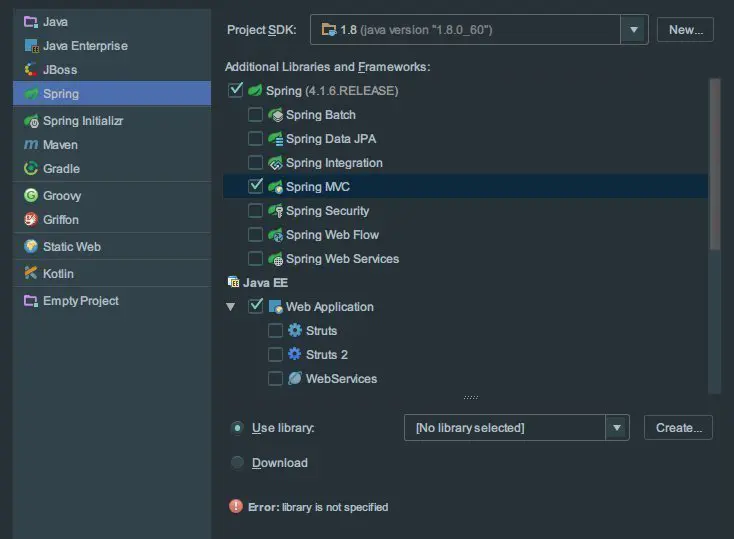
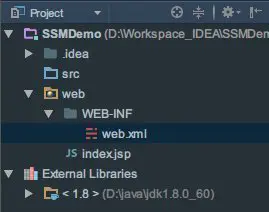
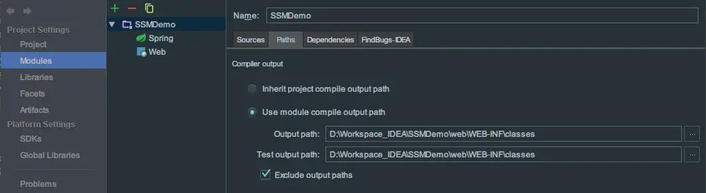
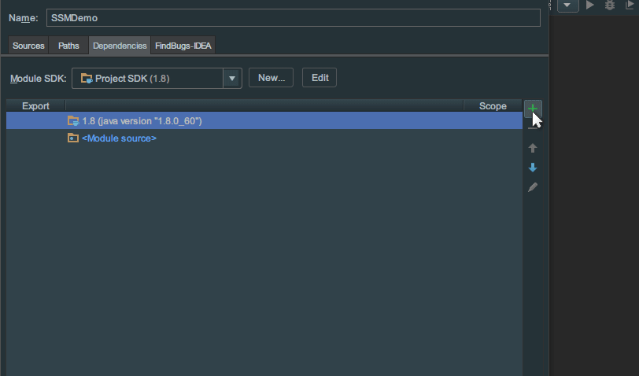
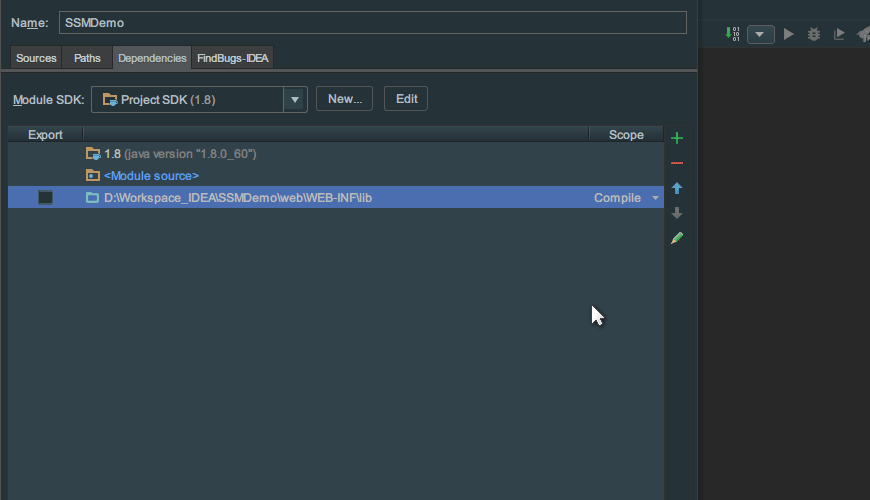
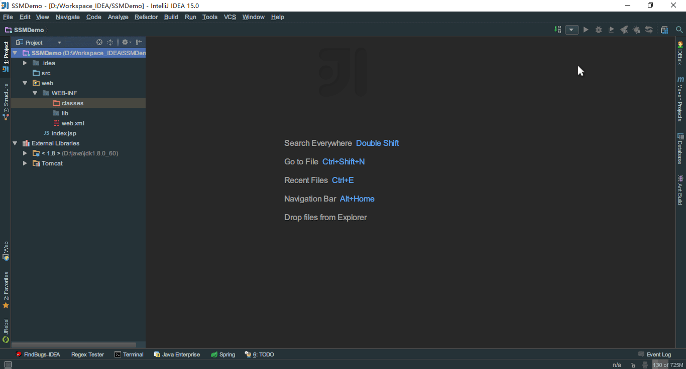
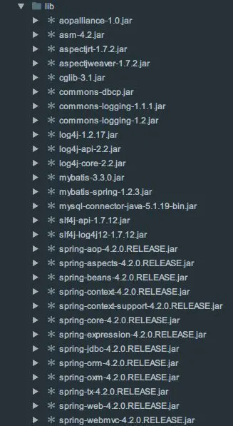
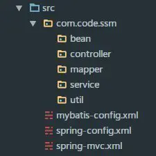

<!-- markdownlint-disable-next-line MD033 -->
<meta name="referrer" content="no-referrer"/>


使用 Intellij idea 整合 SpringMVC+Spring+Mybatis 框架,基于 Annotation.

## intellij 配置

1.新建一个 Spring 工程,勾选 SpringMVC 和 Web Application 支持,不选择下载 jar 包,而是自己导入 jar 包



2.新建好项目之后的包结构如下:



3.在 WEB-INF 目录下新建 classes 和 lib 这 2 个文件夹  
F4 进入项目设置页面.  
a. 设置编译后的 class 文件输出路径



b. 将 lib 添加到构建路径中



c. 添加 Tomcat jar 包



4.配置 Tomcat 服务器  
 因为以前设置过默认配置,这里就简单的设置一下就可以了



5.将需要的 jar 包复制到 lib 文件夹下



---

## xml 配置

1.在 src 目录下新建:  
 spring-mvc.xml SpringMVC 使用  
 spring-config.xml Spring 容器使用  
 mybatis-config.xml Mybatis 配置文件

2.web.xml 的配置  
 a.配置 SpringMVC 的核心控制器，告知 mySpring-cofnig.xml 的存在  
 b.配置 Spring 容器的监听器 当服务器启动时加载 spring 容器

```xml
<?xml version="1.0" encoding="UTF-8"?>
<web-app xmlns="http://xmlns.jcp.org/xml/ns/javaee"
         xmlns:xsi="http://www.w3.org/2001/XMLSchema-instance"
         xsi:schemaLocation="http://xmlns.jcp.org/xml/ns/javaee http://xmlns.jcp.org/xml/ns/javaee/web-app_3_1.xsd"
         version="3.1">

    <!--配置Spring容器的监听器,用于加载Spring容器-->
    <listener>
        <listener-class>org.springframework.web.context.ContextLoaderListener</listener-class>
    </listener>
    <context-param>
        <param-name>contextConfigLocation</param-name>
        <param-value>classpath:spring-config.xml</param-value>
    </context-param>

    <!--配置前端控制器 SpringMVC-->
    <servlet>
        <servlet-name>spring</servlet-name>
        <servlet-class>org.springframework.web.servlet.DispatcherServlet</servlet-class>
        <init-param>
            <param-name>contextConfigLocation</param-name>
            <param-value>classpath:spring-mvc.xml</param-value>
        </init-param>
        <load-on-startup>1</load-on-startup>
    </servlet>
    <servlet-mapping>
        <servlet-name>spring</servlet-name>
        <url-pattern>*.spring</url-pattern>
    </servlet-mapping>

    <!-- 设置session -->
    <session-config>
        <session-timeout>15</session-timeout>
    </session-config>

    <welcome-file-list>
        <welcome-file>login.jsp</welcome-file>
        <welcome-file>index.html</welcome-file>
    </welcome-file-list>
</web-app>
```

启动服务器,如果没报错,我们继续

---

### 实现最简单的登录功能,使用 spring-mvc.xml

客户端请求 -->controller  
在 src 下新建需要的包  


bean: 实体 bean  
controller: 业务控制器  
mapper: 相当于一起的 dao,用来放 mapper.xml 映射文件和对表的操作接口类  
service: 业务接口和业务接口实现类  
util: 工具包

1.bean 类和数据库表信息

```java
package com.code.ssm.bean;
import java.io.Serializable;
public class UserBean implements Serializable{
    private static final long serialVersionUID = 9018124883408166898L;
    private int id;
    private String username;
    private String password;
    private int account;
    public UserBean() {}
    public UserBean(String username, String password, int account) {
        this.username = username;
        this.password = password;
        this.account = account;
    }
    public int getId() {return id;}
    public void setId(int id) {this.id = id;}
    public String getUsername() {return username;}
    public void setUsername(String username) {this.username = username;}
    public String getPassword() {return password;}
    public void setPassword(String password) {this.password = password;}
    public int getAccount() {return account;}
    public void setAccount(int account) {this.account = account;}
    @Override
    public String toString() {
        return "UserBean{" +
                "id=" + id +
                ", username='" + username + '\'' +
                ", password='" + password + '\'' +
                ", account=" + account +
                '}';
    }
}
```

```sql
-- ----------------------------
-- Table structure for t_user
-- ----------------------------
DROP TABLE IF EXISTS `t_user`;
CREATE TABLE `t_user` (
  `pk_id` int(11) NOT NULL AUTO_INCREMENT,
  `f_name` varchar(255) DEFAULT NULL,
  `f_pwd` varchar(255) DEFAULT NULL,
  `f_account` varchar(255) DEFAULT NULL,
  PRIMARY KEY (`pk_id`)
) ENGINE=InnoDB AUTO_INCREMENT=12 DEFAULT CHARSET=utf8;

-- ----------------------------
-- Records of t_user
-- ----------------------------
INSERT INTO `t_user` VALUES ('1', 'updatrezhang3', '12345', '3000');
INSERT INTO `t_user` VALUES ('2', 'updatrezhang3', '12345', '3000');
INSERT INTO `t_user` VALUES ('3', 'zhang3', '12345', '1000');
INSERT INTO `t_user` VALUES ('4', 'zhang4', '12345', '3000');
```

2.spring-mvc.xml 配置

```xml
<?xml version="1.0" encoding="UTF-8"?>
<beans xmlns="http://www.springframework.org/schema/beans"
       xmlns:xsi="http://www.w3.org/2001/XMLSchema-instance"
       xmlns:context="http://www.springframework.org/schema/context"
       xsi:schemaLocation="http://www.springframework.org/schema/beans
	http://www.springframework.org/schema/beans/spring-beans-4.2.xsd
	http://www.springframework.org/schema/context
	http://www.springframework.org/schema/context/spring-context-4.2.xsd">

    <!--开启注解-->
    <context:annotation-config/>
    <!-- 自动扫描controller包下的所有类，使其认为spring mvc的控制器 -->
    <context:component-scan base-package="com.code.ssm.controller"/>

    <!-- ViewREsolver视图解析器 用于将返回的ModelAndView对象进行分离 -->
    <bean class="org.springframework.web.servlet.view.UrlBasedViewResolver">
        <property name="viewClass"
                  value="org.springframework.web.servlet.view.JstlView"/>
        <property name="prefix" value="/"/>
        <property name="suffix" value=".jsp"/>
    </bean>

</beans>
```

3.新建 LoginController.java

```java
package com.code.ssm.controller;

import org.springframework.stereotype.Controller;
import org.springframework.web.bind.annotation.RequestMapping;
@Controller
public class LoginController {
	@RequestMapping("/login")
	public String login(String username, String password) {
		System.out.println(username +"  " + password);
		return null;
	}
}
```

4.在 WEB-INF 目录下新建 login.jsp 文件

```html
<%@ page language="java" pageEncoding="utf-8"%> <%@ taglib prefix="spring"
uri="http://www.springframework.org/tags" %> <%@ taglib prefix="springForm"
uri="http://www.springframework.org/tags/form" %> <% String path =
request.getContextPath(); String basePath = request.getScheme() + "://" +
request.getServerName() + ":" + request.getServerPort() + path + "/"; %>

<!DOCTYPE html PUBLIC "-//W3C//DTD HTML 4.01 Transitional//EN">
<html>
  <head>
    <base href="<%=basePath%>" />
    <title>My JSP 'login.jsp' starting page</title>
  </head>
  <body>
    <form method="post" action="login.spring" name="loginForm">
      <p><input type="text" name="username" /></p>
      <p><input type="password" name="password" /></p>
      <p><input type="submit" value="login" name="subBtn" /></p>
    </form>
  </body>
</html>
```

5.打开服务器,登录 `http://localhost:8080/SSM/login.jsp`  
随便输入用户名和密码,提交之后看控制台是否输出,如果正确输出,我们继续

**总结一下:**

1.在 web.xml 中配置 spring 容器监听器,当服务器启动时加载 spring-config.xml,开启 spring 容器  
2.在 web.xml 中配置前端控制器 DispatcherServlet,拦截全部以.spring 结尾的请求,然后分发给 controller,  
3.在 spring-mvc.xml 中配置开启注解,自动扫描@RequestMapping 注解,  
@Controller: 告知 spring 容器这是一个控制器组件;@RequestMapping("/login"): 告知该方法时针对/login 请求的处理方法

---

### 使用 spring-config.xml,让 spring 容器来管理 bean 之间的关系

上面只是实现了 spring_mvc 的功能,接下来实现 Controller-->Service  
1.spring-config.xml 配置

```xml
<?xml version="1.0" encoding="UTF-8"?>
<beans xmlns="http://www.springframework.org/schema/beans"
       xmlns:xsi="http://www.w3.org/2001/XMLSchema-instance"
       xmlns:context="http://www.springframework.org/schema/context"
       xsi:schemaLocation="http://www.springframework.org/schema/beans http://www.springframework.org/schema/beans/spring-beans.xsd http://www.springframework.org/schema/context http://www.springframework.org/schema/context/spring-context.xsd">

    <!--自动扫描 annotation注解,让spring容器知道哪些需要让它来管理-->
    <!--启动spring容器时,根据annotation自动扫描,然后实例化bean,注入依赖关系-->
    <context:component-scan base-package="com.code.ssm">
        <context:exclude-filter type="regex" expression=".(mapper|service.imp)"/>
    </context:component-scan>
</beans>
```

2.新建 UserService.java 和实现类 UserServiceImp.java

```java
//UserService.java
package com.code.ssm.service;
import com.code.ssm.bean.UserBean;
public interface UserService {
	UserBean login(String username, String password);
}
```

```java
//UserServiceImp.java
package com.code.ssm.service.imp;
import com.code.ssm.bean.UserBean;
import com.code.ssm.service.UserService;
import org.springframework.stereotype.Service;
//告知spring容器,我是loginController类的依赖
@Service("userService")
public class UserServiceImp implements UserService {
	@Override
	public UserBean login(String username, String password) {
	   System.out.println(username + "  " + password);
		return null;
	}
}
```

3.向 LoginController 中注入 UserServiceImp 依赖

```java
package com.code.ssm.controller;
import com.code.ssm.service.UserService;
import org.springframework.stereotype.Controller;
import org.springframework.web.bind.annotation.RequestMapping;
import javax.annotation.Resource;
@Controller
public class LoginController {
    ////将UserService的实现类注入到controller中
	@Resource(name="userService")
	private UserService userService;
	@RequestMapping("/login")
	public String login(String username, String password) {
	   //调用login()方法
		userService.login(username,password);
		return null;
	}
}
```

4.打开服务器,登录 `http://localhost:8080/SSM/login.jsp`  
随便输入用户名和密码,提交之后看控制台是否输出,如果正确输出,我们继续

---

**总结一下:**  
1.在 spring-config.xml 中配置自动扫描,扫描包下面的注解,管理 bean 之间的依赖关系

### 实现数据库连接

controller-->service-->dao  
1.在 mapper 包下新建 UserMapper.java

```java
package com.code.ssm.mapper;
import com.code.ssm.bean.UserBean;
import org.apache.ibatis.annotations.Param;
public interface UserMapper {
	UserBean getUserByNamePwd(@Param("username") String username, @Param("password") String password);
}
```

2.在 mapper 包下新建 UserMapper.xml 映射文件

```xml
<?xml version="1.0" encoding="UTF-8"?>
<!DOCTYPE mapper PUBLIC "-//mybatis.org/DTD Mapper 3.0//EN" "http://mybatis.org/dtd/mybatis-3-mapper.dtd" >
<mapper namespace="com.code.ssm.mapper.UserMapper">
    <!-- 结果映射 -->
    <resultMap id="userMapper" type="UserBean">
        <id property="id" column="pk_id" javaType="int"/>
        <result property="username" column="f_username" javaType="java.lang.String"/>
        <result property="password" column="f_password" javaType="java.lang.String"/>
        <result property="account" column="f_account" javaType="int"/>
    </resultMap>

    <select id="getUserByNamePwd" resultMap="userMapper">
        SELECT *
        FROM t_user
        WHERE f_name = #{username} AND f_pwd = #{password}
    </select>
</mapper>
```

3.在 spring-config.xml 中配置数据源和 SessionFactory

```xml
<!-- 配置数据源 -->
       <!--<context:property-placeholder location="classpath:datasource.properties" />-->
       <!--或者在mybatis.xml中配置或者引入datasource.properties文件-->
       <bean id="dataSource" class="org.springframework.jdbc.datasource.DriverManagerDataSource">
              <property name="driverClassName" value="com.mysql.jdbc.Driver"/>
              <property name="url" value="jdbc:mysql://localhost:3306/test"/>
              <property name="username" value="code"/>
              <property name="password" value="8998"/>
       </bean>

       <!--配置SessionFactory 这是mybatis-spring.jar包中的类-->
       <bean id="sessionFactory" class="org.mybatis.spring.SqlSessionFactoryBean">
              <property name="dataSource" ref="dataSource"/>
              <!--引入mybatis.xml文件-->
              <property name="configLocation" value="classpath:mybatis-config.xml"/>
       </bean>
       <!--spring自动查找mybatis下的类 这是mybatis-spring.jar包中的类-->
        <bean class="org.mybatis.spring.mapper.MapperScannerConfigurer">
            <property name="basePackage" value="com.code.ssm.mapper"/>
            <property name="sqlSessionFactoryBeanName" value="sessionFactory"/>
        </bean>
```

3.配置 mybatis-config.xml

```xml
<?xml version="1.0" encoding="UTF-8"?>
<!DOCTYPE configuration PUBLIC "-//mybatis.org/DTD Config 3.0//EN"
        "http://mybatis.org/dtd/mybatis-3-config.dtd" >
<configuration>
    <!-- 自动扫描包，用类名作别名 -->
    <typeAliases>
        <package name="com.code.ssm.bean"/>
    </typeAliases>
</configuration>
```

4.修改 UserServiceImp.java

```java
package com.code.ssm.service.imp;

import com.code.ssm.bean.UserBean;
import com.code.ssm.mapper.UserMapper;
import com.code.ssm.service.UserService;
import org.springframework.stereotype.Service;

import javax.annotation.Resource;

@Service("userService")
public class UserServiceImp implements UserService{
    //注入依赖
    @Resource
    private UserMapper userMapper;
    @Override
    public UserBean login(String username, String password) {
        return userMapper.getUserByNamePwd(username,password);
    }
}
```

5.修改 LoginController.java

```java
package com.code.ssm.controller;
import com.code.ssm.bean.UserBean;
import com.code.ssm.service.UserService;
import org.springframework.stereotype.Controller;
import org.springframework.web.bind.annotation.RequestMapping;
import javax.annotation.Resource;
@Controller
public class LoginController {
    @Resource(name="userService")
    private UserService userService;
    @RequestMapping("/login")
    public String login(String username, String password){
        UserBean userBean =  userService.login(username,password);
        if(userBean != null) return "success";
        else return "login";
    }
}
```

6.打开服务器,登录 `http://localhost:8080/SSM/login.jsp`

输入正确的用户名和密码,跳转到 success.jsp 页面则成功.整个过程结束
