<!-- markdownlint-disable-next-line MD033 -->
<meta name="referrer" content="no-referrer"/>


项目重构整理

<!-- more-->

## 废话

此篇是 12530 架构重构第二篇, 以 [阿里巴巴开发手册](https://github.com/alibaba/p3c/) 为基础, 结合自己工作经验, 作为 `musicsearch-project`
重构方案的基础部分.
以此为约束, 希望构建一个 `稳定`, `易于维护`, `可扩展` 的重构方案.

一个项目最怕多种编码风格, 实体名一会 entity, 一会 model, 让维护的人身心疲惫, 因此在一个项目中保持唯一一种编码习惯, 有利于代码维护 (比如通过命名,
就知道作用以及所在的包名).

**见名知意, 此乃命名的最高境界 (体会一下 `取名 10 分钟, 编码 1 分钟` 的境界 😂).**

> 代码规范看起来比较枯燥, 看完一遍可能只有一点点印象, 因此我采用比较逗比的方式, 尽量让大家一遍就记住.
> 代码规范比较偏向个人主义, 每个人的编码习惯都不一样, 所以希望多提出自己的建议, 一起改进 (没有最好的规范, 只有最合适的. 🙃)

## Let's go

### 开篇

话说盘古开天辟地之时... 亚当和夏娃诞生混沌之间, 他们从小青梅竹马, 一个会唱 200 首歌, 一个会跳 200 支舞, 后人称他们一个为 二百歌, 一个为
二百舞 ..... (用心去体会 😂)

### 这个才是开篇

江湖四分五裂, 一人一江湖...

但我们是一个团队，为了便于管理和维护，急需一份代码规范, 来约束我们的编码规则和习惯, 就像修炼一门武林绝学, 需要秘籍的指引 (葵花宝典?)。

请各位英雄好汉仔细阅读 严格遵守
如有不足之处 希望提出意见 共商武林统一霸业

从 1000 个哈姆雷特转变为同一个 **林志玲**, 代码风格保持统一有利于提高工作效率, 便于管理.

比如:

1. 一看到以 Controller 结尾的类, 就应该知道这个是接口, 用于参数验证, 调用业务类进行处理业务逻辑, 组装结果, 返回数据或者跳转页面;
2. 一看到以 Service 结尾的类, 就知道这个是业务接口类, 用于定义业务接口;
3. 一看到以 Impl 结尾的类, 就应该知道这个是业务实现类, 组合不同的 Dao, 实现业务逻辑;
4. 一看到以 Dao 结尾的类, 就应该知道这个是 DB 操作类, 对数据进行 CRUD 操作;
5. 一看到以 Dto 结尾的类, 就应该知道这个是数据传输对象, 用于展示层和服务层之间的数据传输;
6. ....

## 约定

为了避免歧义, 文档大量使用以下词汇, 解释如下:

1. `必须` (must): 绝对，严格遵循，请照做，无条件遵守；
2. `一定不可` (must not): 禁令，严令禁止；
3. `应该` (should): 强烈建议这样做，但是不强求；
4. `不该` (should not): 强烈不建议这样做，但是不强求；
5. `可以` (may) 和 可选 (optional): 选择性高一点，在这个文档内，此词语使用较少；
6. `推荐` (recommend): 个人推荐的做法, 不强求;

## 准备工作

> 行走江湖, 没有一件趁手的兵器怎么能在江湖中立足, 还在用 `eclipse` 的少侠们, 希望弃暗投明, 拥抱 Intellij IDEA, 你会发现编码效率提升不是
> **点巴点儿**, 而是 **蹭蹭蹭** 的往上涨 😁.

**我不是富二代, 我没有赢在人生的起跑线上, 但是我用 Intellij IDEA, 我赢在了工作的起跑线上!**

推荐一个比较全面的 [Intellij IDEA 教程](https://github.com/judasn/IntelliJ-IDEA-Tutorial)

**工欲善其事, 必先利其器. 一件趁手的兵器带你迎娶白富美, 走上人生巅峰, 统一江湖, 指日可待**


为了简化手动操作和提高编码效率, 要求安装几个必要的插件, 以及对 IDEA 进行必要的优化配置

### Intellij IDEA 插件

#### Alibaba Java Coding Guidelines

> `必须` 安装, 代码规范检查的基础

**作用: 代码规则检查**

此插件是 阿里巴巴根据 [阿里巴巴开发手册](https://github.com/alibaba/p3c/) 开发的一个静态代码规范检查插件, 每个警告都提供了一个 demo,

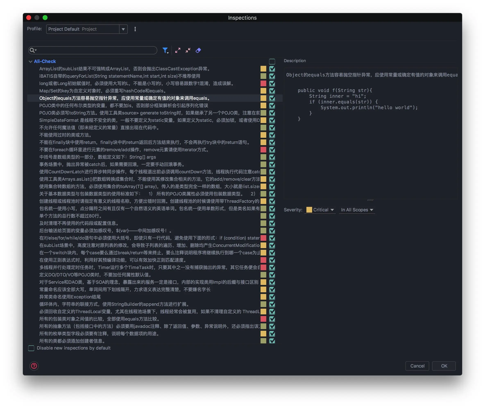
此篇以 [阿里巴巴开发手册](https://github.com/alibaba/p3c/) 为基础, 但是并不会一一罗列每条规范, 因为此插件已经能很好的检查了.

**此篇重点在于这个插件不能检查的规范.**

#### lombok

> `必须` 安装, 不然代码跑不起来就尴尬了

**作用: 化繁为简. [官网](<[http://projectlombok.org/](http://projectlombok.org/)>)**

使用 `@Data` 代替烦人的 get/set 方法

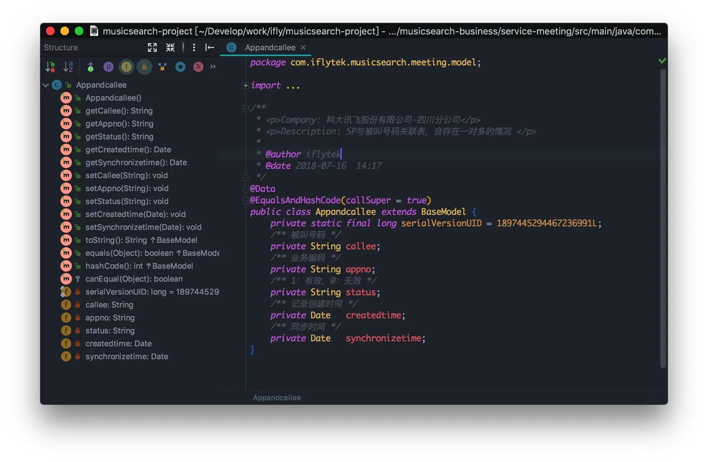

使用 `@Slf4j` 代替获取 log 实例的代码

```java
private static final Logger log = LoggerFactory.getLogger(ApplicationTest.class);
```

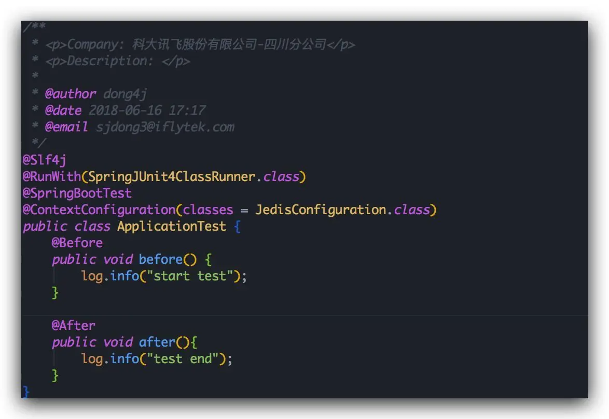

**使用方式**：

1. 在 pom 文件中添加：

   ```xml
   <!-- lombok-->
   <dependency>
       <groupId>org.projectlombok</groupId>
       <artifactId>lombok</artifactId>
       <version>${lombok.version}</version>
   </dependency>
   ```

2. 在 IDEA 中添加插件 `lombok` （file->setting->plugins）

3. IDEA 设置

   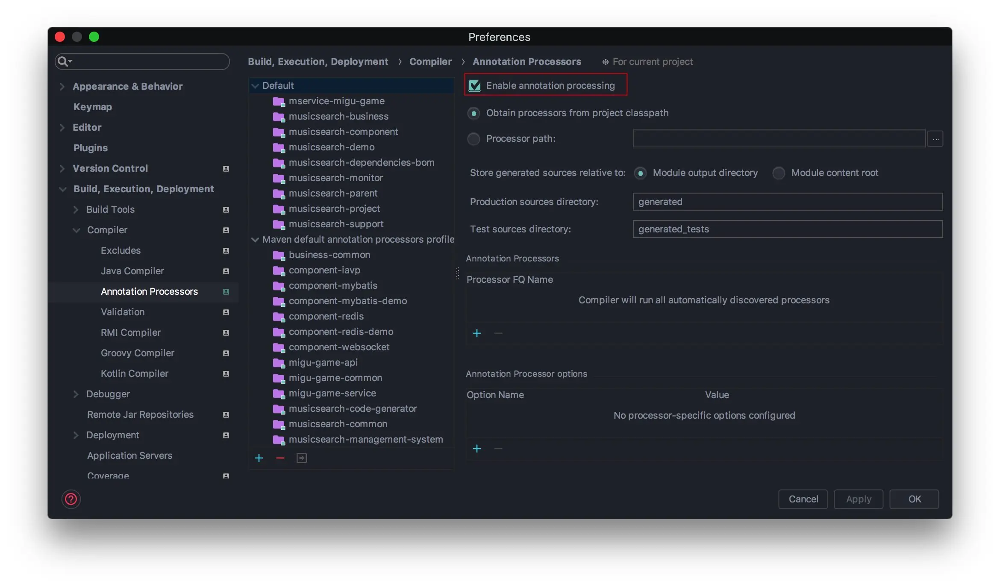

#### Maven Helper

> `必须` 安装, 不然依赖冲突了就不好了

**作用: 检查依赖冲突**

新加入一个 jar 包, 谁添加谁负责, 使用此插件检查是否有依赖冲突.

依赖冲突可能会导致:

1. java.lang.ClassNotFoundException
2. java.lang.NoSuchMethodError
3. java.lang.NoClassDefFoundError
4. 开发环境正常, 测试或者生产环境不正常....

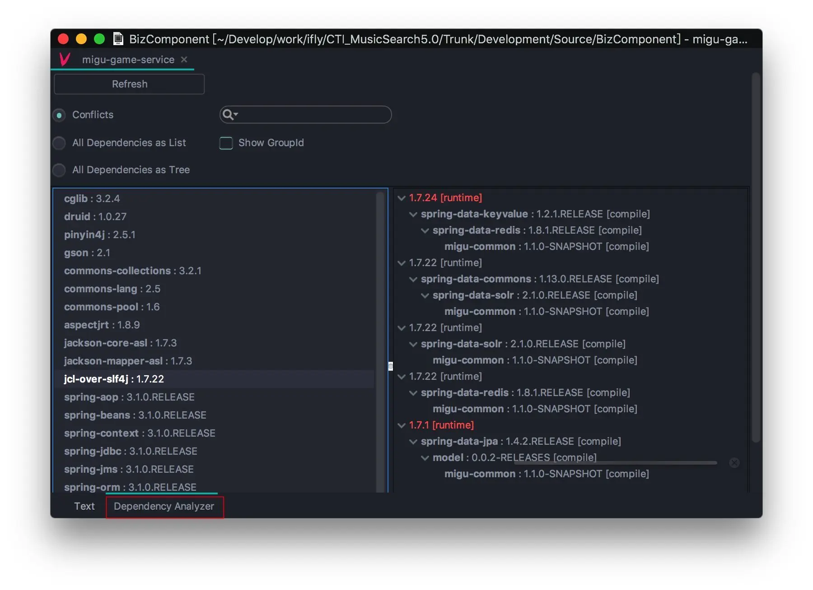

#### JavaDoc

> `必须` 安装

**作用: 快速生成标准的 javadoc**

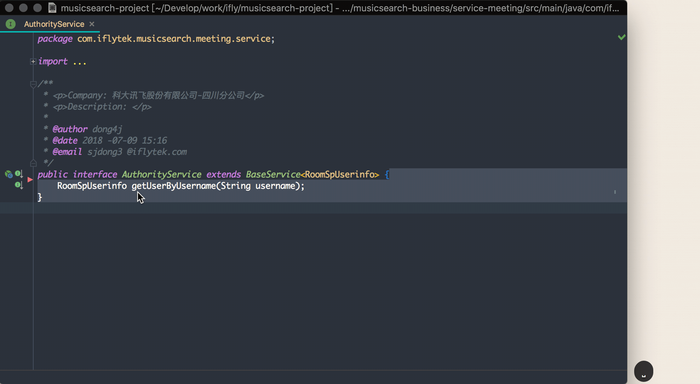

#### JRebel

> `推荐` 安装, 提高工作效率的插件.

**作用: 代码热部署插件, 改了代码后, 重新编译, 不用重启应用就可查看效果.**

热部署插件, 谁用谁知道;

[科学使用方法](http://blog.lanyus.com/search/JRebel/) (低调点)

#### Mybatis Plugin

> `推荐` 安装, 提高工作效率的插件.

**作用: xml 和 dao 快速跳转; 快速生成 xml; xml 检查**

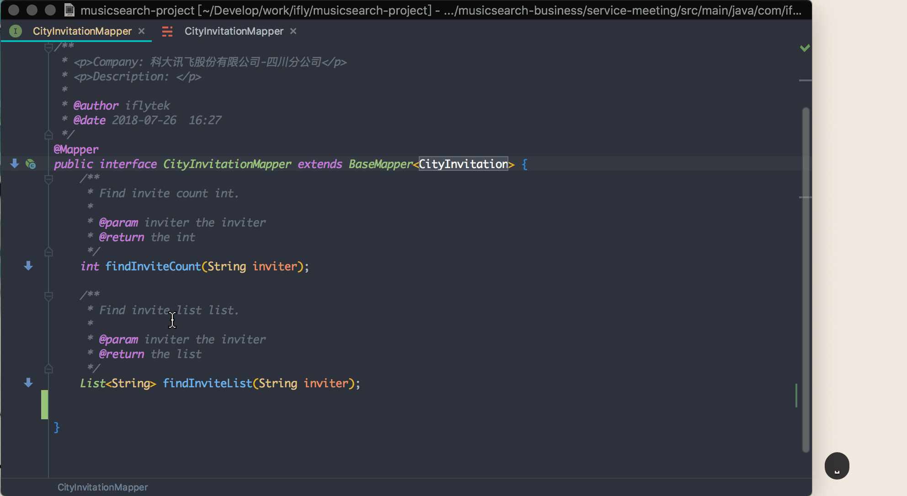

#### GenerateSerialVersionUID

> `推荐` 安装, 提高工作效率的插件

**作用: 为实现了 Serializable 接口的实体快速添加 serialVersionUID, 提高效率**

因为要求实体 `必须` 实现 `Serializable` 接口, 而且 `必须` 添加 `serialVersionUID` 字段.

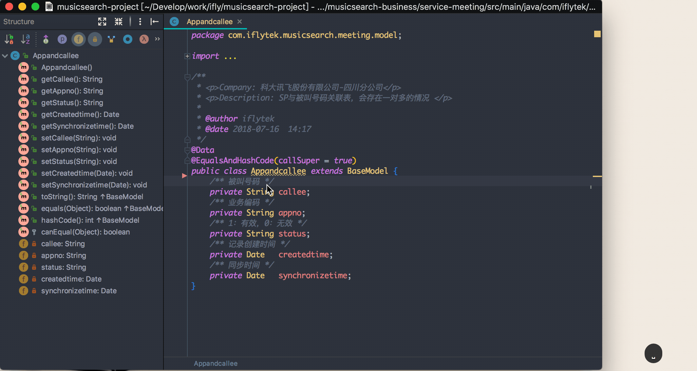

#### GenerateAllSetter

> `推荐` 安装, 提高工作效率的插件

**作用: 快速生成 set 方法**

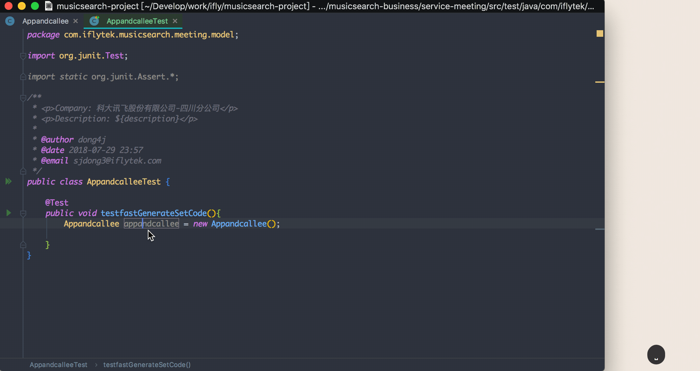

#### Translation

> `推荐` 安装, 提高工作效率的插件

**作用: 翻译插件, 提供 百度, 有道, Google 翻译**

一款为像我这种英语渣的码农量身定做的插件 😂

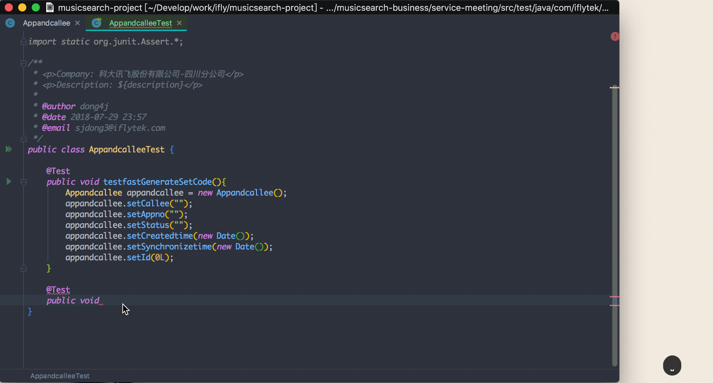

#### Grep Console

> `推荐` 安装

**作用: 高亮显示 log 不同级别日志，看日志的时候一目了然; 具有 error 级别声音提醒功能 (可设置)**

效果:

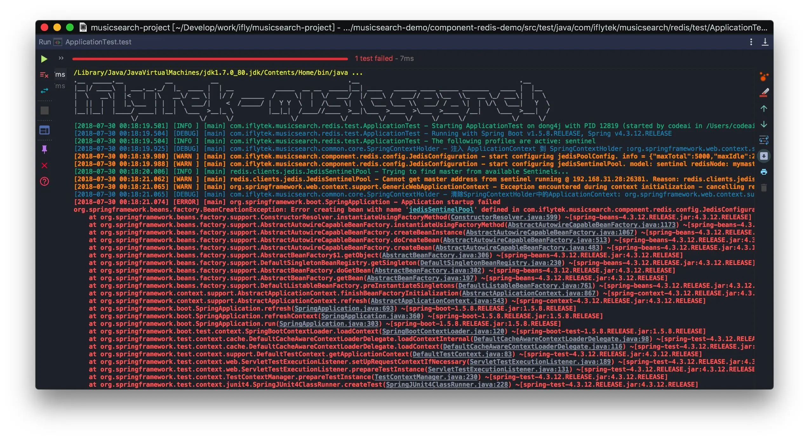

插件设置:

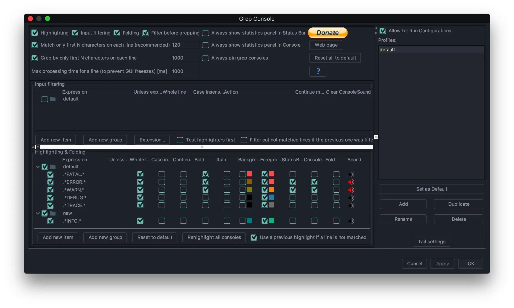
此插件通过 log 输出中的 info/debug/warn/error 来匹配对应的颜色. 因此 log 输出中必须包含 **日志级别**, 这个 **日志规范** 中再说.

#### RestfulToolkit

> `推荐` 安装

**作用: 快速定位接口, Rest 请求模拟 **

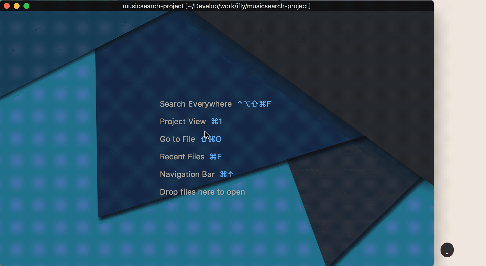

#### Restore Sql for iBatis/Mybatis

> `推荐` 安装

**作用: 查看请求 sql, 可直接运行 **

效果:

`meeting-service` 调用 `/login` 接口后需要执行的 sql

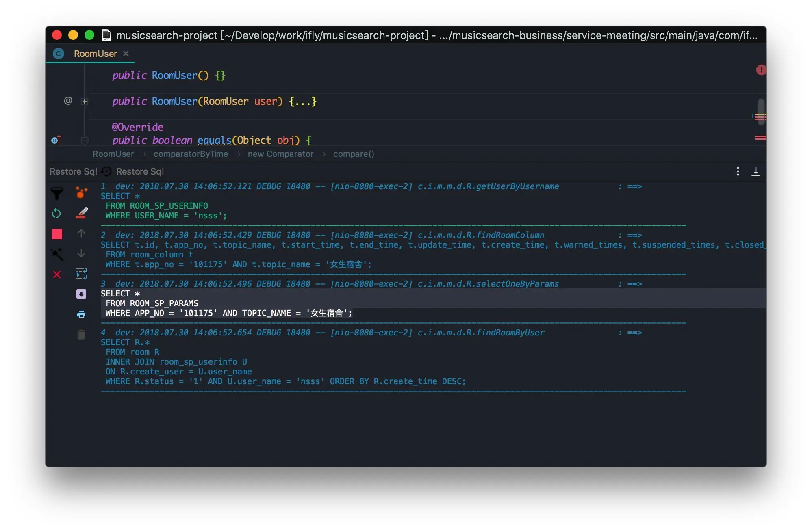

### Intellij IDEA 设置

#### 编码设置

> 编码 `必须` 使用 `UTF-8`, 且 `必须` 设置为 `with NO BOM`

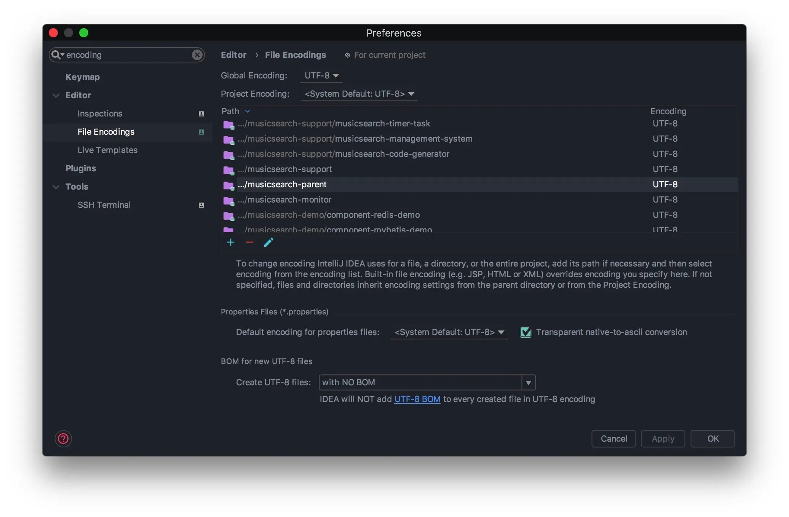

`踩坑`

**Windows 下请不要用记事本打开 UFT-8 编码的文本文件, 更不要保存 **

Windows 坑的很, UTF-8 编码的文本文件最前面会给你加上一个 BOM, 其他系统打开是正常显示, 但是不会显示这个 BOM, 造成文件解析出错.

##### html 设置编码为 UTF-8

```html
<meta charset="UTF-8" />
```

> html 或者模板 `应该` 使用 html5

html4 升级为 html5 非常简单

```html
<!DOCTYPE html PUBLIC "-//W3C//DTD XHTML 1.0 Transitional//EN" "http://www.w3.org/TR/xhtml1/DTD/xhtml1-transitional.dtd">
<html>
  <head>
    <meta http-equiv="Content-Type" content="text/html;charset=UTF-8" />
    <link type="text/css" rel="stylesheet" href="css.css" />
    <script type="text/javascript" src="jquery.js"></script>
    <title>Document</title>
  </head>
  <body></body>
</html>
```

修改为:

```html
<!DOCTYPE html>
<html>
  <head>
    <meta charset="UTF-8" />
    <link rel="stylesheet" href="css.css" />
    <script src="jquery.js"></script>
    <title>Document</title>
  </head>
  <body></body>
</html>
```

简单的升级, 就能享受 30 多个新标签带来的便捷, 何乐而不为呢?

就跟超市打折一样, 还倒送你 30 块, 跳广场舞的大妈排着队去, 你还不去?

##### Tomcat 设置编码为 UTF-8

```xml
<Connector port="8080" protocol="HTTP/1.1"
                connectionTimeout="20000"
                redirectPort="8443"  />
```

改为:

```xml
<Connector port="8080" protocol="HTTP/1.1"
                connectionTimeout="20000"
                redirectPort="8443"
                URIEncoding="UTF-8" />
```

Tomcat7 默认编码为 ISO-8859-1, 到了 Tomcat8 后, 默认编码改为 UTF-8
因此以上修改只针对于 Tomcat7.

#### todo 标识

> `必须`

**作用: 方便搜索, 明确负责人, 说明 todo 原因 **

这里扩展了 IDEA 自带的 todo 标识, 使用 `todo- 负责人: (时间) [原因]` 来规范 `todo` 用法

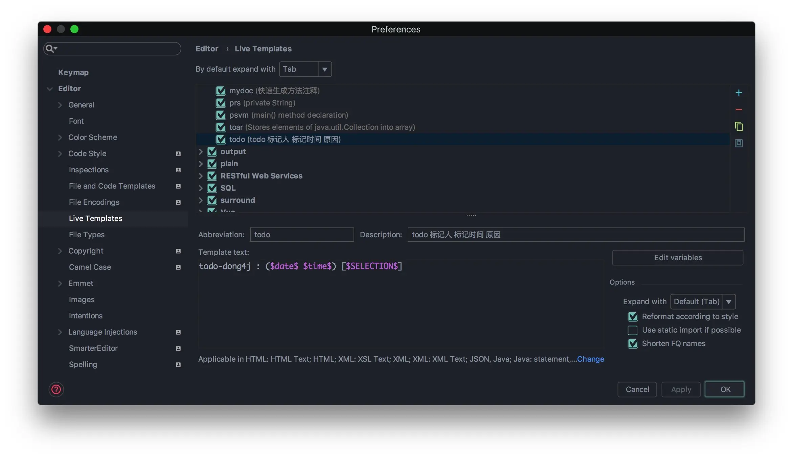

```lua
todo- 负责人: ($date$ $time$) [$SELECTION$]
```

**date time 设置见 类注释一节 **

效果:

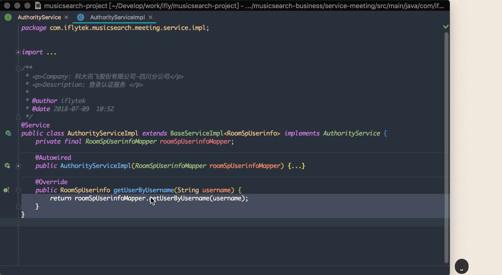

#### fixme 标识

> `必须`

```lua
fixme- 负责人: ($date$ $time$ [$SELECTION$])
```

设置和效果同上

#### 类注释

> `必须` 为每个类添加必要的注释

这里有 2 中方式:

**1. 新建类时添加注释 **

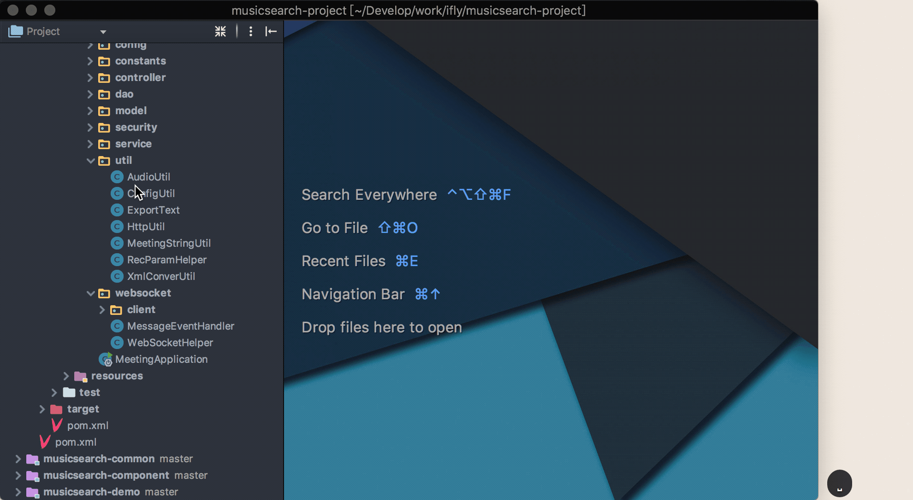

设置方式:

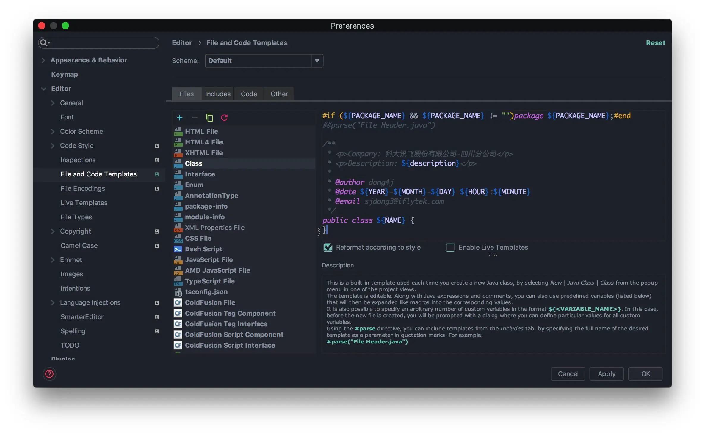

```java
#if (${PACKAGE_NAME} && ${PACKAGE_NAME} != "")package ${PACKAGE_NAME};#end
##parse("File Header.java")

/**
 * <p>Company: xxxx公司 </p>
 * <p>Description: ${description}</p>
 ¶*
 * @author 你的昵称
 * @date ${YEAR}-${MONTH}-${DAY} ${HOUR}:${MINUTE}
 * @email 用户名@xxxx.com
 */
public class ${NAME} {
}
```

**2. 为已存在的类添加注释 **

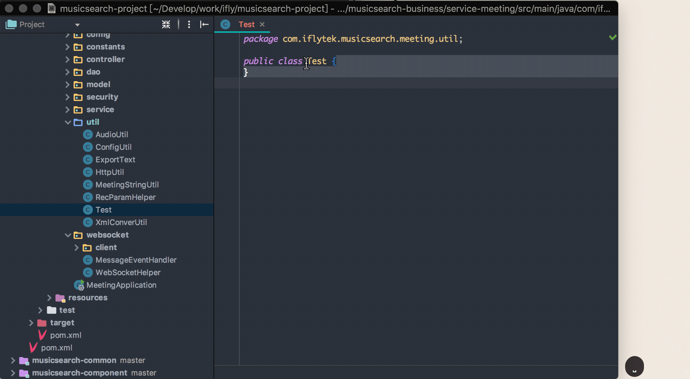

设置方式:

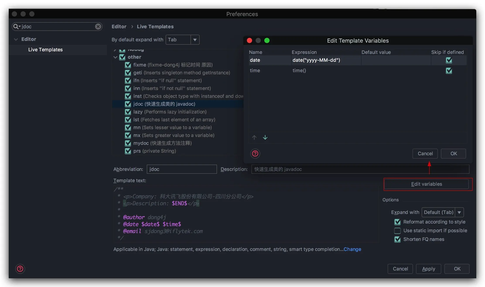

```java
/**
 * <p>Company: xxxx公司 </p>
 * <p>Description: $END$</p>
 *
 * @author 你的昵称
 * @date $date$ $time$
 * @email 用户名@xxxx.com
 */
```

#### 方法注释

> `推荐` 使用 JavaDoc 插件自动生成

JavaDoc 只能自动生成非 `private` 方法和属性的注释, 如果需要生成 `private` 级的注释, 可以通过修改 `public`, 生成完成后, 再修改回来

#### 代码注释

> `不该` 使用行尾注释;
> `推荐` 使用 // 代替 `/*...*/` 多行注释;
> `推荐` 使用 `/**..*/` 对字段进行注释 (单行);
> 所有字段名, 方法名, 类名 都 `应该` 使用简单, 业界常用的单词命名, 不要为了注释而注释, 讲究个代码之美.

在查看大段代码时, `推荐` 使用

```java
// region 段注释
....
// endregion
```

**此注释能增加代码折叠功能, 便于快速梳理代码 **

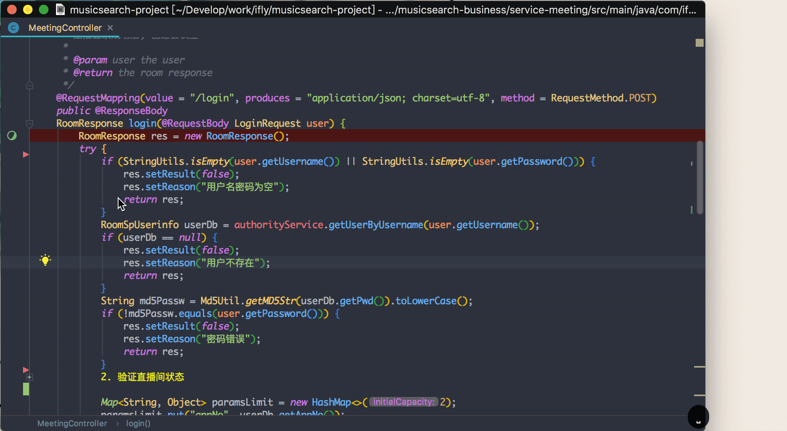

### Version Control 设置

> `必须` 忽略 target 目录
> `必须` 忽略 .idea
> `必须` 忽略 `*.iml`
> `必须` 添加 .ignore 文件

**如果使用 git, 所有忽略文件都可以添加到 .ignore 即可 **

**提交代码时的设置 **

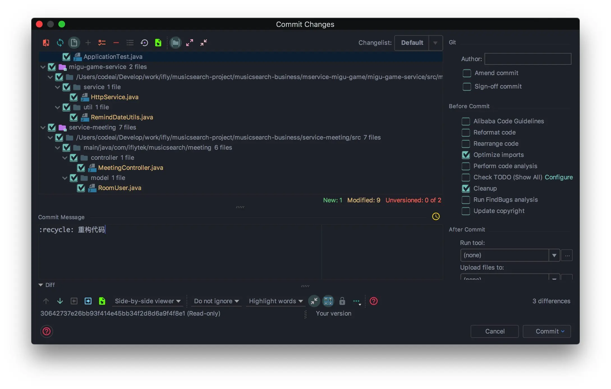

> `必须` 勾选 Optimize imports; (提交代码时, 自动删除不被使用的 import)
> `推荐` 取消掉默认勾选的 Perform code analysis 和 Check TODO, 会增加提交代码的时间;
> `不该` 勾选 Reformat code, 会格式化所有提交的代码, 格式化代码应该自己手动格式化, 这样能减少代码冲突的可能;

## 代码样式

以 intellij-java-google-style.xml 为基础, 做了一部分修改.

> musicsearch-project `必须的必须` 使用此代码样式, 为了减少代码冲突, 同一代码样式 (同一门派, 你去修炼其他门派武功, 会被逐出师门的!).

比如:

1. 一行的代码长度不能超过 140 宽;
2. 等号对齐;
3. if 语句只有一行也 `必须` 加大括号;
4. 所有操作符两边 `必须` 有空格;
5. 类名, 方法名 `必须` 加空格后才跟 一个 `{`;
6. 使用 4 个空格代替制表符 (我们这里不讨论空格好还是制表符好, 统一使用一种是最最好的);
7. ....

**以上列举的部分规范都可以使用格式化解决;**

本人对代码有着严 (变) 格(态)的要求, 严 (变) 格(态)到使用 `//` 后面 `必须` 跟一个空格, 然后才是注释内容; 英文和中文之间 `必须` 增加一个空格;
所有标点全部使用英文标点; 没有被使用的类, 变量都 `必须` 删除; 遇到的警告 `必须` 尽最大努力改正;

左边为重构之前的警告数量 (黄色), 右边为重构之后的

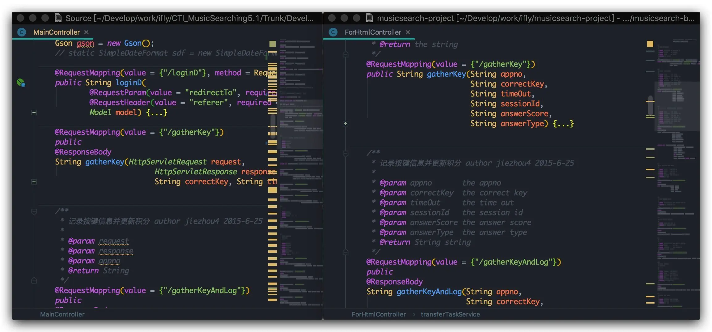

1. 英文和中文之间增加空格是为了便于阅读, 方便拷贝 (双击英文即可全选, 如果不增加空格, 中文英文则会全被选中. 我变态到 chrome
   都要安装一个叫 `空格之神` 的插件, 用于在中英文之间追加空格);
2. 全部使用英文标点的好处不言而喻, Java 乃至所有的编程语言都不支持中文标点, 打个分号还得切换输入法, 想想都忧伤; 有时候就是因为中文标点的问题,
   一直报错 (输入法可以设置中文时使用英文标点, `推荐` 这种设置);
3. 符号后面喜欢追加一个空格, 是受 Markdown 语法的影响, 以前用过很多 Markdown 编辑工具, 由于解析语法不一样, 迁移时渲染不生效, 加个空格或者换行就
   Ok 了; 😂
4. 及时删除不需要的代码, 时刻保持代码干净 (IDEA 会帮我们检查未使用的代码).
5. **警告是 bug 的温床, 修复警告, 就是修复潜在的 bug**. 修复警告, 也能学到很多东西的 (😎)

## musicsearch-project 规范

以下作为 `musicsearch-project` 规范, 制定了大部分要求.

具体设计将在 第三篇 介绍

### 项目结构规范

```lua
.
├── musicsearch-business            # 业务主模块
│     ├── business-common             # 业务公共类库
│     ├── mservice-migu-game          # migu-game 业务
│     └── service-meeting             # meeting 服务模块
├── musicsearch-common              # musicsearch 项目 公共模块
├── musicsearch-component           # 组件主模块
│     ├── component-iavp              # iavp 模块, 封装 iavp 相关实体和接口, 直接注入即可
│     ├── component-mybatis           # mybatis 模块, 提供代码生成和 mybatis 相关功能
│     ├── component-redis             # redis 模块, 注入 RedisService 即可, 提供多种模式
│     └── component-websocket         # websocket 模块 netty-socket.io 封装
├── musicsearch-demo                # demo 主模块
│     ├── component-mybatis-demo
│     └── component-redis-demo
├── musicsearch-dependencies        # 管理第三方 jar 版本和依赖关系
├── musicsearch-monitor             # 监控主模块
├── musicsearch-parent              # musicsearch 工程主模块, 管理整个功能的版本及依赖
│     └── docs                        # 放工程相关文档
│     └── database                    # 放工程 sql
└── musicsearch-support             # 支撑模块主模块
    ├── musicsearch-code-generator
    ├── musicsearch-management-system
    └── musicsearch-timer-task
```

目前重构后的模块, 可能还会有修改.
但是几个主要模块不会再修改了.

> 整个项目结构采用 `Maven` 多模块的方式开发.
> 目的是为了解决 jar 依赖混乱问题.

**结构规范:**

> 所有主模块 `必须` 以 `musicsearch-` 开始.

不为别的, 纯属统一前缀, 好看而已

> 模块名 `必须` 全部使用小写, 单词之间作用 `-` 分隔;

#### musicsearch-parent

作为整个项目的 灵魂 模块, 管理所有自有模块的版本和依赖关系, 以及整个项目都会使用到的依赖, 比如 `lombok`, `junit` 等.

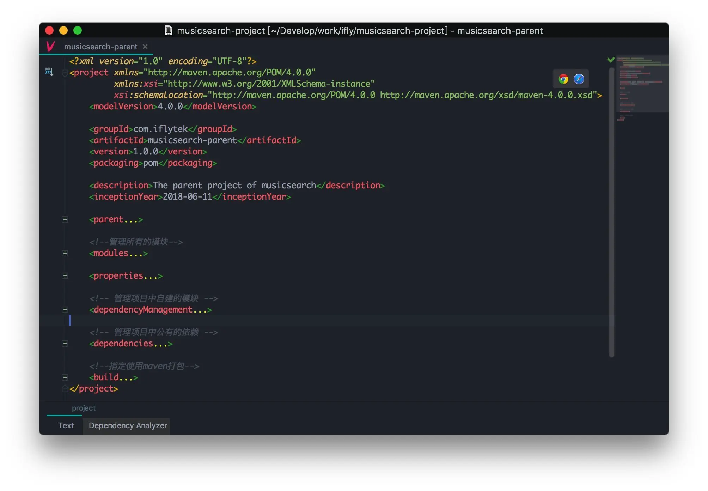
`dependencyManagement` 标签只是用于声明可能会被使用到的依赖 (就像定义变量), 不会真正添加依赖
`dependency` 才会真正真正引入依赖

这里全部为 `musicsearch-project` 自有模块, 以后新增的模块也 `必须` 将声明添加到此标签下
自有模块之间依赖就可直接使用.

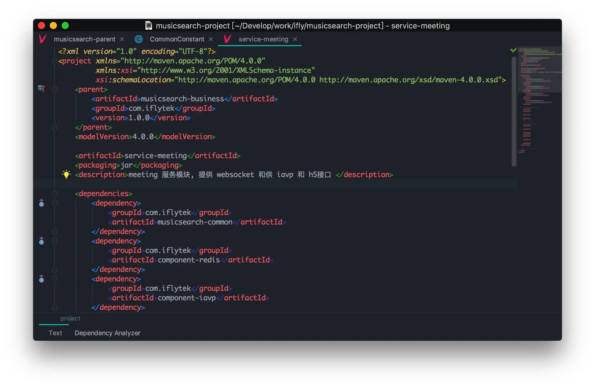
使用时, `一定不可` 添加 version 标签, 不然就会使用修改后的版本, 可能会造成依赖冲突.

---

`musicsearch-project` 模块下有一个 doc 目录, 用于保存文本文档

个人认为, 项目的 `技术文档` 跟着代码走才是最正确的做法.
随时修改, 随时查看, 代码和文档一起更新提交, 才是最佳实践.

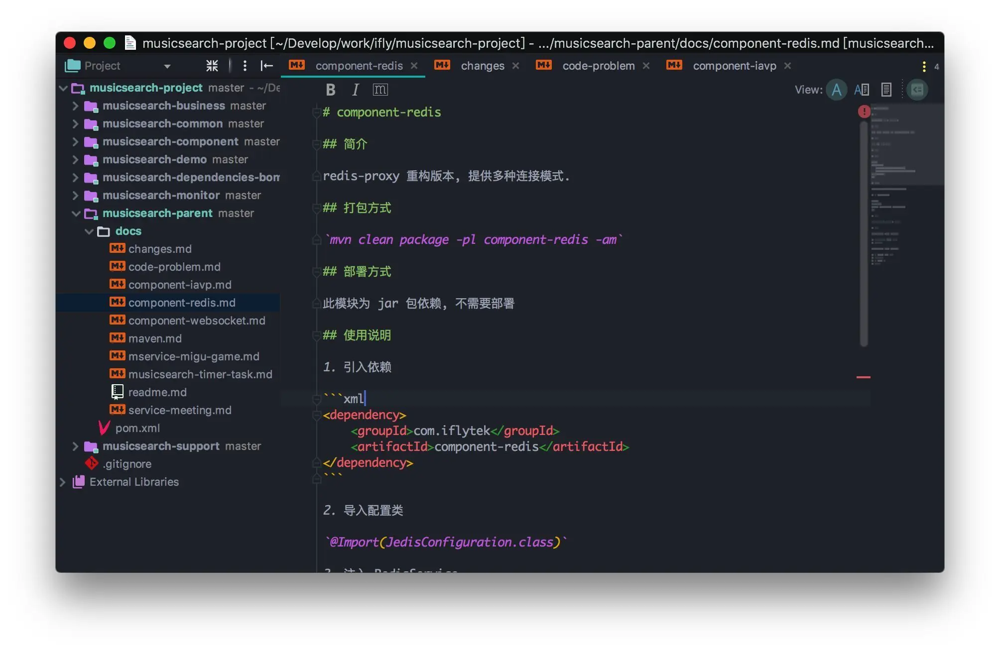
技术文档 `推荐` 使用 `Markdown` 语法编写, 最好是 [GitHub Markdown 语法](https://guides.github.com/features/mastering-markdown/).

这里给出模块说明模板, 每个模块都 `必须` 有此文档

```markdown
# 模块名

## 简介

xxx

## 打包方式

xxx

## 部署方式

xxx

## 使用说明

1. xxx
2. xxx
3. xxx

## 注意事项

xxx

## 更新历史

**更新时间 更新人 **

1. xxx
2. xxx
```

---

`database` 用于保存需求需要更新的 sql 文件, `必须` 以 `.sql` 为后缀, `必须` 是 UTF-8 编码.

#### musicsearch-dependencies

此模块是为了方便管理第三方 jar 依赖而特意添加的, 如果没有此模块, 第三方依赖也可以添加到 `musicsearch-project` 中, 但是会造成过度臃肿,
因此将第三方依赖拆分到此模块中进行统一管理.

> 第三方依赖 `必须` 添加到此模块, 且 `必须` 将版本号设置到 properties 标签下.
> 第三方依赖较大可能存在版本冲突, 因此此模块的版本从 `0.0.1` 开始, 不和 `musicsearch-parent` 相同, 如果此模块存在依赖问题, 修复后, 需要提升版本号,
> 并且 `必须` 写更新记录.

此模块比较特殊, 修改会比较频繁, 依赖出错大部分出现在此模块, 因此单独写一个 `changes.md`, 用于记录更新日志.

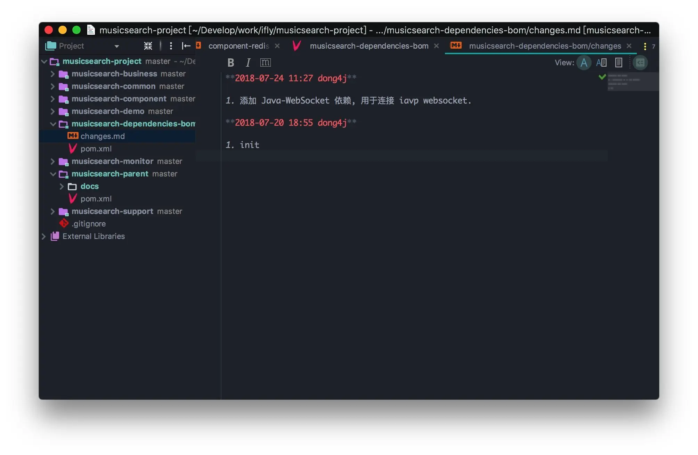

**引入新依赖步骤 **

1. 在 `musicsearch-dependencies` 添加新依赖;
2. 将版本信息写入到 pom 的 properties 标签内, 进行统一管理;
3. 在需要的模块中, 引入依赖;
4. 最后使用 `Maven Helper` 排查是否存在依赖冲突;
5. 如果存在冲突 需要使用 `<exclusions>` 排除相应的依赖;

#### musicsearch-common

`musicsearch-project` 项目的子模块, 作为最底层的依赖, 提供了公共 util 包, core 包, base 包等基础代码.

> 如果被整个项目使用到的代码, 都 `必须` 放入此模块, 比如 StringUtils 工具类, 一些加密类, 整个项目都能使用到的常量类, 枚举类等;

**必须要提出的是:**

不要多个模块多个 StringUtils 工具类, 最佳实践 `应该` 是 `musicsearch-common` 中编写一个通用的 `StringUtils` 类,
继承自 `org.apache.commons.lang3.StringUtils` 类, 业务模块继承 `musicsearch-common` 模块中的 `StringUtils` 类,
实现业务相关的字符串处理工具类.(这种方式同样适用于其他类)

#### musicsearch-business

业务模块的父模块, `musicsearch-parent` 模块的子模块.
用于管理业务模块共用的 jar 依赖.

> 所有业务模块 `必须` 是 `musicsearch-business` 的子模块

将业务代码全部整合在一个模块中, 使用业务名进行再分子模块的方式, 管理整个业务代码.
其他共用模块作为框架基础模块, 以后新项目还可以复用.

> 不提供 `dubbo service` 的模块, `必须` 以 `service-` 开始.
> 提供 `dubbo service` 的模块, `必须` 以 `mservice-` 开始.

`mservice` 的意思是 `micro-service`. 这样便于区分不同的服务类型, 也方便分组.

我们现在使用 `dubbo` 服务治理框架, 如果以后有可能话, 可以很方便的迁移到 `SOFA` 或者 `Spring Cloud` (我就说说, 应该是不可能的事了).

业务子模块除了 `business-common` 模块, 其他子模块都以 Web 应用 或者 JVM 进程直接提供服务.

#### business-common

`musicsearch-business` 模块的子模块, 依赖于 `musicsearch-common`.

> 业务模块共用的代码 `必须` 放入 `business-common` 模块.

比如所有业务都会用到的 redis key 常量类, 则 `必须` 放在 `business-common` 模块中;
而 `service-meeting` 这个模块的业务用到的 redis key 常量则 `必须` 放到 `service-meeting` 模块中.

讲究职责分离, 层级分明, 互不干涉; 你走你的阳关道, 我看我的 西虹市首富.

### 模块名

> `必须` 全部为小写, 单词之间 `必须` 使用 `-` 分隔.

不要随心所欲的命名, 要讲究的规则, 不然会走火入魔的.

> provider 模块名 `必须` 以 `mservice-` 开头;

provider 模块也有可能是服务消费者, 这类的模块, 还是 `应该` 使用 `mservice-` 开头

对于 provider 模块, 至少应该分为 2 层;

1. 服务名 -interface , 提供给 consumer 的依赖模块
2. 服务名 -service , 业务处理模块

> 服务名 -interface 模块 `必须` 包含用到的实体类, 接口定义, dubbo-consumer- 服务名.xml, 共用的 util 类, 枚举类等;

**必须要提出的是:**

`dubbo-consumer- 服务名.xml` 配置文件 `应该` 由 provider 来维护, 而 consumer 只需要 import 此配置文件即可, 而不是在自己的 Spring
配置文件或者自定义一个 dubbo 配置文件再来写引入的接口.

这就是为什么 `dubbo-consumer- 服务名.xml` `应该` 在 interface 模块的原因.

这里看看 migu-game 重构之前的结构 (有一些小改动)

**配置关系:**

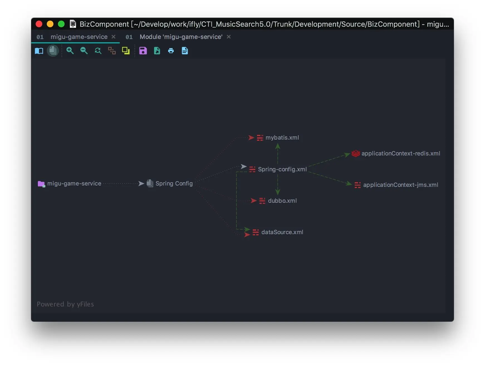

这里的 dubbo.xml 即 provider 配置, 前面也说了, 这样的命名方式不够直观, 因此 `应该` 采用 `dubbo-provider- 服务名 ` 的方式命名;

Spring-config.xml 是主配置, 导入了其他 5 个配置;

```xml
<import resource="spring/dubbo.xml"/>
<import resource="spring/mybatis.xml"/>
<import resource="spring/dataSource.xml"/>
<import resource="classpath*:applicationContext-jms.xml"/>
<import resource="classpath*:applicationContext-redis.xml"/>
```

`applicationContext-jms.xml` 和 `applicationContext-redis.xml` 这 2 个配置原来是放在 web.xml 中的.
这里迁入到 Spring-config.xml 中, 因为 web.xml 只需要负责加载 Spring-config.xml 即可, web.xml 写好之后, 基本不需要修改, 所有配置关系全部在
Spring-config.xml 中管理.

那么问题来了
**dubbo 的 consumer 配置在哪里呢?**

找了半天, 原来在 funclib 模块的 `applicationContext-mainflowfunc.xml` 配置中...


那么问题又来了

如果 migu-game 由合肥的同事开发, 需要增加几个接口, 使用 migu-game 服务的是成都的小明同学, 正在开发 funclib, 这个时候请问....

**小明中午吃了啥?**


> 如果 dubbo consumer 配置由 funclib 维护, 那么就要修改 funclib 模块的配置;
> 如果 dubbo consumer 配置由 migu-game 维护, 合肥的同事只需要提供 migu-game-interface, funclib 只需引入 `dubbo-consumer-migugame.xml`;

` 服务名 -interface` 还应该依赖 `dubbo` 相关 jar 依赖, 这样 consumer 就不需要自己引入 `dubbo` 相关依赖了;

服务行业嘛, 要做就做全套

**最佳实践 **

个人认为, 一个 `mservice` 最好分为 3 层;

1. interface 层;
2. service 层;
3. dao 层;

interface 已经说过了;
service 层, 作为业务层, 依赖于 dao 层和 interface 层;

各层的 pom 中只依赖每层需要的 jar 依赖. 比如 duubo 的依赖 `应该` 写在 interface 层, `mybatis` 和数据库驱动依赖 `应该` 写在 dao 层, 而
service 层依赖业务相关的 jar.

这样将所有依赖下放到不同层中, 以一种插件化的方式提供服务, 导入某层依赖, 连带引入了这层需要的依赖. 这样 jar 依赖关系明确, 也很好管理.

`musicsearch-project` 的思想就是这样, 以 `分而治之` 的方式管理代码和依赖关系, 也就是个解耦的思想.
而不是将所有依赖全部扔到 common 或者 service 中, 方便是方便, 维护起来想死的心都有了.

interface 模块, 就是一个提供给 consumer 的说明, 告诉 consumer, 我这个 interface 提供了哪些功能, 没有具体实现.

而 API 全称 Application Program Interface, 即应用程序接口, 是一组定义, 程序及协议的集合.
因此我将 服务名 -api 用于向外提供 rest api 的模块.

相关的包名也是如此.

### 包名

> 所有包名 `必须` 以 `com.xxxx.msearch` 开始

其他规则:

- 组件模块: `com.xxxx.msearch.component. 组件名 `
- 公共类库: `com.xxxx.msearch.common`
- 服务模块: `com.xxxx.msearch. 服务名 `

`推荐` 几个常用的包名

- `config` 用来放配置类
- `util` 工具类包
- `enums` 枚举类包
- `constant` 常量类包 (`推荐` 将常量按类别定义在不同的常量类中)
- `service` service 接口包
- `service.impl` service 接口实现类包
- `dao` dao 接口包
- `interfaces` 特指 provider 提供的接口类
- `api` 特指 rest api

### 类名

类名 `必须` 使用 UpperCamelCase 风格 (首字母都大写)，必须遵从驼峰形式. 例如: StringUtils

> 抽象类命名 `必须` 使用 Abstract 或 Base 开头;
> 异常类命名 `必须` 使用 Exception 结尾;
> 测试类命名 `必须` 以它要测试的类的名称开始，以 Test 结尾;
> 接口实现类 `必须` 以 Impl 结尾;
> API 接口类必须以 `Controller` 结尾;
> ORM 接口必须以 `Dao` 结尾;

### 方法名

Dao 接口名 `推荐` 使用以下命名方式

新增:

- add(Entity entity)
- insert(Entity entity)
- save(Entity entity)

查询:

- get(Long id)
- getByXxx
- findByXxx
- selectByXxx

更新:

- update(Entity entity)
- updateByXxx

删除:

- delete(Long id)
- deleteByXxx

### 属性名

这个没什么好说的, 按照 Java 推荐命名方式即可.

> 常量命名 `必须` 全部大写, 单词间用下划线分隔;

## 数据库规范

推荐 3 篇文章, 虽然是 mysql 的, 但是都是数据库啊

[赶集 mysql 军规](https://mp.weixin.qq.com/s?__biz=MjM5ODYxMDA5OQ==&mid=2651960775&idx=1&sn=1a9c9f4b94dfe71ad2528fb2c84f5ec7&chksm=bd2d001b8a5a890d302d139ea42e9ffde44407738a618865934e40b8e35486b13cafca2933f6&mpshare=1&scene=1&srcid=1228MzgFw9KLVzaHtjHvpb2p%23rd)
[58 到家数据库 30 条军规解读](https://mp.weixin.qq.com/s?__biz=MjM5ODYxMDA5OQ==&mid=2651959906&idx=1&sn=2cbdc66cfb5b53cf4327a1e0d18d9b4a&chksm=bd2d07be8a5a8ea86dc3c04eced3f411ee5ec207f73d317245e1fefea1628feb037ad71531bc&scene=21#wechat_redirect)
[再议数据库军规](https://mp.weixin.qq.com/s?__biz=MjM5ODYxMDA5OQ==&mid=2651959910&idx=1&sn=6b6853b70dbbe6d689a12a4a60b84d8b&chksm=bd2d07ba8a5a8eac6783bac951dba345d865d875538755fe665a5daaf142efe670e2c02b7c71&scene=21#wechat_redirect)

## 配置规范

为了解决开发, 测试, 现网部署时手动对比配置, 手动切换配置, 减少人工介入出错的几率, 节约时间等问题, `musicsearch-project` 采用多环境配置.
一次打包, 可部署到多个环境.

意思就是: 一次打包, 到处运行.

### 配置分类

**从数据来源可分为:**

- 数据库
- NoSQL
- 文件
- 网络

**从加载顺序上课分为:**

- 启动时加载的配置
  - dataSource 连接配置
  - Redis 连接配置
  - MQ 连接配置
  - 日志配置
  - ...
- 运行期间动态获取
  - 字典数据

其实最容易出错的且影响最大的就是运行期间动态获取的配置, 字典数据改错了就会影响现网业务, 而且不好排查.
连接配置启动时就需要, 如果错误可能会导致启动失败, 这类问题比较容易排查.

### local 环境

以前在开发时, 使用的 dev 环境. 可能会将某几个配置修改成本地环境或者 test 环境进行开发, 开发完成后, 又 `需要逐个改回来`;
改动的配置太多, 部分配置 `忘记改回来` 还提交了, 悲剧了;

local 环境专门解决以上问题.
最初是一个空配置, 我们拉取代码后根据自己的环境修改 local 配置, 然后使用 idea `忽略提交` 功能, 忽略此文件.
每个开发者互不影响, 开发时只需要修改 local 环境即可, `不该` 直接修改其他环境配置，避免环境问题造成线上问题

### dev 环境

现在的服务太多, 我们开发时不可能每个都启动起来, 这时我们可以将一些公共的服务部署到 dev 服务器, 这个配置就是 dev 环境的配置了,
一旦配置好, `不该` 轻易修改.

### test 环境

和 dev 环境差不多, 只是一些连接配置不一样, `不该` 轻易修改.

### prod 环境

生产环境经常改动的就是字典数据, 现在的字段数据太复杂了.

最好的方式是通过 kv 键值对, value 只是简单的字符串而已, 不要是一个复杂的 json, 这样能非常友好的管理所有配置, 修改配置也不容易出错.

redis 构建工具我了解当的一个作用是为了防止修改出错, 做了一个保护措施.
先保存到数据库中, 检查一下, 确保没出错后使用构建工具同步到 redis.

如果是这个原因的话, 我想能不能使用一个弹出框显示修改前与修改后的值, 然后二次确认?
确认后修改数据库, 同时更新 redis.

获取动态数据的方式:

首先从 redis 中获取, 如果没有则从数据库中获取, 然后更新到 redis;
如果有则直接返回.

后台系统修改字典数据且二次确认后, 更新数据库和 redis.

这里有一个事务问题.
比如后台系统修改完字段数据后, 更新数据库成功, 但是更新 redis 失败, 这个时候 redis 中就是旧数据.

**解决方案:**

1. 后台系统二次确认修改;
2. 更新数据库;
3. 将 redis 相应的 key 设置为失效;

**分析:**

1. 第 2 步失败, 直接返回修改失败, 不会发生事务问题, 数据也不会被修改;
2. 第 2 步成功, 第 3 步失败;
   1. 此时应用查询字典数据时, redis 为旧数据 (可以使用重试来解决)
3. 第 2 步成功, 第 3 步成功;
   1. 此时应用查询字典数据时, redis 没有, 则去数据库中查询最新, 然后再更新到 redis 中.

### Dubbo 配置文件

> 消费者配置文件名 `必须` 以 `dubbo-consumer- 服务名.xml` 命名.
> 服务提供者配置文件名 `必须` 以 `dubbo-provider- 服务名.xml` 命名.

配置名区分消费者和生产者, 这样职责明确, 方便搜索查看. 最操蛋的是搜索出几十个 dubbo.xml 配置, 还得一个个点进入看是消费者还是生产者配置.

> 消费者配置 `必须` 单独写在 `dubbo-consumer- 服务名.xml` 中, 不要写在 Spring 配置中.

配置尽量分开到不同到配置文件中, 最后使用 import 聚合起来. 需要修改配置时, 能明确知道去哪个配置文件中修改.
你见 `葵花宝典` 里面写了怎么自宫的详细教程吗? 最多也就引用一下, `欲练此功, 必先自宫`.

> 引入配置不要写在 web.xml, `必须` 使用 import 在 Spring 主配置文件中引入.

`musicsearch-project` 不需要担心这个问题, 因为 web.xml 已经被干掉了 🤣

### Spring 配置文件

- SpringMVC 配置文件统一命名: `spring-mvc.xml`
- Web 应用的 Spring 配置文件统一命名: `spring-context.xml`
- 其他组件的 Spring 配置文件统一命名: 模块名.xml
- Spring Boot 应用的配置文件统一使用 application.properties

`musicsearch-project` 使用 Spring Boot 为基础框架, 因此 `spring-mvc.xml` 和 `spring-context.xml` 已经使用 Java Config 的方式代替.

**自动配置类 `必须` 以 服务名 +Configuration 方式命名 **
**启动类 `必须` 以 服务名 +Application 方式命名 **
**单元测试主类 `必须` 以 服务名 +ApplicationTest 方式命名 **

## Maven

原来的项目是由多个模块由不同的 Maven 管理, 造成编译, 打包,debug 麻烦, 依赖关系复杂, 版本随意, 同一个模块多个不同版本, 维护困难.

为了解决以上问题, 现在将所有模块通过一个 主 pom 进行管理, 所有模块全部在 `musicsearch-porject` 目录下.

优点如下:

- debug 时方便, 想在哪儿打断点就在哪儿打断点. 随处 debug;
- 能借助 IDEA 进行全局重构;
- jar 版本统一管理
- 绝对不会出现相同 jar 多个相同版本的问题.

### pom 规范

> groupId `必须` 为 `com.xxx`
> artifactId `必须` 与 模块名相同
> version `必须` 与 父 pom version 相同
> `必须` 显式指定 `packaging`

如果没有设置 packaging 标签, 默认打包为 jar 格式, 这里 `必须` 设置此标签, 明确指定打包格式.

> `必须` 写 `description` 标签

为此 pom 添加必要的描述信息

> 第三方依赖 `必须` 添加到 `musicsearch-dependencies` pom 中;
> 如果 Maven 中央仓库没有的 jar 包, 从网上下载后, `必须` 上传到公司的 Maven, 不能直接使用 jar 包

1. 搜索 Maven 中央仓库, 关键字 + maven;
2. 搜索不到则找到 jar 上传到公司 Maven 仓库

   ```
   # 安装到私服
   # DgroupId 和 DartifactId 构成了该 jar 包在 pom.xml 的坐标，项目就是依靠这两个属性定位。自己起名字也行。
   # Dfile 表示需要上传的 jar 包的绝对路径。
   # Durl 私服上仓库的位置，打开 nexus——>repositories 菜单，可以看到该路径。
   # DrepositoryId 服务器的表示 id，在 nexus 的 configuration 可以看到。 要与 setting.xml 中的权限 id 一致
   # Dversion 表示版本信息
   mvn deploy:deploy-file -DgroupId=com.xxx -DartifactId=yyy -Dversion=x.x.x -Dpackaging=jar -Dfile=jar-path -Durl= 上传地址 -DrepositoryId=thirdparty
   ```

> 第三方依赖 `必须` 将版本迁入 `musicsearch-dependencies` 到 properties 标签下;
> version `必须` 以 `artifactId.version` 的方式命名;

```xml
<properties>
    ...
    <socket.io-client.version>1.0.0</socket.io-client.version>
</properties>
<dependencyManagement>
    <dependencies>
        ...
        <dependency>
            <groupId>io.socket</groupId>
            <artifactId>socket.io-client</artifactId>
            <version>${socket.io-client.version}</version>
        </dependency>
    </dependencies>
</dependencyManagement>
```

由于 `musicsearch-project` 使用 Spring Boot 开发, 版本为 1.5.8.RELEASE.
Spring Boot 每个版本都有一个 `spring-boot-dependencies` 项目用来维护所有第三方 jar 版本和 Maven 插件版本.


我们直接使用 `spring-boot-dependencies` 中相关依赖的版本, 能有效减少版本冲突.

> 如果我们新增的第三方包已经在 `spring-boot-dependencies` 声明, 则 `必须` 使用 `spring-boot-dependencies` 规定的版本, 即删除 version 标签.

怎么查看新引入的依赖是否在 `spring-boot-dependencies` 被声明了呢, 很简单

比如我需要添加如下依赖到模块中

```xml
<dependency>
    <groupId>org.projectlombok</groupId>
    <artifactId>lombok</artifactId>
    <version>1.16.14</version>
</dependency>
```

整个操作如下图所示:

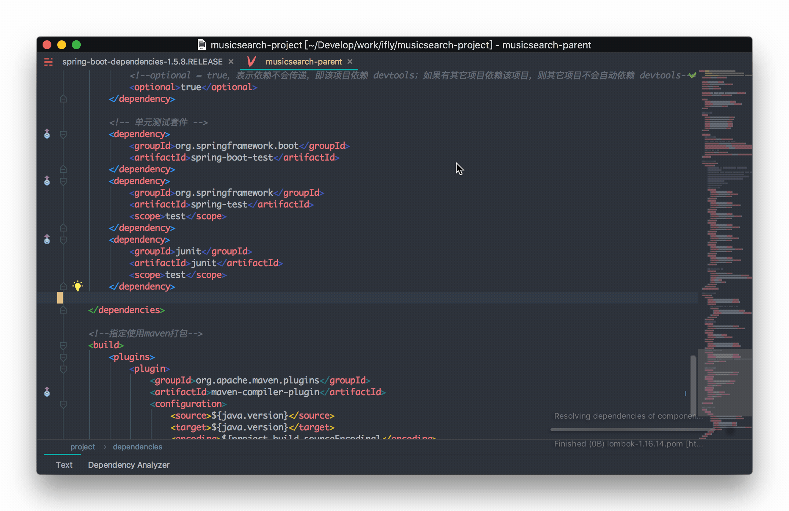

我们新增的 lombok 版本为 1.16.14
但是当加入 pom 之后, 左边出现了一个向上的箭头, 点过去之后, 发现此依赖已经在 `spring-boot-dependencies` 被声明了, 并且版本为 1.16.18, 因此删除
version 就可以了.

**添加新依赖的步骤:**

1. 选择合适的模块, 直接粘贴 maven 依赖配置到 pom 中,
2. 如果左边出现了向上的箭头, 则删除 version 标签, 搞定;
3. 如果没有, 则将此依赖配置粘贴到 `musicsearch-dependencies` 中, 将 version 添加到 properties 标签中;
4. 最后删除最开始那个配置的 version;

`spring-boot-dependencies` 不可能定义到所有的依赖, 因此这里就有了 `musicsearch-dependencies` 这个模块,
用来管理项目需要但是没有在 `spring-boot-dependencies` 中定义的 jar 依赖.

## 日志规范

> `推荐` 使用 `@Slf4j` 获取 `log` 实例

使用 `lombok` 插件, 直接使用 @Slf4j 代替获取 log 实例的冗余代码.

```java
import org.slf4j.Logger;
import org.slf4j.LoggerFactory;

...
private static final Logger log = LoggerFactory.getLogger(Xxx.class);
```

> `必须` 使用 `log4j2` 日志框架

统一使用效率更高的 log4j2 日志框架

> 日志输出到文件的编码 `必须` 为 UTF-8

### 日志配置名

> Web 应用或者通过 JVM 进程提供服务的应用, `必须` 使用 `log4j2-spring.xml` 命名

Spring Boot 官方推荐优先使用带有 -spring 的文件名作为日志配置（如使用 log4j2-spring.xml，而不是 log4j2.xml）

原理可以查看
`Log4J2LoggingSystem.getCurrentlySupportedConfigLocations()`
`AbstractLoggingSystem.getSpringConfigLocations()`

### 输出样式

```
env: %d{yyyy.MM.dd HH:mm:ss.SSS} [%5p] ${sys:PID} -- [%15.15t] %-40.40c{1.} : %m%n%xwEx
```

输出内容元素具体如下：

- 环境名
- 时间日期 — 精确到毫秒
- 日志级别 — ERROR, WARN, INFO, DEBUG or TRACE
- 进程 ID
- 分隔符 —`--`标识实际日志的开始
- 线程名 — 方括号括起来（可能会截断控制台输出）
- Logger 名 — 通常使用源代码的类名
- 日志内容

效果 :

```
dev: 2018.08.01 15:02:25.153  INFO 75012 -- [restartedMain] c.i.m.m.MeetingApplication : Starting MeetingApplication on dong4j with PID 75012 (/Users/codeai/Develop/work/ifly/musicsearch-project/musicsearch-business/service-meeting/target/classes started by codeai in /Users/codeai/Develop/work/ifly/musicsearch-project)
dev: 2018.08.01 15:02:25.154 DEBUG 75012 -- [restartedMain] c.i.m.m.MeetingApplication : Running with Spring Boot v1.5.8.RELEASE, Spring v4.3.12.RELEASE
dev: 2018.08.01 15:02:25.155  INFO 75012 -- [restartedMain] c.i.m.m.MeetingApplication : The following profiles are active: oracle
```

### 日志保存路径

日志路径统一管理, 确保每台服务器上的日志都在同一目录下

```
<property name="LOG_BASE_FOLDER">/path/to/logs/${APP_NAME}</property>
```

`/path/to/logs/` 再议, 只要是一个有读写权限的目录且好记就可以了, 关键是保持统一.

> 最后 `必须` 通过 APP_NAME 参数区分应用.

### 日志归档

> 日志文件 `必须` 1 天归档一次，压缩文件上限 `建议` 为 200MB

每天归档日志, 方便按日志查询日志

## 单元测试规范

> 所有模块都 `必须` 有单元测试, 而不是使用 `main()` 来进行测试;

IDEA 添加单元测试类非常简单

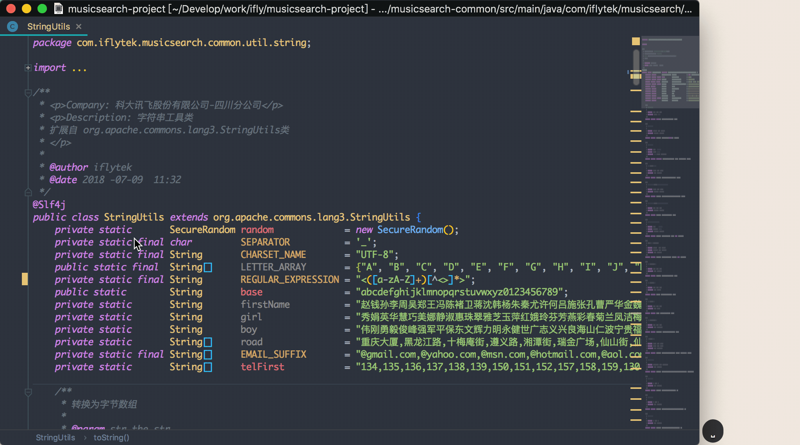

直接通过快捷键自动生成单元测试类.

> 集成测试时, `必须` 继承主测试类;

在每个 Web 模块中, 都会有一个 XxxApplicationTest 测试父类, 用于整合配置类, 测试端口随机等功能.

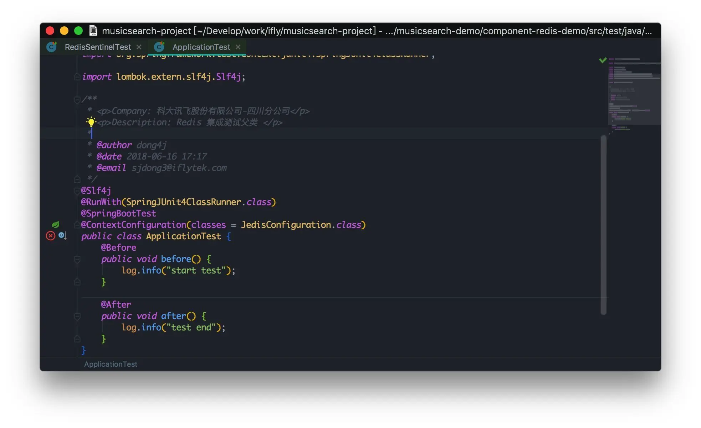

其他集成测试类只需要继承此父类即可, 不需要写重复的注解

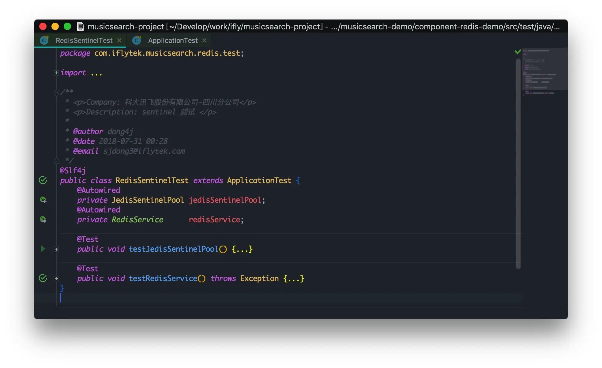
默认是单元测试 `必须` 全部通过才能打包, 当往往由于单元测试编写不规范造成打包失败, 编写好的单元测试难度也非常大, 因此这里不强制要求.

使用 3 种方式忽略单元测试

**方式 1:**

`推荐` 这种

使用变量

```xml
<properties>
    <maven.test.skip>true</maven.test.skip>
</properties>
```

或者

```xml
<properties>
    <skipTests>true</skipTests>
</properties>
```

**方式 2:**

使用 mvn 命令

```lua
mvn package -Dmaven.test.skip=true
```

**方式 3:**

使用插件

```xml
<plugin>
    <groupId>org.apache.maven.plugins</groupId>
    <artifactId>maven-surefire-plugin</artifactId>
    <version>${maven-surefire-plugin.version}</version>
    <configuration>
        <skipTests>true</skipTests>
    </configuration>
</plugin>
```

方式 1 与方式 2 的区别在于:

`skipTests` 不执行测试用例，但编译测试用例类生成相应的 class 文件至 target/test-classes 下
`maven.test.skip` 不但跳过单元测试的运行，也跳过测试代码的编译
