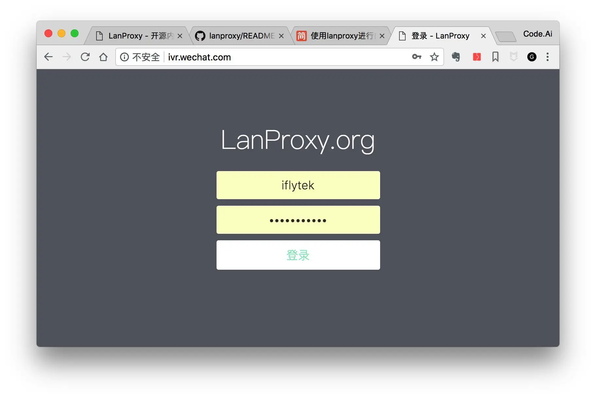
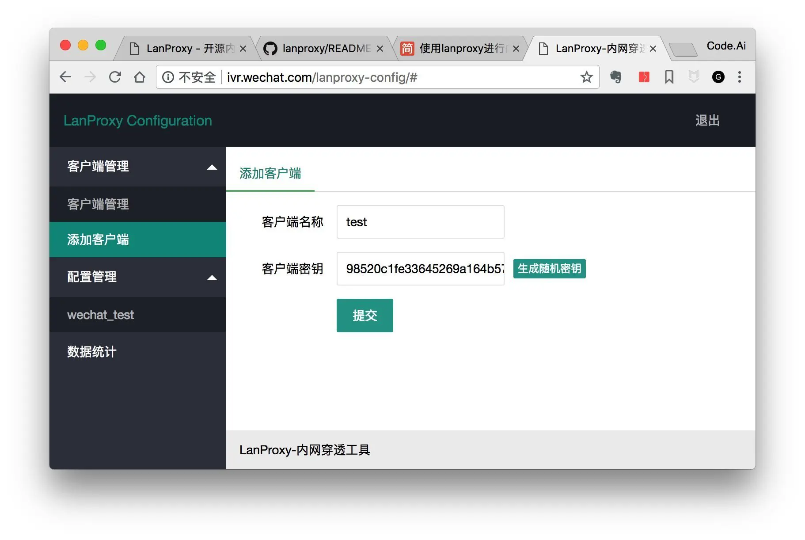
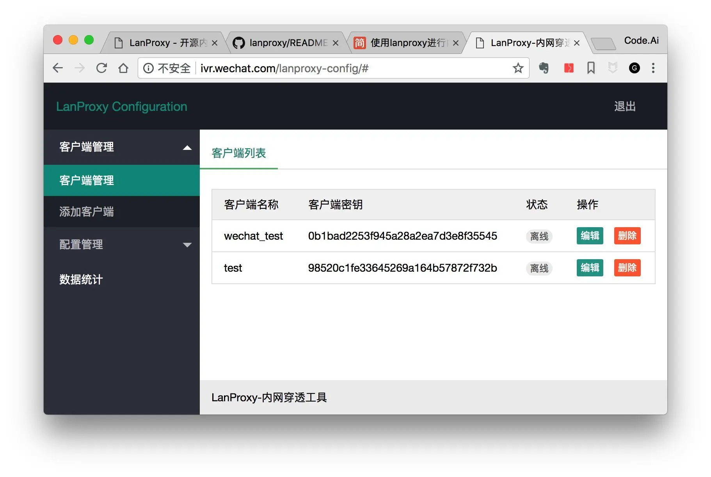
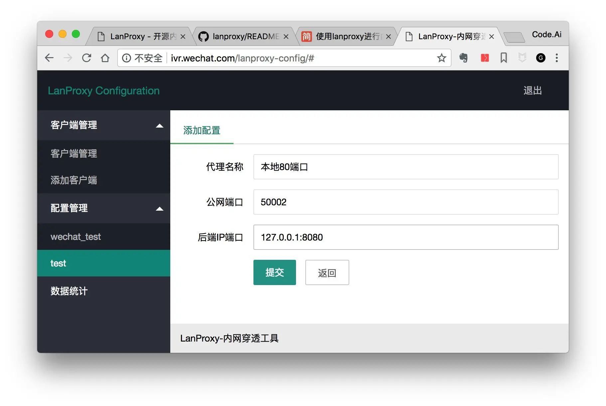
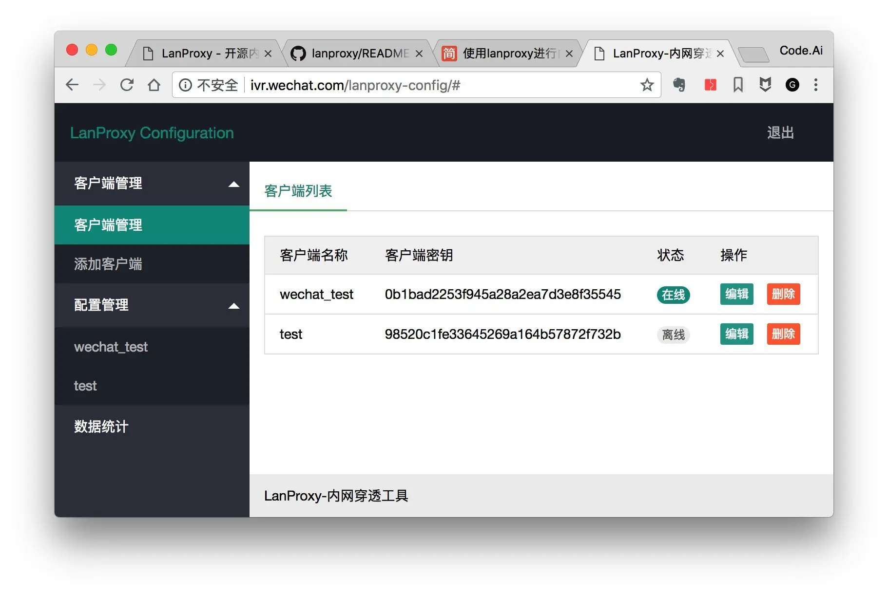

<!-- markdownlint-disable-next-line MD033 -->
<meta name="referrer" content="no-referrer"/>


需要的环境:

1. 具有公网 IP 的服务器, 运行 proxy-server
2. 一台内网 pc 或服务器, 运行 proxy-client
3. lanproxy
4. nginx
5. JDK

## 准备工作

使用 阿里云 服务器, ip 为 `111.111.111.111`, 已经安装好了 nginx 和 JDK8

下载 proxy-server 和 proxy-client

https://github.com/ffay/lanproxy/releases

修改 hosts 文件

```
111.111.111.111 ivr.wechat.com
111.111.111.111 local.ivr.wechat.com
```

## proxy-server 搭建

1. 解压 proxy-server.zip
2. 修改配置文件 `conf/config.properties`, 修改用户名和密码
3. 启动服务 `/usr/local/proxy-server/bin/startup.sh`

config.properties

```lua
server.bind=0.0.0.0
# 普通端口
server.port=4900

server.ssl.enable=true
server.ssl.bind=0.0.0.0
# ssl 端口
server.ssl.port=4993
server.ssl.jksPath=test.jks
server.ssl.keyStorePassword=123456
server.ssl.keyManagerPassword=123456
server.ssl.needsClientAuth=false

config.server.bind=0.0.0.0
# server 后台端口
config.server.port=8090
# 用户名
config.admin.username=admin
# 密码
config.admin.password=admin
```

4. 使用 nginx 反向代理

访问 `http://ivr.wechat.com/` 代理到 `http://127.0.0.1:8090`

```lua
server {
    listen 80;
    server_name ivr.wechat.com;
    charset utf-8;
    location / {
            proxy_set_header   Host             $host;
            proxy_set_header   X-Real-IP        $remote_addr;
            proxy_set_header  X-Forwarded-For  $proxy_add_x_forwarded_for;
            client_max_body_size       1024m;
            client_body_buffer_size    128k;
            client_body_temp_path      data/client_body_temp;
            proxy_connect_timeout      90;
            proxy_send_timeout         90;
            proxy_read_timeout         90;
            proxy_buffer_size          4k;
            proxy_buffers              4 32k;
            proxy_busy_buffers_size    64k;
            proxy_temp_file_write_size 64k;
            proxy_temp_path            data/proxy_temp;
            proxy_pass http://127.0.0.1:8090;
    }
}
```

访问 http://ivr.wechat.com/



## proxy-server 配置

1. 登录 proxy-server，添加客户端，输入客户端备注名称，生成随机密钥，提交添加
   

2. 客户端列表中，配置管理中，都会出现新添加的客户端
   

3. 单击配置管理中的客户端，添加配置（每个客户端可以添加多个配置）
   

- 代理名称，推荐输入客户端要代理出去的端口，或者是客户端想要发布到公网的项目名称
- 公网端口，填入一个服务器空闲端口，用来转发请求给客户端
- 代理 IP 端口，填入客户端端口，公网会转发请求给该客户端端口

## proxy-client 搭建

1. 解压 proxy-client
2. 修改配置文件

```lua
# 与在proxy-server配置后台创建客户端时填写的秘钥保持一致
client.key=0b1bad2253f945a28a2ea7d3e8f35545
ssl.enable=true
ssl.jksPath=test.jks
ssl.keyStorePassword=123456
# 这里填写实际的proxy-server地址；没有服务器默认即可，自己有服务器的更换为自己的proxy-server（IP）地址
server.host=ivr.wechat.com
#default ssl port is 4993
#proxy-server ssl默认端口4993，默认普通端口4900
#ssl.enable=true时这里填写ssl端口，ssl.enable=false时这里填写普通端口
server.port=4993
```

1. 执行 `bin/startup.sh` 启动 client

启动成功后, 会显示 `在线` 标识


最后直接访问 `http://ivr.wechat.com:50002` 将会转发请求到 127.0.0.1:8080

## 优化

nginx 再添加一次转发

```lua
server {
    listen 80;
    server_name local.ivr.wechat.com;
    charset utf-8;
    location /{
        proxy_set_header   Host             $host;
        proxy_set_header   X-Real-IP        $remote_addr;
        proxy_set_header  X-Forwarded-For  $proxy_add_x_forwarded_for;
        client_max_body_size       1024m;
        client_body_buffer_size    128k;
        client_body_temp_path      data/client_body_temp;
        proxy_connect_timeout      90;
        proxy_send_timeout         90;
        proxy_read_timeout         90;
        proxy_buffer_size          4k;
        proxy_buffers              4 32k;
        proxy_busy_buffers_size    64k;
        proxy_temp_file_write_size 64k;
        proxy_temp_path            data/proxy_temp;
        proxy_pass http://127.0.0.1:50002;
    }
}
```

直接访问 `http://local.ivr.wechat.com` 将会转发到 proxy-server 的 50002 端口, 相当于直接访问 `http://ivr.wechat.com:50002`,
最后会转发到内网的 `127.0.0.1:8080`
