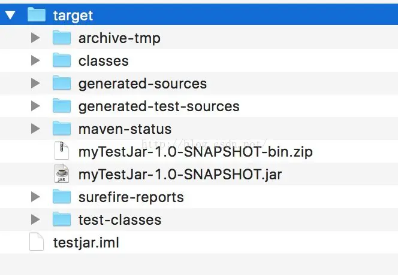
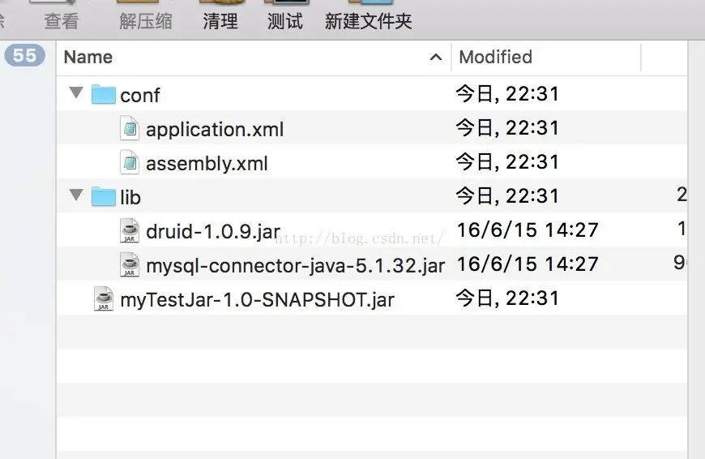
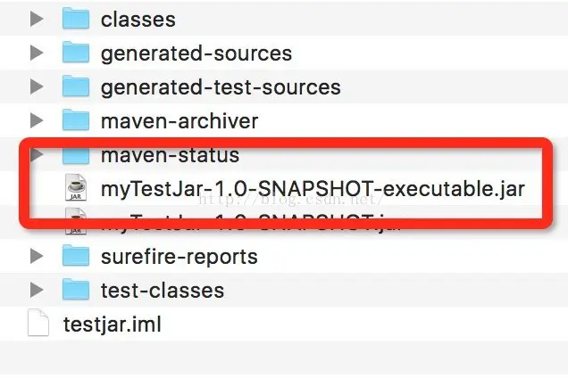

<!-- markdownlint-disable-next-line MD033 -->
<meta name="referrer" content="no-referrer"/>


## 无依赖其他任何 jar

```xml
<build>
    <plugins>
        <plugin>
            <groupId>org.apache.maven.plugins</groupId>
            <artifactId>maven-jar-plugin</artifactId>
            <version>2.4</version>
            <configuration>
                <archive>
                    <manifest>
                        <addClasspath>true</addClasspath>
                        <classpathPrefix>lib/</classpathPrefix>
                        <mainClass>com.think.TestMain</mainClass>
                    </manifest>
                </archive>
            </configuration>
        </plugin>
    </plugins>
</build>
```

运行：mvn clean package，在 target 中找到打包出来的，命令后运行 java -jar xxx.jar 即可，但是如果程序有依赖其他包，比如程序依赖 jdbc 去查询 db，这时候再执行就会出现找不到 jdbc 依赖，因为我们并没有将依赖包打进去

## 解决依赖其他包时，可执行 jar 的打包

```xml
<build>
    <plugins>
        <plugin>
            <groupId>org.apache.maven.plugins</groupId>
            <artifactId>maven-assembly-plugin</artifactId>
            <version>2.3</version>
            <configuration>
                <appendAssemblyId>false</appendAssemblyId>
                <descriptorRefs>
                    <descriptorRef>jar-with-dependencies</descriptorRef>
                </descriptorRefs>
                <archive>
                    <manifest>
                        <mainClass>com.think.TestMain</mainClass>
                    </manifest>
                </archive>
            </configuration>
            <executions>
                <execution>
                    <id>make-assembly</id>
                    <phase>package</phase>
                    <goals>
                        <goal>assembly</goal>
                    </goals>
                </execution>
            </executions>
        </plugin>
    </plugins>
</build>
```

但以上方式用的比较少，因为我们依赖的 jar，也会打进到我们最终生成的 jar，这样不太好，假如你生成的 jar 要给别人使用，最好给一个纯净的。

一般用 assembly 会再用他另外一个功能，将我们的 jar 归档，打包成一个 zip

2、打成一个 zip 包，发布项目的时候，将 zip 包 copy 到服务器上，直接 unzip xxx.zip，里面包含要运行到 jar 以及依赖的 lib，还有配置的 config 文件，即可直接启动服务

```xml
<build>
    <resources>
        <!-- 控制资源文件的拷贝 -->
        <resource>
            <directory>src/main/resources</directory>
            <targetPath>${project.build.directory}/classes</targetPath>
        </resource>
    </resources>
    <plugins>
        <!-- 设置源文件编码方式 -->
        <plugin>
            <groupId>org.apache.maven.plugins</groupId>
            <artifactId>maven-compiler-plugin</artifactId>
            <configuration>
                <source>1.6</source>
                <target>1.6</target>
                <encoding>UTF-8</encoding>
            </configuration>
        </plugin>
        <!-- The configuration of maven-jar-plugin -->
        <plugin>
            <groupId>org.apache.maven.plugins</groupId>
            <artifactId>maven-jar-plugin</artifactId>
            <version>2.4</version>
            <!-- The configuration of the plugin -->
            <configuration>
                <!-- Configuration of the archiver -->
                <archive>

                    <!--
                        生成的jar中，不要包含pom.xml和pom.properties这两个文件
                    -->
                    <addMavenDescriptor>false</addMavenDescriptor>

                    <!-- Manifest specific configuration -->
                    <manifest>
                        <!--
                            是否要把第三方jar放到manifest的classpath中
                        -->
                        <addClasspath>true</addClasspath>
                        <!--
                           生成的manifest中classpath的前缀，因为要把第三方jar放到lib目录下，所以classpath的前缀是lib/
                       -->
                        <classpathPrefix>lib/</classpathPrefix>
                        <!--
                            应用的main class
                        -->
                        <mainClass>com.think.TestMain</mainClass>
                    </manifest>
                </archive>
                <!--
                    过滤掉不希望包含在jar中的文件
                -->
                <!--<excludes>-->
                    <!--<exclude>${project.basedir}/xml/*</exclude>-->
                <!--</excludes>-->
            </configuration>
        </plugin>

        <!-- The configuration of maven-assembly-plugin -->
        <plugin>
            <groupId>org.apache.maven.plugins</groupId>
            <artifactId>maven-assembly-plugin</artifactId>
            <version>2.4</version>
            <!-- The configuration of the plugin -->
            <configuration>
                <!-- Specifies the configuration file of the assembly plugin -->
                <descriptors>
                    <descriptor>src/main/assembly/assembly.xml</descriptor>
                </descriptors>
            </configuration>
            <executions>
                <execution>
                    <id>make-assembly</id>
                    <phase>package</phase>
                    <goals>
                        <goal>single</goal>
                    </goals>
                </execution>
            </executions>
        </plugin>
    </plugins>
</build>
```

还有一个重要的文件，名字可以随便起，我上面用的是 src/main/assembly/assembly.xml

```xml
<assembly>
    <id>bin</id>
    <includeBaseDirectory>false</includeBaseDirectory>
    <!-- 最终打包成一个用于发布的zip文件 -->
    <formats>
        <format>zip</format>
    </formats>

    <!-- Adds dependencies to zip package under lib directory -->
    <dependencySets>
        <dependencySet>
            <!--
               不使用项目的artifact，第三方jar不要解压，打包进zip文件的lib目录
           -->
            <useProjectArtifact>false</useProjectArtifact>
            <!--<outputDirectory>lib</outputDirectory>-->
            <unpack>false</unpack>
        </dependencySet>
    </dependencySets>

    <fileSets>
        <!-- 把项目相关的说明文件，打包进zip文件的根目录 -->
        <!--<fileSet>-->
            <!--<directory>${project.basedir}</directory>-->
            <!--<outputDirectory>/</outputDirectory>-->
        <!--</fileSet>-->

        <!-- 把项目的配置文件，打包进zip文件的config目录 -->
        <fileSet>
            <directory>${deploy.dir}/classes/</directory>
            <outputDirectory>/conf</outputDirectory>
            <includes>
                <include>*.xml</include>
                <include>*.properties</include>
            </includes>
        </fileSet>
        <!-- 把项目自己编译出来的jar文件，打包进zip文件的根目录 -->
        <fileSet>
            <directory>${project.build.directory}</directory>
            <outputDirectory></outputDirectory>
            <includes>
                <include>*.jar</include>
            </includes>
        </fileSet>
    </fileSets>
</assembly>
```

最终执行命令：mvn clean package，出来的是这样的





解压 zip 包，我们看到我们想要的，good

3、还有一种打包方式，上面相当于把我们想要的东西打成一个 zip 包，全部放到一起，看着整洁好看，但有点繁琐，我们其实可以用另外一个插件来完成，不打包，即看到上图解压后的文件

```xml
<project xmlns="http://maven.apache.org/POM/4.0.0" xmlns:xsi="http://www.w3.org/2001/XMLSchema-instance"
         xsi:schemaLocation="http://maven.apache.org/POM/4.0.0 http://maven.apache.org/xsd/maven-4.0.0.xsd">
    <modelVersion>4.0.0</modelVersion>

    <groupId>com.test</groupId>
    <artifactId>myTestJar</artifactId>
    <version>1.0-SNAPSHOT</version>
    <packaging>jar</packaging>

    <name>myTestJar</name>
    <url>http://maven.apache.org</url>

    <properties>
        <deploy.dir>./target/</deploy.dir>
        <project.build.sourceEncoding>UTF-8</project.build.sourceEncoding>
    </properties>

    <dependencies>
        <dependency>
            <groupId>junit</groupId>
            <artifactId>junit</artifactId>
            <version>3.8.1</version>
            <scope>test</scope>
        </dependency>

        <dependency>
            <groupId>com.alibaba</groupId>
            <artifactId>druid</artifactId>
            <version>1.0.9</version>
        </dependency>

        <dependency>
            <groupId>mysql</groupId>
            <artifactId>mysql-connector-java</artifactId>
            <version>5.1.32</version>
        </dependency>
    </dependencies>

    <build>
        <finalName>myTest</finalName>
        <sourceDirectory>src/main/java</sourceDirectory>
        <resources>
            <!-- 控制资源文件的拷贝 -->
            <resource>
                <directory>src/main/resources</directory>
                <targetPath>${project.build.directory}</targetPath>
            </resource>
        </resources>
        <plugins>
            <!-- 设置源文件编码方式 -->
            <plugin>
                <groupId>org.apache.maven.plugins</groupId>
                <artifactId>maven-compiler-plugin</artifactId>
                <configuration>
                    <defaultLibBundleDir>lib</defaultLibBundleDir>
                    <source>1.6</source>
                    <target>1.6</target>
                    <encoding>UTF-8</encoding>
                </configuration>
            </plugin>
            <!-- 打包jar文件时，配置manifest文件，加入lib包的jar依赖 -->
            <plugin>
                <groupId>org.apache.maven.plugins</groupId>
                <artifactId>maven-jar-plugin</artifactId>
                <configuration>
                    <archive>
                        <manifest>
                            <addClasspath>true</addClasspath>
                            <classpathPrefix>lib/</classpathPrefix>
                            <mainClass>com.think.TestMain</mainClass>
                        </manifest>
                    </archive>
                </configuration>
            </plugin>
            <!-- 拷贝依赖的jar包到lib目录 -->
            <plugin>
                <groupId>org.apache.maven.plugins</groupId>
                <artifactId>maven-dependency-plugin</artifactId>
                <executions>
                    <execution>
                        <id>copy</id>
                        <phase>package</phase>
                        <goals>
                            <goal>copy-dependencies</goal>
                        </goals>
                        <configuration>
                            <!-- ${project.build.directory}是maven变量，内置的，表示target目录,如果不写，将在跟目录下创建/lib -->
                            <outputDirectory>${project.build.directory}/lib</outputDirectory>
                            <!-- excludeTransitive:是否不包含间接依赖包，比如我们依赖A，但是A又依赖了B，我们是否也要把B打进去 默认不打-->
                            <excludeTransitive>true</excludeTransitive>
                            <!-- 复制的jar文件去掉版本信息 -->
                            <stripVersion>true</stripVersion>
                        </configuration>
                    </execution>
                </executions>
            </plugin>
            <!-- 解决资源文件的编码问题 -->
            <plugin>
                <groupId>org.apache.maven.plugins</groupId>
                <artifactId>maven-resources-plugin</artifactId>
                <version>2.3</version>
                <configuration>
                    <encoding>UTF-8</encoding>
                </configuration>
            </plugin>
            <!-- 打包source文件为jar文件 -->
            <plugin>
                <artifactId>maven-source-plugin</artifactId>
                <version>2.1</version>
                <configuration>
                    <attach>true</attach>
                    <encoding>UTF-8</encoding>
                </configuration>
                <executions>
                    <execution>
                        <phase>compile</phase>
                        <goals>
                            <goal>jar</goal>
                        </goals>
                    </execution>
                </executions>
            </plugin>
        </plugins>
    </build>

</project>
```

这里采用的是 maven-dependency-plugin 插件，进行资源的 copy。

4、

```xml
<build>
    <resources>
        <resource>
            <targetPath>${project.build.directory}/classes</targetPath>
            <directory>src/main/resources</directory>
            <filtering>true</filtering>
            <includes>
                <include>**/*.xml</include>
            </includes>
        </resource>
    </resources>
    <plugins>
        <plugin>
            <groupId>org.apache.maven.plugins</groupId>
            <artifactId>maven-compiler-plugin</artifactId>
            <version>3.0</version>
            <configuration>
                <source>1.6</source>
                <target>1.6</target>
                <encoding>UTF-8</encoding>
            </configuration>
        </plugin>
        <plugin>
            <groupId>org.apache.maven.plugins</groupId>
            <artifactId>maven-shade-plugin</artifactId>
            <version>2.0</version>
            <executions>
                <execution>
                    <phase>package</phase>
                    <goals>
                        <goal>shade</goal>
                    </goals>
                    <configuration>
                        <transformers>
                            <transformer
                                    implementation="org.apache.maven.plugins.shade.resource.ManifestResourceTransformer">
                                <mainClass>com.think.TestMain</mainClass>
                            </transformer>
                            <!--<transformer-->
                                    <!--implementation="org.apache.maven.plugins.shade.resource.AppendingTransformer">-->
                                <!--<resource>applicationContext.xml</resource>-->
                            <!--</transformer>-->
                        </transformers>
                        <shadedArtifactAttached>true</shadedArtifactAttached>
                        <shadedClassifierName>executable</shadedClassifierName>
                    </configuration>
                </execution>
            </executions>
        </plugin>
    </plugins>
</build>
```

这种方式打出来是柔和到一起，成为一个 jar，



可以直接 java -jar xxx.jar 运行。

我们可以根据不同需要来打包，如果暴露给外面，可以采用第 4 种，如果是自己公司项目打包，建议 2，3 种，因为有时候只是改了个配置文件，不需要打包，直接把配置文件复制进去即可
