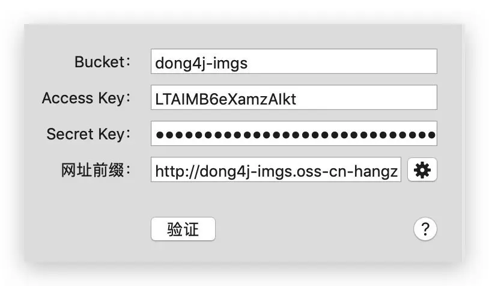
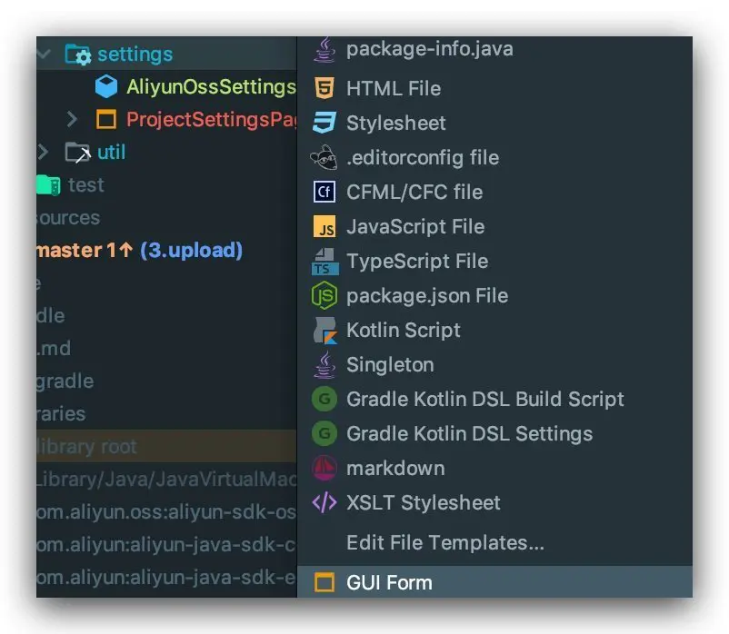

<!-- markdownlint-disable-next-line MD033 -->
<meta name="referrer" content="no-referrer"/>

IDEA Plugin 配置持久化

## 持久化与设置面板

上传到 Aliyun OSS 需要几个参数:

1. endpoint
2. accessKeyId
3. accessKeySecret
4. bucketName
5. filedir (此参数可不填)

本章节将介绍怎样创建设置面板和持久化配置

### 设置面板

直接使用 IDEA 自带的 GUI 插件来画图, 需要开启 `UI Designer` 插件

### 持久化 `PersistentStateComponent`
