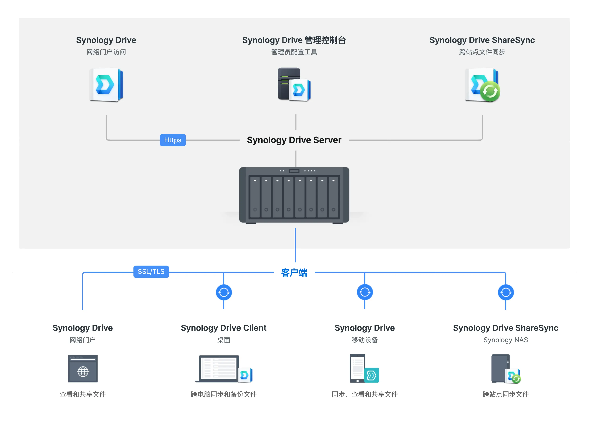
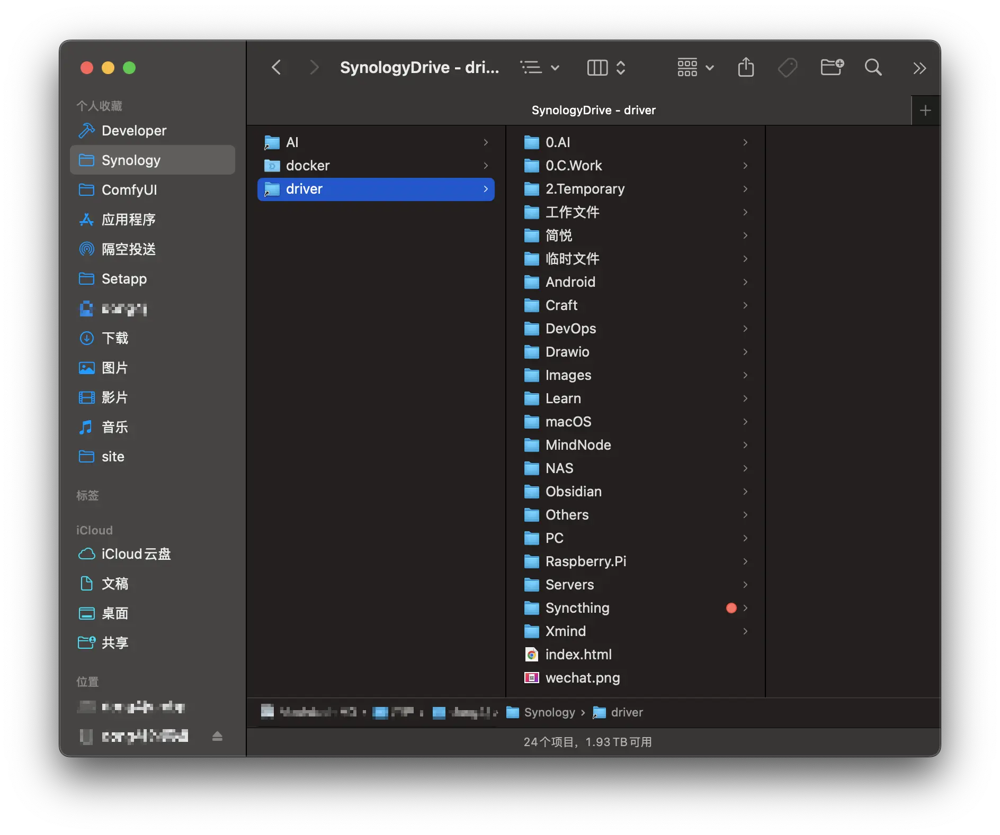
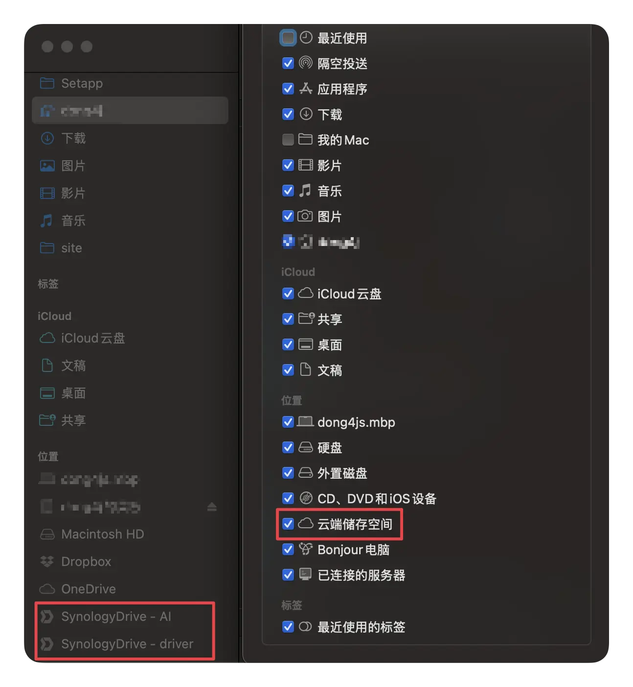
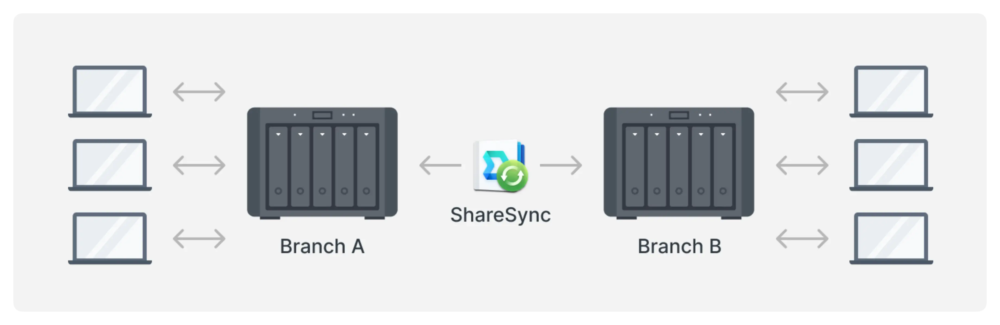
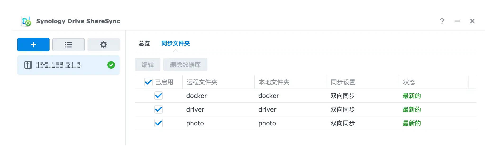
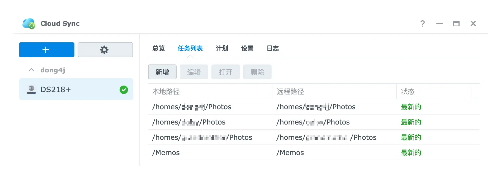
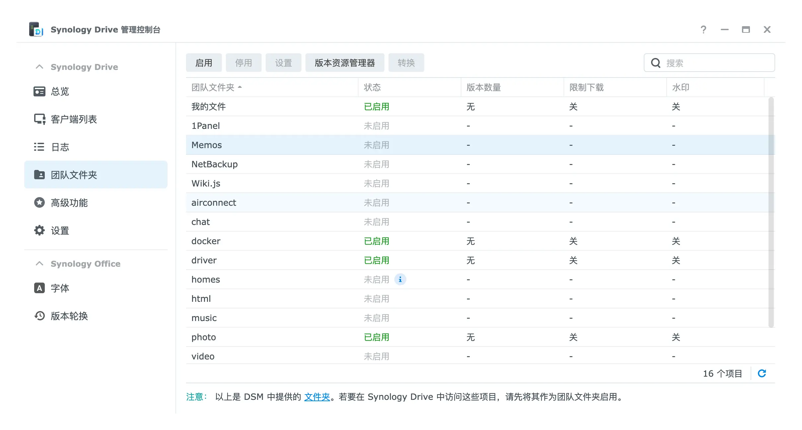
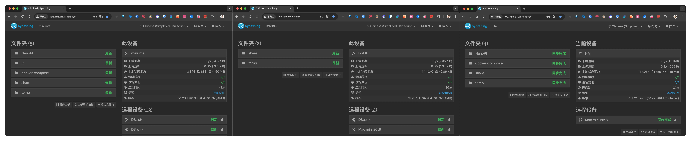

[封面来源: Unsplash-Tianyi Ma](https://unsplash.com/photos/macbook-pro-on-white-surface-WiONHd_zYI4)

## 数据同步

我的数据同步需求主要涉及到工作文件, 常用的配置文件以及 docker-compose 容器编排文件, 这些文件需要在多台主机上使用, 所以直接采用 **Synology Drive** 在支持 **Synology Drive Client** 的主机上同步文件, 一些无法安装 **Synology Drive Client** 的开发板, 则直接使用 **Syncthing** 同步.

**相关文章:**

1. [[homelab-guide|先导篇]]：我的 HomeLab 概要;
2. [[homelab-hardware|硬件篇]]：介绍我所拥有的硬件设备;
3. [[homelab-network|网络篇]]：包括网络环境、异地组网与网络安全;
4. [[homelab-service|服务篇]]：使用 Docker 搭建的各类服务;
5. [[homelab-data|数据篇]]：包括数据存储方案、备份方案和数据恢复方案;
6. [[homelab-data-sync|HomeLab数据同步：构建高效的数据同步网络]]
7. [[homelab-data-backup|HomeLab数据备份：打造坚实的数据安全防线]]
8. [[homelab-upgrade-to-10g|HomeLab 网络续集：升级 10G 网络-再战 10 年]]
9. [[homelab-guide|NAT 内网穿透详解：揭秘网络连接背后的奥秘]]

### Synology Drive

**Synology Drive Server** 由 3 个独立的套件组成:

- Synology Drive 管理控制台: 是 Synology Drive 应用的配置和监控中心, 可以配置同步任务, 备份版本控制, 客户端管理等功能;
- Synology Drive ShareSync: 用于在不同 Synology NAS 设备之间同步共享文件夹;
- Synology Drive: 可以理解为 NAS 上的 **Synology Drive Client**, 可以直接管理共享的文件;

#### Synology Drive Server



**Synology Drive** 被我用来同步工作文件和常用配置:



为了减少对本地磁盘的空间占用, **Synology Drive Client** 提供了 **按需同步** 的功能, 文件只有在使用时才会下载到本地(你也可以自行手动下载), 其他时候都是一个文件链接.

根据自己的需求, 在 **MBP** 上 docker-compose 容器编排文件是需要实时同步的, 而上图所示中的 **driver** 中的文件则采用 **按需同步**, 为了方便统一管理 **Synology Drive** 中的文件, 我使用软链接的方式将他们保存在 `~/Synology` 目录下(如果采用 **按需同步**, 会在 `~/Library/CloudStorage/SynologyDrive-xxx` 目录下创建一个同步目录).



在 **Mac mini 2018** 上则全部使用实时同步, 一方面可以当做本地备份, 另一方面会将 **Mac mini 2018** 作为 **Syncthing** 的枢纽与其他不支持 **Synology Drive Client** 的开发板进行数据同步.

不过遗憾的是在 Linux 上 **Synology Drive Client** 没有 **按需同步** 的功能, 所以我也将 M920x(Ubuntu Server 24.04) 和 Station(Ubuntu Server 22.04) 作为 **Drive** 文件备份主机:

#### Synology Drive ShareSync

**Synology Drive ShareSync** 用于在不同的 Synology NAS 设备之间同步共享目录(准确的说是 Drive 的团队文件夹):



我的 **Drive** 中的文件入口是 **DS218+**, 所有客户端都链接着这台 NAS, 然后会通过 **Synology Drive ShareSync** 将 DS218+ 中的 **Drive** 文件全量备份到 **DS923+** 上:



**DS923+** 的 **Synology Drive ShareSync** 上额外增加了 **photo** 共享目录的同步, 目的是确保在 **DS218+** 挂了之后, 我的家庭照片仍然可以通过 **DS923+** 快速恢复.

---

### Cloud Sync

[Cloud Sync](https://www.synology.cn/zh-cn/dsm/feature/cloud_sync) 可以将 Synology NAS 中的任意文件同步至云端，支持多种云平台，并提供单向或双向同步选项, 单向可以用作下载使用, 双向用作同步.

因为 **Synology Drive** 只能同步共享目录下的文件而无法同步 **homes** 下的文件, 但是 Synology 的 **Photos Mobile** 会将个人照片同步到 **homes** 下的个人 home 目录下, 所以为了同步与备份全家手机上的照片, 我使用 **WebDAV 服务** 将 DS218+ 上的多个个人 home 目录暴露出来, 然后在 DS923+ 上使用 **Cloud Sync** 同步个人 home 目录下的 **Photos** 子目录和主要目录(非 Synology Drive 团队文件夹):



这种方式的好处是当 Client 从 DS218+ 切换到 DS923+ 上后, 仍然可以通过 **Photos Mobile** 查看手机上保存的个人照片.

> **Synology** 的文件同步方式非常多, 比如 **/Memos** 目录你也可以设置为 Synology Drive 团队文件夹, 然后使用 **Synology Drive ShareSync** 来同步:
>
> 

#### 为什么不选择 Hyper Backup

**Hyper Backup** 也能将数据同步/备份到远程 NAS 上, 且提供了 3 种方式:

- 自带的 **备份到远程 NAS 设备**;
- 使用 rsync;
- 使用 WebDAV;

后面两种我们可以在 NAS 上部署相应的服务来完成上述需求(目前还没有尝试过), 问题是备份的文件是 **Hyper Backup** 特有的压缩文件, 无法浏览原始文件, 所以并不能满足照片的同步需求, 且实时性没有 **Cloud Sync** 高(**Hyper Backup** 以小时为单位, **Cloud Sync** 以秒为单位).

### Docker 容器文件同步

两台 NAS 上的 docker 容器文件都存储在本机的 `/docker/0.nas` 目录下, 然后使用 **Synology Drive ShareSync** 在两台 NAS 之间同步, 这样可以在某台 NAS 宕机后快速恢复服务.

而 `Vaultwarden` 这类比较重要的容器会同时在 2 台 NAS 上启动, DS218+ 作为主要服务提供者, 且通过 **Synology Drive ShareSync** 将 **Vaultwarden** 容器的数据文件实时同步到 DS923+ 上, 这样我可以随时切换 **Vaultwarden** 的服务提供者(**Vaultwarden** 的数据文件还会采用脚本定时备份到其他存储设备).

docker-compose 的编排文件同样会使用 **Drive** + **Syncthing** 在全设备同步, 好处是能够在其他寄主机快速重建服务, 问题是产生的容器文件改如何维护.

比如某些配置是寄主机特定配置(服务端口不一样或网卡配置不一样等), 某些是通用配置(比如两台 NAS 的 docker 容器文件可以共用), 这就需要根据情况选择性同步容器文件, 所以我在同步的 **docker** 目录下创建了多个子目录:

```bash
$ tree -d -L 3
docker
    ├── docker-compose
    │   ├── AI
    │   ├── apitable
    │   ├── dev
    │   ├── dockge
    │   │   ├── data
    │   │   └── stacks
    │   ├── ...
    │   └── v2ray
    │       └── data
    ├── docker-data
    │   ├── n8n
    │   ├── ...
    │   └── watchyourlan
    └── dockerfiles
        ├── anylink
        │   ├── ....
        └── zfile
```

1. docker-compose 目录用于存储 docker-compose.yml 文件, 这个目录下的所有文件会全量同步, 所以会将通用的 docker 容器的挂在目录配置到 docker-compose.yml 的同级 data 目录下;
2. 其他不通用的 docker 容器文件会统一挂载到 **docker-data** 目录下, docker-data 只会在当前服务器上;

使用 **Drive** 同步 docker-compose 目录, 不同步 **docker-data** 目录, 通过这种方式既能保证 docker-compose.yml 文件在全设备同步和备份, 又能保证不通用的 docker 容器文件只保留在本地.

---

### Syncthing

上述同步 docker-compose 编排文件和 docker 容器文件的方式只适用于能够安装 **Synology Drive Client** 的主机, 而在不支持的服务器上则通过 **Syncthing** 进行文件同步.

#### 自建发现和中继服务器

可以参考: [[homelab-service#Syncthing|自建 Syncthing 的发现服务器和中继服务器]]

#### 全局忽略文件

Syncthing 通过 **.stignore** 文件来忽略同步的文件或目录, 但是这个文件确不能被 Syncthing 同步, 所有需要在每台安装了 **Syncthing** 的主机上去配置需要忽略的文件和目录. 这个问题有 2 种方式可以解决(可以参考: [Syncronize .stignore file](https://forum.syncthing.net/t/syncronize-stignore-file/557):

- 使用软链接, 将 **.stignore** 修改为其他可以同步的文件名, 比如 **stignore**;
- 使用全局忽略文件, 然后用 `#include 全局忽略文件`;

为了提高通用性, 我采用第二种方式, 具体实施方式如下:

比如现在 **Mac mini 2018** 上的 `~/Synology` 目录结构如下:

```bash
$ tree -d -L 3
~/Synology											# 被 Synology Drive Client 接管
    ├── docker
    │   ├── docker-compose			# 自有 docker-compose.yml 和 docker 容器文件, 实时同步 (同样会被 Syncthing 接管)
    │   ├── docker-data					# 忽略同步
    │   └── dockerfiles					# 第三方 docker-compose.yml, 实时同步
    └── driver
        ├── ...
        ├── ...
        └── Syncthing						# 被 Syncthing 接管的目录, 会同步到无法安装 Synology Drive Client 的设备上
            ├── NanoPI					# NanoPI 设备专用
            ├── PI							# 树莓派专用
            ├── share						# 全设备共用
            └── temp						# 全设备共用
```

**目录使用者为:**


1. docker-compose 全设备同步, 目录下有 docker-compose.yml 和 docker 容器文件;
2. Share: 在全设备同步;
3. Temp: 临时文件, 在全设备同步;
4. NanoPI: 给 NanoPI 开发板使用的文件, 只会在 NanoPI 开发板设备之间同步;
5. PI: 只给树莓派使用的文件, 只会在树莓派之间同步;

> 而前面说的 **Mac mini 2018** 作为 Syncthing 的枢纽就体现在这里: `/driver/Syncthing` 会被 **Drive** 同步到支持安装 **Synology Drive Client** 的设备上, 而 `Syncthing` 目录则用于在无法安装 **Synology Drive Client** 的设备之间同步数据, **Mac mini 2018** 会通过 **Syncthing** 服务链接其他客户端完成数据同步.

---

##### stglobalignore



```
$RECYCLE.BIN
$WINDOWS.~BT
(?d)(?i).DS_Store
(?d)(?i)ehthumbs.db
(?d)(?i)ehthumbs_vista.db
(?d)(?i)Thumbs.db
(?d)(?i)Thumbs.db:encryptable
(?d)(?i)desktop.ini
*.!Sync
*.bak
*.bts
*.Cache
*.crdownload
*.git
*.icloud
*.lnk
*.lock
(?d)(?i)*.log
nohup.out
*.old
*.part
*.shm
*.sqlite*
*.stackdump
*.svn
*.swp
*.sync
*.SyncOld
*.SyncPart
*.SyncTemp
*.tmp
*.wal
*CACHE*
*cache*
*inaccessible*
*S*Conflict*
*s*conflict*
*Temporary*
*~
.#*
.*.swp
.apdisk
.AppleDB
.AppleDesktop
.AppleDouble
.com.apple.timemachine.donotpresent
.DocumentRevisions-V100
.escheck.tmp
.fseventsd
.gvfs
.local/share/trash
.LSOverride
.Prullenbak
.Shared
.Spotlight-V100
.svn
.sync
.SyncArchive
.SyncID
.SyncIgnore
.TemporaryItems
.thumbnails
.Trash*
.trash*
.Trashes
.VolumeIcon.icns
._*
.~lock.
@eaDir
asset-cache
a_writable
captcha_tmp
checkouts
data/searchIndex
dev/
files_trashbin/
forms.json
lost+found
LOST.DIR
Network Trash Folder
nobackup
pagefile.sys
proc/
run/
searchIndex
selinux/
staging.*
sys/
System*Volume*
(?d)temp
templates_c
thumbnails
tmp/
tmp_uploads
trash
Trash*
var/lib/lxcfs/
~$*
```



- 以 `(?i)` 前缀的模式会启用大小写不敏感。如 `(?!)test` 匹配：

  - `test`
  - `TEST`
  - `sEsT`

  `(?!)` 可以与其它模式结合，例如：`(?!)!picture*.png` 会指定 `Picture1.PNG` 不被忽略。在 macOS 和 Windows 上，模式永远是大小写不敏感的。

- 以 `(?d)` 前缀的模式，如果这些文件在阻止目录的删除，就会删除这些文件。这个前缀应该被任何 OS 生成的能随意移除的文件使用。

##### .stignore

在每个需要同步的目录下都需要配置一个这样的文件, 用于配置当前目录的同步规则, 首先需要在此文件中引入 **stglobalignore** 文件, 然后可以根据需求添加其他需要忽略的文件或目录.

我的目标是让 **stglobalignore** 能够通过 **Syncthing** 同步, 所以我将 **stglobalignore** 放在了 **share** 目录下, 那么根据前面的 **Mac mini 2018** 目录结构:

```bash
$ tree -d -L 3
~/Synology
    ├── docker
    │   ├── docker-compose
    │   ├── docker-data
    │		└── dockerfiles
    └── driver
        ├── ...
        ├── ...
        └── Syncthing
            ├── NanoPI
            ├── PI
            ├── share
            │     └── stglobalignore 文件
            ├── temp
            └── 后续其他可能需要添加的目录
```

1. NanoPI, PI, temp 目录下的 `.stignore` 配置: `#include ../share/stglobalignore`;
2. share 目录下的 `.stignore` 配置: `#include stglobalignore`;
3. docker-compose 目录下的 `.stignore` 配置: `#include ../../driver/Syncthing/share/stglobalignore`

> 因为历史原因, **docker-compose** 目录并没有放到 **driver/Syncthing** 目录下.
>
> 但是在其他无法部署 **Synology Drive Client** 的设备上, **docker-compose** 同样是在 **Syncthing** 目录下, 所以此时 docker-compose 目录下的 `.stignore` 应该配置为: `#include ../share/stglobalignore`;

至此我们将 **stglobalignore** 通过 **Syncthing** 同步到全设备, 然后只需要在每个设备上配置一次即可全设备使用, 后面如果需要添加其他通用的忽略配置, 只需要在任意一台设备上修改 **stglobalignore** 配置即可.

Mac mini 2018 负责所有目录的同步, 而其他设备只需要同步自己关心的目录即可.



<!-- R2S 和树莓派 没处理 -->

#### 参考

- [Syncthing-Ignoring Files](https://docs.syncthing.net/users/ignoring.html)
- [Syncthing 忽略模式](https://publish.obsidian.md/chinesehelp/01+2021%E6%96%B0%E6%95%99%E7%A8%8B/Syncthing%E5%BF%BD%E7%95%A5%E6%A8%A1%E5%BC%8F+by+%E6%B7%B3%E5%B8%85%E4%BA%8C%E4%BB%A3)
- [使用 Syncthing 忽略模式，用白名单的方式同步指定格式文件](https://forum-zh.obsidian.md/t/topic/731)
- [Syncthing global ignore file](https://gist.github.com/marksharrison/ec7646f9539a770f2e86b53c7fc7d309)
- [Syncthing 由「忽略模式」导致的同步异常](https://keenwon.com/syncthing-error-caused-by-ignoring-mode/)

---

### 数据同步总结


1. 使用 **Synology Drive Client** 同步工作文件和常用配置等一些需要经常使用到的文件, 可以选择 **实时同步** 和 **按需同步**( Linux 客户端不支持 **按需同步**);
2. **DS218+** 作为所有 **Synology Drive Client** 的外部入口, 所有的 Drive 数据都先通过 DS218+ 进入 HomeLab;
3. 在 DS923+ 上使用 **Synology Drive ShareSync** 与 DS218+ 上的 **photo** , **docker** 和 **driver** 3 个共享目录同步;
4. 在 DS923+ 上使用 **Cloud Sync** 与 DS218+ 上的个人 home 目录下的 Photos 目录同步;
5. **Mac mini 2018** 作为 **HomeLab** 中重要数据同步的枢纽, 为不支持 **Synology Drive Client** 的主机提供通过 **Syncthing** 同步数据;

上述方式分别结合 **Drive** 和 **Syncthing**, 把 **Mac mini 2018** 作为同步枢纽, 将重要文件在全平台进行了同步. 后续只需要在某一台主机上操作 **~/Synology** 目录下的文件即可同步到所有设备.

我现在的操作方式为:

- 感兴趣的 Docker 容器直接在 **docker-compose** 目录下创建 **docker-compose.yml** 文件, 根据需要选择是否同步到其他设备(需要同步的就挂载在 docker-compose 下, 不需要同步的就挂载 docker-data 目录下), 这样我就能在全平台任意一台主机上部署这个 Docker 服务;
- 关键的工作文件直接扔到 **~/Synology/driver/工作文件** 目录下, 这样在家也能随时编辑工作文件;
- 脑图, Obsidian, Drawio, Surge 配置等文件直接扔到 **~/Synology/driver/** 指定目录下, 同步的同时也能备份到其他设备上;
- 需要对开发板, 树莓派等批量处理的文件, 全部扔到 **~/Synology/driver/Syncthing** 目录下, 它们会自动同步到指定的设备上, 不再需要通过 FTP 一个个拷贝;
- 自定义脚本全部扔到 **~/Synology/driver/DevOps** 目录下,
- 多台 macOS 共用的配置文件全部扔到 **~/Synology/driver/macOS** 目录下, 比如 **.zshrc**, **.ssh/config**, **SSH 密钥**, **Alfred 配置** 等, 此目录同时兼备文件备份的功能, 比如多平台的 **Wireguard** 配置, **Royal TSX 配置**, **SnippetsLab 文件** 等;

**相关文章:**

1. [[homelab-guide|先导篇]]：我的 HomeLab 概要;
2. [[homelab-hardware|硬件篇]]：介绍我所拥有的硬件设备;
3. [[homelab-network|网络篇]]：包括网络环境、异地组网与网络安全;
4. [[homelab-service|服务篇]]：使用 Docker 搭建的各类服务;
5. [[homelab-data|数据篇]]：包括数据存储方案、备份方案和数据恢复方案;
6. [[homelab-data-sync|HomeLab数据同步：构建高效的数据同步网络]]
7. [[homelab-data-backup|HomeLab数据备份：打造坚实的数据安全防线]]
8. [[homelab-upgrade-to-10g|HomeLab 网络续集：升级 10G 网络-再战 10 年]]
9. [[homelab-guide|NAT 内网穿透详解：揭秘网络连接背后的奥秘]]
