在构建个人云端实验室 (HomeLab) 的过程中, 硬件是基石, 而网络则是让这些硬件协同工作的血脉和灵魂. 本篇将深入探讨家庭网络的配置, 从基础的架构设计到高级的安全性和异地组网技术, 逐步展示如何搭建一个高效、稳定且安全的自托管网络环境.

我将从以下几个方面进行详细阐述:

1. **网络架构**: 介绍如何选择合适的网络设备 (如路由器、交换机等) , 以及如何在不同的房间和位置部署网络覆盖.
2. **安全性**: 讨论如何设置网络安全策略, 包括防火墙规则、VPN 配置、加密通信等, 以确保数据的安全性和隐私保护.
3. **异地组网**: 展示如何通过远程访问技术, 将家庭实验室扩展到外部网络, 实现异地管理和操作.
4. **实践案例**: 分享实际操作步骤和经验, 帮助读者更好地理解和应用这些网络技术和概念.

通过本篇的探讨, 你将能够了解到如何构建一个高效、安全且可扩展的自托管网络环境. 这不仅能够满足日常工作和学习的需求, 还能为你的个人云端实验室提供一个稳固的网络基础. 让我们一起揭开家庭网络配置的神秘面纱, 探索自托管的无限可能吧！

**相关文章**:

1. [[homelab-guide|先导篇]]：我的 HomeLab 概要;
2. [[homelab-hardware|硬件篇]]：介绍我所拥有的硬件设备;
3. [[homelab-network|网络篇]]：包括网络环境、异地组网与网络安全;
4. [[homelab-service|服务篇]]：使用 Docker 搭建的各类服务;
5. [[homelab-data|数据篇]]：包括数据存储方案、备份方案和数据恢复方案;
6. [[homelab-data-sync|HomeLab数据同步：构建高效的数据同步网络]]
7. [[homelab-data-backup|HomeLab数据备份：打造坚实的数据安全防线]]
8. [[homelab-upgrade-to-10g|HomeLab 网络续集：升级 10G 网络-再战 10 年]]
9. [[homelab-guide|NAT 内网穿透详解：揭秘网络连接背后的奥秘]]

## 阅读指引

由于篇幅较长且不想切分多篇文章影响阅读连续性, 因此这里给出一个阅读指引, 以帮助快速理解章节直接的逻辑关系:

1. [从网络相关的硬件出发, 以网络布线开始到硬件设备连接, 重点介绍了弱电箱和书房的网络布局](#网络架构)
2. [通过外网, 内网和外网->家的网速测试验证宽带的可用性](#网速)
3. [有了硬件和基础网络后, 如何合理的分配设备 IP 地址](#设备-IP-管理) <!-- 使用 - 代替空格 -->
4. [为了方便记忆, 为设备分配自定义域名](#设备域名管理)
5. [完成上面 2 步工作后, 接下来就是如何管理多台服务器](#设备连接管理)
6. [内网配置完成后, 接下来就要考虑如何高效的从外网访问家中的设备和服务](#暴露服务到公网)
7. [因为暴露到公网后, 首先需要考虑的就是网络安全问题](#网络安全)
8. [出门在外, 如何快速且安全的访问家中网络, 看个小电影, 听听歌](#外网访问家庭网络)
9. [为了提升网络体验, 需要考虑如何屏蔽广告](#广告过滤)
10. [在外能够流畅访问家中的网络, 那么在家该如何访问公司的网络呢? ](#异地组网)
11. [如何流畅的访问互联网世界, 只能说一点点](#分流)
12. [最后的最后, 我们应该如何实时了解网络情况](#网络监测与通知)

---

## 网络架构

### 布线

从装修开始就考虑到一定会组建自己的 HomeLab, 但是考虑到弱电箱不够大且没有条件增大, 只能将硬件放置到各个房间, 因此在弱电布线时就做了冗余.

得益于开发商 2 根光纤入户, 使得宽带冗余方案得以实施, 同时遗憾的是无法增加更多的宽带数量.

从弱点箱预埋了总共 8 根八类网线, 客厅 3 根, 主卧和书房各 2 根, 次卧 1 根.



电信和联通通过弱电箱光纤入户

**电信宽带**:

1. 电信光猫通过网线连接电信机顶盒;
2. 电信光猫通过网线连接电视柜中 `AX9000` 的千兆 wan 口, 由 `AX9000` 拨号上网;
3. `AX9000` 的 2.5G lan 口通过网线回连至弱电箱的 `TL-SH1005` 2.5G 交换机;
4. `TL-SH1005` 交换机通过网线连接主卧和书房, 实现主要房间 2.5G 电信有线网络;

**联通宽带**:

1. 联通光猫通过网线连接弱电箱旁边 `6500Pro` 的 2.5G wan 口, 由 `6500Pro` 拨号上网;
2. `6500Pro` 通过 2.5G lan 口连接弱电箱中的另一个 `TL-SH1005` 交换机;
3. `TL-SH1005` 交换机通过网线连接主卧, 次卧和书房, 实现房间 2.5G 联通有线网络;

因为弱电箱小无法放下所有硬件, 因此只能采用这种迂回的方式布线, 关键点是需要额外预埋一条网线将网络从路由器接到交换机, 再由交换机将网络输送到各个房间.

如果在装修时没有考虑导致网线不够, 可以用其他方式实现:

1. 网线一分为二, 四芯用于连接无线路由器, 这种方式当然 **不推荐**, 网速达不到要求;

2. 使用电力猫连接 IPTV 电视盒子, 网线连接无线路由器, 这种方式会导致 IPTV 电视信号稳定性不高;

   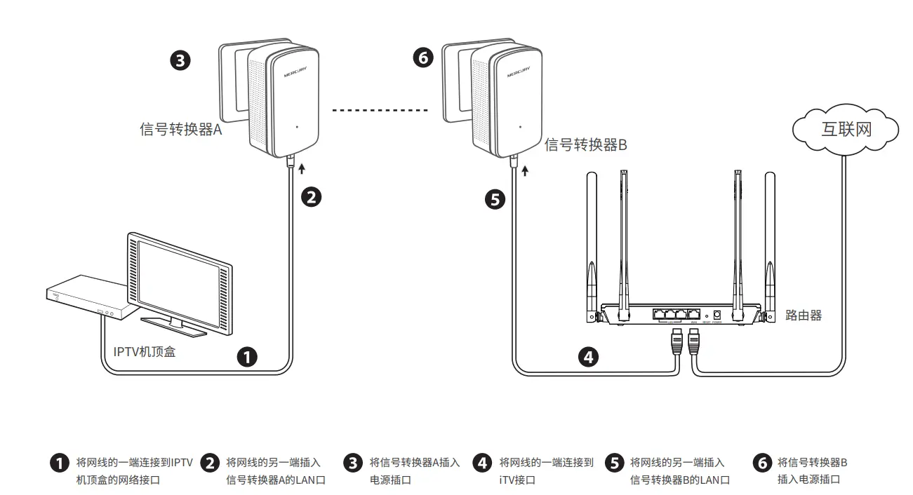

3. 单线复用: 使用支持 VLAN 的交换机, 划分两个逻辑独立的网络. 这种连接方式会增加配置复杂度. [这里有详细的视频教程](https://www.youtube.com/watch?v=1CuyE5HXhA8)

   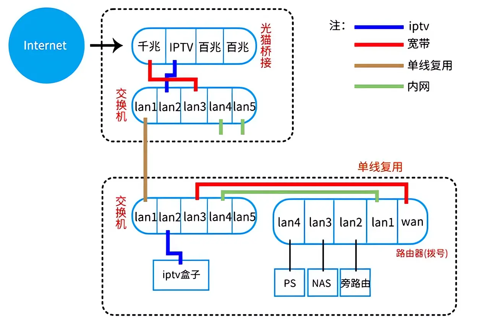

### 弱电箱

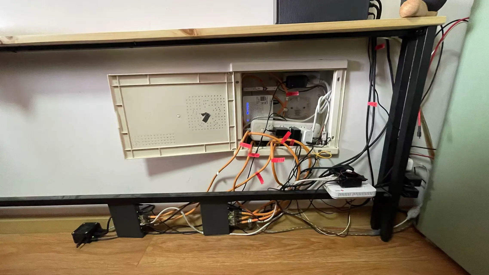

还好沙发后面有一个 10 公分宽的木架, 不然这些设备弱电箱还塞不下.

#### 拓扑图


1. 电视柜 3 个网口实现 IPTV, 路由器拨号上网与有线回程;
2. 弱电箱的电信交换机连接 R2S 和 R5S, 剩下的 2 个网口接到主卧和书房;
3. 联通光猫连接 6500Pro 并由路由器拨号上网, 6500Pro 连接交换机与 R5S;
4. 联通交换机连接 R2S, 其他网口接到主卧, 次卧和书房;

其中 R5S 和 R2S 都已将 **lan 修改为 wan 口**, 然后作为旁路由和轻量服务器是用, 跑了几个 Docker 服务.

#### 光猫改桥接

光猫改桥接的优势:

1. **提升网络性能**: 在桥接模式下, 光猫只负责光电转换, 将路由功能交给专门的路由器处理, 这样可以减轻光猫的负担, 使网络性能得到提升. 同时, 所有的设备都位于同一子网内, 网络结构更加简单, 便于管理和配置.
2. **增强网络稳定性**: 光猫在桥接模式下, 只需完成光电转换, 简化了其任务, 从而降低了工作压力, 提升了家庭网络的稳定性.
3. **便于故障排查**: 由于路由功能由专门的路由器处理, 一旦出现问题, 可以迅速定位到路由器层面进行排查和修复. 而在路由模式下, 故障排查可能会涉及到光猫和路由器等多个设备, 增加了故障排查的难度.
4. **提高灵活性**: 桥接模式允许用户根据实际需求选择合适的路由器设备, 实现更灵活的网络配置. 例如, 用户可以选择具有更强路由性能的路由器来提升网络稳定性, 或者选择具有特殊功能的路由器来满足特定需求.
5. **实现特殊功能**: 光猫改桥接后, 路由器 PPPOE 拨号, 用户可以实现更多的功能. 比如可以单线双拨增加带宽.

改桥接的方法可以网上搜索, 保险起见直接让运营商修改即可.

### 电视柜

电视柜中的 AX9000, 剩下的 lan 分别连接了小米壁画电视和 Apple TV.

### 书房

书房承载了 80% 的网络设备, 因为设备是慢慢增加的, 所以一开始并没有直接购买太多网口的交换机, 后面设备增多后, 因为交换机体积的问题, 也没有直接更换成更多网口的交换机, 而是直接通过增加交换机数量进行网络扩展. 而因为接入了电信和联通, 每条宽带都需要增加双倍的交换机数量.


书房 2 个网口, 分别有线接入电信和联通网络(2.5G).

除了 DS923+ 和单独的开发版, 书房所有供电全部来自于最右边的插座, 因此增加了一个小米智能插座来统计书房的耗电量.

因为书桌上设备太多, 总共通过 4 个 8 口 PDU 插座和 3 个小米插座来供电, 放一个书桌下面的走线图:


不能说乱吧, 只能说隐蔽工程做的不太漂亮 😎.

#### 网络拓扑图


1. 网络设备全部通过双网口接入电信和联通网络, 如果没有双网口的设备, 则通过 USB 或 type-c 转 2.5G 网口实现;
2. 现在还没有条件实现书房主要设备万兆局域网, 这将是下一步的升级目标;

由于早期申请了电信宽带, 当时申请**公网 IP**相对容易. 正是因为这个公网 IP, 当前宽带无法升级到 2000M. 经咨询, 升级可能会导致公网 IP 被收回. 鉴于现有带宽足够使用, 加上还有一条千兆联通宽带, 暂时没有升级的迫切需求.

**宽带配置和使用情况**

1. **电信宽带**:

   - 主要满足日常上网需求.
   - 手机等常用设备优先接入电信网络.

2. **联通宽带**:

   - 最初为免费赠送的 300M 带宽, 后来通过活动以 **每月 19 元**升级到千兆.
   - 通过协商安装师傅, 也获取了一个公网 IP.
   - 联通宽带主要用于智能设备联网和文件下载, 作为电信宽带的**备用网络**.

3. **双宽带优势**:
   - 两条独立宽带确保当一条线路的网络服务出现问题 (如运营商线路故障或光缆被挖断) 时, 仍可通过另一条线路访问家中设备.
   - 但需注意, 如果停电, 两个网络都会中断, 目前还不具备部署大型备用电源的财力 😅.

**网络优化方案**

为减少 WiFi 信号干扰, 进行了以下调整:

1. **WiFi 管理**:

   - 关闭光猫和非主要路由器的 WiFi 功能.
   - 使用 **AX9000** 及其 **Mesh 设备(2 台 AX1800)** 的 WiFi 提供全屋漫游覆盖.

2. **智能设备专网**:
   - 配置 **6500Pro** 作为智能硬件的网络接入点, 启用 **2.4G 和 5G 频段**.
   - 为访客提供专用的访客 WiFi, 保障主网络的安全性.

通过这种分工, 不仅可以优化网络性能, 还能减少干扰, 确保家庭网络的稳定性和可用性.

### 关于网线

刚开始并没有考虑到全网光纤, 这是一大败笔, 现在换成光纤成本有点高, 还好预埋了 **八类网线**, 不过当时功课没有最好, 感觉类型越高越好, 完全没有考虑价格, 导致弱电装修增加了不少成本. 家用网线超六类完全够用.

不同规格网线速率图:

| 规格            | 类型               | 速率                                                                                                   | 接口      | 备注                                                                    |
| --------------- | ------------------ | ------------------------------------------------------------------------------------------------------ | --------- | ----------------------------------------------------------------------- |
| 五类线 CAT 5    | 100Base-T 10Base-T | 100Mbps                                                                                                | RJ45      | 不推荐                                                                  |
| 超五类线 CAT 5E | 100Base-T          | 1000Mbps 2.5Gbps[7](https://icyleaf.com/2023/01/how-to-homelab-part-1-hardware-and-architecture/#fn:7) | RJ45      | 2.5G 网络[仅限 100 米以内](https://www.bilibili.com/video/BV1p14y137v3) |
| 六类线 CAT 6    | 100Base-T          | 1Gbps 10Gbps                                                                                           | RJ45      | 万兆网络仅限 50 米内                                                    |
| 超六类线 CAT 6A | 100Base-T          | 10Gbps                                                                                                 | RJ45      | 200 米内可达万兆网络 没有 6E 标准                                       |
| 七类线 CAT 7    | 100Base-T          | 10Gbps                                                                                                 | GG45/TERA | 带着遮蔽                                                                |
| 光纤            | -                  | -                                                                                                      | -         | 不懂, 详见[维基百科](https://zh.wikipedia.org/zh-cn/光纖通訊)           |

因为七类以上的网线有遮蔽罩, 需要正确接地处理, 反正来给我打水晶头的人不知道怎么接, 不过因为速度还是能达到万兆网速, 所有还没有深究这个问题, 等到有时间再去折腾吧.

### 总结

上一篇说过为什么不通过双线多播和猫棒等手段来提升宽带速度, 主要是 **稳定性和容错** 考虑, 也否定了 **All In One** 的方案, 避免 **All In Boom** 的问题, 而是使用多个硬件承载不同的需求.

在硬件设备上, 我也实现了多台冗余的设计, 比如多个 R2S 设备, 网络相关的服务集群部署等, 主要是保证可用性.

多年互联网开发经验告诉我, 多台服务器比单台性能强劲的服务器更加靠谱和经济实惠, 既能保证高可能还能提高可扩展性, 唯一的缺点就是多服务器的管理和配置难度上升.

---

## 网速

### 外网

**电信**:

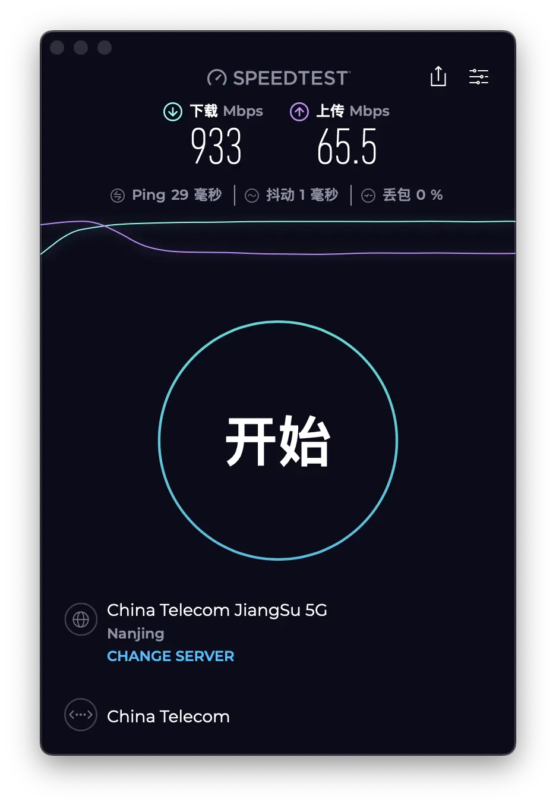

**联通**:

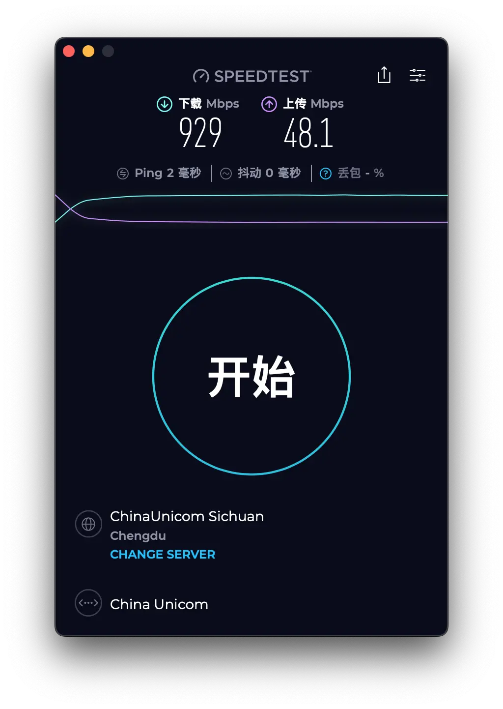

### 内网

内网主要设备全部实现 2.5G:

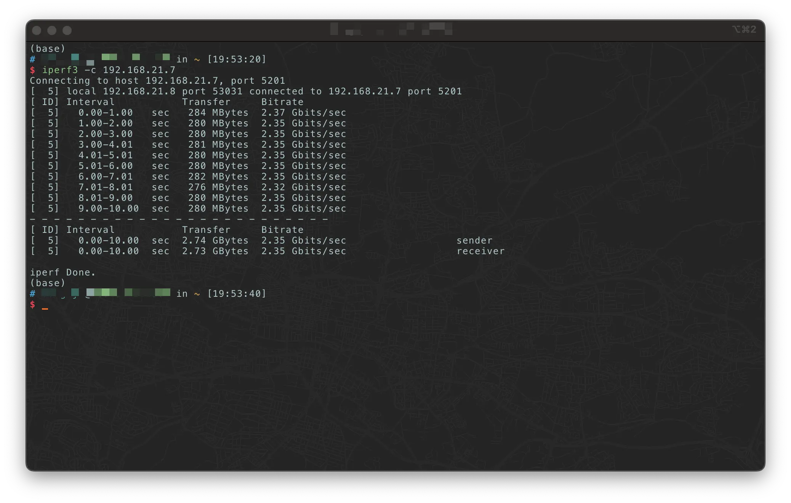

通过雷雳 3 直连的 2 台 Mac mini 能达到 20G:

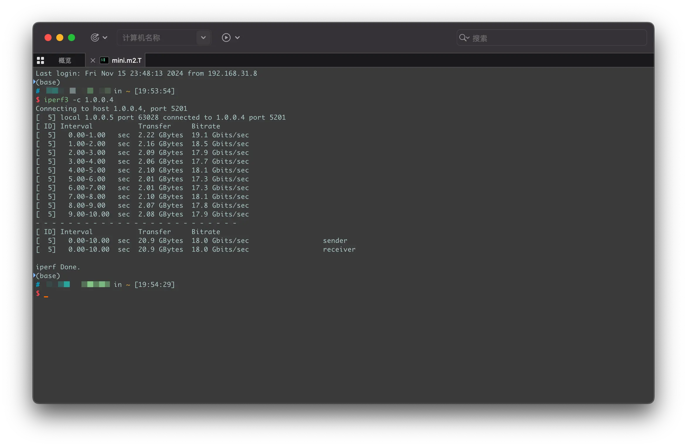

通过万兆交换机连接的 Mac mini 2018 和 DS923+ 能达到 10G 速度:

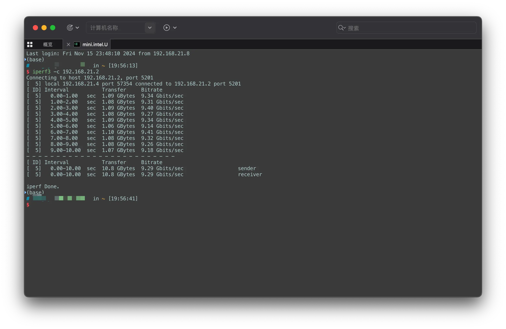

### 外网->家

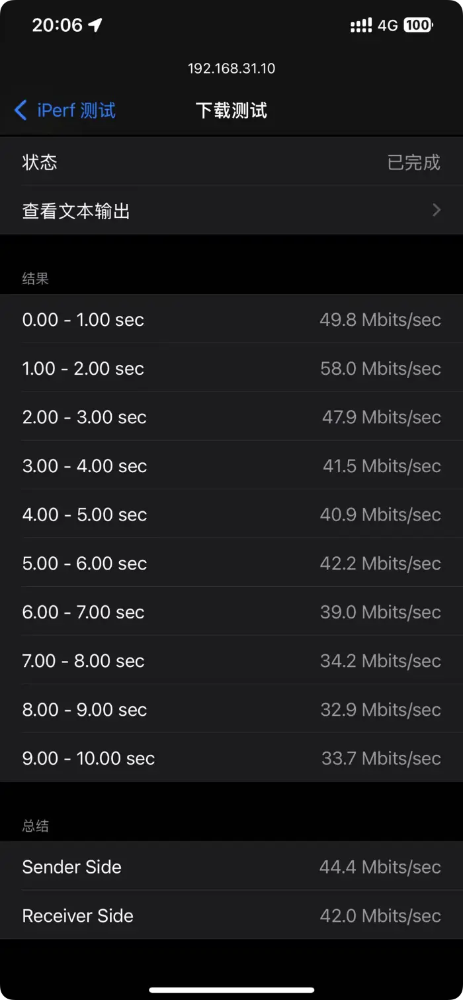

给一个逆天的网速测试截图, 就当图了乐 🤩:

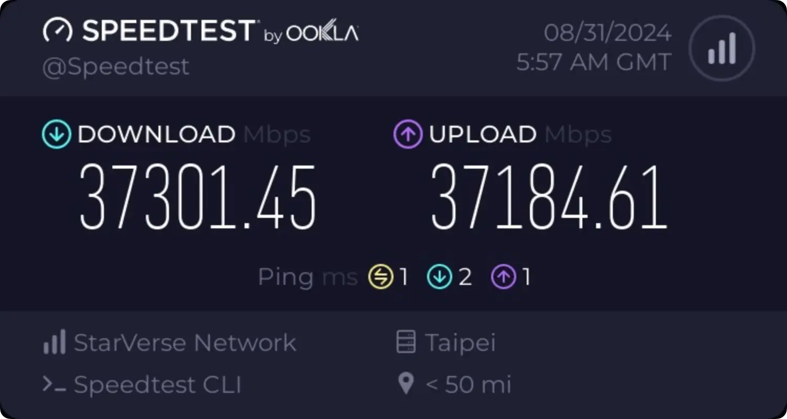

## 设备 IP 管理

从书房的网络拓扑图可以看出, 主要硬件设备的 IP 地址分配都保持有序. 这种规划方式的优势是: **只需记住设备的最后一位数字**, 便能快速找到对应设备.

另一种常见方式是通过修改 **hosts 文件**, 为每个设备设置对应的域名.

最理想的解决方案是**自建 DNS 服务**, 以集中管理所有设备的 DNS 解析任务, 更高效地应对设备数量的增加和变化.

### IP 设置策略

由于设备较多, 且未来可能增加新设备, 因此未采用在设备端手动设置静态 IP 的方式.

**原因**:

1. **灵活性**: 某些设备 (如开发板) 可能频繁切换网络或连接不同宽带.
2. **易管理**: 通过路由器实现静态 IP 绑定既简单又高效, 可统一管理设备的 IP 地址分配.

设备 IP 分配方案按照网口数量进行粗略分组, IP 地址基于其连接的电信或联通宽带进行划分. 这种规划既便于扩展, 又确保了网络结构的清晰和可控性.

### IP 分配

粗略按照网口对设备进行分类:

| 网口数量      | 设备                                                                       | 所需 IP 数量      |
| ------------- | -------------------------------------------------------------------------- | ----------------- |
| WiFi          | `移动设备 * 4`                                                             | 4                 |
| 单网口        | Apple TV, 小米电视                                                         | 2                 |
| 单网口 + WiFi | `开发板 * 7`                                                               | 14                |
| 双网口        | `R2S * 2`, DS218+, DS923+(2 个千兆网口链路聚合成 1 个网口, 另一个万兆网口) | 4(电信联通各一个) |
| 双网口 + WiFI | MBP, Mac mini M2, Mac mini 2018                                            | 6                 |
| 3 网口        | R5S                                                                        | 1                 |
| 4 网口        | M920x. 组装机                                                              | 4                 |

算下来只需要记住 35 个 IP 😅, 当然都是有规律的:

比如 MBP:

- 电信 RJ45: 192.168.31.8
- 联通 RJ45: 192.168.21.8
- 电信 WiFi: 192.169.31.88
- 联通 WiFi: 192.169.21.88

**IP 分配规则**

为了便于管理和记忆, 主要设备的 IP 地址分配遵循以下规则:

1. **前 10 位 IP 分配给主要设备**:

   - 如设备需要连接 WiFi, 直接在有线 IP 的基础上 **double** (翻倍) 即可, 比如 RJ45 IP 为 `192.168.31.8`, WiFi IP 就是 `192.168.31.88`.
   - 如果某设备超过了 10 位范围, 且有额外的 WiFi 连接需求, 则在有线 IP 后面添加一个 **0**, 比如 RJ45 IP 为 `192.168.31.11`, WiFi IP 就是 `192.168.31.110`.

2. **超出规则时的处理**:

   - 当添加 **0** 导致 IP 超过 **254** 时, 直接将下一位 IP 地址递增, 比如 RJ45 IP 为 `192.168.31.33`, WiFi IP 就是 `192.168.31.34`.
   - 确保分配合法, 避免使用非法 IP.

3. **其他设备的分配**:
   - 无关紧要的设备使用 **200 之后**的 IP 地址.
   - 当前 **200 段**的 IP 数量尚充足, 如有需求可以再开放更多的 IP 段.

**优势分析**

这种分配方式使**主要设备的 IP 规划简单易记**, 同时将无关紧要的设备划分至 **200 段**后, 可以减少对主要设备 IP 地址段的干扰, 确保未来扩展设备时的灵活性和有序性.

---

## 设备域名管理

### Hosts

通过修改 **hosts 文件**, 为每个设备设置对应的域名是一种常见的本地解析方案.

然而, 这种方式存在以下问题:

1. **每台终端需单独配置**: 每次新增设备都需要在所有终端的 hosts 文件中手动添加配置.
2. **不支持泛域名解析**: 系统自带的 hosts 文件无法处理类似 `*.xx.com` 的泛域名.

因此这种方式管理效率较低, 扩展性差, 特别是设备数量多或频繁变动的场景, 显得尤为不适用.

**推荐替代方案**: 通过自建 DNS 服务实现集中管理, 不仅支持泛域名解析, 还能减少每台终端的配置工作量, 提升管理效率和灵活性.

### DNS 服务



1. **[dnsmasq](https://thekelleys.org.uk/dnsmasq/)**

- **功能特点**: 轻量级 DNS 和 DHCP 服务器, 支持本地解析、DNS 缓存、DHCP 静态绑定.
- **适用场景**: 家庭和小型局域网中使用, 配置简单, 资源占用极低.
- **优点**:
  - 轻量化, 易配置.
  - 支持本地静态 IP 和域名绑定.
- **缺点**:
  - 高级功能较少, 不适合大型网络或复杂解析场景.

2. **[CoreDNS](https://coredns.io/)**

- **功能特点**: 模块化、插件化设计的 DNS 服务, 适合现代云环境.
- **适用场景**: Kubernetes 集群、微服务架构的 DNS 管理.
- **优点**:
  - 支持负载均衡、缓存、DNSSEC 等高级功能.
  - 插件化架构, 功能可扩展性强.
- **缺点**:
  - 配置和学习曲线相对较高.
  - 对初学者可能显得过于复杂.

3. **[SmartDNS](https://pymumu.github.io/smartdns/)**

- **功能特点**: 高性能 DNS 解析器, 专注于提升解析速度和可靠性.
- **适用场景**: 需优化 DNS 解析速度的环境, 如加速海外解析、影音服务.
- **优点**:
  - 支持多线路、快速 DNS 选择.
  - 优化海外解析性能.
- **缺点**:
  - 功能专注于加速, 不适合复杂解析需求.
  - 高级功能较少, 生态支持不如其他方案.

4. **[AdGuard Home](https://adguard.com/en/adguard-home/overview.html)**

- **功能特点**: 集成广告拦截的 DNS 服务, 提供友好的 Web 管理界面.
- **适用场景**: 家庭网络广告屏蔽和基础 DNS 管理.
- **优点**:
  - 易用的 Web 界面, 配置简单直观.
  - 集成广告拦截、隐私保护功能.
- **缺点**:
  - 灵活性不足, 偏向家庭用户.
  - 插件和高级扩展支持较弱.

5. **[Pi-hole](https://pi-hole.net/)**

- **功能特点**: 以广告拦截为核心的 DNS 服务, 可运行于 Raspberry Pi 或其他小型设备上.
- **适用场景**: 家庭或小型办公网络中的广告屏蔽和基础 DNS 管理.
- **优点**:
  - 强大的广告屏蔽功能.
  - 配置简单, 支持轻量级部署.
- **缺点**:
  - 高级 DNS 功能支持较弱.
  - 更适合广告屏蔽用途, 不适合复杂网络需求.

6. **[Unbound](https://github.com/NLnetLabs/unbound)**

- **功能特点**: 高性能递归 DNS 服务器, 支持 DNSSEC 和隐私保护.
- **适用场景**: 需要安全、高效的递归 DNS 服务的环境.
- **优点**:
  - 支持 DNSSEC, 适合需要隐私保护的场景.
  - 配置灵活, 性能出色.
- **缺点**:
  - 缺少 Web 界面, 配置文件复杂度较高.

7. **[BIND 9](https://github.com/isc-projects/bind9)**

- **功能特点**: 功能全面的权威 DNS 服务器, 广泛用于企业环境.
- **适用场景**: 企业级、复杂解析需求的 DNS 服务.
- **优点**:
  - 支持权威解析、递归解析、DNSSEC 等功能.
  - 功能全面, 企业标准.
- **缺点**:
  - 学习成本高, 适合有经验的管理员.
  - 对系统资源的需求较高.

**总结对比表**

| 工具         | 轻量化 | 高性能 | 易用性 | 插件扩展 | 高级功能 | 适用场景                |
| ------------ | ------ | ------ | ------ | -------- | -------- | ----------------------- |
| **dnsmasq**  | ★★★★★  | ★★★★☆  | ★★★★★  | ★☆☆☆☆    | ★★☆☆☆    | 家庭、小型网络          |
| **CoreDNS**  | ★★★☆☆  | ★★★★★  | ★★☆☆☆  | ★★★★★    | ★★★★☆    | Kubernetes、微服务环境  |
| **SmartDNS** | ★★★★★  | ★★★★★  | ★★★★☆  | ★☆☆☆☆    | ★★☆☆☆    | DNS 加速、影音服务      |
| **AdGuard**  | ★★★★☆  | ★★★☆☆  | ★★★★★  | ★★☆☆☆    | ★★★☆☆    | 广告屏蔽、家庭网络      |
| **Pi-hole**  | ★★★★☆  | ★★★☆☆  | ★★★★☆  | ★★☆☆☆    | ★★★☆☆    | 广告屏蔽、基础 DNS 管理 |
| **Unbound**  | ★★★☆☆  | ★★★★★  | ★★☆☆☆  | ★★☆☆☆    | ★★★★★    | 安全递归 DNS 服务       |
| **BIND 9**   | ★★☆☆☆  | ★★★★☆  | ★★☆☆☆  | ★★★☆☆    | ★★★★★    | 企业环境、权威 DNS 服务 |

**方案选择推荐**:

- **轻量化和便捷配置**: 选择 **dnsmasq**.
- **广告拦截和易用性**: 选择 **AdGuard Home** 或 **Pi-hole**.
- **高性能递归解析**: 选择 **Unbound**.
- **复杂企业级需求**: 选择 **BIND 9**.
- **云原生环境或微服务架构**: 选择 **CoreDNS**.
- **追求解析速度优化**: 选择 **SmartDNS**.

目前在用的是轻量级的 **SmartDNS** 和 **AdGuard Home**, R2S 的固件中自带这 2 个服务, 稍微配置即可实现自定义 DNS, 并具备广告拦截的功能.



### Surge Hosts

只需要满足主要设备能通过域名访问其他服务器或服务即可, 因此没必要单独部署一个 DNS 解析服务, **SmartDNS** 和 **AdGuard Home** 更多的是用来拦截广告.

Surge 本身就具备 hosts 管理功能, 且支持泛域名解析(可以通过 Synology Drive 或 iCloud 服务来同步配置, 避免多端重复配置):

```
# R2ST 的 npm 代理, 所有的 *.npm 全部转发到 R2ST 的 80 端口, 然后再通过 NPM 转发到其他服务
*.npm = 192.168.31.10
```

### 方案总结

在实际使用中, 没有单一方案能够完全满足所有需求, 因此需要根据不同场景搭配多种方案.

我想实现的目标就是 **方便快捷的访问设备与服务**, 避免记忆大量 IP 地址及端口号, 提升访问效率.

其实, 主要设备就那么几台, 记住几个 IP 也不是那么难, 且主要设备的 IP 肯定不会经常改动. 问题是每台服务器的服务需要通过端口区分, 如果是 Web 服务, 直接用 Dashboard 这类服务来管理, 嫌麻烦就用书签, 推荐 [Markoob](https://chromewebstore.google.com/detail/markoob-%E4%B9%A6%E7%AD%BE%E5%90%AF%E5%8A%A8%E5%99%A8/lnhnllkaacmnkffnjgcnokifakeckido?hl=zh-CN):

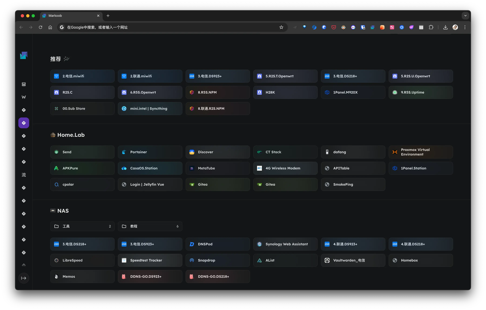

<a id="通过自定义域名减少需要记忆的 IP 数量" style="display:none;"></a> <!--隐藏锚点-->

另一种则是通过自定义域名的方式减少需要记住的 IP 数量, 前面 [Surge Hosts](#Surge Hosts) 已经介绍过 hosts 功能, 我将结合 [Nginx Proxy Manager](https://nginxproxymanager.com/) 再次简化掉端口, 直接通过自定义域名访问所有服务. [具体的配置将在后续详细说明](#代理局域网自定义域名).

所以总结下来就以下几点:

1. 使用浏览器书签管理常用 Web 服务 (在服务篇会使用开源的 Dashboard 服务来管理);
2. [使用 NPM + Surge Hosts 实现 80 端口访问自定义域名](#代理局域网自定义域名), 简化域名并减少 IP 记忆;

---

## 设备连接管理

### SSH

能通过 SSH 连接的设备我这里统称为 **服务器**, 那么在不算虚拟机的情况下, 总共有 20 台设备, 如果需要同时访问多台设备, 在使用 macOS 自带的终端或 iTerm2 一个个手敲的话效率非常低, 不过我们可以通过多种方式提升效率.

#### 别名配置

首先想到的是为每台服务器设置一个简短好记的别名, 我们可以编辑 `.ssh/config` 文件来实现:

```shell
Host 别名
    HostName 服务器 IP
    User username
    Port ssh-port
```

连接方式:

```
ssh 别名
```

#### SSH 免密登录

为了避免每次都需要输入密码, 我们可以配置 SSH 的免密登录:

```shell
# 客户端沈城 SSH 密钥对 ()
$ ssh-keygen -t rsa -b 4096 -C "your_email@example.com"
Generating public/private rsa key pair.
Enter file in which to save the key (/Users/dong4j/.ssh/id_rsa): 这里输入新的密钥保存路径 [我没有直接保存到默认的 id_rsa 中, 后续会共享这个密钥]

# 使用 ssh-copy-id 工具将公钥传输到目标服务器
ssh-copy-id user@remote_server
```

如果未安装 ssh-copy-id, 可以手动传输公钥:

```shell
# 将公钥复制到剪贴板
cat ~/.ssh/server.pub | pbcopy  # macOS
cat ~/.ssh/server.pub | xclip  # Linux

# 登录服务器
ssh user@remote_server

# 在服务器上将公钥添加到 authorized_keys
echo "your-public-key" >> ~/.ssh/authorized_keys
chmod 600 ~/.ssh/authorized_keys
```

验证免密是否生效:

```shell
# 如果没有提示输入密码, 则配置成功
ssh user@remote_server
```

拷贝公钥到其他服务器后, 为了实现局域网服务器之间 SSH 免密登录, 我会将第一步生成的 `server` 也拷贝到其他所有服务器.

值得说明的是, R2S 和 R5S 可以通过 WebUI 进行配置:

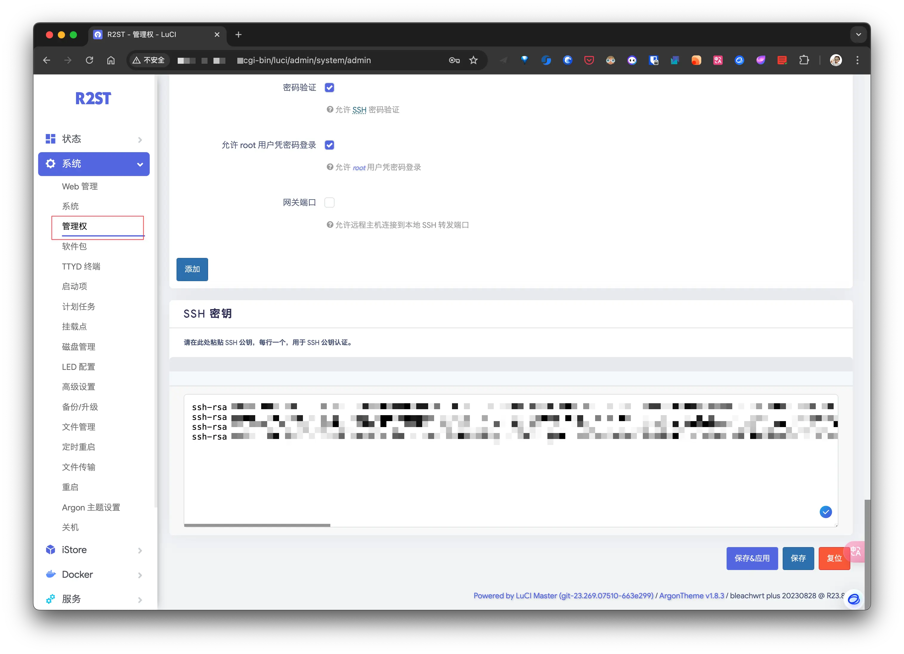

#### SSH 密钥认证

为了安全起见, 建议关闭密码认证, 只开启公钥认证.

编辑服务器上的 SSH 配置文件 /etc/ssh/sshd_config

```shell
# 完全禁止使用密码认证, 强制所有用户使用公钥认证
PasswordAuthentication no
# 启用公钥认证
PubkeyAuthentication yes
# 禁用空密码登录
PermitEmptyPasswords no
```

重启 SSH 服务以应用更改:

```shell
# 注意 不同的系统重启命令可能不一样
sudo systemctl restart sshd
```

配置本机的 `.ssh/config`

```shell
Host 别名
    HostName 服务器 IP
    User username
    Port ssh-port
    IdentityFile ~/.ssh/server
```

#### SSH 允许 root 登录

数据篇中会讲到如何 **使用 Synology NAS 备份服务器上的重要数据**, 前提是必须使用 root 账号登录服务器, 所以这里顺带把 SSH 允许 root 登录一起写一下 (开启 root 登录会增加潜在的安全风险, 及时只是在内网使用):

编辑服务器上的 SSH 配置文件 /etc/ssh/sshd_config

```shell
# 允许 root 用户登录, 但仅限密钥认证, 不允许密码登录
PermitRootLogin prohibit-password
```

以下是增加 SSH 安全性的常规手段:

1. 限制 root 登录的 IP 段;
2. 仅允许密钥登录;
3. 启用 MFA (多因素认证);
4. 使用 [Fail2Ban](https://github.com/fail2ban/fail2ban) 自动封禁多次失败的登录尝试;
5. 更改 SSH 默认端口;

#### SSH 多因素认证

更进一步, 你可以为 SSH 开启多因素认证:

```shell
# 安装 Google Authenticator PAM 模块:
brew install google-authenticator-libpam

# 为登录用户生成一个基于时间的一次性密码配置
google-authenticator

# 扫描生成的二维码到 Google Authenticator、Authy 或其他支持 TOTP 的应用

# 编辑 PAM 文件 /etc/pam.d/sshd, 在文件的顶部添加以下内容:
auth required /opt/homebrew/lib/security/pam_google_authenticator.so
```

编辑 SSH 配置文件 /etc/ssh/sshd_config, 调整以下参数:

```shell
# 启用挑战响应认证
ChallengeResponseAuthentication yes

# 保留或禁用密码认证 (根据需要)
PasswordAuthentication yes
```

macOS 下重启 SSH 服务

```shell
sudo launchctl unload /System/Library/LaunchDaemons/ssh.plist
sudo launchctl load /System/Library/LaunchDaemons/ssh.plist
```

**注意事项**

1. **备份密钥与备用代码**:

   确保生成的密钥和备用代码保存在安全的地方.

2. **排除特定用户**:

可在 PAM 配置中定义例外用户组, 跳过 MFA:

```shell
# o_mfa_users 是无需 MFA 的用户组
auth [success=1 default=ignore] pam_succeed_if.so user ingroup no_mfa_users
auth required pam_google_authenticator.so
```

3. **结合 SSH 密钥**:

配置 SSH 密钥认证与 MFA 结合使用, 提升安全性.

#### SSH 会话保持

同一主机的多次连接可以复用已有连接, 减少登录时间:

```shell
Host *
    # 添加私钥到 ssh-agent 并允许其存储在 macOS 密钥链中
    AddKeysToAgent yes
    # 通过 ssh-agent 管理私钥, UseKeychain 特别适用于 macOS, 将私钥安全存储
    UseKeychain yes
    # 指定私钥路径, 对所有 SSH 连接生效
    IdentityFile ~/.ssh/server

    # 启用 SSH 多路复用: 允许复用现有的 SSH 连接, 无需每次重新认证
    ControlMaster auto
    # 指定控制套接字存储路径, 可使用 /tmp 或用户目录下的子文件夹 (如 ~/.ssh/session)
    ControlPath /tmp/%r@%h:%p

    # 即使没有活动会话, 主连接仍保持最多 4 小时
    ControlPersist 4h

    # 启用 SSH 数据压缩, 尤其适合低带宽网络
    Compression yes

    # 心跳包设置: 防止连接因空闲超时被断开
    ServerAliveInterval 60  # 每 60 秒发送一次心跳包
    ServerAliveCountMax 5   # 心跳失败超过 5 次后断开连接
```

#### SSH 端口转发

经常使用到 SSH 且会用到端口转发功能, 这里仅做个记录.

##### 1. 本地转发

本地转发是一种通过 SSH 创建的隧道, 它允许你将本机的某个端口上的通信, 通过 SSH 服务器转发到另一台远程服务器的指定端口. 在这个过程中, SSH 服务器充当了一个中继的角色, 使得本地计算机能够访问那些它原本无法直接连接的远程服务. **本地转发是在本地机器上设置转发规则**.

语法如下, 其中会指定本地端口 (local-port) 、SSH 服务器 (tunnel-host) 、远程服务器 (target-host) 和远程端口 (target-port) .

```shell
ssh -N -f -L local-port:target-host:target-port username@tunnel-host
```

上面命令中, 有三个配置参数.

`-L`: 转发本地端口.

`-N`: 不发送任何命令, 只用来建立连接. 没有这个参数, 会在 SSH 服务器打开一个 Shell.

`-f`: 将 SSH 连接放到后台. 没有这个参数, 暂时不用 SSH 连接时, 终端会失去响应.

假设本地开发机只能访问跳板机(`192.168.31.x`) 网络, 且跳板机因为多网卡能够访问 `192.168.21.x` 网络, 拓扑图如下:



```shell
# 在本地开发机上执行
ssh -N -f -L 9876:192.168.21.10:9876 root@192.168.31.33
# 关闭本地端口转发
ssh -O cancel -L 9876:192.168.21.10:9876 root@192.168.31.33
```

同时可以配置 `.ssh/config` 实现:

```shell
Host lddns
    HostName 192.168.31.33
    User root
    Port 22
    IdentityFile ~/.ssh/server
    # LocalForward client-IP:client-port target-host:target-port
    LocalForward 9876 192.168.21.10:9876
```

当在本地机器上访问 localhost:9876 时, SSH 会将流量通过 **加密的 SSH 连接** 转发到远程服务器 192.168.21.10 的 9876 端口.

这里的 **加密的 SSH 连接** 是指 `192.168.31.33` SSH 连接通道.

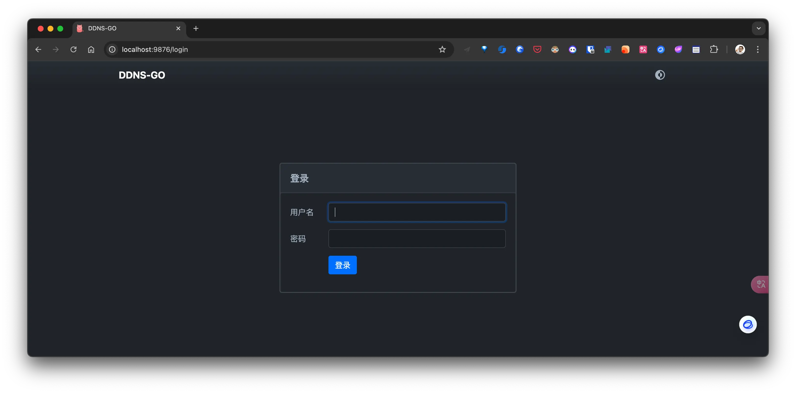

**使用场景**:

- **远程数据库访问**: 将本地的 3306 端口映射到远程服务器的 3306 端口, 这样就可以使用本地的数据库管理工具访问远程数据库.
- **Web 服务访问**: 如果你正在远程服务器上开发 Web 应用, 并且需要从本地机器访问这个应用, 可以通过本地转发将远程服务器的端口映射到本地计算机的某个端口.
- **VPN 替代方案**: 当你无法使用 VPN 时, 可以通过 SSH 本地转发来安全地访问远程网络中的资源.

##### 2. 远程转发

远程转发指的是在远程 SSH 服务器建立的转发规则.

它跟本地转发正好反过来. 建立本地计算机到远程 SSH 服务器的隧道以后, 本地转发是通过本地计算机访问远程 SSH 服务器, 而远程转发则是通过远程 SSH 服务器访问本地计算机. 它的命令格式如下.

```shell
$ ssh -R remote-port:target-host:target-port -N remotehost
```

上面命令中, `-R` 参数表示远程端口转发, `remote-port` 是远程 SSH 服务器的端口, `target-host` 和 `target-port` 是目标服务器及其端口, `remotehost `是远程 SSH 服务器.

远程转发主要针对内网的情况. 下面举两个例子.

第一个例子是内网某台服务器 `localhost` 在 80 端口开了一个服务, 可以通过远程转发将这个 80 端口, 映射到具有公网 IP 地址的 `my.public.server` 服务器的 8080 端口, 使得访问 `my.public.server:8080` 这个地址, 就可以访问到那台内网服务器的 80 端口.

```shell
$ ssh -R 8080:localhost:80 -N my.public.server
```

上面命令是在内网 `localhost` 服务器上执行, 建立从 `localhost` 到 `my.public.server` 的 SSH 隧道. 运行以后, 用户访问 `my.public.server:8080`, 就会自动映射到 `localhost:80`.

第二个例子是本地计算机 `local` 在外网, SSH 跳板机和目标服务器 `my.private.server `都在内网, 必须通过 SSH 跳板机才能访问目标服务器. 但是, 本地计算机 `local` 无法访问内网之中的 SSH 跳板机, 而 SSH 跳板机可以访问本机计算机.

由于本机无法访问内网 SSH 跳板机, 就无法从外网发起 SSH 隧道, 建立端口转发. 必须反过来, 从 SSH 跳板机发起隧道, 建立端口转发, 这时就形成了远程端口转发. 跳板机执行下面的命令, 绑定本地计算机 `local` 的 `2121` 端口, 去访问 `my.private.server:80`.

```shell
$ ssh -R 2121:my.private.server:80 -N local
```

上面命令是在 SSH 跳板机上执行的, 建立跳板机到 `local` 的隧道, 并且这条隧道的出口映射到 `my.private.server:80`.

显然, 远程转发要求本地计算机 `local` 也安装了 SSH 服务器, 这样才能接受 SSH 跳板机的远程登录.

执行上面的命令以后, 跳板机到 `local` 的隧道已经建立了. 然后, 就可以从本地计算机访问目标服务器了, 即在本机执行下面的命令.

```shell
$ curl http://localhost:2121
```

本机执行上面的命令以后, 就会输出服务器 `my.private.server` 的 80 端口返回的内容.

**示例**:

假设本地开发机(`192.168.31.8`)不能访问跳板机(`192.168.31.x`) 网络, 但是跳板机可以访问本地开发机, 且跳板机因为多网卡能够访问 `192.168.21.x` 网络,

这时本地开发机想访问 `192.168.21.10:9876` 服务.

拓扑图如下:


```shell
# 在跳板机上执行
ssh -R 1111:192.168.21.10:9876 -N dong4j@192.168.31.8
```

同时可以配置 `.ssh/config` 实现:

```shell
Host rddns
    HostName 192.168.31.8
    User dong4j
    Port 22
    # RemoteForward remote-port target-host:target-port
    RemoteForward 1111 192.168.21.10:9876
```

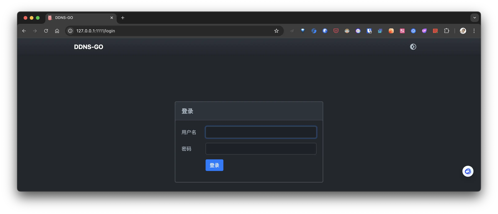

**使用场景**:

- 将还在公司加班的你本机上的 API 暴露到公网, 在家的同事就能和你愉快的调试接口了;
- 你本地的软路由具备分流能力, 你兄弟需要临时用一下查阅点学习资料;

##### 3. 动态转发

动态转发指的是, 本机与 SSH 服务器之间创建了一个加密连接, 然后本机内部针对某个端口的通信, 都通过这个加密连接转发. 它的一个使用场景就是, 访问所有外部网站, 都通过 SSH 转发.

动态转发需要把本地端口绑定到 SSH 服务器. 至于 SSH 服务器要去访问哪一个网站, 完全是动态的, 取决于原始通信, 所以叫做动态转发.

```shell
$ ssh -D local-port tunnel-host -N
```

上面命令中, `-D `表示动态转发, `local-port `是本地端口, `tunnel-host `是 SSH 服务器, `-N `表示这个 SSH 连接只进行端口转发, 不登录远程 Shell, 不能执行远程命令, 只能充当隧道.

举例来说, 如果本地端口是 `2121`, 那么动态转发的命令就是下面这样.

```shell
$ ssh -D 2121 tunnel-host -N
```

注意, 这种转发采用了 SOCKS5 协议. 访问外部网站时, 需要把 HTTP 请求转成 SOCKS5 协议, 才能把本地端口的请求转发出去.

下面是 SSH 隧道建立后的一个使用实例.

```shell
$ curl -x socks5://localhost:2121 http://www.example.com
```

上面命令中, curl 的 `-x` 参数指定代理服务器, 即通过 SOCKS5 协议的本地 `2121` 端口, 访问 `http://www.example.com`.

**示例**:

```
ssh -D 1234 intel -N
curl -x socks5://localhost:1234 https://google.hk
```

在 Mac mini 2018 上可以看到请求:

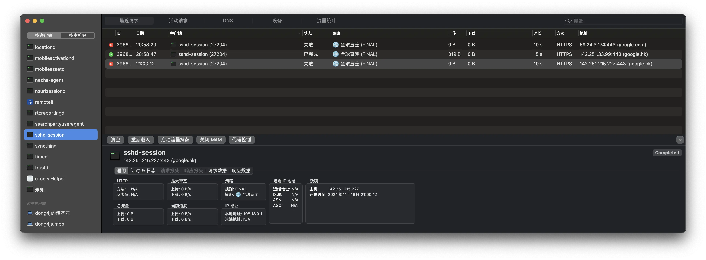

#### SSH 跳板机

```shell
# 跳板机
Host tjump
    HostName 公网 ip
    User {username}
    Port {port}

Host nas
    HostName 192.168.1.20
    User {username}
    Port {port}

# 通过跳板登录到 192.168.1.20
Host jnas
    HostName 192.168.1.20
    User {username}
    Port {port}
    ProxyJump tjump
```

使用方式:

```shell
ssh jnas
# 或者
ssh -J tjump nas
```

#### SSH 两级跳板

首先, 我们需要在本机设置第一级 SSH 隧道. 执行以下命令:

```
$ ssh -L 1999:localhost:2999 tunnel1-host
```

这条命令的作用是, 在本地机器上监听 `1999` 端口, 并将所有发往这个端口的请求, 通过 SSH 隧道转发到 `tunnel1-host` 这台机器的 `2999` 端口.
接下来, 在第一台跳板机 (`tunnel1-host`) 上, 我们需要建立第二级 SSH 隧道. 执行以下命令:

```
$ ssh -L 2999:target-host:3999 tunnel2-host -N
```

这条命令的含义是, 将 `tunnel1-host` 上的 `2999` 端口通过 SSH 隧道连接到 `tunnel2-host`, 然后再由 `tunnel2-host` 转发到目标服务器 `target-host` 的 `3999` 端口.
这样设置后, 当我们访问本机的 `1999` 端口时, 请求实际上会被转发到 `target-host` 的 `3999` 端口.



**应用场景**:
这种多级端口转发的设置常用于以下情况:

1. 访问内网服务器: 当目标服务器位于多层内网中, 直接访问受限时, 可以通过多级跳板机进行访问.
2. 安全加固: 通过多级跳板机, 增加攻击者入侵的难度, 提高系统的安全性.
3. 网络隔离: 在需要隔离不同网络环境的情况下, 通过跳板机实现数据的传输.

#### SSH 集中管理

iTerm2 通过 `Profiles` 来管理多个服务器(使用 `⌘ + O` 打开服务器列表), 但是并没有分组功能, 管理多个服务器不是特别方便.

这里有一些比较热门的终端管理工具:

- [Termius](https://termius.com/)
- [Warp](https://www.warp.dev/)
- [Tabby](https://tabby.sh/)

目前我使用的是 [Royal TSX](https://royalapps.com/ts/mac/features), 目前觉得完全满足我的大部分需求, 且部分特性还能带来一些小惊喜:

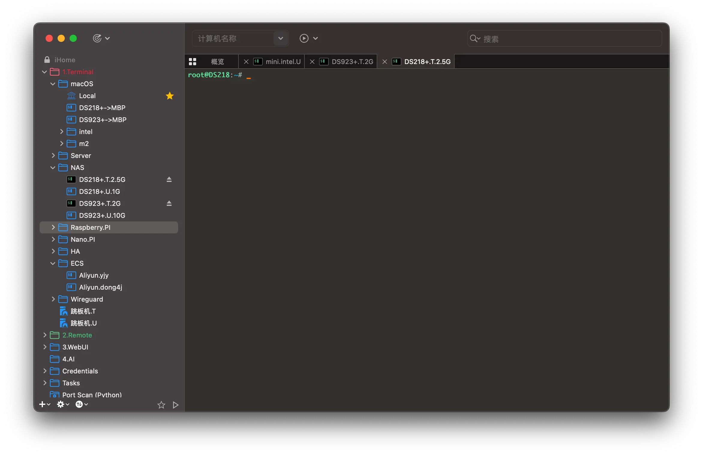

**Royal TSX** 中的 `document` 概念是将所有被管理的 SSH 服务器集中持久化成一个文件(因为这个文件会存在服务器连接信息, 所以还支持加密), 我可以将这个文件通过 Synology Drive 同步到其他 Mac 上, 这就可以实现 `一次配置, 到处使用`;

另外像端口映射, 安全网关, 密钥管理等这些常规功能全部支持. 另外比较惊喜的就是 **Royal TSX** 能通过插件机制支持 **Web**, **RDP**, **VNC** 等远程管理功能:

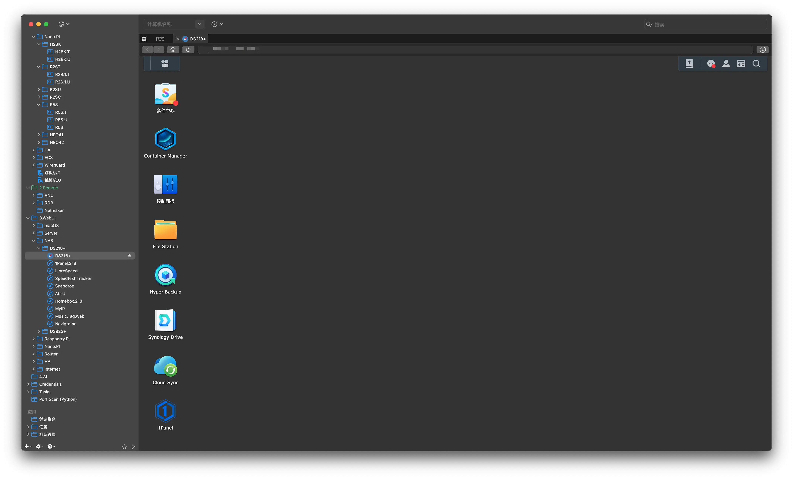

你一个比较惊喜的功能就是: `Broadcast Input to all Terminal Sessions`, 开启多个窗口, 在一台服务器上的操作会同步输出到其他服务器, 这个可以大大简化服务器的配置工作.

**简洁的 SSH 转发设置**:

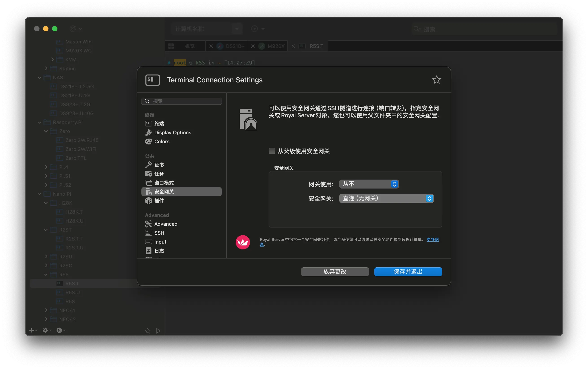

**串口连接**:

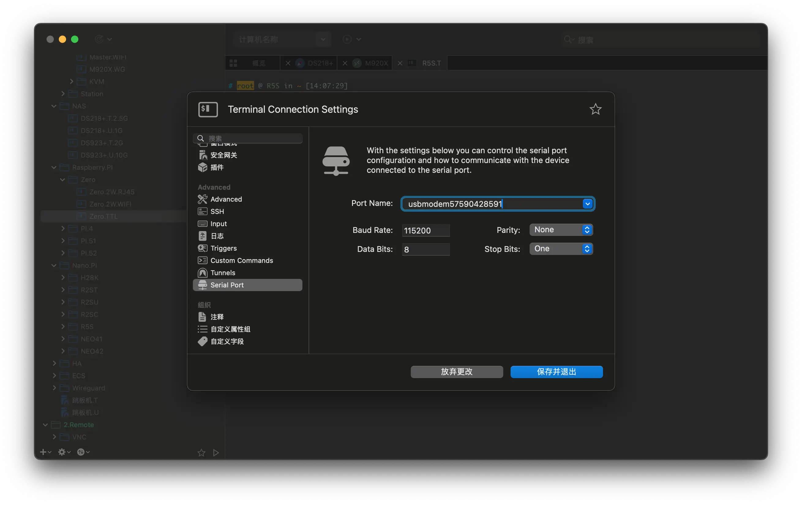

但是 **Royal TSX** 也有它的不足, 比如 **文件管理不方便**, RDP 连接分辨率无法动态适配等, 所以我使用了另一款工具: **XTerminal**, 它的优点是文件管理和系统监控, 亮点是基于 AI 的命令行提示.

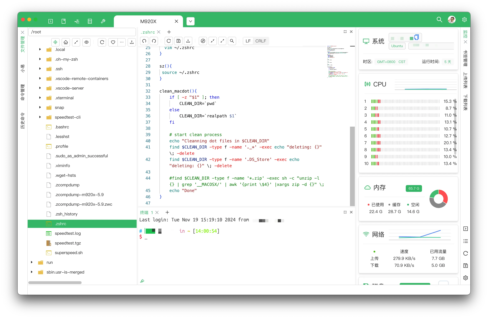

- 双击文件即可直接编辑文件
- 可拖拽上传下载文件
- 服务器监控面板

**AI 功能**:

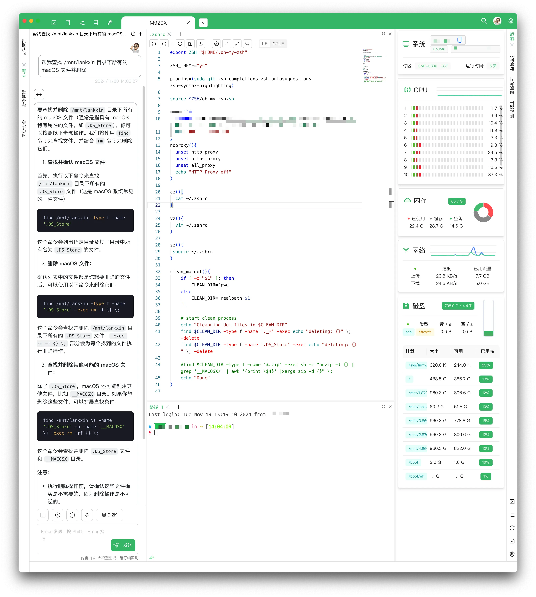

**可视化的 SSH 端口转发配置**:

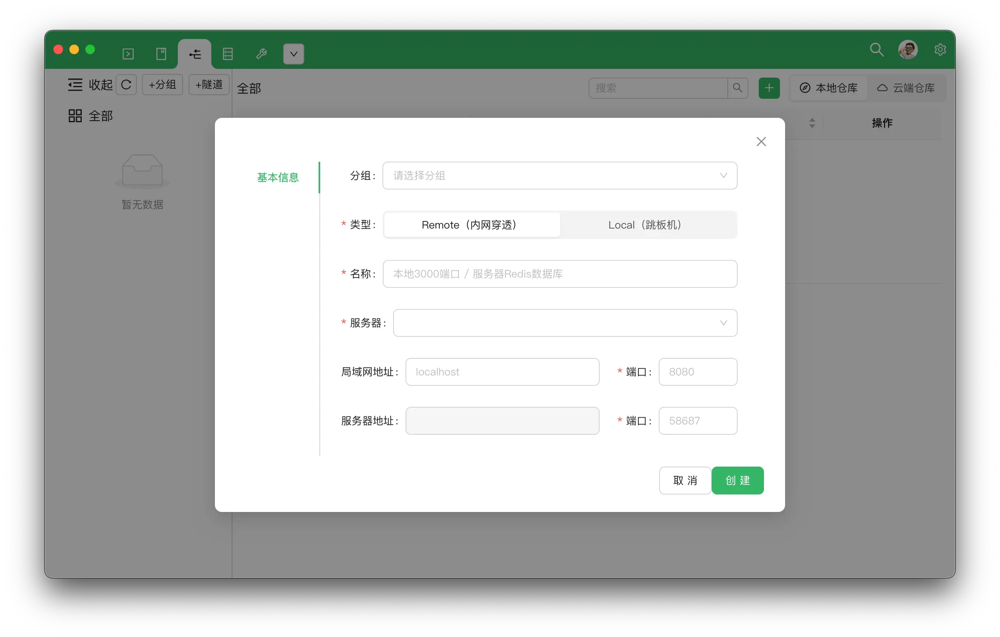

---

#### 参考

- [ssh 转发代理：ssh-agent 用法详解](https://www.cnblogs.com/f-ck-need-u/p/10484531.html): 避免重复输入 passphrase
- [SSH agent forwarding 的應用](https://ihower.tw/blog/archives/7837): 在远程主机上使用本地的 ssh-agent 进行认证，比如在远程主机上进行 `git` 操作、`ssh` 到另一台主机等，避免将私钥 copy 到远程主机上。
- [How to Set Up SSH 2fa (Two-Factor Authentication)](https://blog.longwin.com.tw/2014/10/ssh-google-2-factor-authentication-2014/): 在 openssh server 上配置强制进行 2FA 双因素认证，每次登录都需要输入 Google Authenticator APP 提供的一次性动态密码。

### RDP

上述 2 款工具都不能很好的支持完美的 RDP 远程桌面, 所有我使用了 [Microsoft Remote Desktop](https://apps.apple.com/us/app/windows-app/id1295203466?mt=12),

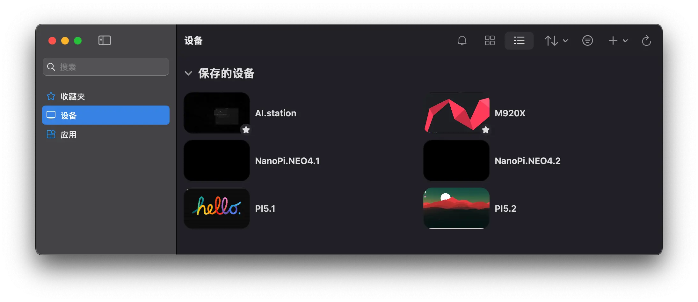



**ubuntu**上安装 **xrdp** 搭建远程桌面, 后面远程桌面是可以了, 但是用户目录下生出了一个 thinclient_drives 文件夹, **无论是不是 root 都不能删除**, 如果你有强迫症, 你就感觉不舒服, 一定要删除, 下面介绍如何删除:

打开并修改 /etc/xrdp/sesman.ini 文件

```shell
sudo vim /etc/xrdp/sesman.ini

# 将 FuseMountName=thinclient_drives 修改为 FuseMountName=.xrdp/thinclient_drives
```

由于 ~/.xrdp 目录不存在, 所以不会创建 **thinclient_drives** 文件夹.

也可以将 **thinclient_drives** 放到 /run 目录下:

```shell
FuseMountName=/run/user/%u/thinclient_drives
```

然后删除 **thinclient_drives** 文件夹

```shell
sudo umount thinclient_drives
sudo rm -rf thinclient_drives
```

以后重新登陆也不会再出现 **thinclient_drives**, 并且远程连接共享剪贴板仍然有效.



### VNC

如果只是连接 macOS 的话, 官方的 **屏幕共享.app** 更值得推荐.

因为 **屏幕共享.app** 无法连接到树莓派, 所以使用 **RDP** 或 **VNC Viewer**.

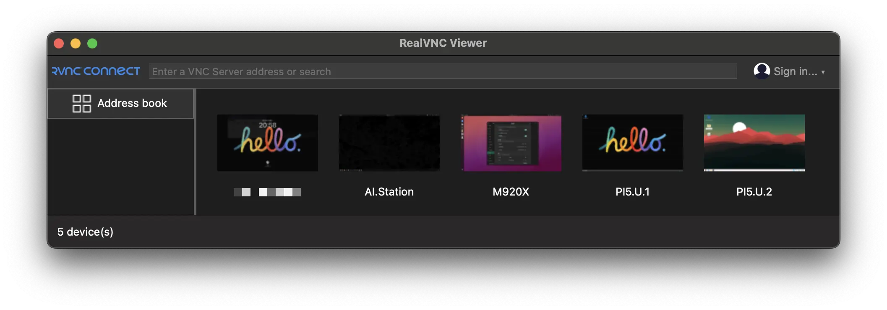



**问题描述**:

- VNC 服务器在启动时如果密钥环未解锁, 将无法访问存储的加密 VNC 密码.
- 结果是, **每次 VNC 服务器启动时**, 都会自动生成一个新的密码.

**问题原因**:

- Ubuntu 22.04 在自动启动期间不会自动解锁密钥环, 这影响了 VNC 服务器的正常使用.

**解决方案**:

1. 打开“密码和密钥”实用工具:
   - 转到**实用工具**菜单, 选择**密码和密钥**.
2. 修改默认密钥环的密码:
   - 在**密码和密钥**管理器中, 右键单击**默认密钥环**.
   - 选择**更改密码**.
3. 输入并确认操作:
   - 系统将要求您输入当前的用户名密码.
   - 在**新密码**和**确认密码**字段中, 不要输入任何内容, 保持空白.
4. 接受风险警告:
   - 系统会警告您, 密钥环上存储的所有密码将不再加密, 并将保持未加密状态.
   - 如果您能够接受这个安全风险, 确认更改.

通过以上步骤, 可以解决 Ubuntu 22.04 中 VNC 服务器在自动启动时无法访问加密密码的问题. 但是这样做会降低密码的安全性, 因此可以采用下面推荐的方式.

**推荐的方式**:

在**密码和密钥**应用程序中执行以下操作:

1. **创建一个新的无密码密钥环**:
   - 打开**密码和密钥**应用程序.
   - 创建一个新的密钥环, 并在创建过程中不设置密码.
   - 将这个新的无密码密钥环设置为默认.
2. **从登录密钥环中删除 VNC 密码**:
   - 在**密码和密钥**应用程序中, 找到登录密钥环.
   - 删除存储在登录密钥环中的 VNC 密码.
3. **重新启动计算机**:
   - 重启计算机以确保新的无密码密钥环成为默认密钥环.

重启后, 执行以下步骤:

1. **重新输入 VNC 密码**:
   - 在屏幕共享设置中重新输入 VNC 密码.
   - 这将把 VNC 密码存储在新的不安全密钥环中.
2. **恢复登录密钥环为默认**:
   - 回到**密码和密钥**应用程序.
   - 将登录密钥环重新设置为默认密钥环.
3. **再次重新启动计算机**:

现在 VNC 密码保持保存, 而默认密钥环也恢复为登录密钥环.

这种方法将所有密码保存为纯文本的不安全性降低到仅将 VNC 密码保存为纯文本.



---

## 暴露服务到公网

### 关于 IPv4

截至 2024 年, IPv4 地址已经全球接近耗尽. 自 2011 年正式宣布 IPv4 地址枯竭以来, IPv4 地址池的可用数量持续减少, 导致剩余的地址在二级市场上的价格不断上涨 .

IPv4 使用 32 位地址空间, 可以提供超过 40 亿个唯一地址. 然而, 随着互联网连接设备数量的激增, 这一地址池已经被耗尽. 北美、亚洲和欧洲是剩余 IPv4 地址的主要持有地区, 其他地区的 IPv4 地址资源相对匮乏 .

由于 IPv4 地址短缺, 许多组织和网络运营商开始依赖 NAT (网络地址转换) 技术, 允许多个设备共享一个公共 IP 地址. 此外, IPv6 的推广也成为解决 IPv4 地址耗尽问题的重要手段, 但由于兼容性问题以及过渡成本较高, IPv6 的部署进展较慢 .

目前, IPv4 地址的租赁和转售成为一种常见的做法, 尤其是在面临 IPv4 地址匮乏的企业中. 尽管如此, 这种做法仅是临时性的解决方案, 而 IPv6 的普及正在变得愈加迫切 .

### 为什么使用 DDNS

我早期申请的电信和联通的公网 IP 都是动态的, 会被运营商不定期的修改, 为了避免因公网 IP 变更无法访问家中的服务的问题, 现在最常用的方案就是使用 DDNS 服务.

### 什么是 DDNS

动态 DNS (DDNS) 是一项在 IP 地址发生变化时可以自动更新 DNS 记录的服务. 域名将网络 IP 地址转换为人类可读的名称, 便于识别和使用. 将名称映射到 IP 地址的信息以表格形式记录在 DNS 服务器上. 但是, 网络管理员会动态分配 IP 地址并经常更改. 每当 IP 地址发生变化时, DDNS 服务都会更新 DNS 服务器记录. 借助 DDNS, 域名管理变得更容易、更高效.

### 动态 DNS 是如何工作的

以下是一般步骤:

1. 向动态 DNS 服务提供商注册域名并配置 DNS 设置
2. 向提供商提供域名的初始 IP 地址
3. 使用更改的 IP 地址在设备或服务器实例上安装动态 DNS 客户端

DDNS 客户端持续监控 IP 地址并检测任何更改. 客户端向动态 DNS 提供商发送 DNS 记录更新通知, 通知其新的 IP 地址. 动态 DNS 提供商修改记录以指向新 IP 地址.

动态 DNS 客户端会继续监控 IP 地址以了解进一步的更改. 每当发生新的更改时, 该过程都会重复.

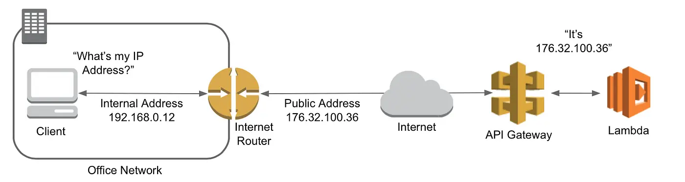

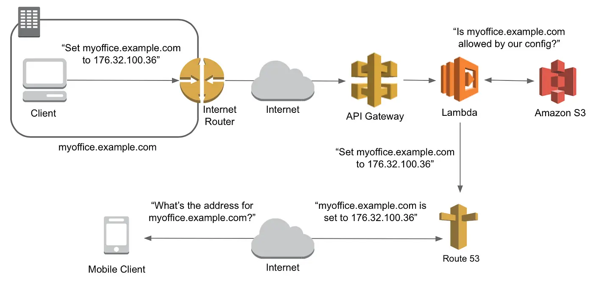

简单来说, 宽带运营商只会给我们动态的公网 IP, 这个 IP 会不定时变化, 为了能使域名映射到正确的 IP 上, 需要借助 DDNS 将当前最新的 IP 通过 API 通知到 DNS 服务运营商以修改为最新的 IP.

我所使用的域名服务商分别是阿里云和腾讯云, 为了正常使用 DDNS 服务, 需要到对应的域名运营商申请 API key, 后面使用 ddns-go 会用到.

### DDNS 服务配置

我目前的设备自带了 DDNS 服务的有:

- Synology NAS: `外部访问-DDNS`
- R2S 这类 OpenWrt 系统: `服务-阿里云 DDNS` 和 `服务-动态 DNS`

但是我并没有直接使用上述的服务, 而是选择使用 docker-compose 部署 [ddns-go](https://github.com/jeessy2/ddns-go), 这样可以方便的同步配置以便快速在其他设备上部署.

#### dons-go 遇到的坑

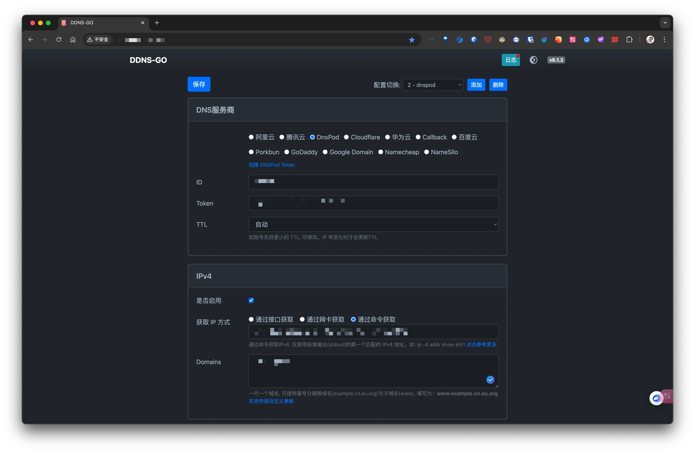

1. TTL 设置错误导致 API 调用失败

   DNS 运营商的 TTL 一般都是 600 秒, 再快就得加钱了, ddns-go 最好设置为自动, 避免 API 调用失败.

2. 通过接口获取 IPv4 太频繁被限流

   ddns-go 自带了几个用于获取 IPv4 的 API 服务, 但是因为 ddns-go 频繁调用被 API 接口服务商限流;

3. 通过接口获取的 IPv4 错误

   这是因为部署 ddns-go 的设备同时部署了分流服务, 需要修改分流规则, 我采用第二种方式: 不使用接口获取;

4. 通过网卡获取

   这种方式只能获取到局域网 IP, 适用于 IPv6;

5. 通过命令获取

   最终采用这种方式, 且返回 IPv4 地址的服务通过 Nginx 在云服务器自建了一个, 获取 IPv4 的命令如下:

   ```shell
   curl --interface 网卡名 url
   ```

   这种方式需要处理多网卡的情况, 因此需要 `--interface` 参数.

6. 通过网卡获取 IPv6

   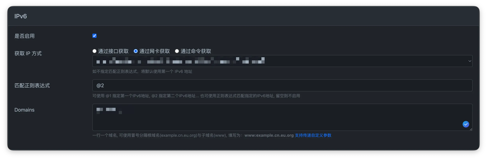

   IPv6 一般会有多个地址, 需要通过正则表达式筛选

   > 电信为 240e 开头 (240e::/20)
   >
   > 移动为 2409 开头 (2409:8000::/20)
   >
   > 联通为 2408 开头 (2408:8000::/20)

7. ddns-go 启动前 10 分钟(具体几分钟记不得了, 反正越快越好)才能设置账号密码

   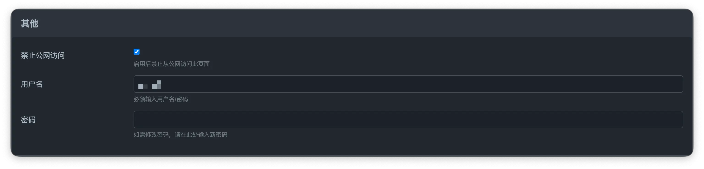

最好禁用公网访问, 这样只能通过局域网 IP 访问.

8. ddns-go 可以配置 IP 变更通知, 我使用的是 [bark](https://bark.day.app/#/) 服务, 全平台可用, 且服务也能自托管:

   

#### 自建获取公网 IP 服务

我的目的很简单, 就是专为 ddns-go 提供的 IP 查询服务, 因此没有加 HTTPS 证书, 云服务器安装 Nginx 并添加配置, 关键的配置如下(记得在安全组开端口):

```
server {
    listen 端口号;
    listen [::]:端口号 ipv6only=on;
    server_name localhost;
    server_tokens off;

    location = /ip {
        add_header Content-Type text/plain;
        access_log off;
        return 200 "$remote_addr\n";
    }
}
```

访问 `http://ip:port/ip` 即可返回文本格式的公网 IP.

如果想自行部署, 可参考 [利用 Nginx 实现简易的公网 IP 查询](https://cloud.tencent.com/developer/article/2286395).

#### 获取正确的 IPv4

因为我有 2 个公网 IP, 域名分别对应不同的 DNS 服务商:

| 宽带运营商 | 域名服务商 | 域名(假设)  | 路由器 IP    |
| ---------- | ---------- | ----------- | ------------ |
| 电信       | 阿里云     | dong4j.tele | 192.168.31.1 |
| 联通       | 腾讯云     | dong4j.unic | 192.168.21.1 |

#### 对于单网卡

比如当前设备是 `192.168.31.1` 这台路由器下的子设备, 按照上述表格, 应该获取到电信的公网 IP 并通知到阿里云的 DNS 已将 dong4j.tele 映射到正确的 IP 上.

#### 对于多网卡

为避免单点问题, 我同时在 M920x, DS218+和 DS923+ 上部署了 ddns-go 服务, 它们同时具备多张网卡.

运行 `route -n` 显示的路由表如下:

| 目标    | 网关         | 子网掩码 | 标志 | 跃点 | 引用 | 使用 | 接口            |
| ------- | ------------ | -------- | ---- | ---- | ---- | ---- | --------------- |
| 0.0.0.0 | 192.168.21.1 | 0.0.0.0  | UG   | 100  | 0    | 0    | enx00e04c680012 |
| 0.0.0.0 | 192.168.31.1 | 0.0.0.0  | UG   | 103  | 0    | 0    | eno1            |

**表头字段解析**

- **目标 (Destination)**: 指向的目标网络或主机地址. `0.0.0.0` 表示默认路由, 适用于所有未匹配其他路由的流量.
- **网关 (Gateway)**: 数据流量需要通过的下一跳 IP. 如果为 `0.0.0.0`, 表示目标为直连网络, 第一行是 `192.168.21.1`, 表示经过联通路由器.
- **子网掩码 (Genmask)**: 定义目标网络的范围.
- **标志 (Flags)**:
  - `U`: 路由是活动的.
  - `G`: 流量需要通过网关.
- **跃点 (Metric)**: 优先级, 数值越小优先级越高 (**后面修改网卡优先级也就是修改这个值**).
- **引用 (Ref)**: 保留字段, 通常为 `0`.
- **使用 (Use)**: 该路由表条目被命中的次数.
- **接口 (Iface)**: 数据流量通过的网络接口.

**路由表内容分析**

**第一行**

| 目标    | 网关         | 子网掩码 | 标志 | 跃点 | 引用 |
| ------- | ------------ | -------- | ---- | ---- | ---- |
| 0.0.0.0 | 192.168.21.1 | 0.0.0.0  | UG   | 100  | 0    |

- **默认路由**: 匹配所有流量.
- **网关**: `192.168.21.1`.
- **接口**: `enx00e04c680012`.
- **跃点**: `100`, 优先级高于第二行.

**第二行**

| 目标    | 网关         | 子网掩码 | 标志 | 跃点 | 引用 |
| ------- | ------------ | -------- | ---- | ---- | ---- |
| 0.0.0.0 | 192.168.31.1 | 0.0.0.0  | UG   | 103  | 0    |

- **默认路由**: 同样匹配所有流量.
- **网关**: `192.168.31.1`.
- **接口**: `eno1`.
- **跃点**: `103`, 优先级低于第一行.

**总结**

1. **多默认路由**: 两条默认路由同时存在, 系统会优先使用跃点较低的路由 (即 `192.168.21.1`) .
2. **故障转移**: 如果优先路由 (`192.168.21.1`) 不可用, 系统会自动尝试使用优先级较低的路由 (`192.168.31.1`) .

第一行跃点为 `100`, 且网关为 `192.168.21.1`, 表示 M920x 会优先使用 `enx00e04c680012` 这张网卡走联通网络.

同理我们整理一张表格:

| 服务器 | 第一优先级                     | 第二优先级      |
| ------ | ------------------------------ | --------------- |
| M920x  | **enx00e04c680012** (**联通**) | eno1 (电信)     |
| DS218+ | **ovs_eth1**(**电信**)         | ovs_eth0(联通)  |
| DS923+ | **ovs_eth2**(**联通**)         | ovs_bond0(电信) |

为了保证 ddns-go 获取正确的 IPv4 地址, 应该这样配置:

| ddns-go 所在的服务器 | 电信公网 IP (Domains: `*.dong4j.tele`)         | 联通公网 IP (Domains: `*.dong4j.unic`)               |
| -------------------- | ---------------------------------------------- | ---------------------------------------------------- |
| M920x                | `curl --interface eno1 http://ip:port/ip`      | `curl --interface enx00e04c680012 http://ip:port/ip` |
| DS218+               | `curl --interface ovs_eth1 http://ip:port/ip`  | `curl --interface ovs_eth0 http://ip:port/ip`        |
| DS923+               | `curl --interface ovs_bond0 http://ip:port/ip` | `curl --interface ovs_eth2 http://ip:port/ip`        |

- `http://ip:port/ip` 是前面说的自建的获取公网 IP 的服务;
- 一定要注意第一优先级的网卡对应的是哪个路由器以及路由器对应的宽带服务商;

### 泛解析

前面通过使用 **DDNS (动态域名解析服务) **, 我们将动态公网 IP 与一个泛域名 (例如 `*.dong4j.tele`) 绑定. 这样一来:

1. **所有三级域名共享同一 IP 地址**:

   - 泛域名的配置意味着 `nas.dong4j.tele`、`blog.dong4j.tele`、`api.dong4j.tele` 等三级域名都会指向同一个动态公网 IP.
   - 无需为每个子服务单独创建域名解析记录.

2. **减少管理工作**:

   - 当公网 IP 变化时, DDNS 会自动更新与该 IP 关联的域名解析.
   - 无需手动更新每个子域名的记录, 提高了效率和维护便利性.

3. **便于扩展和服务管理**:
   - 不同的三级域名可以被路由到不同的内部服务或设备 (如 Web、FTP、SSH 等) .
   - 实现灵活的服务部署, 而不增加域名管理的复杂性.

#### 示例

假设公网 IP 动态变化且通过 DDNS 绑定到了泛域名 `*.dong4j.tele`, 以下请求都能被正确路由:

- `nas.dong4j.tele` → DS218+ WebUI
- `blog.dong4j.tele` → 博客
- `api.dong4j.tele` → 接口服务

通过这种配置, 大大简化了域名管理流程, 同时适配动态 IP 环境.

### 端口映射

前面我们已经将公网 IP 成功绑定到了指定域名上, 比如我需要访问 DS218+ 的 WebUI, 只需要在路由器上开放指定的端口并映射到正确的 IP 上:

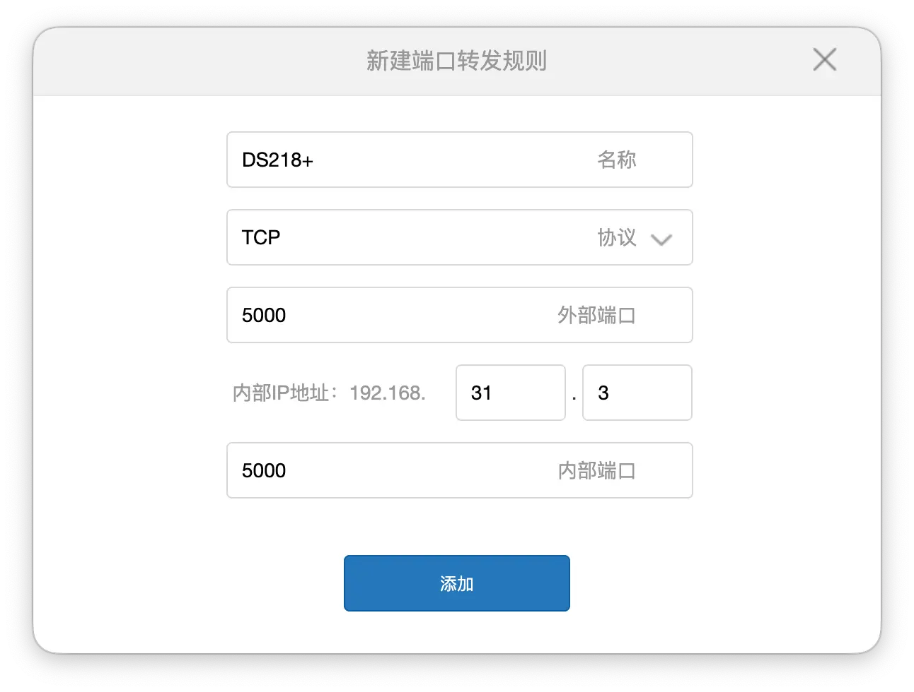

**最好修改外部端口号, 不要与内部端口号一样**

这样我们就可以通过 `http://nas.dong4j.tele:5000` 访问内部的 `http://192.168.31.3:5000`.

然而随着需要暴露的服务越来越多, 通过路由器进行端口转发管理会变得繁琐, 尤其是每个服务需要独占一个端口. 例如:

- 服务 A → 8081 端口
- 服务 B → 8082 端口
- 服务 C → 8083 端口

这种方式不仅难以记忆, 还会造成端口冲突, 并且极度浪费端口资源.

如果熟悉 Nginx 反向代理的话, 除了通过端口区分服务, 还能通过域名区分:

- `nas.dong4j.tele:5000` → 服务 A
- `blog.dong4j.tele:5000` → 服务 B
- `api.dong4j.tele:5000` → 服务 C

这样我们只需要一个端口即可代理多个服务.

以下是一个简单的 Nginx 配置, 用于将不同的域名路由到不同的内部服务:

```nginx
server {
  listen 5000;
  server_name nas.dong4j.tele;
  location / {
		proxy_pass http://192.168.31.3:5000; # 映射到服务 A
  }
}
server {
  listen 5000;
  server_name blog.dong4j.tele;
  location / {
		proxy_pass http://192.168.31.4:8080; # 映射到服务 B
  }
}
server {
  listen 5000;
  server_name api.dong4j.tele;
  location / {
		proxy_pass http://192.168.31.5:1234; # 映射到服务 C
  }
}
```

### Nginx Proxy Manager

虽然 Nginx 的配置文件设计得非常简洁, 并支持热加载 (通过 `nginx -s reload`) , 无需完全重启服务, 但是在命令行下操作确实有点不方便.

可视化操作 Nginx 配置目前成熟的方案非常多, 比如:

- [nginx-proxy-manager]()
- [nginxWebU](https://www.nginxwebui.cn/)
- [NGINX Config](https://do.co/nginxconfig)
- [Nginx Proxy Manager](https://nginxproxymanager.com/)
- 1Panel 中的 OpenResty
- 宝塔面板中的 Nginx

这类服务选择一个顺手的就行, 目前我使用的是 [Nginx Proxy Manager](https://nginxproxymanager.com/):

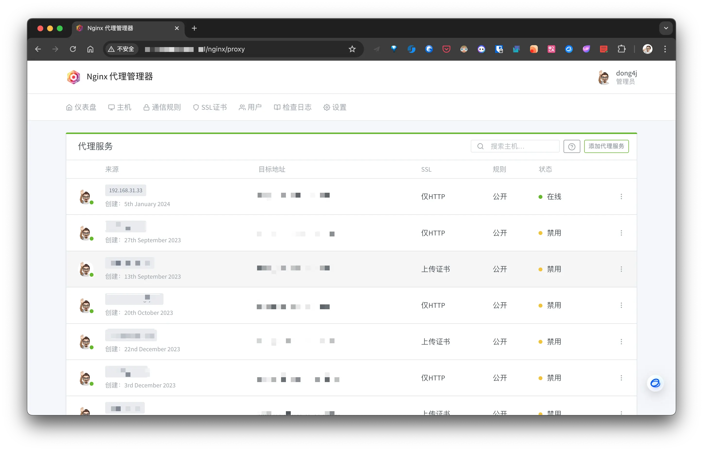

**为了安全起见, 已将所有服务迁移到 雷池 Safeline**.

#### 反向代理


反向代理配置非常简单, 只需要配置:

- 域名
- 协议: 内网一般选择 http, 外部访问如果需要 HTTPS, 则需要在 SSL 选项卡中配置 HTTPS 证书, 这个后面详细介绍;
- 转发主机: 内部服务所在的服务器 IP
- 转发端口: 服务端口

我们以外网通过 HTTP 访问 NAS (`192.168.31.3`) 为例, 假设 Nginx Proxy Manager (后面简称 `NPM` )监听的 HTTP 端口为 `6080`, IP 为 `192.168.31.10` , 那么配置步骤如下:

- 在路由器上配置端口转发: `1020` 端口指向 `192.168.168.31.10` 的 6080 端口;

- 在 `NPM` 添加代理服务配置:

  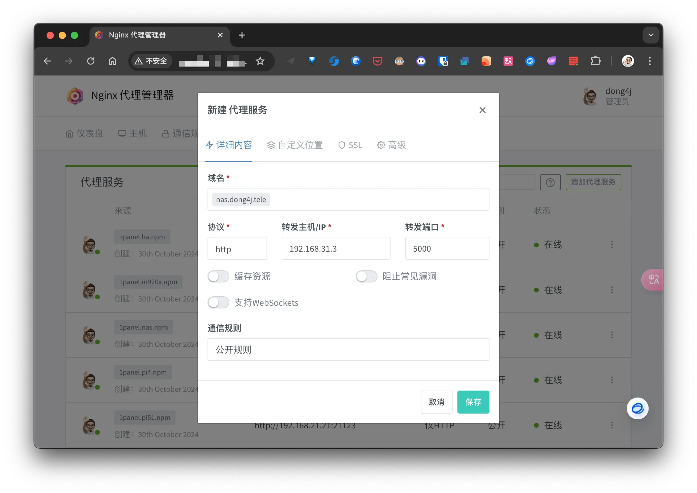

访问 `nas.dong4j.tele:1020` 即可访问 NAS 的 WebUI 服务.


整体的流程为:

1. ddns-go 通过定时调用 API 将获取到的最新公网 IP 推送给域名服务商;
2. 在路由器将特定端口绑定到 NPM 的 HTTP 端口, 比如 1020 -> 6080;
3. 在 NPM 进行代理服务配置, 将域名映射到指定服务;

这样我们就能通过 **某个固定的端口结合不同的域名访问不同的服务**, NPM 也提供 [REST API](https://github.com/NginxProxyManager/nginx-proxy-manager/blob/develop/backend/schema/swagger.json), 你可以玩一些比较花的操作, 比如通过脚本随时关闭/开启某个代理服务.

#### HTTPS 证书申请

NPM 还提供 `Let's Encrypt` 证书申请服务, 可申请 3 个月的免费证书并能够自动续期.

需要验证你对证书中域名的控制权, 也就是说你要能证明, 这个域名是属于你的. 有两种验证方式: 一种是基于 `HTTP` 的验证方式, 另一种是基于 `DNS` 的验证方式.

关于这方面的教程非常多, 所以这里就不在赘述了, 只说说我遇到的问题:

1. `ModuleNotFoundError: No module named 'zope' #2440`

   [这里是 Issues](https://github.com/NginxProxyManager/nginx-proxy-manager/issues/2440)

   解决方法:

   ```shell
   # 进入 docker 容器
   docker exec -it /bin/bash xxxx
   pip install certbot-dns-dnspod
   pip install zope -i https://pypi.tuna.tsinghua.edu.cn/simple
   ```

2. `Another instance of Certbot is already running`

   ```shell
   find / -type f -name '.certbot.lock' -exec rm {} \;
   ```

在使用的过程中, 第一次申请证书会消耗大量时间, 出现多次申请失败的情况, 且自动续期经常会失败, 再尝试了通过 `1Panel` 的证书管理功能后, 果断弃用了 NPM 的 HTTPS 证书管理功能, 这个在 [网络安全-HTTPS 证书](#HTTPS 证书) 一节中详细说明.

**值得注意的是, 如果启用了 HTTPS, 在路由器的端口转发配置时, 需要将外部端口映射到 NPM 的 HTTPS 端口.**

#### 开启 HTTPS 访问

HTTPS 证书申请后给域名添加 HTTPS, 需要注意你的 NPM 的 HTTPS 端口号, 比如是 `30443`, 那么在路由器配置端口转发时就要使用此端口号.


#### 自定义位置

自定义位置是在特殊场景下提供的一种定制化配置, 比如我的 `bark` 服务, 它的完整路径是这样的:

```
http://192.168.31.20:8088/iphone-uuid/
http://192.168.31.20:8088/mbp-uuid/
# xxx-uuid 通常为 22 位随机字符串
```

这个 URL 会作为 Webhook 在多个地方使用, 且会有多个客户端的 uuid, 比如上面的 `iphone-uuid` 就是将消息通知到手机, 而 `mbp-uuid` 则是通知到 MBP, 为了方便记忆, 且在 `bark` 重置 uuid 后不需要重新修改设备上的 Webhook 地址, 可以这样设置:

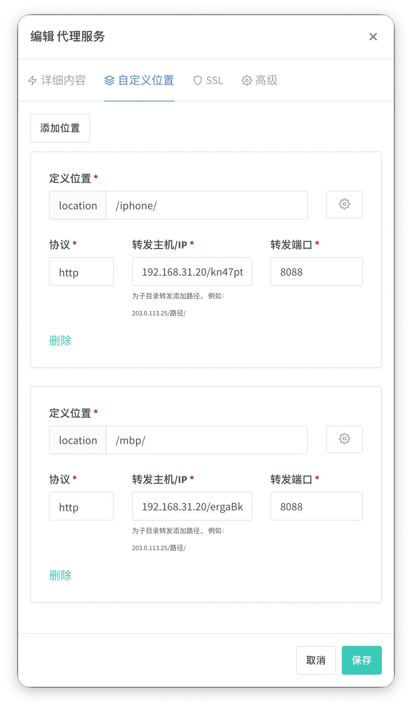

Webhook 地址则变更为:

```
http://bark.dong4j.tele:1020/iphone/
http://bark.dong4j.tele:1020/mbp/
```

[这里有一个通过 NPM 搭建获取公网 IP 服务的说明](obtain_public_ip_address_using_nginx.md)

#### 高级配置

如果 WebUI 上无法通过可视化配置满足你的需求, 你可以进入 NPM 挂载的目录直接修改配置:

可以按照如下方式添加自定义配置片段文件`/data/nginx/custom`:

- `/data/nginx/custom/root_top.conf`: 包含在 nginx.conf 的顶部
- `/data/nginx/custom/root.conf`: 包含在 nginx.conf 的最末尾
- `/data/nginx/custom/http_top.conf`: 包含在主 http 块的顶部
- `/data/nginx/custom/http.conf`: 包含在主 http 块的末尾
- `/data/nginx/custom/events.conf`: 包含在事件块的末尾
- `/data/nginx/custom/stream.conf`: 包含在主流块的末尾
- `/data/nginx/custom/server_proxy.conf`: 包含在每个代理服务器块的末尾
- `/data/nginx/custom/server_redirect.conf`: 包含在每个重定向服务器块的末尾
- `/data/nginx/custom/server_stream.conf`: 包含在每个流服务器块的末尾
- `/data/nginx/custom/server_stream_tcp.conf`: 包含在每个 TCP 流服务器块的末尾
- `/data/nginx/custom/server_stream_udp.conf`: 包含在每个 UDP 流服务器块的末尾

更多的配置说明可自行查看 [NPM 官方文档](https://nginxproxymanager.com/advanced-config/)

#### 代理局域网自定义域名

##### Surge + NPM

后面会讲到 [使用 雷池 Safeline 代替 NPM](#用 WAF 替换 NPM), 所有代理服务都会迁移过去, 所以 NPM 就沦为了局域网自定义域名的代理工具, 接下来 **设备域名映射一节** 中关于如何使用 [NPM + Surge 来简化域名访问的详细配置](#通过自定义域名减少需要记忆的 IP 数量).

流程大致如下:


1. Surge 配置自定义域名:

   ```txt
   # 所有的 *.npm 全部解析成 192.168.31.10
   *.npm = 192.168.31.10
   ```

2. 配置 NPM:

   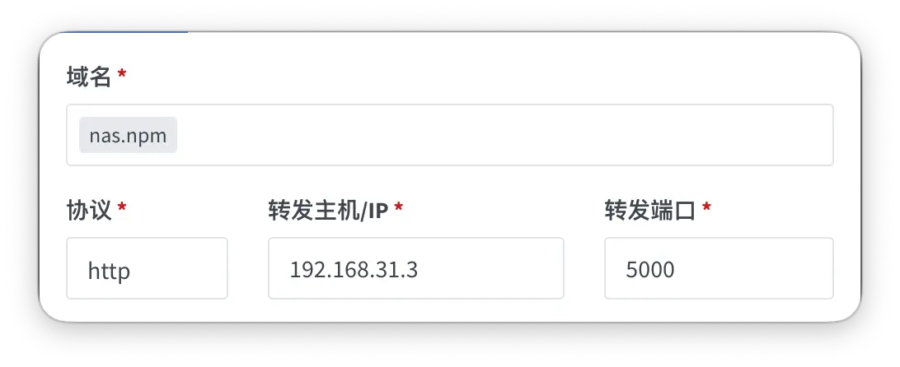

意思是来自 `nas.npm` 的请求会被代理到 `http://192.168.31.3:5000` 上, 即 DS218+ 的 WebUI 服务.

**总结下来**:

1. Surge 将 `*.npm` 全部解析成 `192.168.31.10`;
2. 当请求 `xx.npm` 时被发送到 NPM 的 `80` 端口;
3. NPM 根据 **域名** 判断应该代理请求到哪个服务;

为了简化, 我们使用 NPM 的 `80` 端口, 所以需要注意的 NPM 的端口配置:

```yml
services:
  app:
    image: 'chishin/nginx-proxy-manager-zh:latest'
    ports:
      - '80:80'				# HTTP 代理端口
      - '12443:443' 	# HTTPS 代理端口
      - '1281:81' 		# WebUI 管理端口
		...
```

接下来就是在 NPM 上重复添加代理配置了:

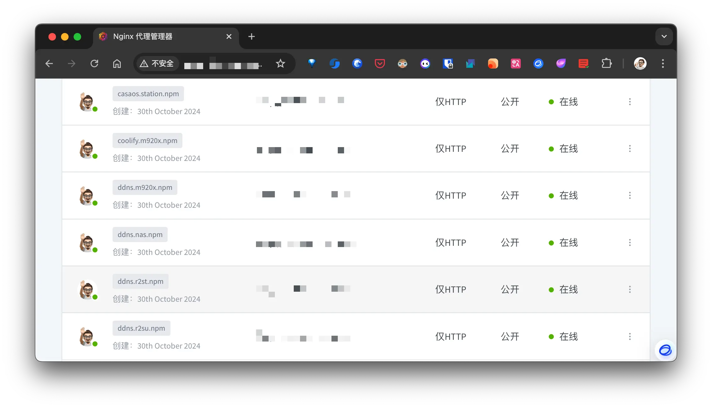

**我的自定义域名规则**:

- `.npm` 作为顶级域名;
- `{服务器}.npm` 作为二级域名, 比如: `nas.npm`;
- `{服务名}.{服务器}.npm` 作为三级域名, 比如: `ddns.nas.npm`

**值得注意的是, 因为 .npm 不是有效的 TLD**, 因此在 Chrome 第一次使用的时候, 需要输入完整的 URL: `http://nas.npm`, 否则会被当成搜索请求, 成功打开一次后即可, 后面就不需要完整输入 URL 了.

当然你也可以将 `.npm` 改成其他的比如: `.local`.

**补充说明**:

因为 **NPM** 只能代理 **HTTP** 协议, 如果 **TCP/UDP** 协议也想使用域名, 你可以在 Surge 添加一条配置, 比如 DS218+ 的 IP 是 `192.168.31.3`, 我想使用 `ssh.nas.npm` 连接 SSH:

```
ssh.nas.npm = 192.168.31.3
*.npm = 192.168.31.10
```

使用方式:

```shell
ssh root@ssh.nas.npm
```

##### Surge + SmartDNS + NPM

其实还可以结合 SmartDNS 来达成同样的目的, 但是这种方式比 **Surge + NPM** 多了一层, 这是没有采用的 **原因之一**.

**Surge** 只是用来获取指定域名的 DNS 地址, **SmartDNS** 用于 DNS 解析, NPM 的作用不变.

**具体配置为**:

1. Surge Hosts 配置修改为:

   ```shell
   *.npm = server:192.168.31.10
   ```

表示 `*.npm` 域名使用部署在 `192.168.31.10` 上的 **SmartDNS** 提供的 DNS 服务来获取解析.

2. **SmartDNS** 配置如下(官方文档说是支持 `*.npm` 这种通配符解析的, 但是本地测试并没有成功, 这是没有使用的 **原因之二** ):

   ```shell
   address /nas.npm/192.168.31.10
   address /tnas.npm/192.168.31.10
   ....
   # 其他域名配置, 同样是指向 192.168.31.10
   ```

**SmartDNS** 的意义在于作为一个 DNS 服务为局域网设备提供解析服务, 问题是需要在多台服务器上进行 DNS 地址配置, 我的目的只是在主要设备上实现域名访问, Surge 显然更适合, 所以这也是没有使用的 **原因之三**.

### IPv6

#### 中国的 IPv6 发展情况

截至 2024 年, 中国在 IPv6 的发展方面取得了显著进展. 以下是根据《中国 IPv6 发展状况白皮书 (2024) 》和相关报道总结的几个关键点:

1. **IPv6 用户数量**: 截至 2024 年 5 月, 中国的 IPv6 活跃用户数达到 7.94 亿, 占全体网民总数的 72.7%. 这个比例从 2017 年初的 0.51% 显著提高. 已分配 IPv6 地址的终端数达到 17.65 亿, 其中移动网络终端为 13.50 亿, 固定宽带接入网络终端为 4.15 亿.
2. **发展阶段**: 中国 IPv6 的发展经历了起步期 (2017 年至 2018 年中) 、爬升期 (2018 年中至 2023 年一季度) 和稳定期 (2023 年一季度至今) 三个阶段.
3. **网络流量**: 移动网络 IPv6 流量占比达到 64.56%, 固定网络 IPv6 流量占比为 21.21%. 城域网 IPv6 总流量占全网总流量的 21.21%.
4. **网络性能**: IPv6 网络性能得到显著提升, 其时延降低, 丢包率减少, 显示出在网络性能和稳定性方面的潜力.
5. **基础资源**: 中国在 IPv6 地址申请量和拥有量方面均位居世界第二, IPv6 AS (自治系统) 数量占比达到 70.43%.
6. **政策支持**: 中国政府高度重视 IPv6 的部署和应用, 自 2017 年《推进互联网协议第六版 (IPv6) 规模部署行动计划》发布以来, 已出台多项政策, 明确 IPv6 发展目标和时间表.

#### 全球 IPv6 发展情况

全球范围内, IPv6 的部署和应用也在加速推进. 以下是根据《2024 全球 IPv6 发展指数报告》总结的几个关键点:

1. **全球覆盖率**: 2023 年, 全球 IPv6 网络部署显著提速, 总体覆盖率首次突破 30%. 部分领先国家的 IPv6 覆盖率已经达到或接近 70%, 其 IPv6 移动流量占比也已超过 IPv4.
2. **技术发展**: 随着 IPv6 网络的基本建成, 领先国家的 IPv6 规模部署及应用开始进入新的阶段, 政策聚焦逐渐从网络扩张转向 IPv6 Enhanced 技术的产品化落地和规模化应用.
3. **数字经济**: IPv6 作为数字基建的底座, 是互联网升级和网络技术创新的重要基石. IPv6 创新技术应用融合行业应用场景加速落地, 为各行业的数字化、智能化转型提供了关键支持.

IPv6 都在迅速发展, 已成为成为支撑现代互联网和数字经济发展的关键技术.

IPv6 对于个人用户的一个巨大优势在于, 即使宽带运营商不提供 IPv4 公网 IP, 也可以通过 IPv6 直接访问家中的设备.

**IPv6 的优势**:

1. **无 NAT 限制**
   在 IPv4 网络中, 运营商通常使用 NAT (网络地址转换) 来将多个用户共享一个公网 IP, 这限制了用户通过公网访问家中设备的能力. 而 IPv6 提供了几乎无限的地址空间, 每个设备都可以拥有独立的公网 IPv6 地址.

2. **端到端通信**
   IPv6 支持真正的端到端通信, 消除了 NAT 带来的复杂性. 这使得用户可以直接通过 IPv6 地址远程访问家中的路由器、NAS、摄像头等设备, 无需依赖 DDNS 或复杂的端口映射.

3. **更高的安全性**

   IPv6 内置了 IPsec 支持, 可以实现更安全的通信. 同时, IPv6 的分布式地址分配方式, 减少了攻击者扫描设备的可能性.

4. **与 5G 和物联网结合**

   随着 5G 和智能家居的发展, 更多设备开始支持 IPv6, 这将进一步简化联网设备的配置和管理.

#### 实现方式

1. **确认运营商支持 IPv6**

   确保宽带提供商已经开通 IPv6 服务. 当前中国主要的运营商 (如中国电信、中国联通、中国移动) 正在大力推进 IPv6 部署.

2. **配置路由器**

   确保家庭路由器支持并启用了 IPv6, 开启后将为家中设备分配公网 IPv6 地址.

3. **远程访问设备**

   通过 IPv6 地址直接访问设备, 例如: `http://[your-ipv6-address]:port`. 也可以使用 DDNS 服务将复杂的 IPv6 地址映射为易记的域名.

4. **兼容性处理**

   对于不支持 IPv6 的场景, 可以使用 IPv6 到 IPv4 的隧道技术 (如 6to4 或 Teredo) 来实现兼容.

通过这些方式, 即使没有 IPv4 公网地址, 也能利用 IPv6 更方便地管理家中的设备, 特别是在需要多设备远程访问的情况下.

#### 现状

我目前已经实现了主要设备的 **IPv6** 访问, 且通过 DDNS-GO 绑定了域名, 但是因为安全性问题(安全认证登录并没有覆盖到所有服务, 因为绑定了域名, 如果被猜测出端口号, 就会被非法访问), 暂时关闭了所有的 **IPv6** 访问(开启路由器的 IPv6 防火墙).

**与 IPv6 相关的服务配置, 比如 Surge, OpenClash, ShellClash, Pass Wall 等就自行搜索了, 本文不过多描述.**

#### IPv6 相关资源

**IPv6 测试地址**:

- [IPv6 连接测试](https://test-ipv6.com/)
- [IPv6 查询与检测](https://ipw.cn/)
- [ITDOG](https://www.itdog.cn/ping_ipv6/)

**IPv6 报告**:

- [国家 IPv6 发展监测平台](https://www.china-ipv6.cn/)
- [中国 IPv6 发展状况(2019)](http://www.caict.ac.cn/kxyj/qwfb/ztbg/201907/P020190712576587138174.pdf)
- [全球 IPv6 发展指数报告 2024](https://www.rolandberger.com/publications/publication_pdf/Global-IPv6-Development-Report-2024_CN.pdf)

---

## 网络安全

网络安全涉及到的方面非常多, 大体包括:

1. 强密码策略 + MFA 多因素认证;
2. 使用 vLAN 或子网进行网络隔离;
3. 使用 HTTPS 加密协议;
4. 部署防火墙;
5. 定期更新服务, 修复已知漏洞;
6. [蜜罐系统](https://github.com/paralax/awesome-honeypots);

在 Homelab 环境中, 部署物理防火墙虽然是理想的安全方案, 但成本高昂, 对于普通用户并不现实. 相比之下, **使用 HTTPS 加密协议** 是最容易实现且高效的安全措施之一.

而 `强密码策略 + MFA 多因素认证` 这个则是个人使用习惯, 我一般都会使用 `Bitwarden` 生成 **不重复且复杂的** 密码, 且开启具备 `MFA 多因素认证` 服务的二次认证, 在 macOS 使用了 [Step Two](https://steptwo.app/) 来管理一次性密码, 这样的 APP 还有很多, 比如还有 [Authenticator](https://play.google.com/store/apps/details?id=com.google.android.apps.authenticator2&pli=1).

最近打算部署一个 蜜罐系统玩玩儿, 它是一种攻防兼备的工具, 通过欺骗和分析攻击者来增强网络防御, 通过主动布防, 主动示弱攻击者, 并且进行反制, 使网络攻击不再是一个没有损失、只有收益的事情.

### HTTPS 证书

前面介绍过使用 [Nginx Proxy Manager 来申请并自动续期免费的 HTTPS 证书](#HTTPS 证书申请), 但因为不稳定而被弃用, 转而使用 1Panel 的 HTTPS 的证书申请与管理服务:

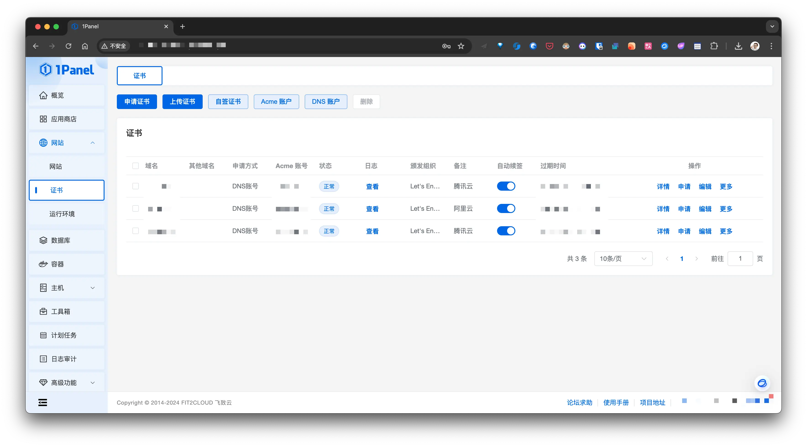

1Panel 的证书申请非常快且成功率 100%, 可以采用手动的方式为 **雷池 Safeline** 添加证书, 也可以 [自动化部署 HTTPS 证书到 WAF](#自动部署 1Panel 申请的 HTTPS).

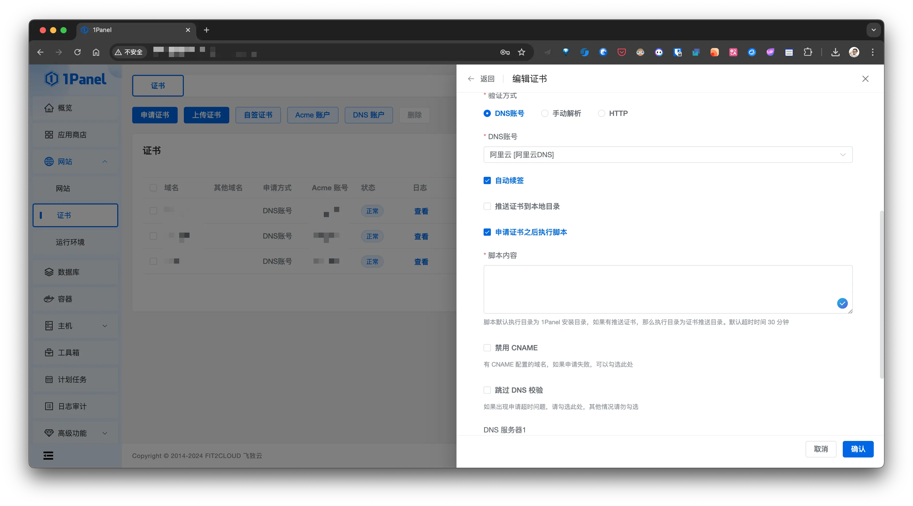

### 雷池 Safeline

[雷池](https://waf-ce.chaitin.cn/) 号称 **下一代 Web 应用防火墙**, 社区版功能完全够用(主要因为专业版太贵 🥲), 专业版多了告警, 负载均衡等功能:

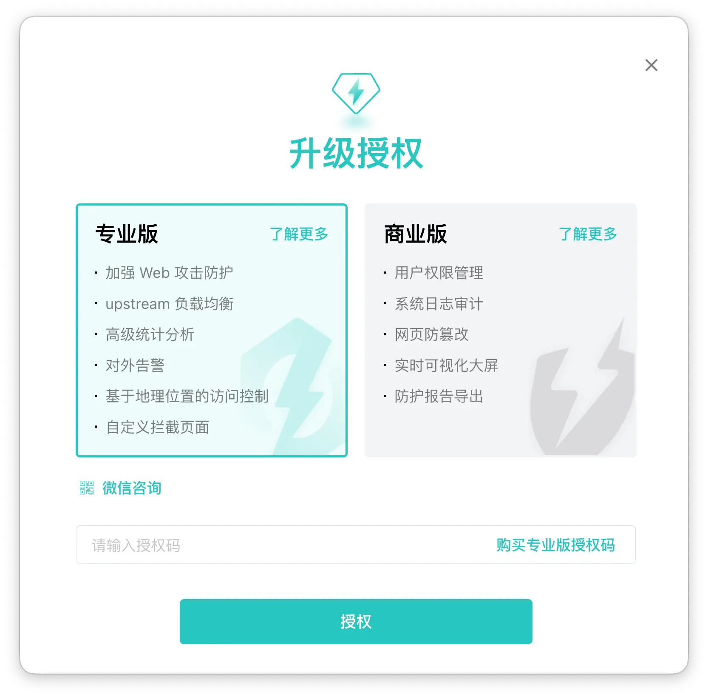

用 [官方的测试工具](https://github.com/chaitin/blazehttp) 玩了一下, 攻击检测日志中的信息非常全面:

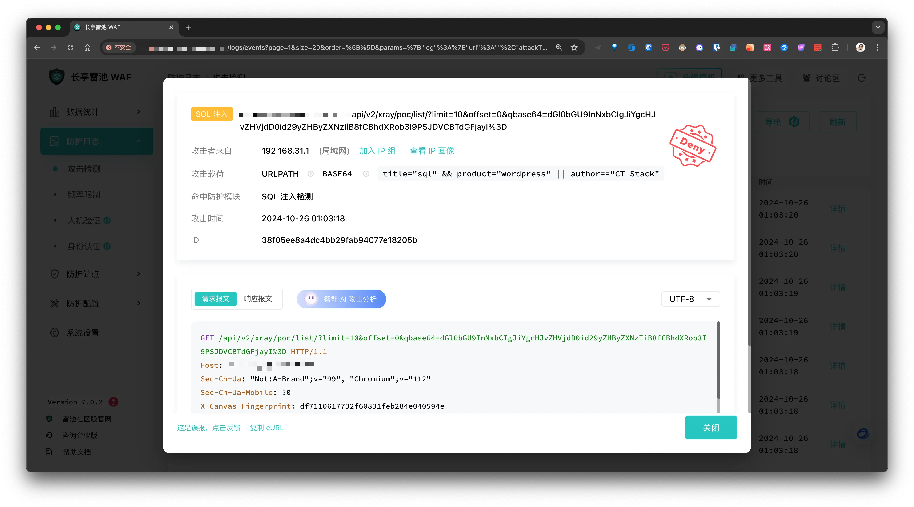

且还有 AI 攻击分析:

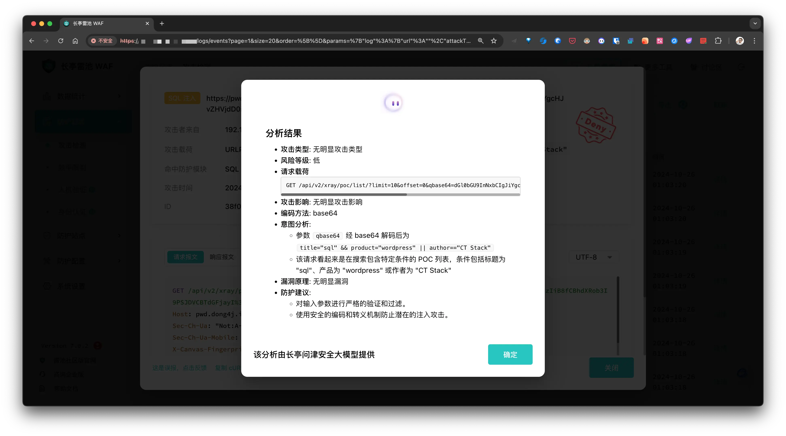

后续我将使用 **WAF** 代替 **雷池 Safeline**.

#### 用 WAF 替换 NPM

买不起硬件防火墙, 软件防火墙我们还不能白嫖吗?

所以为了玩一玩这个号称这么牛逼的软防火墙, 将 NPM 的代理全部迁移到了 WAF, 现在 NPM 则沦为 [内网自定义域名的代理服务](#代理局域网自定义域名).

所以就直接使用 2 台虚拟机通过 Docker 部署了 WAF, 分别替代电信和联通网络的 NPM:

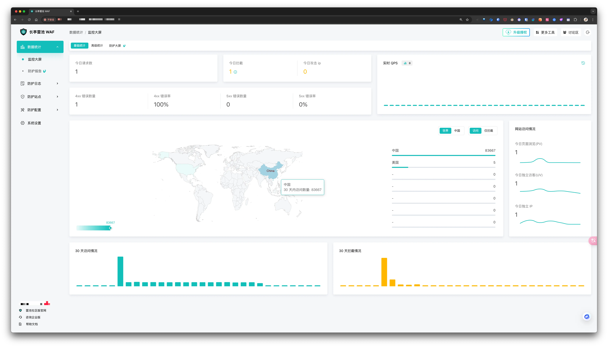

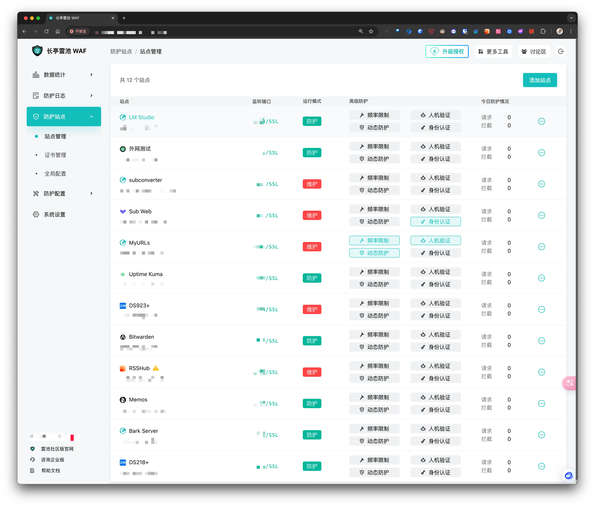

防护功能要比 NPM 多几个, 且有 Dashboard 展示访问与拦截情况.

#### 配置域名代理

与 NPM 不同的是 WAF 在配置域名时确认端口号, 而 NPM 在启动时就确认了 HTTP 和 HTTPS 端口 , 所以 WAF 的优势是能够为不同的域名设置不同的端口:

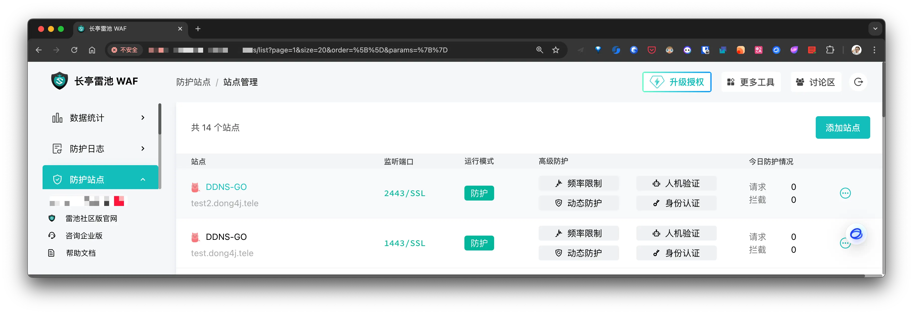

如上配置的话, 就需要在路由器分别为 `1443` 和 `2443` 配置端口转发规则, 局域网 IP 添加部署 WAF 的服务器 IP.

##### NAS 域名代理

补充说明一下如何代理 `Synology Drive` 流量.

`Synology Drive` 客户端全平台支持, 我在手机和电脑上使用了 Drive 客户端.

假设我想使用 `nas.dongj4.tele:1443` 来访问 NAS 上(`192.168.31.3`) 的 `Synology Drive` 服务, 那么只需要在 WAF 添加一个域名配置:

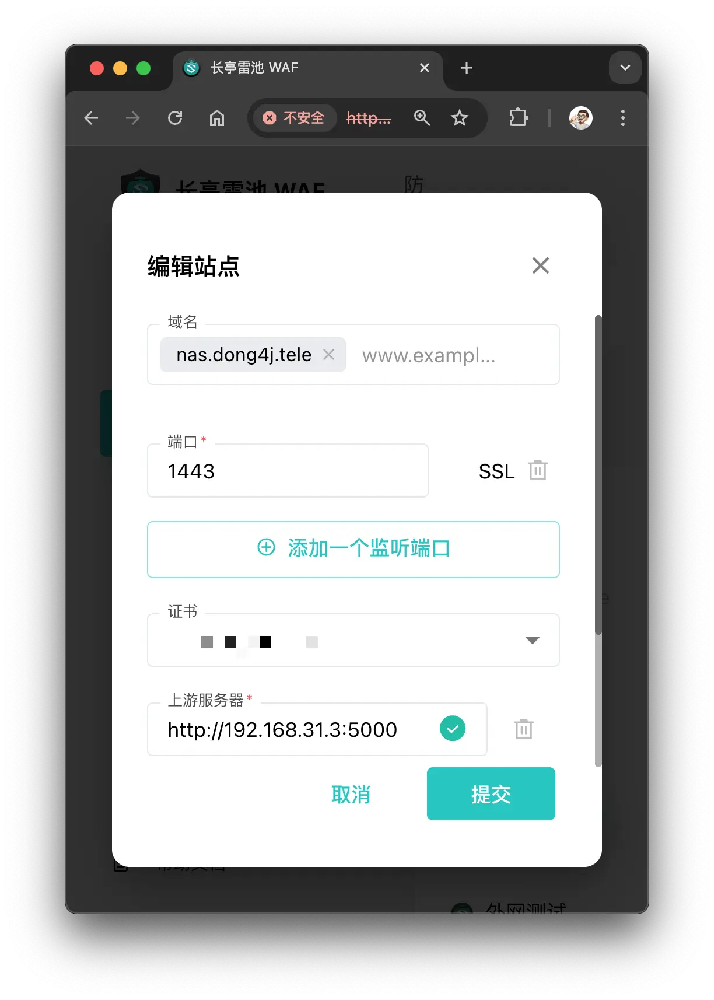

熟悉 Synology 的朋友都知道 `5000` 是 NAS 的 WebUI 的 HTTP 端口. 接着在路由器上配置端口转发, 将 `1443` 转发到 `192.168.31.10:1443`,

然后在手机客户端上登录:

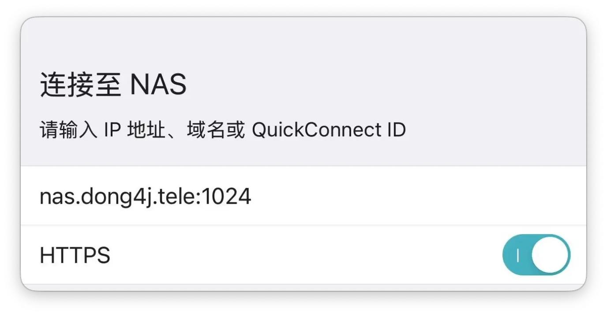

配置没问题的话应该就可以正常登录了, 如果登录失败请自行检查端口转发, NAS 的端口号等是否设置正确.

然后如果你将上述的域名和端口配置到桌面版的 Drive client 会发现连接不上, 这是因为 **PC 端 Drive 程序开放的默认访问端口为 6690**, 对移动端的 App 开放的默认访问端口为 **5000**.

> Synology Drive 客户端会根据输入的域名或 IP 自动选择默认端口进行访问:
>
> - **PC 客户端**: 如果未指定端口, 会默认使用 **6690**
> - **移动客户端**: 默认使用 **5000** (HTTP) 或 **5001** (HTTPS)
>
> 如果用户明确填写了端口号, 客户端会优先使用指定的端口.
>
> 在局域网中, 直接输入 NAS 的 IP 地址即可连接, 是否加端口号均可；在外网访问时, 需要将外部端口转发到 NAS 的相应内部端口 (例如 6690)

[DSM 服务使用的网络端口](https://kb.synology.cn/zh-cn/DSM/tutorial/What_network_ports_are_used_by_Synology_services)


所以为了让桌面版的 Drive client 能正常使用, 我们需要在路由器上多配置一个端口转发规则 ([因为 WAF 它不支持 TCP/UDP 转发](#WAF 的代理的局限性)):

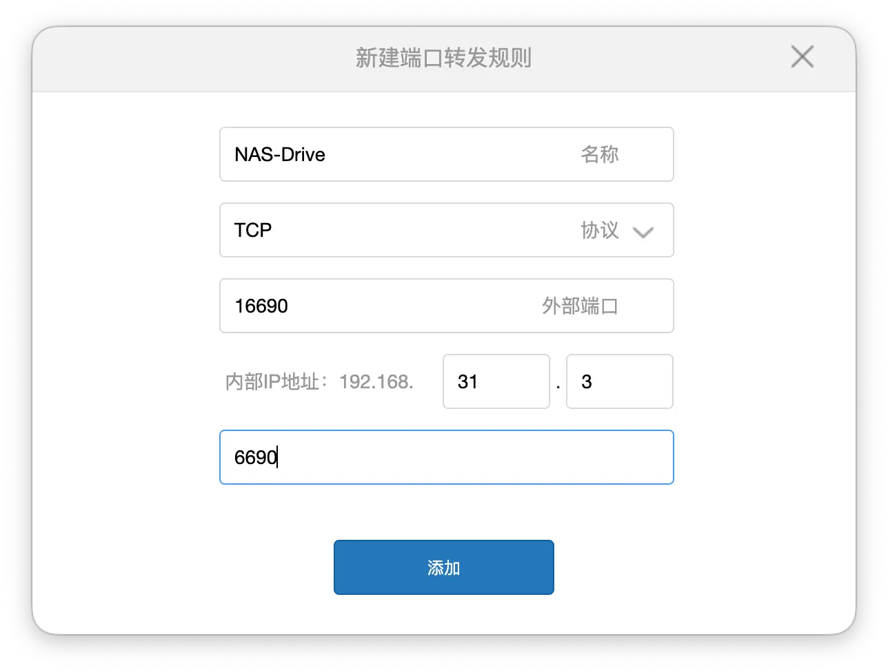

桌面版 Drive 连接配置:

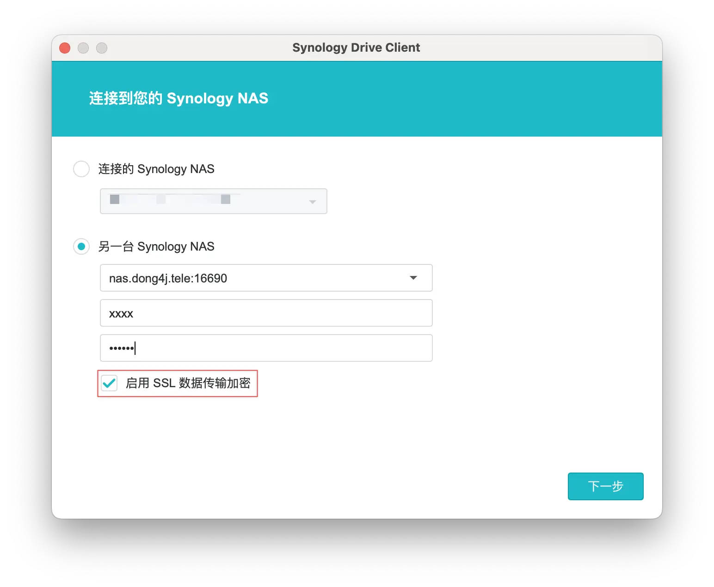

这里 **启用 SSL 数据传输加密** 最好能勾选上, 但因为没有通过 WAF 转发, 所有无法使用 WAF 中的证书配置, 你需要在 NAS 中配置 HTTPS 证书:

> 后面会讲到为什么使用 1Panel 的证书管理代理 WAF 的证书管理, 且实现 1Panel 申请证书并自动部署到 WAF.
>
> 这里会先用到 1Panel 的 2 个证书, 如果没啥头绪, 可以先看完 [自动部署 1Panel 申请的 HTTPS](#自动部署 1Panel 申请的 HTTPS) 再回过来看这里.

NAS 新增证书:

1. 入口: 控制面板-安全性-证书

2. 新增证书-导入证书或从 Let's Encrypt 获取证书 (如果是更新证书就选第二项: **替换已有证书**)-导入证书(不要勾选 **设为默认证书**[如果你知道是什么操作可执行选择]):

   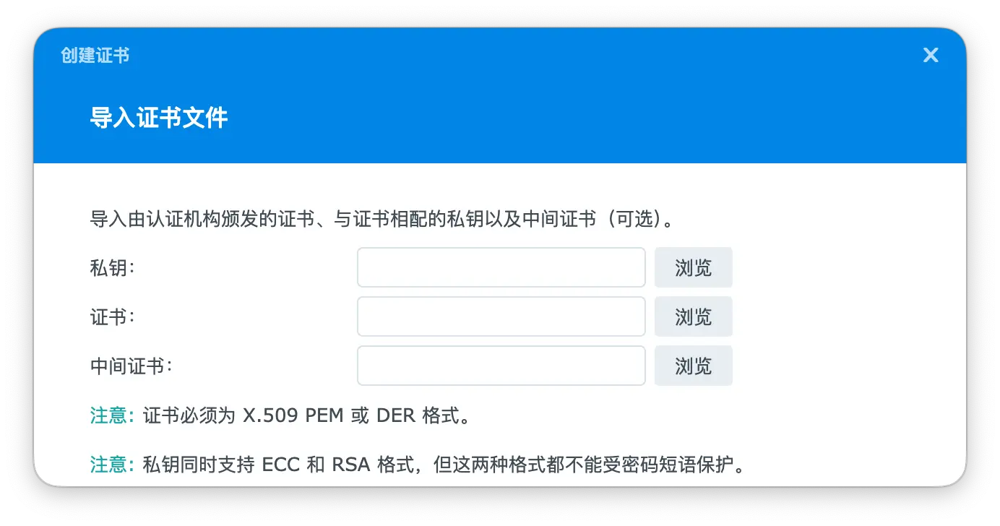

私钥: **privkey.pem**

证书: **fullchain.pem**

中间证书: 可不填

3. 为 Drive 配置自定义证书:

   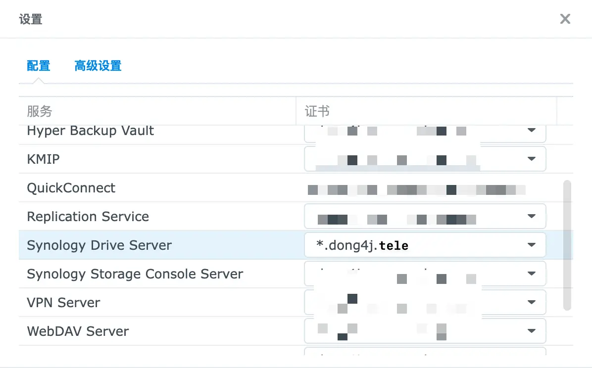

##### NAS 自动部署 HTTPS 证书

当然这又是另一个话题了, 我会单独出一个指南, 通过 [acme.sh](https://github.com/acmesh-official/acme.sh) 将证书自动部署到 NAS 和 WAF.

相关链接:

- [两个优化点 #660](https://github.com/chaitin/SafeLine/issues/660)
- [证书增加使用路径导入方式 #782](https://github.com/chaitin/SafeLine/issues/782)
- [群晖 DSM7.x 通过 acme.sh 全自动更新并部署 SSL 证书](https://blog.zakikun.com/archives/80.html)
- [记我群晖上的 Docker 项目: ddns-go 和 acme.sh](https://www.iamlm.com/blog/119.%E8%AE%B0%E6%88%91%E7%BE%A4%E6%99%96%E4%B8%8A%E7%9A%84Docker%E9%A1%B9%E7%9B%AE%EF%BC%9Addns-go%E5%92%8Cacme.sh/)
- [HTTPS certificates for your Synology NAS using acme.sh](https://github.com/acmesh-official/acme.sh/wiki/Synology-NAS-Guide)

#### 不使用 WAF 的证书管理

**WAF** 无法申请泛域名证书, 所以就有点尴尬.

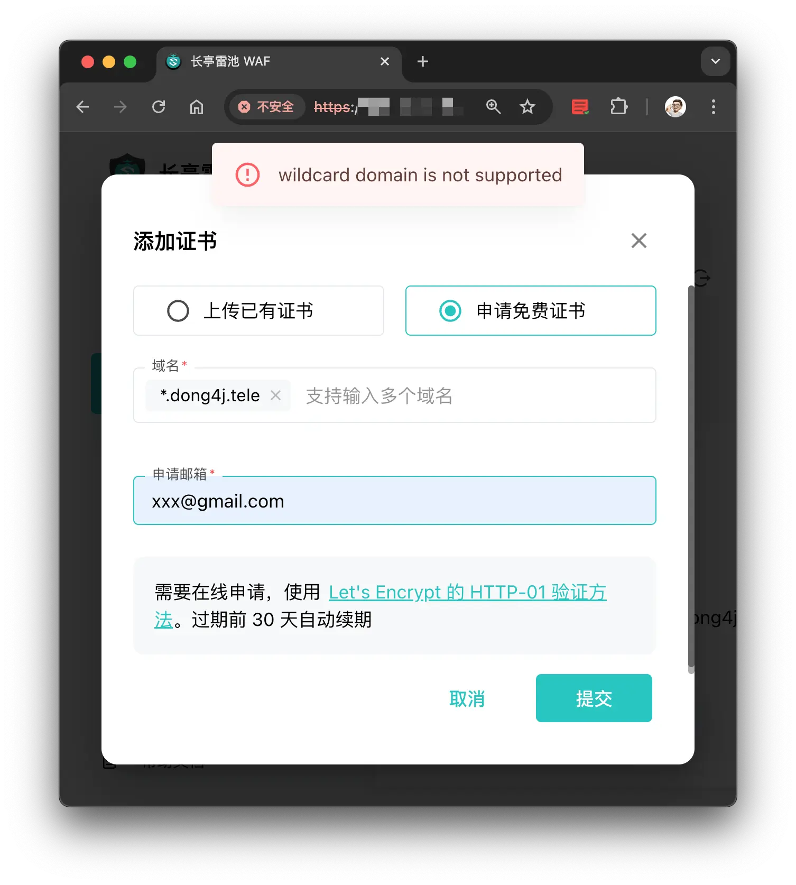

不过最新的情况是官方已经在考虑 [通过 DNS 验证的方式来支持泛域名证书申请了](https://github.com/chaitin/SafeLine/issues/563), 所以还是可以期待一下.

WAF 的其他 [开发计划](https://waf-ce.chaitin.cn/community) 也可以关注一下.

#### WAF 的代理的局限性

**只能代理 HTTP 服务**, 不支持四层代理转发. 官方的回答是不支持, 没必要: **WAF 只关注七层网络协议, 专注于 HTTP 流量的检测与清洗**.

但是 WAF 一般都是部署在公网之后的那台服务器, 作为所有流量的入口, 然后才是转发到后面的 Nginx 或其他服务, 如果只支持七层代理转发的话, 诸如 SSH 这类 TCP/UDP 层的流量还得单独配置.

[可以看看这里的讨论](https://github.com/chaitin/SafeLine/issues/123), 不知道官方会不会支持.

为了解决上述问题, 我目前使用的方案:

- 如果是 HTTP 服务, 全部通过路由器转发到 WAF 所在的服务器上, 然后由 WAF 进行后续的转发;
- 其他服务比如 WireGuard, Snell 等四层协议的流量则通过路由器直接转发至指定的服务器 (前面 [NAS 域名代理](#NAS 域名代理) 就是一个例子);

#### WAF 社区版的局限性

和 NPM 的配置自由度比起来, WAF 社区版则不是那么具有可玩性, 因为 WAF 会定时覆盖手动修改的配置文件, 不过也有不是那么优雅的解决方案, 接下来通过一个例子来说明一下操作方式.

首先在 WAF 上创建一个站点, 用于返回 **当前时间** 和 **客户端真实 IP**:

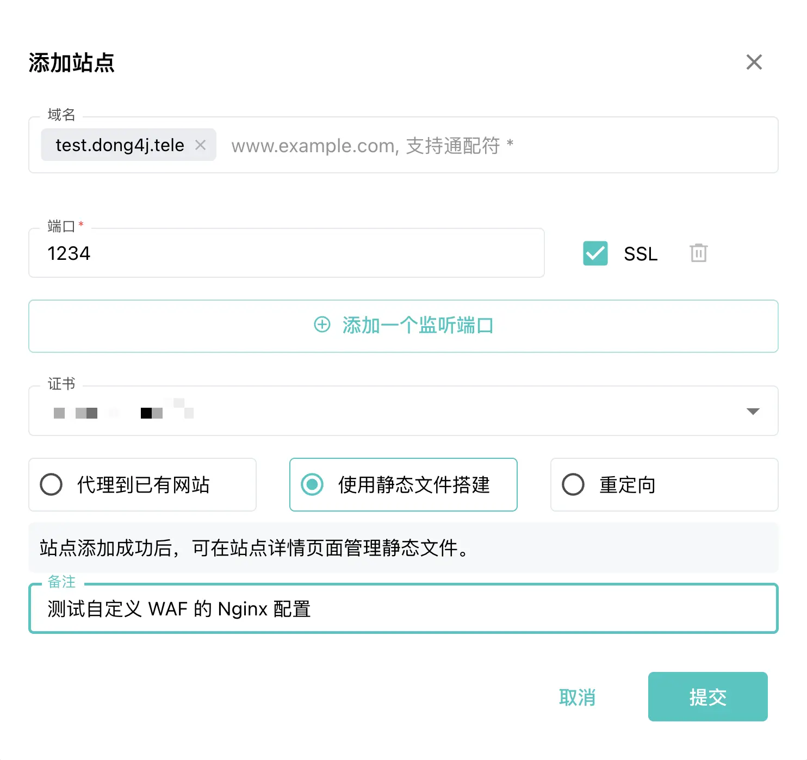

点击创建好的站点, 然后渠道 **静态资源** 选项卡, 添加一个 **index.html** 页面, 内容如下:

```html
<!DOCTYPE html>
<html lang="en">
  <head>
    <meta charset="UTF-8" />
    <meta name="viewport" content="width=device-width, initial-scale=1.0" />
    <title>Current Time</title>
  </head>
  <body>
    <p>
      <script>
        document.write(new Date().toLocaleTimeString());
      </script>
    </p>
  </body>
</html>
```

访问 `https://test.dong4j.tele:1234` 可返回当前时间.

接下来去服务器手动修改 WAF 的 nginx 配置文件:

刚刚添加的测试站点的配置文件为: `/opt/safeline/resources/nginx/sites-enabled/IF_backend_13`,

打开并编辑, 在 `server` 中添加如下配置:

```
location = /ip {
    add_header Content-Type text/plain;
    access_log on;
    return 200 "$remote_addr\n";
}
```

保存退出, 为了防止 WAF 定期覆盖手动修改后的配置文件, 我们需要给刚刚的配置文件添加 **不可变属性**

```shell
chattr +i IF_backend_13
```

重新加载 Nginx 配置:

```shell
docker exec -it safeline-tengine nginx -t   && \
docker exec -it safeline-tengine nginx -s reload
```

最后访问 `https://test.dong4j.tele:1234/ip` 可获取到客户端 IP (使用蜂窝网络的手机访问).

关键点是 `chattr +i`, 防止 WAF 覆盖我们修改过后的文件, 如果需要再次编辑, 使用 `chattr -i 文件名` 恢复.

### 自动部署 1Panel 申请的 HTTPS

使用 WAF 一键部署脚本时会让你选择安装的目录, 我安装在 `/opt` 目录下, 所以 Nginx 的目录: `/opt/safeline/resources/nginx/sites-enabled/` (你可以查看 `/opt/safeline/conpose.yaml` 文件, 了解其他挂在的目录的位置).

**我先添加一个测试站点**:

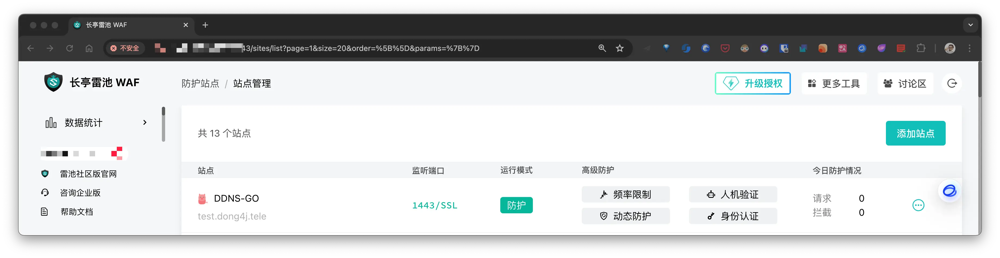

对应的 Nginx 配置文件为 **IF_backend_15**:

```
upstream backend_15 {
    server 192.168.31.10:9876;
    keepalive 128;
    keepalive_timeout 75;
}
...
server {
    listen 0.0.0.0:1443 ssl http2;
    server_name test.dong4j.tele;
    ssl_certificate /etc/nginx/certs/cert_1.crt;
    ssl_certificate_key /etc/nginx/certs/cert_1.key;
		...
    if ($host !~* ^(test\.dong4j\.tele)$) {
        rewrite ^ /not_found_page last;
    }
    ....
    location ^~ / {
        proxy_pass http://backend_15;
        ...
    }
```

可以看到用到的公钥证书和私钥分别是: `/etc/nginx/certs/cert_1.crt`, `/etc/nginx/certs/cert_1.key` (如果已经有多个 HTTPS 证书, 后缀可能会是其他的数字).

他们对应的挂载目录为: `/opt/safeline/resources/nginx/certs`

所以我们的目标就是自动换 `certs` 中的证书, 我们使用脚本来实现这一自动化过程.

1. 在 1Panel 上配置 **推送证书到本地目录**:

   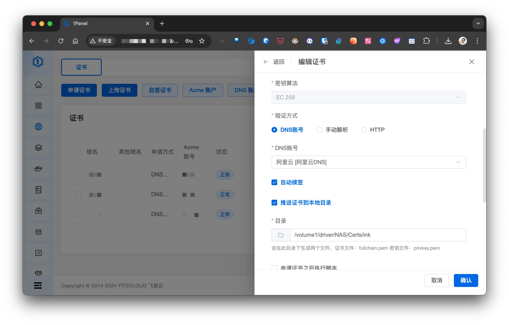

如果原来没有配置证书推送, 需要重新申请一次:

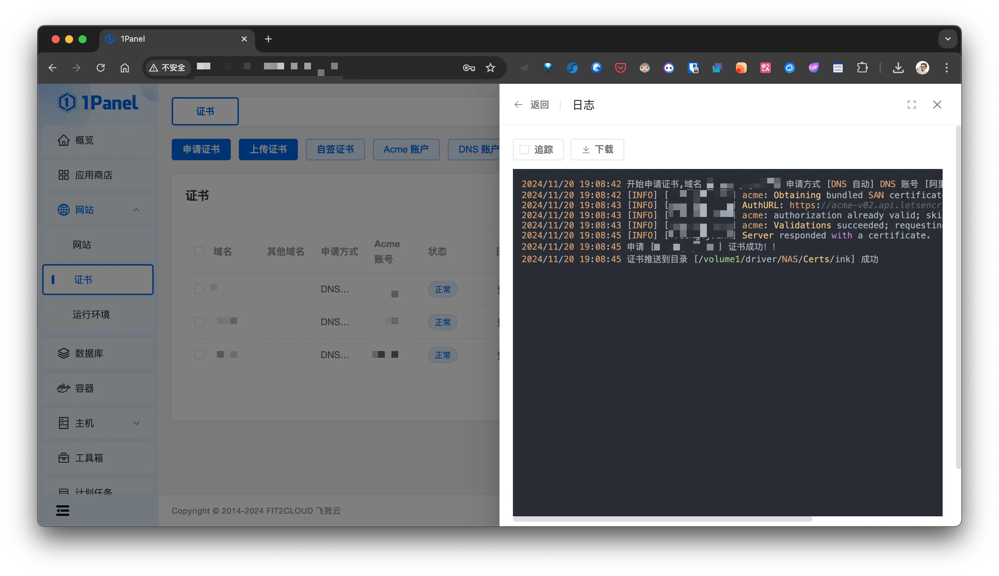

然后指定目录下会出现 证书文件`fullchain.pem` 和密钥文件 `privkey.pem`, 因为 `fullchain.pem` 包含多个证书文件, 而 `openssl x509` 默认只处理单个证书, 所以我们可以直接拷贝 `fullchain.pem` 的内容, 接下来就是脚本部分(脚本名称为: `sync_certs.sh`):



**看到这里先别急着使用这个脚本, 接着往下看, 还有更好的方式, 这里只是记录一下折腾过程.**

```python
#!/bin/bash

# 使用说明
usage() {
    echo "Usage: $0 <WAF_IP>"
    echo "Example: $0 waf.t"
    exit 1
}

# 检查是否传入参数
if [ -z "$1" ]; then
    usage
fi

# 定义变量
WAF="$1"
CERT_FILE="fullchain.pem"
KEY_FILE="privkey.pem"
CERT_PATH="/opt/safeline/resources/nginx/certs/cert_1.crt"
KEY_PATH="/opt/safeline/resources/nginx/certs/cert_1.key"
DOCKER_CONTAINER="safeline-tengine"

# 日志函数
log() {
    echo "[INFO] $1"
}

error() {
    echo "[ERROR] $1" >&2
    exit 1
}

# 检查文件是否存在
if [ ! -f "$CERT_FILE" ] || [ ! -f "$KEY_FILE" ]; then
    error "证书文件或密钥文件不存在, 请确保 $CERT_FILE 和 $KEY_FILE 存在"
fi

# 复制证书和密钥
log "正在复制证书和密钥到 ${WAF}..."
scp "$CERT_FILE" "${WAF}:${CERT_PATH}" || error "无法复制证书文件到 ${WAF}"
scp "$KEY_FILE" "${WAF}:${KEY_PATH}" || error "无法复制密钥文件到 ${WAF}"
log "证书和密钥文件已成功复制到 ${WAF}"

# 修复文件权限
log "正在修复文件权限..."
ssh "$WAF" "chmod 644 ${CERT_PATH} ${KEY_PATH}" || error "无法修复文件权限"
log "文件权限修复完成"

# 重启 Docker 容器
log "正在重启 Docker 容器 ${DOCKER_CONTAINER}..."
ssh "$WAF" "docker restart ${DOCKER_CONTAINER}" > /dev/null || error "无法重启 Docker 容器"
log "Docker 容器 ${DOCKER_CONTAINER} 已成功重启"

log "证书同步和更新完成！"
```



---

我的 `1Panel` 部署在 DS218+ 上, 且有 2 台 WAF 服务器分别对应电信和联通网络, 所以我将公共参数提出来, 使用脚本传参的方式处理:

1. `waf.t` 和 `waf.u` 需要在 `.ssh/config` 中配置, 如果你看过 [SSH 别名配置](#别名配置) 应该不难;
2. 还需要配置 [SSH 免密登录](#SSH 免密登录);
3. WAF 上的 `cert_1.crt` 和 `cert_1.key` 名称需要根据你自己的情况修改;
4. 如果你使用雷池一键安装脚本, Nginx 容器的名称应该是 `safeline-tengine`, 如果不是可自行修改;

**值得注意的是, 在我的 DS218+ 上 1Panel 以 root 运行, 所以 `.ssh/config` 应该在 /root/.ssh 目录下设置**.

**设置脚本**:

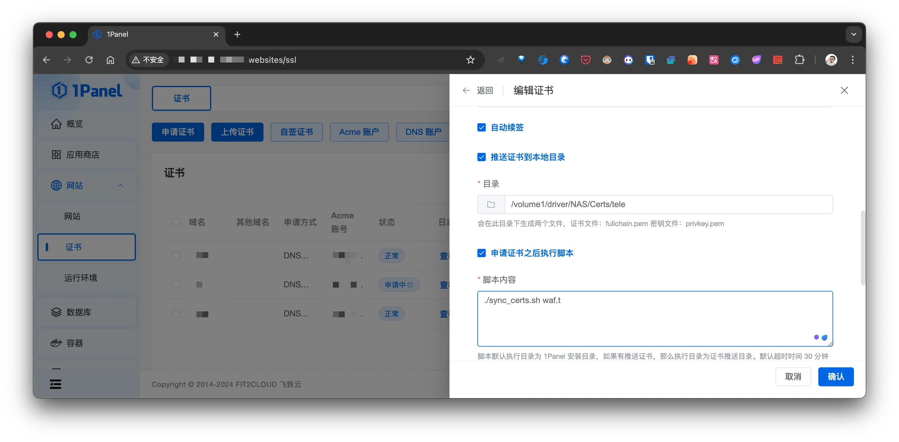

最后在 1Panel 中重新申请证书即可:

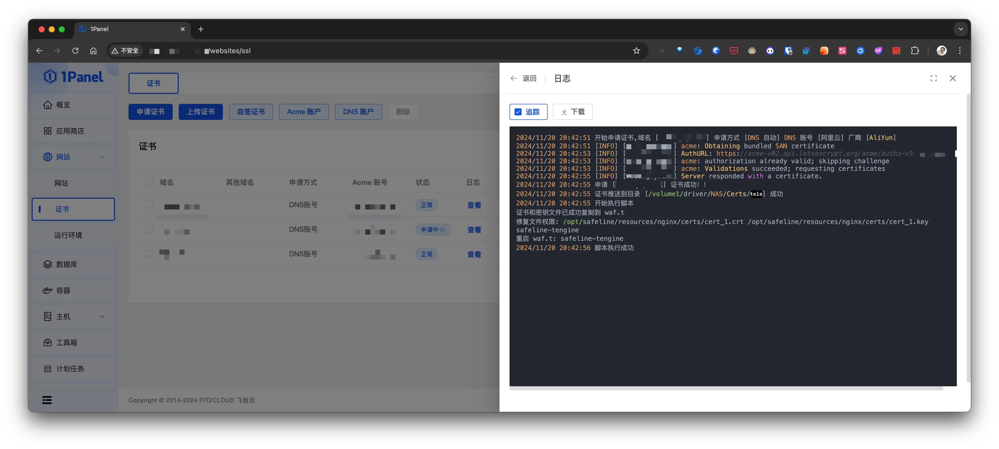

**结果大意了没有闪**, 这种方式虽然能够成功替换挂载目录下的证书文件, 但是 **WAF** 它把 **证书数据存在数据库里面的** , 心中一万只草泥马飘过.....

我是怎么发现的呢? 我拿八倍望远镜发现的.....

重新申请证书后到 WAF 中的证书管理页面查看, 发现证书时间没有更新, 且编辑证书后不是新的证书. 在 `/opt/safeline` 目录下有个 `reset_tengine.sh` 文件.



```shell
#!/bin/bash

set -e

SCRIPT_DIR=$(dirname "$0")

confirm() {
    echo -e -n "\033[34m[SafeLine] $* \033[1;36m(Y/n)\033[0m"
    read -n 1 -s opt

    [[ "$opt" == $'\n' ]] || echo

    case "$opt" in
        'y' | 'Y' ) return 0;;
        'n' | 'N' ) return 1;;
        *) confirm "$1";;
    esac
}

if ! confirm "是否重新生成 tengine 的所有配置"; then
    exit 0
fi

nginx_path="${SCRIPT_DIR}/resources/nginx"
backup_path="${SCRIPT_DIR}"/resources/nginx."$(date +%s)"

if [ ! -d "${nginx_path}" ]; then
    echo "website dir not found"
    exit 1
fi

mv "${nginx_path}" "${backup_path}"

docker restart safeline-tengine > /dev/null

docker exec safeline-mgt gentenginewebsite

if [ -d "${backup_path}/static" ]; then
    cp -r "${backup_path}/static" "${nginx_path}/static"
fi
```



我重新执行了里面的 `docker exec safeline-mgt gentenginewebsite`, 结果将挂载目录下的证书给还原回去了, 翻遍了所有的挂载目录都没有发现备份的证书文件, 这才发现不简单.....

所以看了 `compose.yaml` 文件, 其中就出现了 `postgres` 数据库, 那么是不是证书数据被存储到数据了? 带着这个疑问, 我们将 `postgres` 的端口暴露出来连上去看看(`postgres` 的密码在 同级目录下的 `.env` 中).

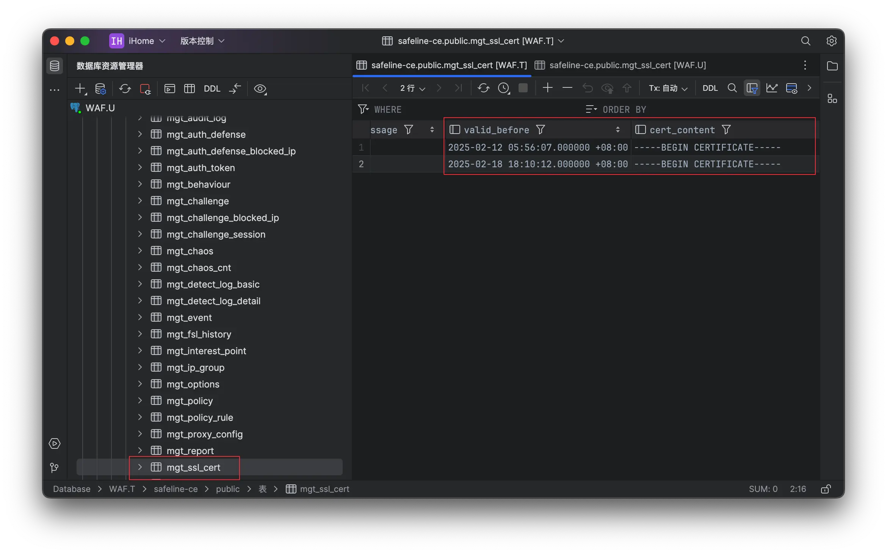

如图所示, 证书数据被保存在了 `mgt_ssl_cert` 中, 看来只能通过 Web API 来操作了, 不过 WAF 并没有提供 API 文档, 也没有提供生成 API key 的操作, 控制台看了一下, 基于 JWT 的认证, 简单的写了脚本, 模拟登录获取 JWT, 然后调用 `POST /api/open/cert` 更新证书:

<!--
参考:

```python
import requests
import time
import pyotp
import urllib3

# 基本配置信息
BASE_URL = "https://www.iots.vip"     # 登录地址
USERNAME = "admin"                    # 用户名
PASSWORD = "123123123"                # 密码

OTP_SECRET = "ADXXXXXXWB5S3UIWZCDX"   # 动态验证码的密钥
CERT_ID = "1"                         # 证书ID, 用于更新证书
CERT_FILE_PATH = "www.iots.vip.crt"   # 证书文件路径
CERT_KEY_PATH = "www.iots.vip.key"    # 私钥文件路径

# 获取动态验证码
def get_passcode(secret):
    totp = pyotp.TOTP(secret)         # 初始化TOTP对象
    return totp.now()                 # 返回当前时间窗口的动态验证码

# SafeLine类用于与SafeLine服务进行交互
class SafeLine:
    def __init__(self, base_url):
        urllib3.disable_warnings()     # 禁用SSL警告
        self.base_url = base_url       # 设置基础URL
        self.csrf_token = None         # 初始化CSRF令牌
        self.jwt = None                # 初始化JWT令牌
        self.session = requests.Session()  # 创建请求会话
        self.session.verify = False    # 禁用SSL证书验证

    # 获取CSRF令牌
    def get_csrf_token(self):
        response = self.session.get(f"{self.base_url}/api/open/auth/csrf")
        data = response.json()
        self.csrf_token = data['data']['csrf_token']
        return self.csrf_token

    # 登录方法
    def login(self, username, password):
        self.get_csrf_token()          # 获取CSRF令牌
        payload = {                    # 构建登录请求数据
            "username": username,
            "password": password,
            "csrf_token": self.csrf_token
        }
        response = self.session.post(f"{self.base_url}/api/open/auth/login", json=payload)
        data = response.json()
        self.jwt = data['data']['jwt'] # 保存JWT令牌
        return self.jwt

    # 验证多因素认证
    def validate_mfa(self, code):
        self.get_csrf_token()          # 获取CSRF令牌
        headers = {'authorization': 'Bearer ' + self.jwt}
        payload = {                    # 构建多因素认证请求数据
            "code": code,
            "timestamp": int(time.time() * 1000),
            "csrf_token": self.csrf_token
        }
        response = self.session.post(f"{self.base_url}/api/open/auth/tfa", headers=headers, json=payload)
        data = response.json()
        if data['err'] is None:
            self.jwt = data['data']['jwt']  # 更新JWT令牌
            print("login success")         # 打印登录成功信息
        else:
            self.jwt = None
        return data['data']['jwt']

    # 列出所有证书
    def list_all_certs(self):
        headers = {'authorization': 'Bearer ' + self.jwt}
        response = self.session.get(f"{self.base_url}/api/open/cert", headers=headers)
        data = response.json()
        return data['data']['nodes']

    # 更新证书
    def update_cert(self, cert_id, crt, key):
        headers = {'authorization': 'Bearer ' + self.jwt}
        payload = {                    # 构建更新证书请求数据
            "manual": {
                "crt": crt,
                "key": key
            },
            "type": 2
        }
        response = self.session.put(f"{self.base_url}/api/open/cert/{cert_id}", headers=headers, json=payload)
        data = response.json()
        if data['err'] is None:
            print("update success")     # 打印更新成功信息

# 主程序入口
if __name__ == '__main__':
    safeline = SafeLine(base_url=BASE_URL)  # 创建SafeLine对象
    safeline.login(USERNAME, PASSWORD)       # 登录
    safeline.validate_mfa(get_passcode(OTP_SECRET))  # 验证多因素认证

    # 读取证书文件和私钥文件
    with open(CERT_FILE_PATH, 'r') as cert_file:
        cert_str = cert_file.read()
    with open(CERT_KEY_PATH, 'r') as key_file:
        cert_key = key_file.read()
    safeline.update_cert(CERT_ID, cert_str, cert_key)  # 更新证书
```
-->



```shell
#!/bin/bash

# === 配置信息 ===
BASE_URL="https://ip:port/api"
USERNAME="用户名"
PASSWORD="密码"
# 证书 id
CERT_ID=1
CERT_FILE_PATH="fullchain.pem 文件路径"
CERT_KEY_PATH="privkey.pem 文件路径"

# === 函数: 输出错误信息并退出 ===
function error_exit {
    echo "[ERROR] $1"
    exit 1
}

# === 1. 获取 CSRF Token ===
csrf_token=$(curl -k -s "${BASE_URL}/open/auth/csrf" | jq -r '.data.csrf_token') || error_exit "无法获取 CSRF Token"
[ -z "$csrf_token" ] && error_exit "CSRF Token 为空"
echo "[INFO] CSRF Token 获取成功"

# === 2. 获取 JWT Token ===
JWT=$(curl -k -s -X POST "${BASE_URL}/open/auth/login" \
     -H "Content-Type: application/json" \
     -d "{\"username\":\"${USERNAME}\",\"password\":\"${PASSWORD}\",\"csrf_token\":\"${csrf_token}\"}" | jq -r '.data.jwt') || error_exit "无法获取 JWT"
[ -z "$JWT" ] && error_exit "JWT Token 为空"
echo "[INFO] JWT Token 获取成功"

# === 3. 读取证书文件和密钥文件内容 ===
[ -f "$CERT_FILE_PATH" ] || error_exit "证书文件 ${CERT_FILE_PATH} 不存在"
[ -f "$CERT_KEY_PATH" ] || error_exit "密钥文件 ${CERT_KEY_PATH} 不存在"

CERT_CONTENT=$(jq -sRr '.' < "$CERT_FILE_PATH") || error_exit "读取证书文件失败"
KEY_CONTENT=$(jq -sRr '.' < "$CERT_KEY_PATH") || error_exit "读取密钥文件失败"

echo "[INFO] 证书和密钥文件已读取"

# === 4. 更新证书 ===
UPDATE_PAYLOAD=$(jq -n \
    --arg cert "$CERT_CONTENT" \
    --arg key "$KEY_CONTENT" \
    --argjson type 2 \
    --argjson id $CERT_ID \
    '{
      manual: {
        crt: $cert,
        key: $key
      },
      type: $type,
      id: $id
    }')

result=$(curl -k -s -X POST "${BASE_URL}/open/cert" \
     -H "Authorization: Bearer ${JWT}" \
     -H "Content-Type: application/json" \
     -d "$UPDATE_PAYLOAD") || error_exit "证书更新请求失败"

# 解析并判断结果
err=$(echo "$result" | jq -r '.err')
msg=$(echo "$result" | jq -r '.msg')

if [ "$err" == "null" ]; then
    echo "[INFO] 证书更新成功"
else
    echo "[ERROR] 证书更新失败: $msg"
fi
```



`update_certs.sh` 脚本中只需要修改前面的参数运行即可.

我即将 `fullchain.pem`, `privkey.pem` 和 `update_certs.sh` 3 个文件全部放在了 1Panel 推送证书的目录下, 现在只需要在修改 **1Panel** 的脚本内容即可:

```shell
./update_certs.sh
```

> **`sync_certs.sh` 脚本已经没用了, 因为通过接口更新证书后, WAF 自己会将新的证书写入 `opt/safeline/resources/nginx/certs/` 目录下的 `cert_{id}.crt` 和 `cert_{id}.key`, 所以前面都是踩坑记录.**

后续会输出 [通过 acme.sh 将证书自动部署到 NAS 和 WAF](#NAS 自动部署 HTTPS 证书).

### 根据环境自动切换 Hosts

> **前面已经使用 NPM 和 WAF 并都开启了 HTTPS, 这节所有的操作都在这个前提下进行.**

我的目的是 **根据网络环境自动切换映射的 IP**, 适应动态网络环境, 保持稳定的连接.

解决的问题是在外网通过公网访问家里的服务, **在家则直接映射到指定的服务器, 避免从公网绕一圈回来**.

其实这个需求只会用在需要随身携带的 MBP 上, 我们可以通过自定义 DNS 服务来实现, 但问题是需要手动切换 DNS 服务地址, 当然也是可以写脚本来实现自动化的.

得益于 `Surge` 这款强大的网络调试工具, 且支持自定义脚本, 所以我会是用 `Surge ` 来完成这样工作.

> 如果路由器支持配置 Hosts 的话, 也是一种方案, 问题是不支持泛域名:
>
> 

我们首先对齐一下颗粒度:

- NAS WebUI 局域网的地址为 `http://192.168.31.3:5000`;

- 在公司通过 `nas.dong4j.tele:1234` 来访问 NAS 的 WebUI;
- 在家还是使用 `nas.dong4j.tele:1234` 访问 NAS 的 WebUI;

一个站点的服务可以通过其 IP 地址和端口号来识别, 端口号不能改的情况下就只能修改域名所映射的 IP 地址.

前面说过我不会将服务原本的端口暴露到公网, 为了保证外网端口不改的情况下通过域名访问局域网内其他的服务(**但是上述需求必须保证 NPM 或 WAF 的 HTTPS 端口与路由器上配置的外网端口一致**), 我们必须在路由器后面添加一层代理.

接下来我们详细描述一下 **NPM** 和 **WAF** 如果完成上面的需求.

假设:

| 服务名 | IP            | 端口(HTTPS) |
| ------ | ------------- | ----------- |
| NPM    | 192.168.31.2  | 1234        |
| WAF    | 192.168.31.20 | 1234        |

#### NPM

NPM 特殊一点就是在启动时将就必须确认 HTTPS 端口号, 所以为了能在家也能映射到 NPM, 必须保证 NPM 的 HTTPS 端口和路由器的转发端口保持一致.

| 外网端口 | 转发的 IP    | 转发的端口 |
| -------- | ------------ | ---------- |
| 1234     | 192.168.31.2 | 1234       |

NPM 代理服务配置:


上述配置后应该能通过 `https://nas.dong4j.tele:1234` 访问 NAS 的 WebUI 了. 这是在外网的情况, 在内网环境下, 我们需要为 `*.dong4j.tele` 设置 Hosts, 让它全部映射到 NPM 的 IP 地址:

Surge 配置:

```
*.dong4j.tele = 192.168.31.2
```

使用 **dig** 或 **ping** 检查一下是否生效(Surge 需要配置一下才能获取真实的 IP: 设置-通用-高级: Always Real IP Hosts, 在列表中添加 `*.dong4j.tele`, 或者直接修改配置文件: General 分组下的 always-real-ip 配置):

```
$ dig nas.dong4j.tele

; <<>> DiG 9.10.6 <<>> nas.dong4j.tele
;; global options: +cmd
;; Got answer:
;; ->>HEADER<<- opcode: QUERY, status: NOERROR, id: 22000
;; flags: qr; QUERY: 1, ANSWER: 1, AUTHORITY: 0, ADDITIONAL: 0

;; QUESTION SECTION:
;nas.dong4j.tele.		IN	A

;; ANSWER SECTION:
nas.dong4j.tele.	30	IN	A	192.168.31.2

;; Query time: 1 msec
;; SERVER: 198.18.0.2#53(198.18.0.2)
;; WHEN: Thu Nov 21 14:30:34 CST 2024
;; MSG SIZE  rcvd: 64
```

这样我们就完成了整个链路:


#### WAF

WAF 的配置大同小异, 与 NPM 不同的地方就是可以配置多个端口, 同时也需要在路由器上配置对应的端口转发规则.

| 外网端口 | 转发的 IP     | 转发的端口 |
| -------- | ------------- | ---------- |
| 1234     | 192.168.31.20 | 1234       |

路由器上配置端口转发规则:


WAF 的代理配置:


修改 Surge 配置:

```
*.dong4j.tele = 192.168.31.20
```

WAF 的配置就完成了.

#### 自动切换域名映射

最后就是 Surge 如何动态修改 Hosts 了, 这个有多种实现方式:

1. 使用脚本动态修改 DNS 服务器: 需要架设 DNS 服务器, 固没有采用;

2. **使用脚本动态修改域名解析的 IP**: 目前使用的方案;

3. 使用模块动态修改 Hosts 映射: 备用方案;

   

   1. 创建一个 `override-hosts.sgmodule` 文件:

      ```
      #!name=Custom Hosts
      #!desc=在家使用下面的 hosts 覆盖默认 hosts, 不在家就使用默认 hosts (默认的 hosts 不要添加相关的映射)

      [Host]
      *.dong4j.tele = 192.168.31.2
      ```

   2. 在 script 节点下添加配置:

      ```
      # 根据当前网络重写 Hosts 配置
      network-changed = script-path=network-changed.js,type=event,event-name=network-changed
      ```

   3. 在当前目录下添加 `network-changed.js`:

      ```javascript
      const name = "Custom Hosts";
      let home = ["wifi1", "wifi2", "wifi2"].includes($network.wifi.ssid);

      const getModuleStatus = new Promise((resolve) => {
        $httpAPI("GET", "v1/modules", null, (data) =>
          resolve(data.enabled.includes(name))
        );
      });

      getModuleStatus.then((enabled) => {
        if (home && !enabled) {
          //家里,未开启模块 => 开启
          $notification.post("Event", `开启${name}模块`, "");
          enableModule(true);
        } else if (!home && enabled) {
          //不是家里,开启了模块 => 关闭
          $notification.post("Event", `关闭${name}模块`, "");
          enableModule(false);
        } else {
          //其他情况 => 重复触发 => 结束脚本
          $done();
        }
      });

      function enableModule(status) {
        $httpAPI("POST", "v1/modules", { [name]: status }, () => $done());
      }
      ```

   关闭/开启 WiFi 即可查看效果. **需要注意的是这种方式优先级高于第二种**

   

4. 使用 [Surge ponte](https://community.nssurge.com/d/1612-dns-ssid/12): 需要额外的 Mac 硬件, 有时间再折腾一下, 应该会是最简单的方式;

我所需要的就是简单的修改 Hosts 的映射关系, 所以我采用第二种方案, 具体配置如下:

1. 在 script 节点下添加配置:

   ```
   # 使用脚本代替 DNS 解析
   dns dnspod script-path=dnspod.js,debug=true
   ```

2. 在当前目录下添加 `dnspod.js`:

   ```javascript
   let home =
     $network.wifi.ssid === "wifi ssid1" || $network.wifi.ssid === "wifi ssid2";

   if (home) {
     $done({ address: "192.168.31.2" });
   } else {
     $httpClient.get(
       "http://119.29.29.29/d?dn=" + $domain,
       function (error, response, data) {
         if (error) {
           $done({});
         } else {
           $done({ addresses: data.split(";"), ttl: 600 });
         }
       }
     );
   }
   ```

3. 修改 Surge Hosts 配置:

   ```
   *.dong4j.tele = script:dnspod
   ```

4. 开启 WiFi, 访问一下 `https://nas.dong4j.tele:1234` :

   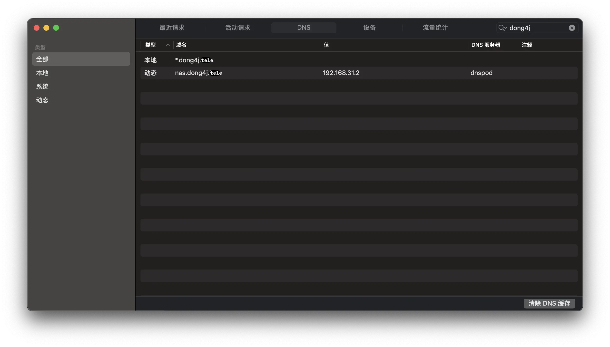

`*.dong4j.tele` 的 DNS 服务器已被成功修改为 `dnspod`.

脱离 Surge, 你可以写其他脚本来完成上述需求, 比如:

- 当网络发生变更时, 执行脚本直接修改 Surge Hosts 的配置, 然后使用 [Surge CLI 重载配置](https://manual.nssurge.com/others/cli.html) (通常 Surge 会在检测到配置文件改动后自动重载);

### 内部服务使用 HTTPS 访问

一些特殊的场景下需要通过 HTTPS 访问内部服务, 比如 Bitwarden, 本地部署的 LLM 提供的 OpenAI API 等, 另一个就是开发场景.

有一些开源项目可以直接使用:

- [nip.io](https://nip.io/)
- [localtls](https://github.com/Corollarium/localtls)
- [sslip.io](https://sslip.io/)

这里选择相对来说比较简单的方式来实现内网 HTTPS 访问.

#### mkcert 的安装与使用

```shell
# 安装
brew install mkcert

# 指定根证书存储路径
export CAROOT=/Users/dong4j/Synology/driver/NAS/Certs/mkcert
# 安装本地 CA 根证书
mkcert -install
# 为域名生成证书
mkcert "*.nas.tele" localhost 127.0.0.1 ::1
```

因为 HTTPS 证书只只支持二级以上的泛域名, 所以这里使用的是 `*.nas.tele`.

生成的证书在 `/Users/dong4j/Synology/driver/NAS/Certs/mkcert` 目录下:

```
$ mkcert "*.nas.tele" localhost 127.0.0.1 ::1

Created a new certificate valid for the following names 📜
 - "*.nas.tele"
 - "localhost"
 - "127.0.0.1"
 - "::1"

Reminder: X.509 wildcards only go one level deep, so this won't match a.b.nas.tele ℹ️
The certificate is at "./_wildcard.nas.tele+3.pem" and the key at "./_wildcard.nas.tele+3-key.pem" ✅
It will expire on 21 February 2027 🗓
```

在 NPM 上手动添加证书:

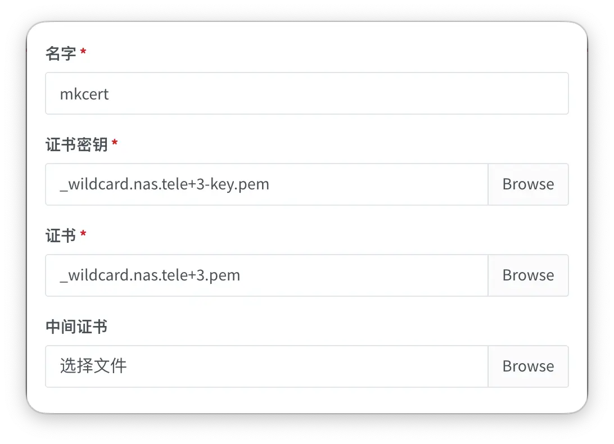

添加一个站点:

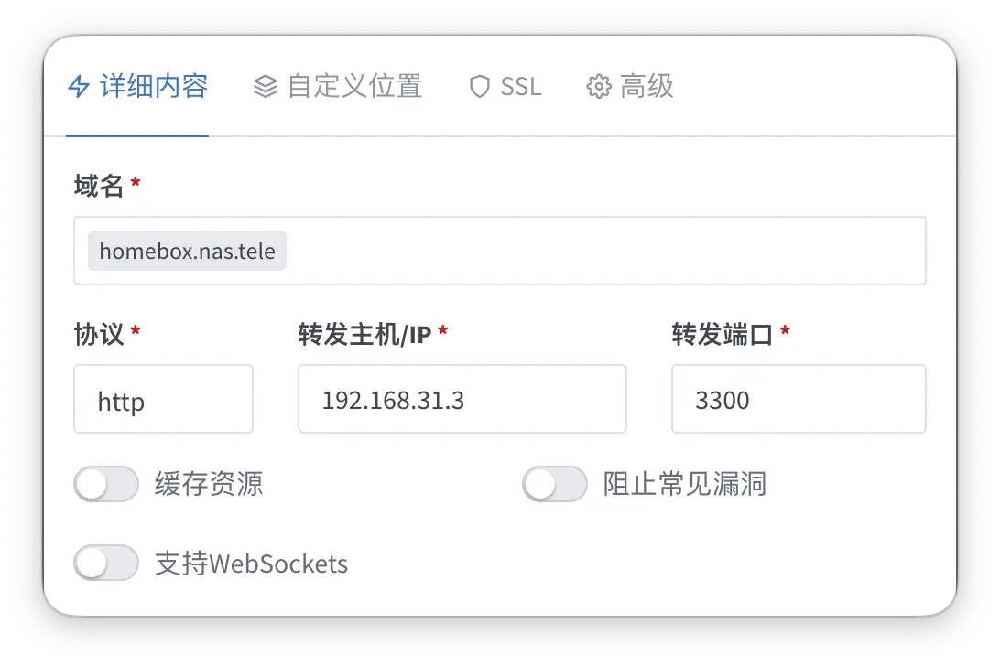

配置 HTTPS:

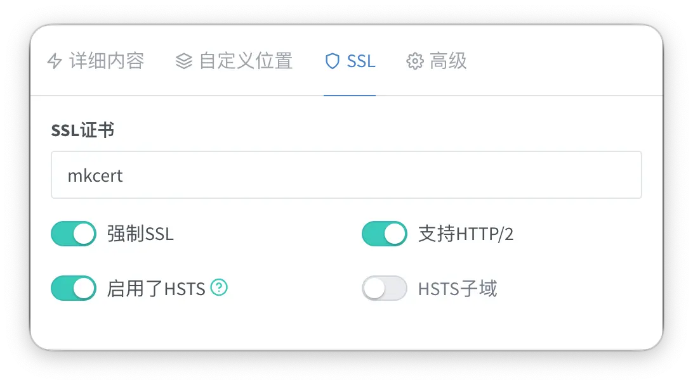

Surge 配置:

```
*.tele = 192.168.31.10
```

最终效果:

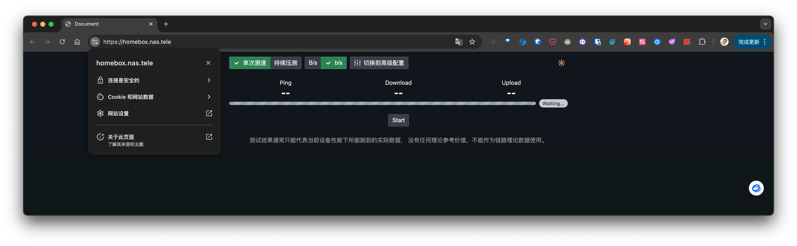

参考:

- [为 Homelab 环境创建自己的证书颁发机构 (CA)](https://support.tools/create-certificate-authority-homelab/)
- [使用 mkcert 工具生成受信任的 SSL 证书, 解决局域网本地 https 访问问题](https://cloud.tencent.com/developer/article/2191830)
- [教你秒建受信任的本地 SSL 证书, 彻底解决开发测试环境的无效证书警告烦恼！](https://cloud.tencent.com/developer/article/1514003)
- [SSL 之 mkcert 构建本地自签证书,整合 SpringBoot3](https://cloud.tencent.com/developer/article/2379654)

### 不暴露服务到公网

为了减少网络安全问题, 可以不将内网服务暴露到公网, 只在局域网环境使用. 那么这种情况下, 我们可以使用 **VPN** 的方式访问家中的设备和服务.

目前家用比较流行的有 [Tailscale](https://tailscale.com/) 和 [ZeroTier](https://www.zerotier.com/), 然后另选了几个竞品做了对比:

#### 功能对比

| **特性**           | [Tailscale](https://tailscale.com/) | [Headscale](https://github.com/juanfont/headscale) | [ZeroTier](https://www.zerotier.com/) | [NetBird](https://netbird.io/) | [Netmaker](https://www.netmaker.io/) |
| ------------------ | ----------------------------------- | -------------------------------------------------- | ------------------------------------- | ------------------------------ | ------------------------------------ |
| **类型**           | 商业工具, 免费计划可用              | 自托管的 Tailscale 替代                            | 商业工具, 社区免费计划可用            | 开源工具, 自托管               | 开源工具, 自托管                     |
| **协议**           | WireGuard                           | WireGuard                                          | 自定义协议                            | WireGuard                      | WireGuard                            |
| **P2P 支持**       | 是                                  | 是                                                 | 是                                    | 是                             | 是                                   |
| **需要公网服务器** | 可选                                | 是                                                 | 可选                                  | 是                             | 是                                   |
| **内网穿透能力**   | 强                                  | 强                                                 | 强                                    | 强                             | 强                                   |
| **平台支持**       | 全平台                              | 全平台 (与 Tailscale 类似)                         | 全平台                                | 全平台                         | 全平台                               |
| **用户界面**       | 图形化                              | CLI                                                | 图形化                                | 图形化                         | 图形化和 CLI                         |
| **开源**           | 部分开源 (客户端闭源)               | 开源                                               | 部分开源                              | 开源                           | 开源                                 |



##### Tailscale

- **优势**:
  - 使用 WireGuard, 提供高效、低延迟的加密通信.
  - 简单易用, 几乎零配置, 适合非技术用户.
  - 支持细粒度访问控制 (ACL) .
  - 提供免费计划, 可满足小型 HomeLab 的需求.
  - 内置 NAT 穿透, 适用于复杂网络环境.
- **劣势**:
  - 依赖 Tailscale 官方控制服务器 (可通过 Headscale 替代) .
  - 客户端闭源, 部分用户可能有隐私顾虑.

##### **Headscale**

- **优势**:
  - 开源的自托管版本 Tailscale 控制服务器, 完全免费.
  - 保留 Tailscale 的核心功能, 如 NAT 穿透和 ACL.
  - 数据完全本地掌控, 适合注重隐私的用户.
- **劣势**:
  - 无图形化界面, 需要通过 CLI 或 API 管理.
  - 自托管和运维门槛较高, 不适合小白用户.

##### **ZeroTier**

- **优势**:
  - 自定义协议, 性能优秀且可靠.
  - 支持高级网络功能, 如 SD-WAN 和多播.
  - 图形化界面友好, 适合小白和中小企业.
  - 社区免费计划可满足个人和小型团队需求.
- **劣势**:
  - 部分核心闭源.
  - 加密性能略逊于 WireGuard.

##### **NetBird**

- **优势**:
  - 完全开源, 基于 WireGuard 提供高效加密通信.
  - 类似 Tailscale, 更专注于自托管和隐私.
  - 支持 NAT 穿透, 适合跨网络设备通信.
- **劣势**:
  - 功能相较 Tailscale 略弱, 用户社区较小.
  - 管理工具和文档不够成熟.

##### **Netmaker**

- **优势**:
  - 完全开源, 支持 WireGuard, 性能强大且灵活.
  - 支持跨云和跨网络的大规模部署.
  - 提供企业级 VPN 服务功能.
- **劣势**:
  - 配置较复杂, 不适合非技术用户.
  - 自动 DNS 和服务发现功能需要手动设置.

#### 适用场景

| **场景**               | **推荐工具**                   | **理由**                                                                  |
| ---------------------- | ------------------------------ | ------------------------------------------------------------------------- |
| **HomeLab 或个人使用** | Tailscale / Headscale          | 简单易用, 零配置, 支持 ACL, 适合跨设备、跨网络的轻量级使用场景.           |
| **注重隐私与自托管**   | Headscale / NetBird / Netmaker | 开源工具, 数据完全掌控在本地.                                             |
| **企业级分布式网络**   | ZeroTier / Netmaker            | ZeroTier 提供强大的企业功能, Netmaker 适合需要自托管和跨云环境的企业场景. |
| **需要图形化管理**     | Tailscale / ZeroTier / NetBird | 图形界面便于管理, 适合用户规模不大的团队或个人.                           |
| **开源社区支持**       | Headscale / NetBird / Netmaker | 以开源为主, 社区活跃, 适合开发者和技术爱好者.                             |
| **跨复杂网络通信**     | Tailscale / ZeroTier / NetBird | 内置 NAT 穿透, 解决复杂网络环境下的连接问题.                              |

#### 总结

- **Tailscale** 和 **Headscale**: 适合轻量化和个人使用, 尤其是 HomeLab 用户.
- **ZeroTier**: 适合中小企业和对高级网络功能有需求的用户.
- **NetBird** 和 **Netmaker**: 更适合自托管和隐私敏感用户, Netmaker 在大规模部署场景表现优异.



尝试过 **ZeroTier** 并自建根服务器后, 感觉还是没有直接使用 WireGuard 来的方便, 所以上述构建虚拟局域网的方案全部放弃了, 改用最原始的 [WireGuard 来完成 VPN 搭建工作](#WireGuard).

参考:

- [更适合国内的远程访问方法: 自建根服务器打造基于 ZeroTier 虚拟内网 - 少数派](https://sspai.com/post/85130)
- [GitHub - xubiaolin/docker-zerotier-planet: 一分钟私有部署 zerotier-planet 服务](https://github.com/xubiaolin/docker-zerotier-planet)

### 临时暴露服务到公网

某些特殊情况下可能需要将服务暴露给其他人使用. 有可能内部服务不是全部都有认证授权功能, 可以使用 **WAF** 的 **身份认证功能** (**NPM** 也有相关功能) 为服务加上一层最基础的保护:

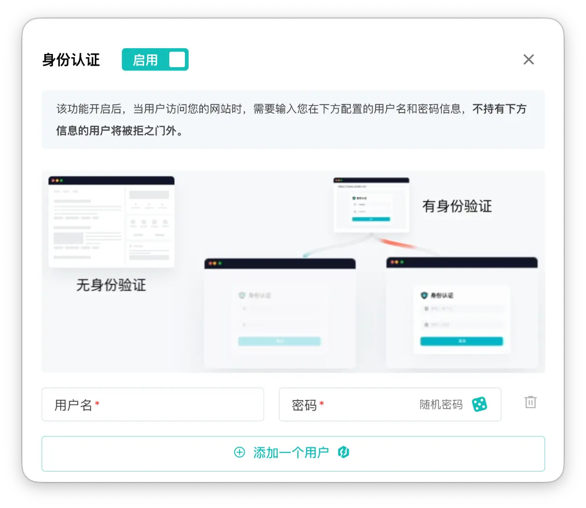

### 智能家居设备网络隔离

推荐阅读一下: [智能家居设备会带来哪些安全性问题?](https://sspai.com/post/69223)

我想过使用 VLAN 来隔离智能设备, 但是目前还没有硬件条件, 也没有时间调整目前的网络架构, 也许等后面规划好了 v2.0 版本再来水一篇文章.

理想中的应该是 [UniFi](https://ui.com/us/zh/introduction) 全家桶 + 独立机架 + 万兆内网.

<!--

没有成功显示视频









-->

---

## 广告过滤

### Surge

因为主要设备都是 Apple 硬件, 且都安装了 Surge, 可以方便的通过 Surge 去过滤绝大多数广告, 且广告规则可自动更新, 我目前使用的是 [blackmatrix7/ios_rule_script](https://github.com/blackmatrix7/ios_rule_script) 这个开源项目, 里面的规则集非常全面.

### AdGuard Home

其他设备上的广告则可以通过广告过滤服务来集中处理. 比较主流的广告过滤服务有 [AdGuard Home](https://adguard.com/zh_cn/adguard-home/overview.html) 和 [Pi-hole](https://pi-hole.net/) , 后者在国外比较流行, 目前我在 2 台 R2S 上部署了 **AdGuard Hom**e, 分别为电信和联通网络提供广告过滤服务.

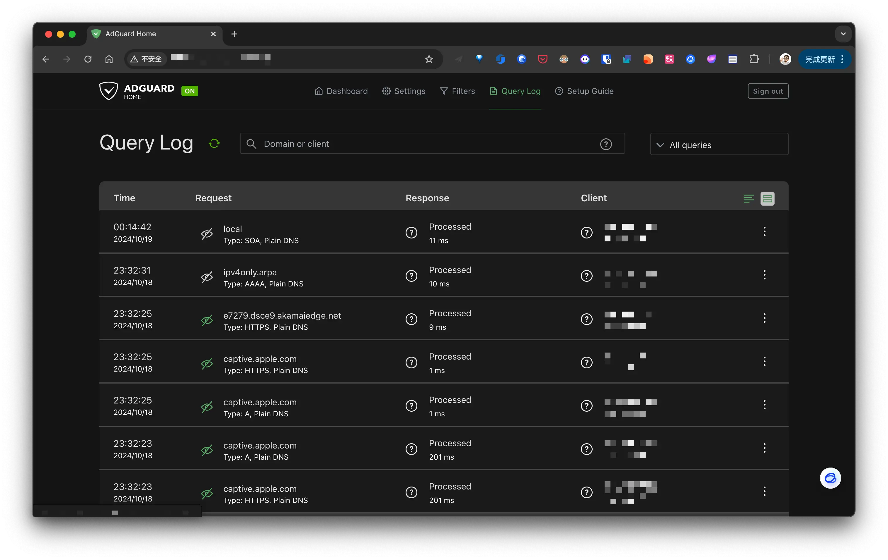

**AdGuard Home** 同样提供手机客户端.

因为是旁路由模式, 所以需要手动为客户端设置网关和 DNS:

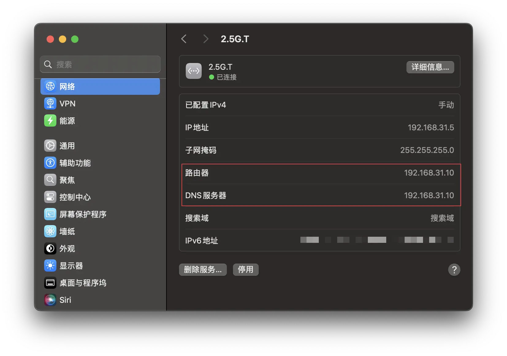

将路由器和 DNS 服务器全部设置为 **AdGuard Home** 所在服务器的 IP.

---

## 外网访问家庭网络

在开始这章之前, 有必要了解一下 [[nat-guide|NAT (Network Address Translation)]] <!-- 链接站内文章, 使用文件名, 不要后缀 -->

### WireGuard VPN

<!--

简单介绍一下, 并进行对比, 最好有个讨论链接 我记得
[WireGuard + Surge 异地组网实践](https://nxw.name/2023/wireguard)
[WireGuard 的搭建使用与配置详解](https://icloudnative.io/posts/wireguard-docs-practice/)
[WireGuard 教程: WireGuard 的搭建使用与配置详解](https://www.msl.la/archives/248/)
[WireGuard笔记(一) 节点安装配置和参数说明](https://www.cnblogs.com/milton/p/14178344.html)
[Ubuntu 的 WireGuard 教程](https://documentation.ubuntu.com/server/how-to/wireguard-vpn/peer-to-site/)
[Openwrt 下配置 WireGuard](https://www.ioiox.com/archives/143.html)
[Openwrt使用wireguard实现异地组网](https://blog.xianyu.one/2023/02/08/wireguard-connect/)
[WireGuard VPN 服务器自动设置脚本](https://github.com/hwdsl2/wireguard-install)
[macOS 上配置](https://docs.oakhost.net/tutorials/wireguard-macos-server-vpn/)
[另一篇国外的 macOS 配置](https://barrowclift.me/articles/wireguard-server-on-macos)
-->

#### 传统的 VPN 方案

##### OpenVPN


**OpenVPN** 是一种热门且高度安全的协议, 许多 VPN 提供商都使用这种协议. 它运行在 TCP 或 UDP 互联网安全协议上. TCP 能确保数据以正确的顺序完整传输, 而 UDP 则专注于更快的速度.

**优点**

- **开放源码, **这表示代码是公开的. 任何人都可以检查代码中是否存在可能危及 VPN 安全的隐藏后门或漏洞;
- **多功能性. **这种协议能与一系列不同的加密和流量协议一起使用, 可以针对不同的用途进行配置, 也可以根据需要进行安全或轻量的配置;
- **安全性. **能搭配各种加密协议, 因此非常安全;
- **绕过多数防火墙**: OpenVPN, 就能够轻松绕过防火墙;

**缺点**

- **设置复杂**: 多功能性意味着如果多数用户试图建立自己的 OpenVPN, 他们可能会因为复杂性而难以设置.

将用没必要上 **重量级的(相对 WireGuard 来说)** 的 OpenVPN, 专注主要功能即可.

##### L2TP/IPsec


L2TP (Layer 2 Tunneling Protocol) 和 IPSec (Internet Protocol Security) 是两种网络协议, 经常组合使用以提供安全的 VPN (虚拟专用网络) 连接:

- **L2TP** 用于建立隧道 (Tunneling) , 将数据封装在 VPN 隧道中传输.
- **IPSec** 用于加密和验证数据包, 确保数据的安全性和完整性.

这种组合方式被称为 **L2TP/IPsec**, 是一种常见的 VPN 协议, 用于在公共网络 (例如互联网) 上传输敏感数据, 需要占用 3 个端口:

- 使用 **UDP 500** 和 **4500** (NAT 穿越) 进行密钥交换 (IKE 协议) .
- L2TP 使用 **UDP 1701** 端口进行通信.

**优点**

- **安全性**: L2TP 根本不提供任何安全性, 但却相当安全. 这是因为它能搭配各种加密协议, 使协议按需要变得更安全或轻量.
- **广泛可用**: L2TP 在几乎适用于所有操作系统, 这代表管理员能轻易找到支持并使其运行.

**缺点**

- **可能已被美国国家安全局 (NSA) 破解**: 与 IKEv2 一样, L2TP 通常与 IPsec 搭配使用, 因此它也存在前面提到的漏洞.
- **速度慢**: 该协议封装数据两次, 这种方法对某些应用程序很有用, 但与只封装数据一次的其他协议相比, 速度较慢.
- **无法绕过防火墙**: 与其他 VPN 协议不同, L2TP 没有其他方法来穿过防火墙. 面向监视的系统管理员使用防火墙来封锁 VPN, 而自行设置 L2TP 的人很容易被封锁.

##### IKEv2/IPsec


**IKEv2 (Internet Key Exchange version 2) ** 是一种提供安全密钥交换会话的隧道协议, 该协议是微软和思科合作的成果. 与 L2TP 类似, 它通常与 IPsec 配对使用以提供身份验证和加密功能. 它由 **IETF RFC 7296** 定义, 是 IKE (Internet Key Exchange) 协议的改进版本.

IKEv2 的主要功能是协商和管理加密密钥, 确保通信双方能够以安全和高效的方式加密数据.

配置相对复杂, 特别是在手动部署服务器时, 且需要占用 2 个端口:

- **UDP 500**: IKEv2 的默认端口, 用于初始连接和 IKE 协商.
- **UDP 4500**: 当 NAT 穿越 (NAT-T) 被检测到时, IKEv2 切换到此端口.

**优点**

- **稳定性**: IKEv2/IPsec 使用一种名为 Mobility and Multi-homing Protocol (MOBIKE) 的技术, 当流量在互联网传输时, 该技术可确保建立 VPN 连接不中断, 使得 IKEv2/IPsec 成为移动设备最可靠和稳定的协议.
- **安全性**: 作为 IPsec 套件的一部分, IKEv2/IPsec 可与大多数加密算法配合使用, 使其成为最安全的 VPN 协议.
- **速度**: 运行时占用很少的宽带, 而且它的 NAT 穿透技术, 使其连接和通信更快速, 也有助于通过防火墙.

**缺点**

- **兼容性有限**: IKEv2/IPsec 与许多系统不兼容. 这对 Windows 用户来说不是问题, 因为微软参与制定此协议, 但其他操作系统则可能需要第三方软件才能支持.

因从 Wi-Fi 切换到移动数据时不会遗失 VPN 连接, **IKEv2/IPsec** 常用在移动设备端.

#### WireGuard 是什么


是整个 VPN 行业都在谈论的最新、最快速的通道协议. 这种协议使用最先进的加密技术, 使当前的领导者——OpenVPN 和 IKEv2/IPsec 黯然失色.

[**WireGuard**](https://github.com/pirate/wireguard-docs) 是由 `Jason Donenfeld` 等人用 `C` 语言编写的一个开源 VPN 协议, 被视为下一代 VPN 协议, 旨在解决许多困扰 `IPSec/IKEv2`、`OpenVPN` 或 `L2TP` 等其他 VPN 协议的问题.

WireGuard 声称其性能比大多数 VPN 协议更好, [但这个事情有很多争议](https://www.ipfire.org/blog/why-not-wireguard).

与在用户空间中运行的 OpenVPN 不同, WireGuard 的优势在于直接集成到 Linux 内核(5.6 开始)中. 这种集成使其能够更高效地处理数据包, 同时最大限度地减少用户空间和内核空间之间的上下文切换.


WireGuard 仅使用 UDP, 并且通常在 **单个端口上** 运行, 从而简化了其设置和操作. 这与 OpenVPN 形成对比, 后者可以使用 TCP 或 UDP, 并且可能需要根据配置管理多个端口. WireGuard 使用单一协议和端口, 降低了网络配置和防火墙规则的复杂性, 从而提高了整体性能.

然而精简就意味着功能缺失, [WireGuard 的局限性](https://www.ipfire.org/blog/why-not-wireguard), 只能说目前 WireGurad 方式对我来说完全够用.

**优点**

- **免费和开源**: 任何人都能查看代码, 这使得部署、稽核和调试更加容易.

- **精简且速度极快**: 仅由 4000 行代码组成, 是所有协议中“最精简”的协议. 相较之下, OpenVPN 代码行数是它的 100 倍.

  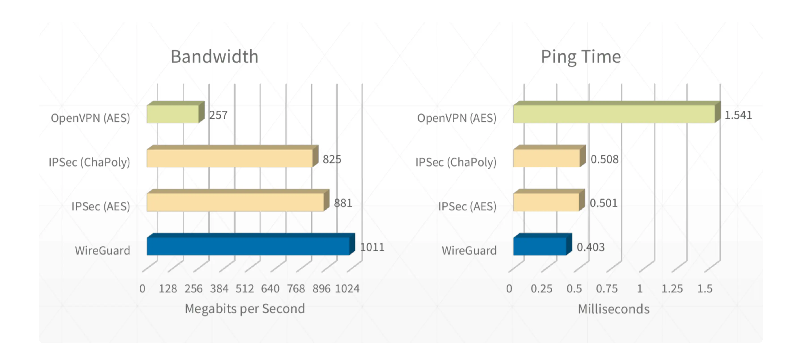

**缺点**

- **不完整**: WireGuard 有望成为“下一个大事件”, 但其实施仍处于早期阶段, 还有很大的改进空间. 目前, 它无法为用户提供任何级别的匿名性 (尽管完全匿名是不可能的) , 因此 VPN 提供商需要找到定制的解决方案, 在不损失速度的情况下提供必要的安全性.

**使用时机**: 每当需要速度优先时, 都可以使用 WireGuard: 流媒体、在线游戏或下载大型文件.

##### 相关链接

关于性能比较的更多信息可以参考下面几篇文档:

- [官方的基准测试](https://www.wireguard.com/performance/)
- [两台具有 10 Gb 以太网的服务器之间的 WireGuard 基准测试](https://www.reddit.com/r/linux/comments/9bnowo/wireguard_benchmark_between_two_servers_with_10/)

关于 WireGuard 加密的更多资料请参考下方链接:

- [WireGuard: 下一代内核网络隧道](https://www.wireguard.com/papers/wireguard.pdf)
- [《WireGuard 协议的密码学分析》](https://eprint.iacr.org/2018/080.pdf)
- [WireGuard 的安全性分析](https://courses.csail.mit.edu/6.857/2018/project/He-Xu-Xu-WireGuard.pdf)
- [WireGuard 技术分享](https://www.wireguard.com/talks/blackhat2018-slides.pdf)
- [WireGuard 评测: 新型 VPN 具有显著优势](https://arstechnica.com/gadgets/2018/08/wireguard-vpn-review-fast-connections-amaze-but-windows-support-needs-to-happen/)

下面是一些有助于密钥分发和部署的服务:

- [WireGuard 点对点连接的工具](https://pypi.org/project/wireguard-p2p/)
- [一组 Ansible 脚本, 简化 WireGuard 和 IPsec VPN 的设置](https://github.com/trailofbits/algo)
- [Streisand](https://github.com/StreisandEffect/streisand)
- [用 Bash 编写的 WireGuard 自动安装程序](https://github.com/its0x08/wg-install)
- [WireGuard 配置生成器](https://github.com/brittson/wireguard_config_maker)
- [Web 端 WireGuard 配置生成器](https://www.wireguardconfig.com)

---

#### WireGuard 使用场景

利用 WireGuard 可以组建非常复杂的网络拓扑, 根据网络环境的不同通常有多种配置方式:

##### 1. 端到端直接连接

这是最简单的拓扑, 所有的节点要么在同一个局域网, 要么直接通过公网访问, 这样 `WireGuard` 可以直接连接到对端, 不需要中继跳转.

##### 2. 局域网到外网

比如在家访问公司局域网, 或者在公司访问家庭局域网. 最简单的方案是通过公网暴露的一端作为服务端, 另一端指定服务端的公网地址和端口, 然后通过 `persistent-keepalive` 选项维持长连接, 让 NAT 记得对应的映射关系.

##### 3. 两端都位于 NAT 之后

**3.1 使用中继服务器**

大多数情况下, 当通信双方都在 NAT 后面的时候, NAT 会做源端口随机化处理, 直接连接可能比较困难. 可以加一个 **中继服务器**, 通信双方都将中继服务器作为对端, 然后维持长连接, 流量就会通过中继服务器进行转发.

**3.2 打洞**

上面也提到了, 当通信双方都在 NAT 后面的时候, 直接连接不太现实, 因为大多数 NAT 路由器对源端口的随机化相当严格, 不可能提前为双方协调一个固定开放的端口. 必须使用一个信令服务器 (`STUN `, [[nat-guide|自建 STUN Server?]]), 它会在中间沟通分配给对方哪些随机源端口. 通信双方都会和公共信令服务器进行初始连接, 然后它记录下随机的源端口, 并将其返回给客户端.

> 这就是现代 P2P 网络中 `WebRTC` 的工作原理. 有时候, 即使有了信令服务器和两端已知的源端口, 也无法直接连接, 因为 NAT 路由器严格规定只接受来自原始目的地址 (信令服务器) 的流量, 会要求新开一个随机源端口来接受来自其他 IP 的流量 (比如其他客户端试图使用原来的通信源端口) . 运营商级别的 NAT 就是这么干的, 比如蜂窝网络和一些企业网络, 它们专门用这种方法来防止打洞连接.

---

### WireGuard 配置实例

#### 点对点

常见的应用场景: 将一台计算机连接到远程网络, 并使其能够像在本地网络中一样访问所有资源. 例如连接到公司的内部网络, 远程提交代码, 访问公司内部的 Wiki 等; 远程连到家庭网络看个小电影, 听听 NAS 的无损音乐什么的.

远程 WireGuard 端点中的位置非常灵活. 它可以位于防火墙、路由器或其他任何网络设备上. 这意味着我们可以根据实际需求选择最合适的部署位置.

> 简单说明一下:
>
> **在 WireGuard 里, 客户端和服务端基本是平等的, 差别只是谁主动连接谁而已**.
>
> 双方都会监听一个 UDP 端口, 谁主动连接, 谁就是客户端. 主动连接的客户端需要指定对端的公网地址和端口, 被动连接的服务端不需要指定其他对等节点的地址和端口.
>
> 值得强调的是: **安装的 WireGuard 的服务器, 既可以作为服务端也可以作为客户端.**
>
> 后面我会直接是用 **服务端** 和 **客户端** 来简单区分不同的对端, 所以需要提前说明一下这个概念.

**网络拓扑图**:

```
                                 公网
                                xxxxxx             ppp0 ┌────────┐
          ┌────┐               Xxx   xxxx             ──┤ 路由器  │
          │    ├─ppp0         xxx      xx               └───┬────┘
          │    │              xx        x                   │         home 192.168.31.0/24
          │    │               xxx    xxx                   └───┬─────────┬─────────┐
          └────┘                 xxxxx                          │         │         │
                                                              ┌─┴─┐     ┌─┴─┐     ┌─┴─┐
                                                              │   │     │   │     │   │
                                                              │pi4│     │NAS│     │...│
                                                              │   │     │   │     │   │
                                                              └───┘     └───┘     └───┘
```

这幅图展示了典型的家庭/小型公司网络拓扑结构. 通常会有一个由 ISP 提供的光猫, 下面通过路由器拨号上网, 以及一些内部设备, 如 Raspberry PI、NAS 和其他设备.

**安装方法**:

可以选择以下两种方法之一来部署 WireGuard:

1. **在路由器上部署**: 如果使用 **OpenWrt** 作为主路由系统的话, 这是最常见且简单的的方法;
2. **在局域网中的另一个系统上部署**: 比如在公司可能没有权限对路由器做任何配置(但是申请 **开放一个端口映射** 还是可以的), 或者路由器无法安装 **WireGuard** 的时, 只能使用这种方式(比如我在公司部署了一台 R2S 小型服务器); 在家庭网络也采用这种方式(因为考虑到稳定性, 使用 AX9000 和 6500Pro 作为主路由且没有开启 root 权限, 只作为普通路由器使用)

**服务端和客户端**:

请注意, 在这种场景中部署的 **WireGuard** 我称为 **服务端**, 意思是不会有 **WireGuard Endpoint** 配置, Endpoint 配置应该在需要访问家庭/公司网络的外部设备上(主动连接家庭/公司网络中的 WireGuard 服务, 我称为 **客户端**).

> 我没有 **OpenWrt** 系统的主路由器, 所以需要在主路由上配置端口转发规则, 将指定流量转发到部署了 **WireGuard** 的内部服务器上.
>
> 如果你的主路由器是 OpenWrt 系统, 可以自行查阅配置方式, 方式都大同小异.

下面我将在 **Ubuntu**, **Armbian**, **NAS** 和 **R2S** (OpenWrt 系统, 作为二级路由器) 上部署 **WireGuard** 服务, 这些系统覆盖了大多数常见的系统类型, 以此来说明在各个系统上如何部署, 配置与使用 **WireGuard**.

值得推荐的 **WireGuard** 管理工具:

- [wg-easy](https://github.com/wg-easy/wg-easy): 简单易用的 **WireGuard 服务端**;

- [wireguard-ui](https://github.com/ngoduykhanh/wireguard-ui): 比前者稍微复杂一点, 不过功能更多;

---

##### Ubuntu

M920x 部署了 Ubuntu Server, 所以这里直接是用它来部署 **WireGuard**.

网络拓扑图 1: 只接入联通网络



1. 将 **10.10.1.0/24** 作为 **WireGuard** 的网络, 和现在的联通网络分开;
2. M920x 添加一个 **wg0** 网卡, 并使用 **10.10.1.1/32** (不需要自己去手动添加 **wg0** 网卡, **WireGuard** 部署启动成功后会自行添加);
3. 外网的 MBP 使用 **10.10.1.8/32** 作为它的 **WireGuard** 网络 IP;
4. 联通网络的 IP 段 为 **192.168.21.0/24**;

> 我们的目的是让在外网的 MBP 能通过 **WireGuard** 接入到 M920x 上部署的 **wg0** 网络, 并且能访问家中联通网络下的任意设备.
>
> 接下来就是无聊的安装部署与配置环节.
>
> 总体流程:
>
> 1. 安装 WireGuard;
> 2. 生成公钥和私钥;
> 3. 添加 wg0.conf 配置;
> 4. 配置防火墙和 IP 转发;
> 5. 添加 Peer 节点;
> 6. 客户端使用;

---

**WireGuard** 可从默认的 Ubuntu 软件源中获得:

```bash
sudo apt update
sudo apt install wireguard
```

这将安装 WireGuard 模块和工具, WireGuard 作为内核模块运行.

> 下面的操作都是 root 用户.

为 M920x 生成密钥:

```shell
mkdir /etc/wireguard
# 生成私钥
wg genkey > m920x-private.key
# 通过私钥生成公钥
wg pubkey < m920x-private.key > m920x-public.key
```

为 MBP 生成密钥:

```shell
wg genkey > mbp-private.key
wg pubkey < mbp-private.key > mbp-public.key
```

创建 **wg0.conf** 配置文件(是 **数字 0**, 不是字母 o, 我怕你字体有问题, 所以提醒一下):

```shell
[Interface]
Address = 10.10.1.1/32
ListenPort = 51000
PrivateKey = <M920x 的私钥: m920x-private.key>

[Peer]
# MBP
PublicKey = <MBP 的公钥: mbp-public.key>
AllowedIPs = 10.10.1.8/32
```

> 这里不要搞混了, Interface 填写的是当前主机的 **私钥**, 对等点(Peer) 填写的是其他设备的 **公钥**.

配置防火墙和 IP 转发 (`vim /etc/sysctl.conf`):

```shell
# 防火墙我直接关闭, 如果不关闭就要放行 51000 端口
sudo ufw allow 51000/udp
# 配置 IPv4 转发, 用于允许内核在网络接口间转发流量
net.ipv4.ip_forward = 1
# 如果需要在 IPv6 环境下启用 WireGuard, 还需要添加下面的配置
net.ipv6.conf.all.forwarding=1
```

> 使用 `sysctl -p` 使上述配置生效.

最后启动 **WireGuard**:

```shell
wg-quick up wg0

# 停止命令为:
wg-quick down wg0
```

启动成功后, 在 **M920x** 上使用 `ip a` 可以找到一个 **wg0** 的虚拟网卡, 大概是这样的:

```shell
wg0: <POINTOPOINT,NOARP,UP,LOWER_UP> mtu 1420 qdisc noqueue state UNKNOWN group default qlen 1000
  link/none
  inet 10.10.1.1/24 scope global wg0
     valid_lft forever preferred_lft forever
  inet6 fd45:da8::1/64 scope global
     valid_lft forever preferred_lft forever
```

MBP 的 **WireGuard** 配置 (macOS 下的 WireGuard 在 **非国区** App Store 免费下载):

```shell
[Interface]
PrivateKey = <MBP 的私钥: mbp-private.key>
Address = 10.10.1.8/32

[Peer]
PublicKey = <M920x 的公钥: m920x-public.key>
AllowedIPs = 10.10.1.0/24
Endpoint = <M920x 的公网域名, 比如 m920x.dong4j.tele:51000>
PersistentKeepalive = 25
```

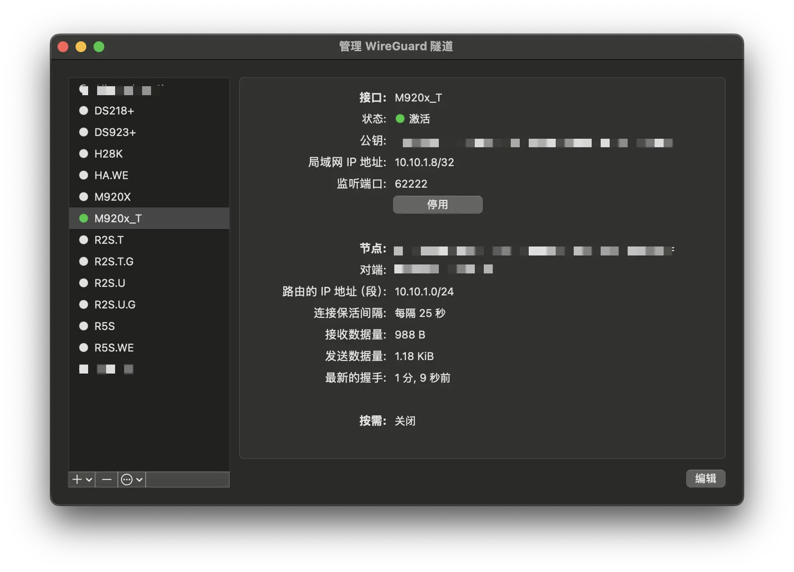

MBP 上 **WireGuard** 创建的网卡信息:

```
utun6: flags=8051<UP,POINTOPOINT,RUNNING,MULTICAST> mtu 1420
	options=6460<TSO4,TSO6,CHANNEL_IO,PARTIAL_CSUM,ZEROINVERT_CSUM>
	inet 10.10.1.8 --> 10.10.1.8 netmask 0xffffffff
```

然后我们可以是用 **ping** 来验证是否成功:

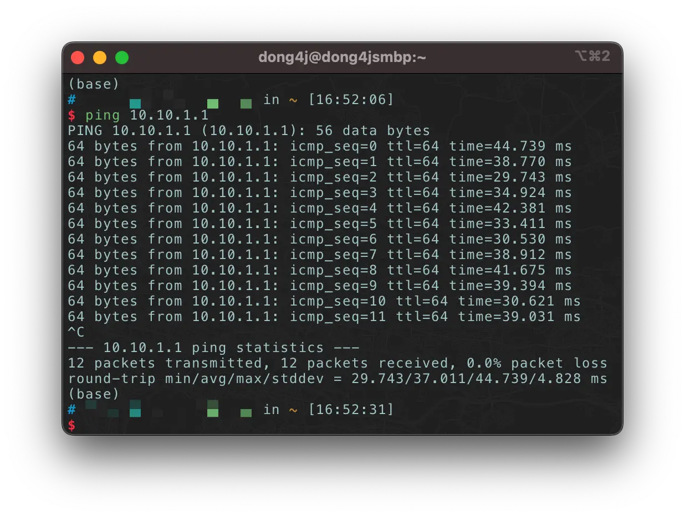

也能成功访问 M920x 上的服务:

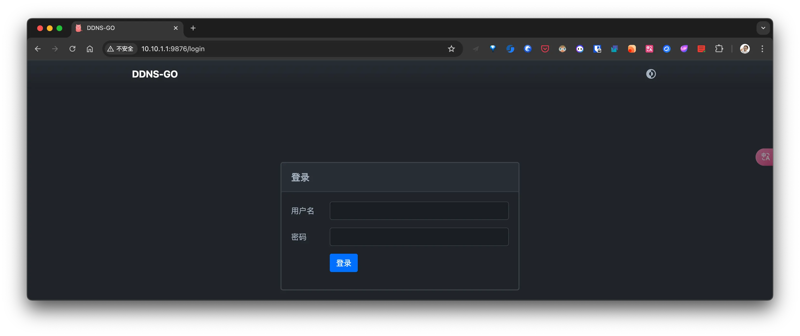

在 **M920x** 上使用 **wg** 查看 **WireGuard** 信息:

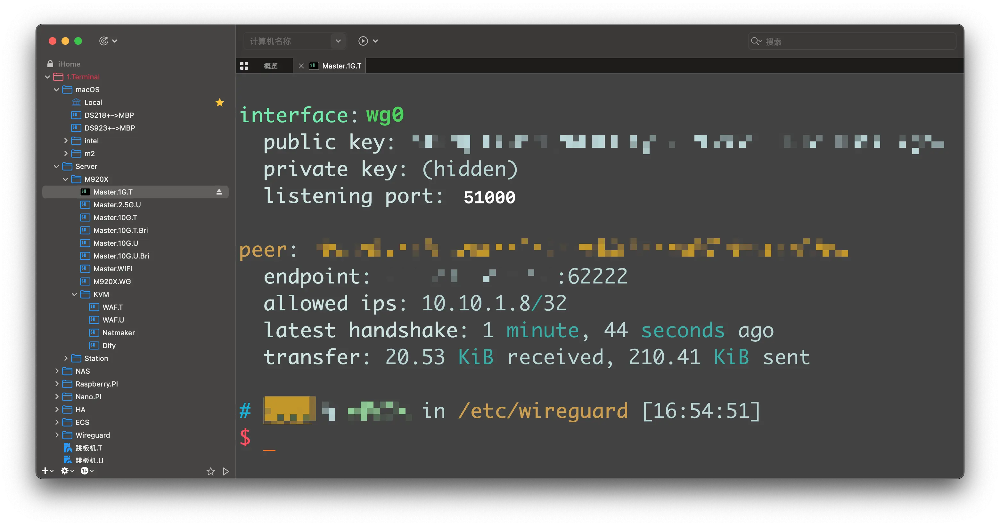

---

上述配置将局域网内的 M920x 和外网的 MBP 成功的加入到 **10.10.1.0/24** 这个局域网内, 但是目前也只能在这个子网内通信, 如果我想让 MBP 访问 M920x 所在的 **192.168.21.0/24** 这个局域网, MBP 则需要如下配置:

```shell
[Interface]
PrivateKey = <MBP 的私钥: mbp-private.key>
Address = 10.10.1.8/32

[Peer]
PublicKey = <M920x 的公钥: m920x-public.key>
AllowedIPs = 10.10.1.0/24, 192.168.21.0/24
Endpoint = <M920x 的公网域名, 比如 m920x.dong4j.tele:51000>
PersistentKeepalive = 25
```

`AllowedIPs = 10.10.1.0/24, 192.168.21.0/24` 表示: 来自 `10.10.1.0/24, 192.168.21.0/24` 的流量全部通过 **WireGuard** 的网卡(MBP 上的 utun6 网卡)发往 **M920x**, 我们来详细了解一下整个链路是怎样的:

1. MBP 请求 **http://192.168.21.1** 访问小米路由器的 WebUI;

2. 流量从 MBP 的 utun6 网卡发往 M920x:

   ```shell
   $ netstat -rn
   Routing tables

   Internet:
   Destination        Gateway            Flags               Netif Expire
   ...
   192.168.21         link#34            UCS                 utun6
   192.168.21.1       link#34            UHW3I               utun6     82
   ```

   

   1. 192.168.21

   - Destination: 目标网络 (网段) , 这里是 192.168.21, 通常表示子网.
   - Gateway: link#34 表示无需通过网关, 直接通过指定接口访问.
   - Flags:
     - U: 路由可达 (Up) .
     - C: 直接连接的网络 (Connected) .
     - S: 静态路由 (Static route) .
   - Netif: utun6 是虚拟网络接口, 常见于 VPN 或隧道连接.

   2. 192.168.21.1

   - Destination: 单个主机地址.
   - Gateway: link#34, 表示通过物理或虚拟接口访问.
   - Flags:
     - U: 路由可达.
     - H: 主机路由 (Host route) .
     - W3: 通常与 VPN 相关, 表示接口状态.
     - I: 可能是临时或动态的接口.
   - Netif: 使用 utun6 接口.
   - Expire: 82 表示该路由将在 82 秒后过期, 通常是动态路由.

   

3. 数据包进入主机后, 内核会检查: 如果数据包的目标端口是 **WireGuard** 配置的 UDP 监听端口 (51000) , 系统会将流量交给 wg0 接口进行解密, 否则就会被丢弃;

4. 解密后的流量会被系统路由表或 NAT 表处理, 决定最终的流量去向; 而 M920x 的路由表情况为:

   ```shell
   $ route -n
   内核 IP 路由表
   目标            网关            子网掩码        标志  跃点   引用  使用 接口
   0.0.0.0         192.168.21.1    0.0.0.0         UG    101    0        0 enx00e04c680012
   ...
   10.10.1.8       0.0.0.0         255.255.255.255 UH    0      0        0 wg0
   192.168.21.0    0.0.0.0         255.255.255.0   U     101    0        0 enx00e04c680012
   ...
   ```

   上面表示 **192.168.21.0** 的流量会通过 M920x 的 `enx00e04c680012` 网卡处理;

在 MBP 上使用 `traceroute 192.168.21.1` 查看一下请求路径:

```shell
$ traceroute 192.168.21.1
traceroute to 192.168.21.1 (192.168.21.1), 64 hops max, 40 byte packets
 1  10.10.1.1 (10.10.1.1)  35.225 ms  34.738 ms  35.507 ms
 2  192.168.21.1 (192.168.21.1)  37.286 ms  36.622 ms  38.947 ms
```

1. **第一跳**: `10.10.1.1` 是 WireGuard 隧道对端的虚拟 IP, 通常是服务器的 WireGuard 接口地址. 这说明流量通过 wg0 接口成功进入 WireGuard 隧道.

2. **第二跳**: `192.168.21.1` 是目标地址, 表明 WireGuard 隧道对端 (服务器) 接收了流量, 并通过服务器上的路由规则转发到了 `192.168.21.0/24` 子网.

而 M920x 的路由规则为:

```shell
$ ip route show 192.168.21.0/24
192.168.21.0/24 dev enx00e04c680012 proto kernel scope link src 192.168.21.7 metric 101
```

如果数据包的目标地址属于 `192.168.21.0/24` 子网, 并且没有其他更优的路由规则, 系统将通过 `enx00e04c680012` 接口发送这些数据包.

> 值得说明的是, `net.ipv4.ip_forward = 1` 这个配置是转发流量的关键.

---

因为我的 M920x 分别连接了电信(192.168.31.0/24) 和联通(192.168.21.0/24) 网络, 我的目的是通过 M920x 的 **WireGuard** 访问 2 个网络下的所有设备和服务,

网络拓扑图 2: 接入电信和联通网络



1. M920x 具备双网卡, IP 分别是 `192.168.31.7/32`(电信) 和 `192.168.21.7/32` (联通);
1. MBP 的 **WireGuard** IP 保持不变;

为了满足上述需求, 我们需要修改 MBP 的 WireGuard 客户端配置:

```shell
[Interface]
PrivateKey = <MBP 的私钥: mbp-private.key>
Address = 10.10.1.8/32

[Peer]
PublicKey = <M920x 的公钥: m920x-public.key>
AllowedIPs = 10.10.1.0/24, 192.168.21.0/24, 192.168.31.0/24
Endpoint = <M920x 的公网域名, 比如 m920x.dong4j.tele:51000>
PersistentKeepalive = 25
```

配置完成后, 即可访问家中 2 个内网中所有的设备.

**网卡优先级的问题** <a id="网卡优先级的问题" style="display:none;"></a>

上面的网络拓扑图我隐藏了一个细节: 只有在流量通过联通公网进入时才能访问家中的设备, 如果是从电信公网走, 你会发现 **WireGuard** VPN 通道都建立不上(这里的意思是指 MBP 的 WireGuard 配置中的 **Endpoint**, 联通配置的是 ` m920x.dong4j.unic:51000`, 电信配置的是 ` m920x.dong4j.tele:51000`).

原因是 **多网卡优先级导致的**:


**流量进入网卡后的具体流程**:

1. 电信网络握手请求：
   - 数据包从电信公网进入路由器，根据路由器上设置的端口映射将流量转发至 `192.168.31.7:51000`;
   - 数据包进入 M920x 的电信网卡 (`192.168.31.7`);
2. WireGuard 服务接收数据包：
   - WireGuard 接收请求，准备生成握手响应包。
3. 数据包从默认路由返回：
   - 因为联通网卡 (`192.168.21.7`) 的优先级高，握手响应包走联通网卡发出。
   - 响应包的源 IP 为联通公网 IP(`40.40.40.40`)，而客户端期待的是电信公网 IP(`20.20.20.20`)。
4. 客户端丢弃响应包：
   - 客户端验证响应包的源 IP (`40.40.40.40`)，发现与握手请求的目标 IP(`20.20.20.20`) 不一致，认为这是无效包。

WireGuard 的握手过程依赖 UDP 数据包，并且会严格检查响应包的以下属性：

1. 源 IP 必须与目标 IP 匹配：
   - 客户端发送握手请求时记录目标 IP（比如电信公网 IP）;
   - 如果服务端返回的包源 IP 是联通公网 IP，客户端无法将其与最初的请求匹配;
2. UDP 四元组验证：
   - 客户端会验证返回包的 UDP 四元组（源 IP、目标 IP、源端口、目标端口）;
   - 如果源 IP 不对，整个握手流程就失败;

> **M920x** 网卡优先级: enx00e04c680012(联通) > en01(电信)
>
> 当 WireGuard 服务端收到客户端的握手包时, 解密后需要发送回客户端, 因为 enx00e04c680012 (102.168.31.7) 优先级高于 en01, 所以会使用 enx00e04c680012(192.168.21.7) 网卡回复响应, 数据包经过联通路由器时, NAT 将源地址修改为联通公网 IP, 导致客户端无法验证响应包的源 IP, 最终握手失败.

---

**添加自启动**

```shell
systemctl enable wg-quick@{配置名}
```

你可以在同一台服务器上部署多个 WireGuard 服务, 所以可以配置多个自启动, 比如现在的配置是 `wg0.conf`, 那么 **配置名** 就是 `wg0`;

> 在清楚 **WireGuard** 的基础配置与使用流程后 , Linux 环境下推荐直接使用 [一键部署脚本](https://github.com/hwdsl2/wireguard-install) 来简化操作, 另一个 [一键部署脚本](https://github.com/angristan/wireguard-install).

---

##### NAS

NAS 需要安装 **WireGuard** SPK 包才能正常使用, 这里是 [各个 DMS 版本的 SPK 包下载地址](https://www.blackvoid.club/wireguard-spk-for-your-synology-nas/), 如果你不放心也可以按照教程自行编译.

我使用第三方套件仓库安装的方式部署:

在 **套件中心** 新增套件来源

1. 矿神: https://spk7.imnks.com/
2. SynoCommunity(同时推荐添加上这个, 有较多的第三方 SPK): https://packages.synocommunity.com/

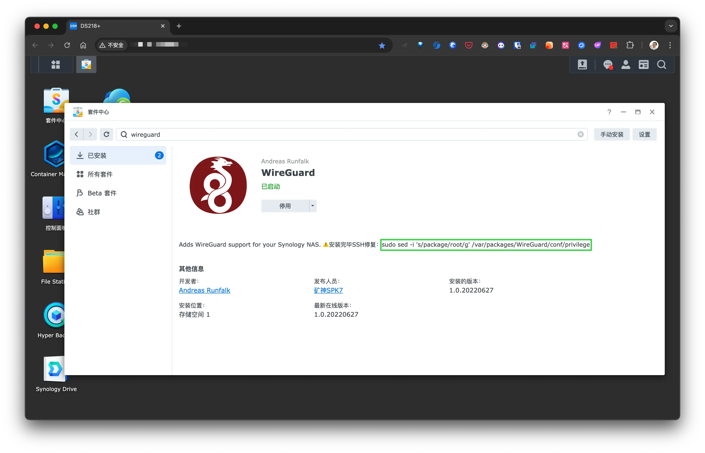

使用 SSH 登录 NAS, 然后按照要求执行一下:

```shell
sed -i 's/package/root/g' /var/packages/WireGuard/conf/privilege
```

修改完可以确定一下, 如果有问题还可以用 vi 去编辑:

```shell
root@DS218:~# cat /var/packages/WireGuard/conf/privilege
{
    "defaults": {
        "run-as": "root"
    }
}
```

为了能通过 **WireGuard** 访问电信和联通的内网, 还需要 IP 转发 (`vim /etc/sysctl.conf`):

```
# 配置 IPv4 转发, 用于允许内核在网络接口间转发流量
net.ipv4.ip_forward = 1
```

后续的配置与在 Ubuntu 上一致, 最后使用 `wg-quick up {配置名}` 启动即可, 不需要显式设置自启动, DSM 系统会自己启动.

---

##### OpenWrt

**OpenWrt** 同样支持可视化 UI 来配置 **WireGuard**, 且支持 **客户端** 模式.

推荐你直接刷自带 **WireGuard** 的 **OpenWrt 固件**, 如果没有你也可以按照下图所示去安装必要的软件包(可能需要替换软件源, 或直接通过 pkg 安装):

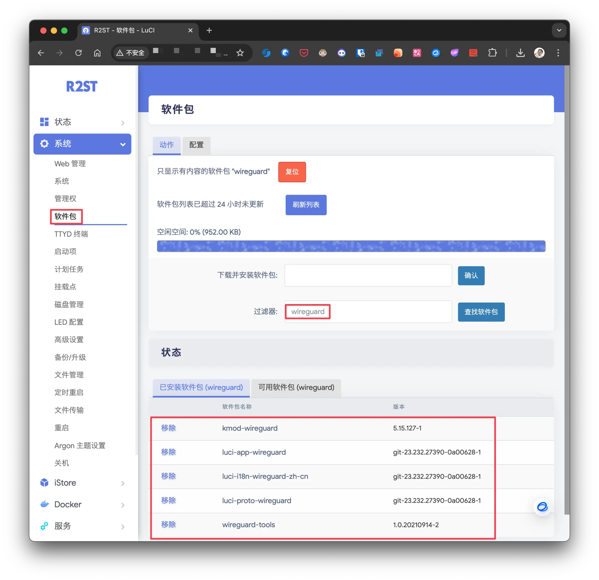

在 **网络-接口** 选项卡下新增一个 **WireGuard** 接口:

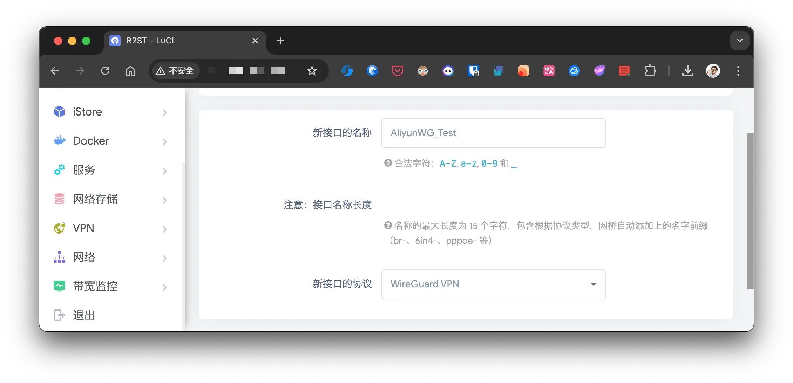

> 在某些 **OpenWrt** 系统中, 只能添加一个 **WireGuard** 接口, 比如 NanoPI 的 FriendlyWrt, 推荐你早点换掉, 不然后面无法玩儿更多的功能.

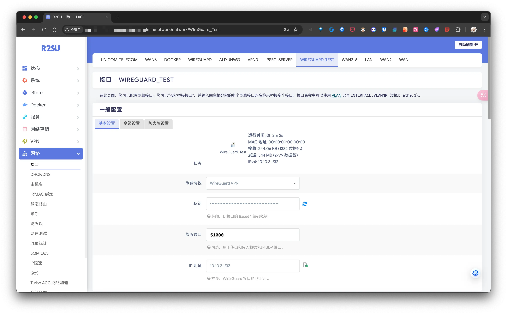

只需要填写 **私钥**, **监听端口** 和 IP 地址即可.

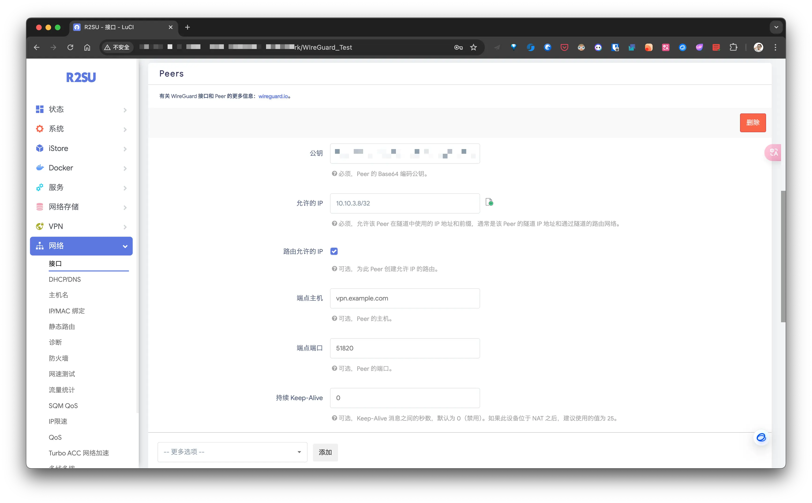

只需要填写 **公钥**, **允许的 IP**, **勾选路由允许的 IP** 即可, 其他 3 个可以在客户端配置上修改.

最后是配置防火墙, 允许 **51000** 进出即可(因为我把 **WireGuard_Test** 划分到 wan 区域了, 所以这里是 **wan**).


配置完成后, 最好重启一下 **WireGuard_Test** 接口, 最后配置客户端即可可到状态:


---

###### lan 改 wan 口

像 R2S, R5S 和 H28K 这类 OpenWrt 系统, 网口分别是一个 WAN 口一个 LAN 口(R5S 有 2 个 2.5G LAN 口, 1 个千兆 WAN 口, 但是我需要使用到 2 个 2.5G 的网口作为 WAN 口连接电信和联通网络), 为了满足通过一台设备即可同时访问家中的 2 个内网, 需要将 LAN 口改成 WAN 口.

我以 H28K 为例, 记录一下修改方式:

todo (等把 H28K 重新刷机再写)

---

##### wg-easy 部署

最简单的方式是使用 [wg-easy](https://github.com/wg-easy/wg-easy), 它支持在任何具有 WireGuard 内核的主机上使用 **Docker** 一键部署, 并自带 WebUI. 不过目前 **wg-easy** 还只能作为 **服务端** 使用, 幸运的是 [v15.0.0](https://github.com/wg-easy/wg-easy/milestone/4) 版本将开始支持 **客户端** 模式.

> 这里只是简要说明一下 **wg-easy** 的部署方式, 不会详细展开客户端的使用方式, 所以需要你具备一点 **WireGuard** 使用基础.

```yaml
volumes:
  etc_wireguard:

services:
  wg-easy:
    environment:
      - LANG=chs
      - WG_HOST={你的公网固定 ip 或 DDNS 的域名}
      # Optional:
      - PASSWORD_HASH={2 次 hash 后的密码}
      # - PORT=WebUI 管理端口, 默认为 51821
      # - WG_PORT=WireGuard 的 UDP 端口, 默认为 51820
      # - WG_CONFIG_PORT=92820
      - WG_DEFAULT_ADDRESS=10.10.8.x
      - WG_DEFAULT_DNS=223.5.5.5
      - WG_MTU=1420
      - WG_ALLOWED_IPS=192.168.31.0/24, 192.168.21.0/24, 10.10.8.0/24
      - WG_PERSISTENT_KEEPALIVE=25
      - WG_POST_UP=iptables -A FORWARD -i wg0 -j ACCEPT; iptables -A FORWARD -o wg0 -j ACCEPT; iptables -t nat -A POSTROUTING -o eth1 -j MASQUERADE; iptables -t nat -A POSTROUTING -o eth2 -j MASQUERADE
      - WG_POST_DOWN=iptables -D FORWARD -i wg0 -j ACCEPT; iptables -D FORWARD -o wg0 -j ACCEPT; iptables -t nat -D POSTROUTING -o eth1 -j MASQUERADE; iptables -t nat -D POSTROUTING -o eth2 -j MASQUERADE
      - UI_TRAFFIC_STATS=true
      - UI_CHART_TYPE=1 # (0 Charts disabled, 1 # Line chart, 2 # Area chart, 3 # Bar chart)

    image: ghcr.io/wg-easy/wg-easy
    container_name: wg-easy
    volumes:
      - etc_wireguard:/etc/wireguard
    ports:
      - "51820:51820/udp"
      - "51821:51821/tcp"
    restart: unless-stopped
    cap_add:
      - NET_ADMIN
      - SYS_MODULE
      # - NET_RAW # ⚠️ Uncomment if using Podman
    sysctls:
      - net.ipv4.ip_forward=1
      - net.ipv4.conf.all.src_valid_mark=1
```

> 更多的配置说明请查看官方文档.

需要说明的有 2 点:

- [密码生成方式](https://github.com/wg-easy/wg-easy/blob/master/How_to_generate_an_bcrypt_hash.md): 生成出的密码记得将每个`$`符号替换为两个`$$`符号;
- WG_POST_UP 和 WG_POST_DOWN: 因为我有 2 张网卡, 所以这里配置了 2 个 iptables;

添加一个客户端并下载配置, 或直接使用二维码导入到 WireGuard 的客户端. 最后一步就是在路由器上配置端口转发, 将 **51820** 的流量路由到 **wg-easy** 所在的服务器.

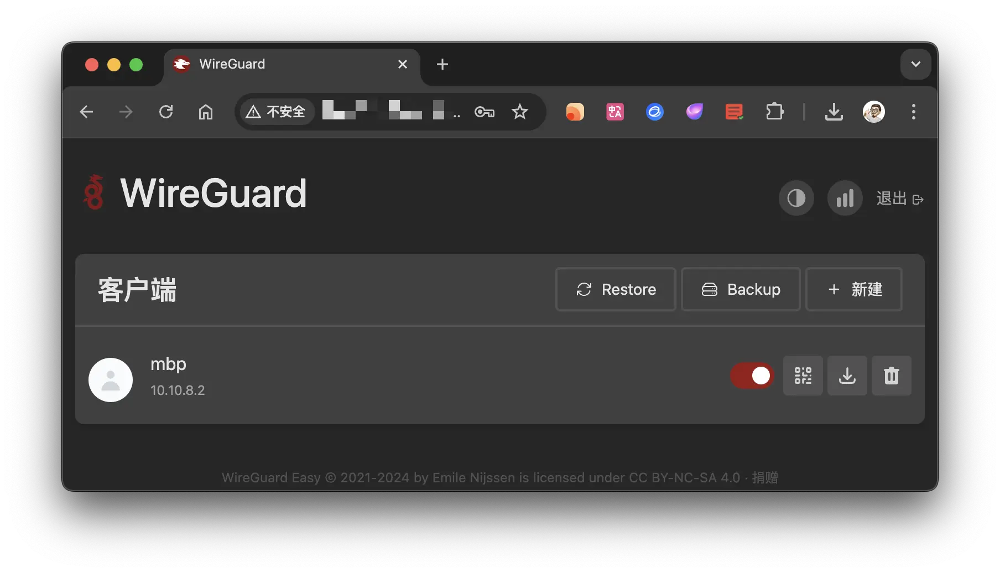

因为目前 **wg-easy** 的局限性, 更推荐使用手动配置的方式部署 **WireGuard**, 这种方式更加灵活, 能够支持更复杂的网络拓扑架构.

---

#### 中继

如果客户端和服务端都位于 NAT 后面, 需要加一个中继服务器, 客户端和服务端都指定中继服务器作为对等节点, 它们的通信流量会先进入中继服务器, 然后再转发到对端.


接下来将要实现以阿里云作为中继服务器, 并将流量转发到电信和联通内网, 下面是一些基础情况:

1. WireGuard 的虚拟我们设置为局域网为 `10.10.4.0/24`;
2. M920x 2 张网卡分别接入了电信和联通网络;
3. 外部设备(MBP) 能够在外部访问 `10.10.4.0/24` 和电信联通内网中的所有设备和服务;

**中继服务器配置如下**:

```shell
[Interface]
PrivateKey = <中继服务器私钥>
Address = 10.10.4.1/32
ListenPort = <端口号>
PostUp = iptables -A FORWARD -i %i -j ACCEPT; iptables -A FORWARD -o %i -j ACCEPT; iptables -t nat -A POSTROUTING -o eth0 -j MASQUERADE
PostDown = iptables -D FORWARD -i %i -j ACCEPT; iptables -D FORWARD -o %i -j ACCEPT; iptables -t nat -D POSTROUTING -o eth0 -j MASQUERADE

# MBP
[Peer]
PublicKey = <MBP 公钥>
AllowedIPs = 10.10.4.8/32

# M920X
[Peer]
PublicKey = <M920x 公钥>
AllowedIPs = 10.10.4.7/32, 192.168.31.0/24, 192.168.21.0/24
```

**M920x 配置如下 (前面已经有一个作为服务端的 wg0.conf 配置, 下面是新增的 wg-aliyun.conf 作为客户端的配置)**:

```shell
[Interface]
PrivateKey = <M920x 私钥>
Address = 10.10.4.7/32

[Peer]
PublicKey = <中继服务器公钥>
AllowedIPs = 10.10.4.0/24
Endpoint = 公网IP:<端口号>
PersistentKeepalive = 25
```

启动: `wg-quick up wg-aliyun`

**MBP 的配置如下**:

```shell
[Interface]
PrivateKey = <MBP 私钥>
Address = 10.10.4.8/32

[Peer]
PublicKey = <中继服务器公钥>
AllowedIPs = 10.10.4.0/24, 192.168.31.0/24, 192.168.21.0/24
Endpoint = 公网IP:<端口号>
PersistentKeepalive = 25
```

上述配置能让在外网的 MBP 通过中继服务器, 将 `192.168.31.0/24` 和 `192.168.21.0/24` 的流量转发到 M920x, 而 M920x 正好在内网, 可以通过本机网卡流量转发来访问 2 个网段, 这里就实现了上述需求.

在 MBP 本地执行 `traceroute 192.168.31.1` 来看看跃点路径:

```
$ traceroute 192.168.31.1
traceroute to 192.168.31.1 (192.168.31.1), 64 hops max, 40 byte packets
 1  10.10.4.1 (10.10.4.1)  12.971 ms  6.369 ms  6.320 ms
 2  10.10.4.7 (10.10.4.7)  10.887 ms  11.182 ms  11.753 ms
 3  192.168.31.1 (192.168.31.1)  12.963 ms  12.929 ms  17.214 ms
```

1. 第一跳来到了中继服务器(`10.10.4.1`);
2. 第二跳为 M920x (`10.10.4.7`);
3. 第三跳则是 M920x 的联通网关 (`192.168.31.1`);

接下来是整个流程的分析.

我们知道在 WireGuard 启动完成后, `[Peer]` 中的每个 IP 段都会被解析为一个路由, 下面是 **中继服务器的路由表**:

```
➜  ~ route -n
Kernel IP routing table
Destination     Gateway         Genmask         Flags Metric Ref    Use Iface
10.10.4.7       0.0.0.0         255.255.255.255 UH    0      0        0 wg0
10.10.4.8       0.0.0.0         255.255.255.255 UH    0      0        0 wg0
...
192.168.21.0    0.0.0.0         255.255.255.0   U     0      0        0 wg0
192.168.31.0    0.0.0.0         255.255.255.0   U     0      0        0 wg0
```

从上面我们可以看出我们配置的 IP 的流量都会通过 **wg0** 网卡发出.

而 MBP 的路由表如下所示:

```
$ netstat -rn
Routing tables

Internet:
Destination        Gateway            Flags               Netif Expire
...
10.10.4.0/24       link#45            UCS                 utun6
10.10.4.7          link#45            UHWIi               utun6
10.10.4.8          10.10.4.8          UH                  utun6
192.168.21         link#45            UCSI                utun6
192.168.31         link#45            UCSI                utun6
...
```

同样是创建了多条目标路由, 且由 WireGuard 网卡处理流量

而 M920x 只有一条:

```
$ route -n
内核 IP 路由表
目标            网关            子网掩码        标志  跃点   引用  使用 接口
0.0.0.0        192.168.31.1    0.0.0.0         UG    101    0        0 eno1
10.10.4.0      0.0.0.0         255.255.255.0   U     0      0        0 wg-aliyun
```

所以整个流程如下:

1. **MBP 发出流量**:

   - MBP 需要访问 192.168.31.0/24 网络, 流量的源地址为 10.10.4.8, 目标地址为 192.168.31.1.

   - 根据 MBP 的 WireGuard 配置, 192.168.31.0/24 属于 AllowedIPs 列表.

   - 该流量会被路由到 MBP 的 WireGuard 隧道, 发送到中继服务器.

     ```
     源地址: 10.10.4.8
     目标地址: 192.168.31.1
     出口设备: utun6
     ```

2. **中继服务器处理流量**:

   - 根据中继服务器的配置:

     - AllowedIPs 包括 192.168.31.0/24, 因此流量被转发到与 M920x 的 WireGuard 隧道.

   - 中继服务器上的 MASQUERADE 规则被触发, 将源地址改为中继服务器的 WireGuard 地址 10.10.4.1.

     ```
     源地址: 10.10.4.1 (经过 NAT 转换)
     目标地址: 192.168.31.1
     出口设备: wg0 (到 M920x)
     ```

3. **M920x 接收流量**:

   - M920x 收到从中继服务器来的流量:

     - 源地址为 10.10.4.1
     - 目标地址为 192.168.31.1

   - 根据 M920x 的 WireGuard 配置:

     - AllowedIPs 包含 192.168.31.0/24, 因此流量被路由到本地网络.

   - 流量离开 M920x, 进入其局域网接口 (eno1) , 并最终到达目标设备 192.168.31.1.

     ```
     源地址: 10.10.4.1
     目标地址: 192.168.31.1
     出口设备: eno1
     ```

4. **目标设备的响应**:

   - 目标设备 (192.168.31.1) 处理请求后, 发送响应回到源地址 10.10.4.1.

   - 响应流量返回到 M920x 的局域网接口.

     ```
     源地址: 192.168.31.1
     目标地址: 10.10.4.1
     出口设备: eno1
     ```

5. **M920x 返回中继服务器**:

   - 根据 WireGuard 隧道规则, 流量被发送回中继服务器.

     ```
     源地址: 192.168.31.1
     目标地址: 10.10.4.1
     出口设备: wg-aliyun
     ```

6. **中继服务器返回 MBP**:

   - 根据中继服务器的 NAT 规则, 恢复原始源地址, 将目标地址改为 10.10.4.8.

   - 响应流量被转发回 MBP.

     ```
     源地址: 192.168.31.1
     目标地址: 10.10.4.8
     出口设备: wg0 (到 MBP)
     ```

7. **MBP 接收响应**
   - MBP 收到从 192.168.31.1 返回的响应流量, 完成通信.

对于这种中继转发方式部署的 **WireGuard** 服务, 其中 PostUp 是关键:

```
PostUp = iptables -A FORWARD -i %i -j ACCEPT; iptables -A FORWARD -o %i -j ACCEPT; iptables -t nat -A POSTROUTING -o eth0 -j MASQUERADE
PostDown = iptables -D FORWARD -i %i -j ACCEPT; iptables -D FORWARD -o %i -j ACCEPT; iptables -t nat -D POSTROUTING -o eth0 -j MASQUERADE
```

用于配置流量转发和 NAT:

1. `iptables -A FORWARD -i %i -j ACCEPT`

   - 添加一条规则, 允许从 WireGuard 接口 (%i 会被 WireGuard 自动替换为实际接口名, 如 wg0) 进入的流量被转发.
   - 目的: 确保来自 VPN 客户端的流量能够通过服务器转发.

2. `iptables -A FORWARD -o %i -j ACCEPT`

   - 添加一条规则, 允许从其他网络流出的流量被转发到 WireGuard 接口.
   - 目的: 允许外部网络的数据包返回到 VPN 客户端.

3. `iptables -t nat -A POSTROUTING -o eth0 -j MASQUERADE`
   - 在 NAT 表的 POSTROUTING 链中添加一条规则, 对通过 eth0 接口的流量进行地址伪装.
   - 目的: 将 VPN 客户端的私有 IP (如 10.10.4.0/24) 伪装成服务器的 eth0 公网 IP, 便于访问互联网或外部网络.

#### 打洞

上面的 **中继服务器** 是通过转发流量的方式达到异地访问的目的, 比如可以将公司和家庭网络打通, 组成一个大的局域网, 达到异地互访的效果.

但是打洞则不同, 这里的中继服务器有点像 **Dubbo** 中的 **Zookeeper**, 起到一个注册中心的作用, 不转发流量, 当隧道打通后, 两端是通过 **直连** 访问的.

看过 [[nat-guide|NAT (Network Address Translation)]] 之后肯定清楚打洞的原理, 只要隧道被打通后, 在 NAT 记录失效之前(UDP 约 30 秒)更新 **WireGuard** 的配置并建立连接就可以直接通信, 实现细节可以参考这篇博客: [WireGuard Endpoint Discovery and NAT Traversal using DNS-SD](https://www.jordanwhited.com/posts/wireguard-endpoint-discovery-nat-traversal/), 很有启发意义.

<!--
[上一篇的翻译](https://icloudnative.io/posts/wireguard-endpoint-discovery-nat-traversal/)
-->

---

#### WireGuard 客户端

各大应用商店直接搜 **WireGuard** 即可, 免费好用. 但是会存在一个问题: **只能同时开启一个客户端配置**, 对我我这种有多个服务端且需要做复杂均衡的需求就满足不了, 所以官方的客户端就没在使用了, 接下来我将在 Surge 上配置多个 WireGuard 服务端, 且根据网络情况自动选择最优的服务端.

##### Surge 上配置 WireGuard

Surge 配置 WireGuard 非常简单:

```
[WireGuard 节点名]
private-key = <客户端私钥>
self-ip = 客户端 IP (不用加子网掩码, 比如 10.10.4.8)
dns-server = 自定义
mtu = 1420
peer = (public-key = <服务端公钥>, allowed-ips = "0.0.0.0/0, ::/0", endpoint = <服务端公网 IP>:<端口>, preshared-key = <预共享密钥, 没有就不加>, keepalive = 45)
```

**allowed-ips** 我这里配置是所有流量, 后续会通过 **Rule** 来分流特定流量.

然后在 **Proxy** 节点下使用此节点:

```
🧬 Node = wireguard, section-name=节点名, test-url=可以是你内网的 IP(比如 http://192.168.31.1), ip-version=v4-only

🛜 AX9000 = direct, test-url=http://192.168.31.1, test-timeout=1
```

最后配置相应的规则:

```
[Rule]
# 所有来自 192.168.31.0/24 的请求全部使用 WireGuard 处理
OR,((IP-CIDR,192.168.31.0/24,no-resolve), (DOMAIN-SUFFIX,xxx)),🧬 Node
...
```

上述是一个最基础的配置, 其他更多的配置和注意事项可查看 [官方教程](https://manual.nssurge.com/policy/wireguard.html).

我的配置稍微复杂一点, 需求大致如下:

1. 在公司(异地)能访问家里的电信和联通内网;
2. 在公司访问公司内网走直连, 不走 WireGuard;
3. 在家能访问公司内网;
4. 在家访问电信和联通内网走直连, 不走 WireGuard;
5. 如果只连接了电信或联通其中某一个内网, 也能通过 WireGuard 访问另一个内网;

为了满足上述需求, 我们需要结合 Surge 的 **fallback** 和 **subnet** 相关的特性, 下面是具体配置.

1. 配置 **WireGuard** 节点:

   

   ```
   [WireGuard H28K]
   private-key = <客户端私钥>
   self-ip = 客户端 IP (不用加子网掩码, 比如 10.10.4.8)
   dns-server = 自定义
   mtu = 1420
   peer = (public-key = <服务端公钥>, allowed-ips = "0.0.0.0/0, ::/0", endpoint = <服务端公网 IP>:<端口>, preshared-key = <预共享密钥, 没有就不加>, keepalive = 25)

   [WireGuard R2S.T]
   private-key = <客户端私钥>
   self-ip = 客户端 IP (不用加子网掩码, 比如 10.10.4.8)
   dns-server = 自定义
   mtu = 1420
   peer = (public-key = <服务端公钥>, allowed-ips = "0.0.0.0/0, ::/0", endpoint = <服务端公网 IP>:<端口>, preshared-key = <预共享密钥, 没有就不加>, keepalive = 25)

   [WireGuard R2S.U]
   private-key = <客户端私钥>
   self-ip = 客户端 IP (不用加子网掩码, 比如 10.10.4.8)
   dns-server = 自定义
   mtu = 1420
   peer = (public-key = <服务端公钥>, allowed-ips = "0.0.0.0/0, ::/0", endpoint = <服务端公网 IP>:<端口>, preshared-key = <预共享密钥, 没有就不加>, keepalive = 25)

   [WireGuard R5S]
   private-key = <客户端私钥>
   self-ip = 客户端 IP (不用加子网掩码, 比如 10.10.4.8)
   dns-server = 自定义
   mtu = 1420
   peer = (public-key = <服务端公钥>, allowed-ips = "0.0.0.0/0, ::/0", endpoint = <服务端公网 IP>:<端口>, preshared-key = <预共享密钥, 没有就不加>, keepalive = 25)

   [WireGuard M920X]
   private-key = <客户端私钥>
   self-ip = 客户端 IP (不用加子网掩码, 比如 10.10.4.8)
   dns-server = 自定义
   mtu = 1420
   peer = (public-key = <服务端公钥>, allowed-ips = "0.0.0.0/0, ::/0", endpoint = <服务端公网 IP>:<端口>, preshared-key = <预共享密钥, 没有就不加>, keepalive = 25)

   [WireGuard DS218+]
   private-key = <客户端私钥>
   self-ip = 客户端 IP (不用加子网掩码, 比如 10.10.4.8)
   dns-server = 自定义
   mtu = 1420
   peer = (public-key = <服务端公钥>, allowed-ips = "0.0.0.0/0, ::/0", endpoint = <服务端公网 IP>:<端口>, preshared-key = <预共享密钥, 没有就不加>, keepalive = 25)

   [WireGuard DS923+]
   private-key = <客户端私钥>
   self-ip = 客户端 IP (不用加子网掩码, 比如 10.10.4.8)
   dns-server = 自定义
   mtu = 1420
   peer = (public-key = <服务端公钥>, allowed-ips = "0.0.0.0/0, ::/0", endpoint = <服务端公网 IP>:<端口>, preshared-key = <预共享密钥, 没有就不加>, keepalive = 25)

   [WireGuard R2S.C]
   private-key = <客户端私钥>
   self-ip = 客户端 IP (不用加子网掩码, 比如 10.10.4.8)
   dns-server = 自定义
   mtu = 1420
   peer = (public-key = <服务端公钥>, allowed-ips = "0.0.0.0/0, ::/0", endpoint = <服务端公网 IP>:<端口>, preshared-key = <预共享密钥, 没有就不加>, keepalive = 25)

   [WireGuard Aliyun]
   private-key = <客户端私钥>
   self-ip = 客户端 IP (不用加子网掩码, 比如 10.10.4.8)
   dns-server = 自定义
   mtu = 1420
   peer = (public-key = <服务端公钥>, allowed-ips = "0.0.0.0/0, ::/0", endpoint = <服务端公网 IP>:<端口>, preshared-key = <预共享密钥, 没有就不加>, keepalive = 25)
   ```

   

2. 配置 **Proxy** 节点:

   ```
   [Proxy]
   🍺 阿里云 = wireguard, section-name=Aliyun ip-version=v4-only
   # ########## home ###########
   🛜 AX9000 = direct, test-url=http://192.168.31.1, test-timeout=1
   🛜 6500 = direct, test-url=http://192.168.21.1, test-timeout=1

   # test-url 和 test-udp 交错, 用于验证双网卡是否正常
   # | 🌤️ H28K | 🦠 R2S.T | 🧬 R2S.U | 🎊 R5S | 🤿 M920X | 🎉 DS218+ | 👺 DS923+ |
   # |   联通  |    电信  |    联通   |   电信  |   联通   |    电信   |     联通  |
   🌤️ H28K = wireguard, section-name=H28K, test-url=http://192.168.31.1, ip-version=v4-only
   🦠 R2S.T = wireguard, section-name=R2S.T, test-url=http://192.168.21.1, ip-version=v4-only
   🧬 R2S.U = wireguard, section-name=R2S.U, test-url=http://192.168.31.1, ip-version=v4-only
   🎊 R5S = wireguard, section-name=R5S, test-url=http://192.168.21.1, ip-version=v4-only
   🤿 M920X = wireguard, section-name=M920X, test-url=http://192.168.31.1, ip-version=v4-only
   🎉 DS218+ = wireguard, section-name=DS218+, test-url=http://192.168.21.1, ip-version=v4-only
   👺 DS923+ = wireguard, section-name=DS923+, test-url=http://192.168.31.1, ip-version=v4-only
   # ########## home ###########

   # ########## work ###########
   🛜 H3C = direct, test-url=http://192.168.100.1, test-timeout=1
   🧩 R2S.C = wireguard, section-name=R2S.C, test-url=http://192.168.100.1, test-timeout=1
   # ########## work ###########

   🌐 全球直连 = direct
   🚫 拒接连接 = reject
   ```

   `test-url` 表示通过 WireGuard 隧道能访问的地址, 这里直接访问路由器的 WebUI 来测试, 如果愿意折腾的话, 也可以在 HomeLab 自建 CaptivePortal 检测服务.

   🛜 AX9000 和 🛜 6500 都是直连, 且测试地址是路由器网关; 同理 🛜 H3C 的测试地址是公司内网的网关.

3. 配置 **Proxy Group** 节点:

   ```
   [Proxy Group]
   🤿 Team = fallback, 🍺 阿里云

   🦠 ALL.in.One = url-test, 🛜 AX9000, 🛜 6500, 🌤️ H28K, 🦠 R2S.T, 🧬 R2S.U, 🎊 R5S, 🤿 M920X, 🎉 DS218+, 👺 DS923+, 🛜 H3C, 🧩 R2S.C, no-alert=true, interval = 600
   🏠 iHome = url-test, 🌤️ H28K, 🦠 R2S.T, 🧬 R2S.U, 🎊 R5S, 🤿 M920X, 🎉 DS218+, 👺 DS923+, tolerance=30, interval = 600
   💼 Company = url-test, 🧩 R2S.C, tolerance=30, interval = 600

   # mini-intel 开启 surge ponte
   🖥️ P.Intel = url-test, DEVICE:MINI-INTEL, hidden=true
   🖥️ P.TV = url-test, DEVICE:APPLETV, hidden=true

   🤿 Auto.T = fallback, 🛜 AX9000, 🏠 iHome, 🖥️ P.Intel, 🖥️ P.TV, no-alert=true
   🥋 Auto.U = fallback, 🛜 6500, 🏠 iHome, 🖥️ P.Intel, no-alert=true

   🚙 Work = subnet, default = 💼 Company, "192.168.100.1" = 🛜 H3C
   ```

对于家庭网络直接是用 **fallback** 来处理, 表示优先是用 🛜 AX9000 和 🛜 6500, 因为前者是直连模式, 连接测试通过则表示连接了家庭网络, 则直接使用直连 模式; 如果没有连接家庭内网测试会失败, 则回退到第二个规则:🏠 iHome 组, 而 🏠 iHome 组 是由多个 **WireGuard** 节点组成, 会选择延迟最低的一个连接到 家庭网络.

公司网络则使用 `subnet` 处理, 表示如果当前网络的网关是 `192.168.100.1` (公司主路由器), 则使用 💼 Company 组中延迟最低的节点, 现在只有 1 个, 后 面还可以扩展.

4. 配置 **Rule** 节点:

   ```
   [Rule]
   OR,((IP-CIDR,192.168.31.0/24,no-resolve), (DOMAIN-SUFFIX,tele)),🤿 Auto.T
   OR,((IP-CIDR,192.168.21.0/24,no-resolve), (DOMAIN-SUFFIX,unic)),🥋 Auto.U
   # ############################ work #############################
   OR,((IP-CIDR,192.168.100.0/24,no-resolve),(DOMAIN-SUFFIX,yy.xxx.com), (DOMAIN-SUFFIX,xxx.info)),🚙 Work
   ```

   这就简单了, 根据 IP 或域名分流. 其中 **tele** 和 **unic** 是我自定义的内网域名, 分别对应电信和联通网络.

上述配置后, 2 个内网分别由多台服务器提供 WireGuard 节点, 因为 [网卡优先级的原因](#网卡优先级的问题) 分别划分到电信和联通宽带入口, 因为每台服务器至少存在 2 个网口且分别连接电信和联通内网, 所以我只要任意连接一台服务器就能访问家中 2 个网络, 多台设备起到负载均衡的作用且不会因为单点故障访问不了家庭网络(停电不算).

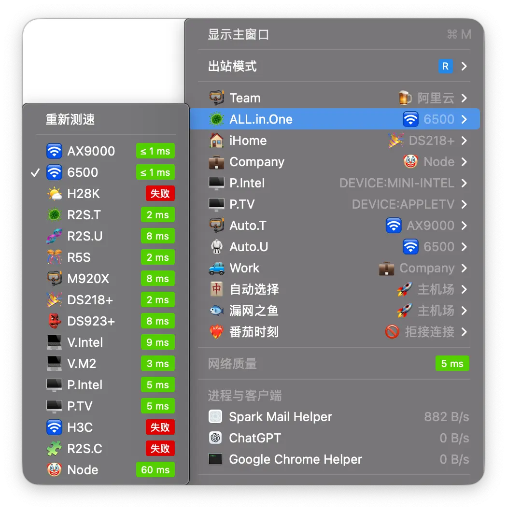

> 关于更多的 Surge 配置, 后续应该还会有文档输出.

---

### WireGuard 配置详解

<!--
看这个 https://icloudnative.io/posts/wireguard-docs-practice/
这个也看一下 https://www.msl.la/archives/248/
官方文档翻译: https://cshihong.github.io/2020/10/11/WireGuard%E5%9F%BA%E6%9C%AC%E5%8E%9F%E7%90%86/
[WireGuard 白皮书解读](https://www.zhihu.com/column/c_1498091755665240064)
-->

#### 详细配置

**服务端**:

```ini
[Interface]
# [可选] 是否将 Endpoint 持久化到配置文件中, 默认为 false
SaveConfig = false
# [必须] 当前节点在 WireGuard 虚拟局域网的 IP
Address = 10.10.1.1/32
# [必须] 服务端监听的端口
ListenPort = 51820
# [必须]
PrivateKey = <服务端密钥>
# [可选] 客户端将会使用这里指定的 DNS 服务器来处理 VPN 子网中的 DNS 请求, 但也可以在客户端中覆盖此选项
DNS = 1.1.1.1,8.8.8.8
# [可选] 定义 VPN 子网使用的路由表, 默认不需要设置, Table = auto (默认值)
# 这里的 Table 是指: /etc/iproute2/rt_tables
# 可以使用 ip route add default via 10.10.1.1 dev eno1 table 12345 来手动添加
Table = 12345
# [可选] 默认不需要设置, 一般由系统自动确定
MTU = 1500
# [可选] 启动 VPN 接口之前运行的命令. 这个选项可以指定多次, 按顺序执行
PreUp = /bin/example arg1 arg2 %i
# [可选] 启动 VPN 接口之后运行的命令. 这个选项可以指定多次, 按顺序执行
PostUp = /bin/example arg1 arg2 %i
# [可选] 停止 VPN 接口之前运行的命令. 这个选项可以指定多次, 按顺序执行
PreDown = /bin/example arg1 arg2 %i
# [可选] 停止 VPN 接口之后运行的命令. 这个选项可以指定多次, 按顺序执行
PostDown = /bin/example arg1 arg2 %i

# Peer: 定义能够为一个或多个地址路由流量的对等节点 (peer) 的 VPN 设置
[Peer]
# [必须] 允许该对等节点 (peer) 发送过来的 VPN 流量中的源地址范围, 分别在流量出站和入站时匹配并进行响应的处理
AllowedIPs = 10.10.1.2/32
# [必须]
PublicKey = <客户端公钥>
# [可选] 根据场景配置
PersistentKeepalive = 25
# [可选] 预共享密钥, 使用此选项为 VPN 添加另一层加密保护
# 使用 wg genpsk 生成预共享密钥, 客户端的 Peer 节点需要配置相同的密钥
PresharedKey = xxxx
```

**客户端**:

```ini
[Interface]
# [必须]
PrivateKey = +AbVMFfuV/b6WbZub9mxaza+YY7qHXA8QhW1wjouZng=
# [必须]
Address = 10.10.1.2/32
# [可选] 覆盖服务端 DNS 配置
DNS = 1.1.1.1,8.8.8.8
# [可选] 配置后将使用固定端口, 不在随机
ListenPort = 51820
# 其他的可选字段参考 服务端配置

[Peer]
# [必须]
PublicKey = p4U7Q+tz0brH/RFUU+4yFVL7LcrxNFfMBe+NgYiOYj8=
# [必须]
AllowedIPs = 10.10.1.0/24, 192.168.21.0/24, 192.168.31.0/24
# [必须]
Endpoint = <homelab.site:port>
# [可选] 根据场景配置
PersistentKeepalive = 25
```

#### Address: 24 vs 32

<!--

这个解释了: https://ubuntu.com/server/docs/introduction-to-wireguard-vpn

-->

我看网上其他博客说 **如果是中继服务器, 就需要将服务端的 Address 配置成 /24 子网**, 但是我测试过 **/32** 子网也不会出现问题, 那么 **Address** 究竟定义的是什么, 带着这个疑问, 我们来看看不同配置下路由的具体情况:

**Address = 10.10.1.1/32 时**:

```shell
$ wg-quick up wg1
[#] ip link add wg1 type wireguard
[#] wg setconf wg1 /dev/fd/63
[#] ip -4 address add 10.10.1.1/32 dev wg1
[#] ip link set mtu 1420 up dev wg1
[#] ip -4 route add 10.10.1.9/32 dev wg1
[#] ip -4 route add 10.10.1.8/32 dev wg1
```

启动 WireGuard 后, 自动执行的操作如下:

1. 创建名为 wg1 的 WireGuard 接口;
2. 从配置文件加载 WireGuard 的 peer 信息和密钥配置;
3. 给接口 wg1 分配 10.10.1.1/32 的 IP 地址;
4. 计算适当的 MTU (如果需要, 可以在配置中覆盖, WireGuard 推荐 1420) ;
5. 配置静态路由, 使 10.10.1.9 和 10.10.1.8 的流量通过 wg1 接口;

添加的路由为:

```shell
$ ip route show
...
10.10.1.8 dev wg1 scope link
10.10.1.9 dev wg1 scope link
...
```

意思是: **任何指向 10.10.1.8 或 10.10.1.9 的流量将直接通过 wg1 接口发送, 无需经过网关**.

**Address = 10.10.1.1/24 时**:

```shell
$ wg-quick up wg1
[#] ip link add wg1 type wireguard
[#] wg setconf wg1 /dev/fd/63
[#] ip -4 address add 10.10.1.1/24 dev wg1
[#] ip link set mtu 1420 up dev wg1
```

添加的路由为:

```shell
$ ip route show
...
10.10.1.0/24 dev wg1 proto kernel scope link src 10.10.1.1
...
```

这条路由表示: **所有指向 10.10.1.0/24 网络的流量将通过 wg1 接口直接发送, 且数据包的源地址为 10.10.1.1.**

和配置 **/24** 子网的唯一区别就是使用 `10.10.1.0/24` 代替了单独配置的 `10.10.1.8`和 `10.10.1.9`, 然后我们看一下 **10.10.1.1** 如何路由:

```shell
$ ip route get 10.10.1.1
local 10.10.1.1 dev lo table local src 10.10.1.1 uid 0
    cache <local>

$ ip route show table local

# /32 子网输出如下
local 10.10.1.1 dev wg1 proto kernel scope host src 10.10.1.1

# /24 子网输出如下
local 10.10.1.1 dev wg1 proto kernel scope host src 10.10.1.1
broadcast 10.10.1.255 dev wg1 proto kernel scope link src 10.10.1.1
```

不管如何配置, 都是使用 local 路由表, 不同的是 **/24** 多了一条广播配置, 意思是当要向广播地址 10.10.1.255 发送数据包时, 流量会直接通过 wg1 接口广播到同一子网内的其他设备.

**所以我只是想确认一个问题: /32 和 /24 子网分别在什么场景下使用**:

| **场景**                   | **推荐子网** | **理由**                                  |
| -------------------------- | ------------ | ----------------------------------------- |
| 点对点中继                 | `/32`        | 精确控制目标路由, 减少广播, 提升安全性.   |
| 多点或子网中继             | `/24`        | 适合多个设备在同一子网通信, 简化路由管理. |
| 需要节省路由表资源         | `/32`        | 只处理特定 IP, 避免大范围广播.            |
| 需要全网自动发现和广播通信 | `/24`        | 允许所有同一子网的设备自动互联.           |

综上所述, **服务端的 Address 配置只是代表当前节点在局域网中的设备 IP. 如果非要说影响, 我觉得只能是创建的路由数量不同导致的占用系统资源不同罢了.**

> 所以个人建议如果只是少量设备, 直接配置成 /32 子网即可, 至于什么才是 **少量设备** 就需要自己去定夺了, 反正我 10+ 节点全部配置成了 /32 子网.

---

#### AllowedIPs 的作用

<!--

说一下请求与响应的细节 https://zh-wireguard.com/#conceptual-overview

-->

简单来说: **当发送数据包时, AllowedIPs 列表表现为一种路由表, 而当接收数据包时, 允许的 IP 列表表现为一种访问控制列表**:

前面我们已经知道启动 WireGuard 后, 会将 AllowedIPs IP 列表添加到路由表;

1. 发送数据时根据这个路由表选择合适的节点加密数据并发送;
2. 接受到数据时先解密, 成功后还需要对比指定节点的 AllowedIPs IP 列表与数据表的源地址是否匹配;

为了更好地理解 **WireGuard** 如何处理数据包的传输和安全性, 我们将详细介绍其加解密过程, 这将帮助我们深入理解 `AllowedIPs` 参数的重要性.

**发送数据(加密过程)**:

1.  **生成会话密钥**:

    - 每个 WireGuard 对等方 (客户端和服务端) 在建立连接时会使用 **Curve25519** 算法生成 **共享密钥** (Diffie-Hellman 密钥交换) .
    - 这个密钥交换基于双方的公钥和私钥来生成会话密钥, 该密钥是对称的, 意味着双方都能用它加密和解密数据.
    - 假设客户端的私钥为 sk_c, 公钥为 pk_c, 服务端的私钥为 sk_s, 公钥为 pk_s. 双方会通过交换公钥并用对方的公钥与自己私钥生成一个共享的会话密钥.

2.  **加密数据**:

    - 数据包会使用 **ChaCha20** 算法进行加密. 使用共享的会话密钥来加密发送的数据.
    - **Poly1305** 用于数据包的认证, 确保数据在传输过程中未被篡改. 它会生成一个消息验证码 (MAC) , 并附加到加密数据上.
    - 加密的过程使用的是流加密的方式, 通过会话密钥生成的伪随机流来加密数据.

3.  **封装数据包**:

    - 加密后的数据会被封装成 WireGuard 数据包, 其中包括:

      - 目标地址
      - 加密后的有效负载
      - 消息认证码 (MAC)
      - 发送者的身份标识

4.  **发送数据包**:
    - 数据包会通过 UDP 发送到目标的远程端点 (例如, IP 地址和端口) .

**接收数据(解密过程)**:

1. **接收数据包**:

   - 接收方通过 UDP 收到一个数据包, 这个数据包可能是加密的.

2. **验证消息认证码(MAC)**:

   - 解密前, 接收方会先使用 **Poly1305** 算法检查数据的完整性, 确保数据包在传输过程中未被篡改.
   - 如果验证失败, 数据包会被丢弃.

3. **解密数据**:

   - 如果消息验证通过, 接收方使用 **ChaCha20** 算法与共享密钥解密数据.
   - 共享密钥是通过双方的公钥和私钥生成的 Diffie-Hellman 会话密钥来解密数据.
   - 解密后, 恢复出原始的明文数据.

4. **检查数据包的来源**:
   - 解密后, 接收方还需要检查数据包的来源. 如果数据包是来自一个未被授权的源, 或者不符合接收方的安全策略, 数据包将被丢弃.

---

客户端在发送数据时, 会通过 **AllowedIPs** 选择 Peer 节点(源地址 IP 和 AoolwedIPs 匹配), 然后使用确定的 Peer **会话密钥**(服务端的公钥和 Peer 的私钥通过 **Curve25519** 生成)对数据进行加密;

当数据到达服务端时, 会用所有已知客户端的会话密钥逐一尝解密并试验证消息完整性,一旦匹配到有效的会话密钥, 即可确认数据包是由对应的客户端发送, 解密后的数据包中有源地址(IP Header) 中, 这时服务端的 WireGuard 就会将源地址和客户端的 **AllowedIPs** 进行匹配, 如果相同或在允许的子网内, 则接受数据包;

当服务端处理完后需要向客户端发送响应数据时, 服务端会查看响应数据的目标 IP, 并将其与每个客户端的 **AllowedIPs** 列表进行比较, 以确定将其发送到哪个客户端.

以上就是 WireGuard 的加解密过程, 从中我们可以明确 **AllowedIPs** 的作用.

那么问题来了:

1. 不同的 Peer 可以有相同的 **AllowedIPs** 吗？即 Peer1 和 Peer2 的 **AllowedIPs** 都为 `1.1.1.1/32` 或者都为 `1.1.1.0/24`;
2. 如果一个 Peer 的 **AllowedIPs** 包含了另外一个 Peer 的 **AllowedIPs**, 那么会落到哪个 Peer 上？即 Peer1 的 **AllowedIPs** 为 `1.1.1.0/24`, Peer2 的 **AllowedIPs** 为 `1.1.1.1/32`, 目的 IP 为 `1.1.1.1/32` 的包会发送给 Peer1 还是 Peer2 呢？

为了解释上面的问题, 我们来看一下 **AllowedIPs** 的具体实现: WireGuard 使用前缀树来维护 **AllowedIPs**, 下面是实现逻辑:

```go
func (node *trieEntry) lookup(ip []byte) *Peer {
  // 用来存储找到的最近匹配的 Peer
	var found *Peer
  // IP 地址的长度, 通常是 4 (IPv4) 或 16 (IPv6)
	size := uint8(len(ip))
  // 如果目标 IP 与当前节点的前缀匹配长度大于等于当前节点的 CIDR, 继续往下走
	for node != nil && commonBits(node.bits, ip) >= node.cidr {
    // 如果当前节点关联了一个 Peer, 更新 found, 表示找到了一个更匹配的 Peer.
		if node.peer != nil {
			found = node.peer
		}
    // 如果已检查完目标 IP 的所有字节, 结束查找
		if node.bitAtByte == size {
			break
		}
    // 根据当前 IP 地址的某一位决定往左子树 (0) 还是右子树 (1) 继续查找
		bit := node.choose(ip)
    // 跳到子树节点
		node = node.child[bit]
	}
	return found
}
```

**整体流程**:

1. **逐层比较前缀**: 从根节点开始, 逐层比较 IP 地址的前缀部分, 确认是否匹配当前节点.
2. **更新匹配的** Peer: 如果当前节点匹配目标 IP 且关联 Peer, 将 Peer 记录下来.
3. **选择子树继续匹配**: 根据 IP 地址的位信息, 选择左子树或右子树.
4. **返回最终匹配**: 返回最长前缀匹配的 Peer.

---

如果 Peer1 的 **AllowedIPs** 为 10.10.1.0/24, Peer2 的 **AllowedIPs** 为 10.10.1.2/32, Peer3 的 **AllowedIPs** 为 192.168.31.0/24, 目的 IP 为 10.10.1.2/32, 它的前缀树看起来是这样子的:

```
                                         [root]
                                         /    \
                                  10.* ( )   192.* ( )
                                    |             \
                                 10.10.* ( )    168.*
                                    |               \
                              10.10.1.* (Peer1)    31.* (Peer3)
                                    |
                              10.10.1.2/32 (Peer2)
```

所以对于上面 2 个问题的答案是:

1. 不能, 最后添加的 Peer 会覆盖前面的 Peer;
2. 第一次匹配到 `10.10.1.*`, 找到 `10.10.1.0/24`(Peer1), 然后再次匹配到 `10.10.1.2/32`(Peer2), 所以最后应该使用 **Peer2** 节点.

---

#### 持久化 Endpoint

在服务端有这么一个配置:

```
[Interface]
# [可选] 是否将 Endpoint 持久化到配置文件中, 默认为 false
SaveConfig = false
```

如果设置为 true, 则会在必要时将最新的 Peer 的公网 IP 和端口写入到配置文件中:

1. 正常断开连接时:

   当 WireGuard 接口被关闭 (例如使用 wg-quick down 命令时) , WireGuard 会自动将当前连接的状态, 包括对等端的 **Endpoint** 信息, 写入到配置文件中.

2. 系统重启或服务重启时:

   如果系统重启或 wg-quick 服务重启, WireGuard 会在重启前保存当前连接的状态, 包括 **Endpoint** 信息.

3. 动态更改时:

   如果 WireGuard 通过接收到的数据包自动更新了对等端的 **Endpoint** (例如, 通过 NAT 穿越时发生远程端点 IP 或端口的变化) , 并且此时连接被手动断开或接口被重启, 最新的端点信息将被写入配置文件.

我们一般不会直接去配置服务端配置节点中的 EndPoint, 而客户端必须配置, 这样才能知道数据包应该发送到哪里, 而 WireGuard 需要知道回复的数据包应该发送给谁, 所以需要将接受到的数据包中的源地址 IP 和端口记下来, 而如果客户端的出口公网 IP 端端口变化了, 则服务端就会动态去更新指定节点的 Endpoint.

---

#### DDNS 问题

WireGuard 只会在启动时解析域名, 如果你使用 `DDNS` 来动态更新域名解析, 那么每当 IP 发生变化时, 就需要重新启动 WireGuard. 粗暴点的解决方案是使用 `PostUp` 钩子每隔几分钟或几小时重新启动 WireGuard 来强制解析域名.

> Linux 上内核实现的 WireGuard , 内核 API 只接受 AF_INET 或 AF_INET6 的 endpoint 地址, 所以域名是在用户态由 wg 配置工具在配置时刻解析的, 那么 DDNS 的话, 解析记录更新内核也无法感知. 还需要用户态的 daemon 监测并更新配置.

幸运的是, wireguard-tools 提供了一个示例脚本 `reresolve-dns.sh`, 它可以解析 WG 配置文件并自动重置端点地址. 需要定期运行 `reresolve-dns.sh /etc/wireguard/wg.conf` 以从已更改其 IP 的端点中恢复. 一种方法是通过 systemd 计时器每三十秒更新一次所有 WireGuard 端点:



```shell
#!/bin/bash
# SPDX-License-Identifier: GPL-2.0
# Copyright (C) 2015-2020 Jason A. Donenfeld <Jason@zx2c4.com>. All Rights Reserved.

# 启用错误捕获, 一旦出错, 脚本将立即退出
set -e

# 启用无大小写匹配和扩展模式
shopt -s nocasematch
shopt -s extglob

# 设置语言环境为 C, 确保脚本在不同语言环境下行为一致
export LC_ALL=C

# 获取第一个参数作为配置文件名
CONFIG_FILE="$1"

# 如果参数是合法的文件名, 则使用 /etc/wireguard 路径下的配置文件
[[ $CONFIG_FILE =~ ^[a-zA-Z0-9_=+.-]{1,15}$ ]] && CONFIG_FILE="/etc/wireguard/$CONFIG_FILE.conf"

# 使用正则提取接口名称 (从文件名中提取)
[[ $CONFIG_FILE =~ /?([a-zA-Z0-9_=+.-]{1,15})\.conf$ ]]
INTERFACE="${BASH_REMATCH[1]}"

# 处理每个 Peer 的函数
process_peer() {
	# 只有当处于 [Peer] 段且 PublicKey 和 Endpoint 不为空时才处理
	[[ $PEER_SECTION -ne 1 || -z $PUBLIC_KEY || -z $ENDPOINT ]] && return 0

	# 检查 WireGuard 最新握手时间是否超过 135 秒
	[[ $(wg show "$INTERFACE" latest-handshakes) =~ ${PUBLIC_KEY//+/\\+}\	([0-9]+) ]] || return 0
	(( ($EPOCHSECONDS - ${BASH_REMATCH[1]}) > 135 )) || return 0

	# 更新 Peer 的 endpoint (wg set wg0 peer "公钥" endpoint "最新 IP")
	wg set "$INTERFACE" peer "$PUBLIC_KEY" endpoint "$ENDPOINT"
	reset_peer_section
}

# 重置 Peer 段信息
reset_peer_section() {
	PEER_SECTION=0
	PUBLIC_KEY=""
	ENDPOINT=""
}

# 初始化 Peer 段
reset_peer_section

# 逐行读取配置文件
while read -r line || [[ -n $line ]]; do
	# 去除注释部分
	stripped="${line%%\#*}"

	# 提取键和值, 并去除首尾空格
	key="${stripped%%=*}"; key="${key##*([[:space:]])}"; key="${key%%*([[:space:]])}"
	value="${stripped#*=}"; value="${value##*([[:space:]])}"; value="${value%%*([[:space:]])}"

	# 如果是新的段落, 处理当前 Peer 并重置段落状态
	[[ $key == "["* ]] && { process_peer; reset_peer_section; }

	# 如果进入 [Peer] 段, 设置标志
	[[ $key == "[Peer]" ]] && PEER_SECTION=1

	# 如果处于 [Peer] 段, 提取 PublicKey 和 Endpoint 信息
	if [[ $PEER_SECTION -eq 1 ]]; then
		case "$key" in
		PublicKey) PUBLIC_KEY="$value"; continue ;;
		Endpoint) ENDPOINT="$value"; continue ;;
		esac
	fi
done < "$CONFIG_FILE"

# 处理最后一个 Peer
process_peer
```

这个脚本用于自动更新 WireGuard 中继服务器配置文件中的 Peer 的 Endpoint, 当最新握手时间超过 135 秒时, 通过 wg set 更新 Peer 的 Endpoint 信息.

**主要步骤**:

1. 读取配置文件路径, 并根据输入参数确定具体路径和接口名称;
2. 使用 process_peer 函数检查每个 Peer, 根据握手时间判断是否需要更新;
3. 通过正则匹配提取 PublicKey 和 Endpoint, 然后动态调整 WireGuard 配置;



**下面是使用官方脚本的方式**:

```shell
git clone https://git.zx2c4.com/wireguard-tools /usr/share/wireguard-tools
```

```shell
# sudo vim /etc/systemd/system/wireguard_reresolve-dns.timer
[Unit]
Description=Periodically reresolve DNS of all WireGuard endpoints
[Timer]
OnCalendar=*:*:0/30
[Install]
WantedBy=timers.target
```

```bash
# sudo vim /etc/systemd/system/wireguard_reresolve-dns.service
[Unit]
Description=Reresolve DNS of all WireGuard endpoints
Wants=network-online.target
After=network-online.target

[Service]
Type=oneshot
ExecStart=/bin/sh -c 'for i in /etc/wireguard/*.conf; do /usr/share/wireguard-tools/contrib/reresolve-dns/reresolve-dns.sh "$i"; done'
```

```bash
sudo systemctl enable wireguard_reresolve-dns.service wireguard_reresolve-dns.timer --now
```

如果是 **OpenWrt** 系统安装的 **WireGuard** 且作为客户端使用的话, 可以直接使用自带的 **DDNS 看门狗脚本**, 定时任务添加以下 **cron** 即可:

```shell
* * * * * /usr/bin/wireguard_watchdog
```

---

#### PostUP 和 PostDown

**PostUP**: 启动 VPN 接口之后运行的命令, 这个选项可以指定多次, 按顺序执行.

例如:

- 从文件或某个命令的输出中读取配置值:

  ```ini
  PostUp = wg set %i private-key /etc/wireguard/wg0.key <(some command here)
  ```

- 添加一行日志到文件中:

  ```ini
  PostUp = echo "$(date +%s) WireGuard Started" >> /var/log/wireguard.log
  ```

- 调用 WebHook:

  ```ini
  PostUp = curl https://events.example.dev/wireguard/started/?key=abcdefg
  ```

- 添加路由:

  ```ini
  PostUp = ip rule add ipproto tcp dport 22 table 1234
  ```

- 添加 iptables 规则, 启用数据包转发:

  ```ini
  PostUp = iptables -A FORWARD -i %i -j ACCEPT; iptables -A FORWARD -o %i -j ACCEPT; iptables -t nat -A POSTROUTING -o eth0 -j MASQUERADE
  ```

- 强制 WireGuard 重新解析对端域名的 IP 地址:

  ```ini
  PostUp = resolvectl domain %i "~."; resolvectl dns %i 192.0.2.1; resolvectl dnssec %i yes
  ```

**PostDown**: 停止 VPN 接口之后运行的命令. 这个选项可以指定多次, 按顺序执行.

- 删除 iptables 规则, 关闭数据包转发:

  ```ini
  PostDown = iptables -D FORWARD -i %i -j ACCEPT; iptables -D FORWARD -o %i -j ACCEPT; iptables -t nat -D POSTROUTING -o eth0 -j MASQUERADE
  ```

---

#### PersistentKeepalive

如果连接是从一个位于 NAT 后面的对等节点 (peer) 到一个公网可达的对等节点 (peer) , 那么 NAT 后面的对等节点 (peer) 必须定期发送一个出站 ping 包来检查连通性, 如果 IP 有变化, 就会自动更新`Endpoint`.

例如:

- 本地节点与对等节点 (peer) 可直连: 该字段不需要指定, 因为不需要连接检查.
- 对等节点 (peer) 位于 NAT 后面: 该字段不需要指定, 因为维持连接是客户端 (连接的发起方) 的责任.
- 本地节点位于 NAT 后面, 对等节点 (peer) 公网可达: 需要指定该字段 `PersistentKeepalive = 25`, 表示每隔 `25` 秒发送一次 ping 来检查连接.

#### 共享 Peer 配置

如果某个 `peer` 的公钥与本地接口的私钥能够配对, 那么 WireGuard 会忽略该 `peer`.

利用这个特性, 我们可以在所有节点上共用同一个 peer 列表, 每个节点只需要单独定义一个 `[Interface]` 就行了, 即使列表中有本节点, 也会被忽略.

具体方式如下:

- 每个对等节点 (peer) 都有一个单独的 `/etc/wireguard/wg0.conf` 文件, 只包含 `[Interface]` 部分的配置.
- 每个对等节点 (peer) 共用同一个 `/etc/wireguard/peers.conf` 文件, 其中包含了所有的 peer.
- Wg0.conf 文件中需要配置一个 PostUp 钩子, 内容为 `PostUp = wg addconf /etc/wireguard/peers.conf`.

---

#### 路由全部流量

如果你想通过 VPN 转发所有的流量, 包括 VPN 子网和公网流量, 需要在客户端的 `[Peer]` 的 `AllowedIPs` 中添加 `0.0.0.0/0, ::/0`.

即便只转发 `IPv4` 流量, 也要指定一个 `IPv6` 网段, 以避免将 `IPv6` 数据包泄露到 VPN 之外.

详情参考: [reddit.com/r/WireGuard/comments/b0m5g2/ipv6_leaks_psa_for_anyone_here_using_wireguard_to](https://icloudnative.io/go/?target=aHR0cHM6Ly93d3cucmVkZGl0LmNvbS9yL1dpcmVHdWFyZC9jb21tZW50cy9iMG01ZzIvaXB2Nl9sZWFrc19wc2FfZm9yX2FueW9uZV9oZXJlX3VzaW5nX3dpcmVndWFyZF90by8%3d)

例如:

```
[Interface]
Address = 10.10.1.1/32
ListenPort = 44000
PrivateKey = <私钥>

[Peer]
PublicKey = <公钥>
AllowedIPs = 0.0.0.0/0
```

如果某一个 peer 的 allowed ip 配置成 0.0.0.0/0, 则 wireguard 会

- 把 0.0.0.0/0 路由加入到路由表 51820 中
- 所有经过 wg0 网卡的流量包都打上 51820 标志
- 加一条策略路由规定不带 51820 标志的数据包才去查询路由表 51820

```
$ wg-quick up wg2
[#] ip link add wg2 type wireguard
[#] wg setconf wg2 /dev/fd/63
[#] ip -4 address add 10.10.1.1/32 dev wg2
[#] ip link set mtu 1420 up dev wg2
[#] wg set wg2 fwmark 51820
[#] ip -4 rule add not fwmark 51820 table 51820
[#] ip -4 rule add table main suppress_prefixlength 0
[#] ip -4 route add 0.0.0.0/0 dev wg2 table 51820
[#] sysctl -q net.ipv4.conf.all.src_valid_mark=1
[#] nft -f /dev/fd/63
```

因为 0.0.0.0/0 是默认路由, 而 main 表中肯定已经存在默认路由了, 所以必须插入到一个新的路由表中(`ip -4 rule add not fwmark 51820 table 51820`);

比如从浏览器发起一个远端访问, 流程为:

1. chrome 发出的数据包到达对应的 socket；
2. 该数据包经过内核协议栈时, 会首先做 route decision, 本次 routing decision 会命中 51820 路由表, 所以包会被发送到 wg0 网卡；
3. 该数据包通过字符驱动直接发送到了应用层应用 wireguard, wireguard- 会将该普通数据包封装成 wireguard 数据包, 并打上 fwmark 0xca6c；
4. wireguard 发出的 wireguard 数据包到达对应的 socket；
5. 该 wireguard 数据包经过内核协议栈时, 会首先做 routing decision, 由于该包带了 fwmark, 所以不会命中 51820 路由表, 而是命中默认路由策略, 被发送到了 eth0 网卡；
6. eth0 网卡将该 wireguard 数据包发送出去.

可以看出来, 如果不为数据包打上 fwmark 0xca6c, 不添加策略路由而是将路由添加到 main 表, 则步骤 5 中的 routing decision 会再次把包送回到 wg0 网卡, 形成路由环路.

如果配置 `SaveConfig = tue`, 启动完成后配置文件会变更为:

```
[Interface]
Address = 10.10.1.1/32
SaveConfig = true
ListenPort = 44000
FwMark = 0xca6c
PrivateKey = <私钥>

[Peer]
PublicKey = <公钥>
AllowedIPs = 0.0.0.0/0
```

会多出一个 **FwMark = 0xca6c** 配置项, 因为还没有客户端连接, Peer 下还不会持久化 Endpoint.

---

#### IPv6

前面的例子主要使用 `IPv4`, WireGuard 也支持 `IPv6`. 例如:

```ini
[Interface]
AllowedIps = 10.10.1.1/32, fd45:da8::1/128

[Peer]
...
AllowedIPs = 0.0.0.0/0, ::/0
```

#### 常用命令汇总

**生成密钥**

```bash
#生成私钥
$ wg genkey > example.key

# 生成公钥
$ wg pubkey < example.key > example.key.pub
```

**启动与停止**

```bash
$ wg-quick up /full/path/to/wg0.conf
$ wg-quick down /full/path/to/wg0.conf

# 获取在配置目录下
$ wg-quick up wg0
$ wg-quick down wg0
```

```bash
# 启动/停止 VPN 网络接口
$ ip link set wg0 up
$ ip link set wg0 down

# 注册/注销 VPN 网络接口
$ ip link add dev wg0 type wireguard
$ ip link delete dev wg0

# 注册/注销 本地 VPN 地址
$ ip address add dev wg0 10.10.4.8/32
$ ip address delete dev wg0 10.10.4.8/32

# 添加/删除 VPN 路由
$ ip route add 10.10.4.8/32 dev wg0
$ ip route delete 10.10.4.8/32 dev wg0
```

**查看信息**

接口:

```bash
# 查看系统 VPN 接口信息
$ ip link show wg0

# 查看 VPN 接口详细信息
$ wg show all
$ wg show wg0
```

地址:

```bash
# 查看 VPN 接口地址
$ ip address show wg0
```

路由:

```bash
# 查看系统路由表
$ ip route show table main
$ ip route show table local

# 获取到特定 IP 的路由
$ ip route get 10.10.4.1
```

参考:

- [Linux 上的 WireGuard 网络分析（一）](https://thiscute.world/posts/wireguard-on-linux/)
- [wireguard protocol](https://www.wireguard.com/protocol/)
- [WireGuard 到底好在哪？](https://zhuanlan.zhihu.com/p/404402933)
- [Understanding modern Linux routing (and wg-quick)](https://ro-che.info/articles/2021-02-27-linux-routing)
  - 它的中文翻译：[WireGuard 基础教程：wg-quick 路由策略解读 - 米开朗基扬](https://icloudnative.io/posts/linux-routing-of-wireguard/)

---

### 回家方案总结

前面用大量篇幅介绍了我的 HomeLab 的网络架构, 重点关注稳定性与可用性, 目的是保证随时随地都能异地访问家庭网络, 总结起来就是下面几点:

- 多宽带避免运营商故障: 灾备冗余;
- 多设备避免单点故障: 负载均衡;

如果没有公网 IP, 我们还有很多方式实现异地访问:

- 公网被回收则启用 IPv6;
- 公网中继;
- 内网穿透;

[这里还有另一种方式](https://chi.miantiao.me/posts/without-ipv4/), 有机会可以尝试一下.

<!--
https://chi.miantiao.me/posts/sink/

-->

---

## 分流



分流有 2 种方案:

1. 终端设备安装分流服务, 只服务于当前设备:
   - 优点:
     - **自主可控**: 每个设备独立运行分流服务, 配置灵活且不影响其他设备;
     - **无需更改网络基础设施**: 对路由器等网络设备无依赖, 避免复杂的网络配置;
     - **稳定性高**: 分流仅限于当前设备, 不会因其他设备或集中服务的故障而受影响;
   - 缺点:
     - **维护成本高**: 需要在每台设备上手动安装、配置和维护分流服务, 尤其当设备数量较多时工作量增加;
     - **统一管理困难**: 分流规则无法集中管理, 设备间的配置可能不一致 (**已通过规则服务实现分流规则集中化管理**);
     - **性能受限于终端设备**: 某些设备性能不足时, 分流可能会降低网络效率;
2. 部署集中式的分流服务, 服务于整个网络;
   - 优点:
     - **集中管理**: 所有设备共享一套分流规则, 配置统一且维护方便;
     - **设备接入简单**: 终端设备无需额外配置, 只需设置网关或 DNS;
     - **高效的网络流量分配**: 可充分利用高性能设备 (如专用服务器) 处理复杂的分流任务;
     - **便于扩展**: 新增设备时无需重复配置分流服务;
   - 缺点:
     - **单点故障风险**: 集中服务出现故障会导致所有设备分流失效;
     - **网络依赖性高**: 对路由器或网关的网络配置依赖较大, 复杂网络环境中可能难以部署;
     - **对硬件性能要求高**: 需要高性能设备支撑, 处理所有设备的分流流量;

---

### 基于 Surge 集中式的分流方案

#### 方式一

Surge 部署在 Mac mini M2 上, 配置也非常简单(类似的还有 R2S 的旁路由设置, 不同的是 DNS 也需要填写 R2S 的 IP 地址):

- 开启 Surge 的增强模式

- 在其他设备上设置:

  | 配置名   | 配置值                 |
  | :------- | :--------------------- |
  | 网关     | Mac mini M2 的 IP 地址 |
  | DNS      | **198.18.0.2** (重点)  |
  | 子网掩码 | 255.255.255.0          |
  | IP       | 保持不变               |

虽然这种方式需要手动在每台终端上进行配置, 但分流这种操作本身比较特殊, 尽量在设备本地处理更为稳妥.

此外, 像 R2S 这样的旁路由设备虽然也能提供类似功能, 独立配置每台需要分流的设备可以确保更高的自主性和稳定性.

**最怕的就是因为规则的问题把流量用完的情况, 因此最好在需要分流的设备上手动开启分流服务.**

#### 方式二

**使用 Surge 提供 DHCP 服务**

可以让 Surge 接管路由器的 **DHCP 和 DNS 服务**, 具体操作如下:

1.  关闭路由器的 DHCP 功能.
2.  在 Surge 中启用 DHCP 功能.
3.  在终端设备上手动设置网关和 DNS (同上述配置) .

**未采用原因**:

- 关闭路由器 DHCP 功能后, 不确定静态 IP 绑定记录是否会保留.
- 我可能会在将来切换回由路由器提供 DHCP 服务, 因此不希望因 Surge 退出使用而引发额外配置问题.
- 主要设备上全部安装了 Surge, 非 macOS 的系统则会是用 R2S 的旁路由模式, 因此没必要采用这种集中式的方案.

### 经验总结

此前曾将分流服务部署在 root 过的 AX9000 路由器上, 接管全屋设备的上网需求, 以实现全屋设备无感知的分流, 但频繁的网络断线和部分网络不可用 (需要重启路由器) 违背了我追求稳定性的原则. 最终, 我将 AX9000 恢复为普通路由器, 仅用来提供静态 IP 绑定、端口映射等常规功能.

目前对分流就一个原则: **手动开启分流功能**.

每次手动开启虽然麻烦, 但是可以明确知道自己的操作会带来什么影响, 我觉得还是值得的.

对于 Apple 设备开始 Surge 还比较简单, 对于非 Apple 设备, 则提供了脚本以简化操作:

```shell
proxy(){
  export https_proxy=http://ip:port http_proxy=http://ip:port all_proxy=socks5://ip:port
  echo "HTTP Proxy on"
}

noproxy(){
  unset http_proxy
  unset https_proxy
  unset all_proxy
  echo "HTTP Proxy off"
}
```

需要时执行 `proxy` 方法即可.

### 最终方案

目前分流需求仅限于少数特定设备, 我的方案是这是结合设备独立分流和旁路由模式:

1. **Apple 设备直接安装 Surge**, 采用设备独立分流方案, 配置通过 iCloud 或 Synology Drive 同步;
2. 非 Apple 设备则使用 R2S 旁路由模式或者设置 `http_proxy`, 确保分流服务的 **独立性和可控性**;



---

## 总结

我们已经基本介绍了家庭网络的配置，包括网络架构、安全性、异地组网等方面。每个章节都可以单独拿出来撰写一篇博客，但由于保持连贯性，我们选择将它们合并为一篇文章。

接下来，我们将转向服务相关的内容。作为软件开发者，我深知工具对于工作效率的重要性。因此，在接下来的内容中，我将重点关注各种工具类的自托管服务。这些服务可能会包括代码管理、持续集成和持续部署（CI/CD）工具、版本控制系统、日志管理、监控工具等。

虽然现在只是画出了一个大致的蓝图，但我相信随着时间的推移，我会不断探索和实践，将这些服务逐步应用到我的个人云端实验室中。我期待着与大家分享我在这个领域的经验、挑战和解决方案。

感谢大家的关注和支持，希望这些内容能够对您的自托管之旅有所帮助。如果您有任何建议或问题，欢迎在评论区留言，让我们一起探讨和学习。让我们继续前进，共同打造属于我们的高效、稳定且安全的个人云端实验室！

**相关文章:**

1. [[homelab-guide|先导篇]]：我的 HomeLab 概要;
2. [[homelab-hardware|硬件篇]]：介绍我所拥有的硬件设备;
3. [[homelab-network|网络篇]]：包括网络环境、异地组网与网络安全;
4. [[homelab-service|服务篇]]：使用 Docker 搭建的各类服务;
5. [[homelab-data|数据篇]]：包括数据存储方案、备份方案和数据恢复方案;
6. [[homelab-data-sync|HomeLab数据同步：构建高效的数据同步网络]]
7. [[homelab-data-backup|HomeLab数据备份：打造坚实的数据安全防线]]
8. [[homelab-upgrade-to-10g|HomeLab 网络续集：升级 10G 网络-再战 10 年]]
9. [[homelab-guide|NAT 内网穿透详解：揭秘网络连接背后的奥秘]]
