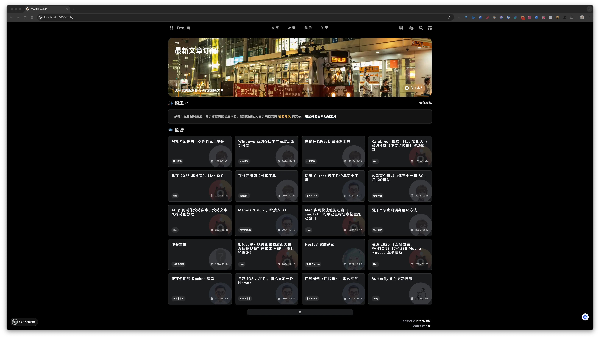

安知鱼主题自带朋友圈功能, 不过需要自行部署后端, 下面说说我的部署过程.

## 创建朋友圈页面

在 Hexo 博客根目录下打开终端，输入

```bash
hexo new page fcircle
```

打开 `source/fcircle/index.md`,添加一行 `type: 'fcircle'`:

```yaml
---
title: 朋友圈
date: 2022-11-21 17:06:17
comments: false
aside: false
top_img: false
type: "fcircle"
---
```

## 主题配置

配置菜单:

```yaml
menu:
  友链:
    朋友圈: /fcircle/ || anzhiyu-icon-artstation
```

开启朋友圈:

```yaml
# 朋友圈配置
friends_vue:
  enable: true
  vue_js: xxx
  apiurl: xxx
  top_background: xxx
```

| 参数           | 备选值/类型 | 解释                           |
| :------------- | :---------- | :----------------------------- |
| enable         | boolean     | 【必须】是否启用               |
| vue_js         | url         | 【必须】朋友圈前端构建后的 url |
| apiurl         | string      | 【必须】朋友圈后端 url         |
| top_background | url         | 【可选】朋友圈顶部背景图       |

前端原项目地址：[hexo-circle-of-friends-front](https://github.com/anzhiyu-c/hexo-circle-of-friends-front), 需要自行编译此项目.

## 朋友圈前端

<!-- MBP  /Users/dong4j/Developer/3.Knowledge/site/hexo-circle-of-friends-front/ -->

```bash
git clone git@github.com:anzhiyu-c/hexo-circle-of-friends-front.git

cd hexo-circle-of-friends-front
npm install
```

修改配置文件(`src/utils/config.ts`):

```javascript
const DefaultConfig: any = {
  private_api_url: "https://yourdomain/",
  public_api_url: "https://yourdomain/",
  page_default_number: 20,
  page_turning_number: 20,
  error_img: "https://sdn.geekzu.org/avatar/57d8260dfb55501c37dde588e7c3852c",
  sort_rule: "created",
  defaultFish: 100,
  hungryFish: 100,
};
export default DefaultConfig;
```

最后编译:

```bash
npm run build
```

执行成功后会在 `dist/assets/` 目录下生成一个 JS 文件, 我将它改名为 `friends.js`, 我将它上传到了图床, 然后在配置中使用 url 获取此文件.

```yaml
# 朋友圈配置
friends_vue:
  enable: true
  vue_js: https://{friends.js}的图床地址
  apiurl: xxx
  top_background: xxx
```

## 朋友圈后端

后端服务我使用 Docker 部署到本地的服务器, 然后使用 Nginx 向外暴露服务

```bash
git clone git@github.com:Rock-Candy-Tea/hexo-circle-of-friends.git

cd hexo-circle-of-friends
python3 deploy.py
```

> 建议提前下载镜像：
>
> ```bash
> docker pull yyyzyyyz/fcircle:latest
> ```

成功运行后会进入交互界面, 根据执行的情况选择即可:

```
$ python3 deploy.py
欢迎使用部署工具，选择部署方式：
——————————————————————————————————
| 1、server | 2、docker | q、退出 |
——————————————————————————————————
2
请选择：
——————————————————————————————————
| 1、部署 | 2、取消部署 | q、退出 |
——————————————————————————————————
1
指定api服务端口，按回车不输入则默认为8000
7773
989b605b330db943cf172dc893bf4dd3706f0460e18fc5bbaa48e7129a1d2f56
已部署！
欢迎使用部署工具，选择部署方式：
——————————————————————————————————
| 1、server | 2、docker | q、退出 |
——————————————————————————————————
q
再见！
```

尝试访问 API 验证部署是否成功：

```bash
curl http://192.168.31.7:7773/all
```

出现数据即为部署成功。

接下来通过 Nginx 配置反向代理和 HTTPS 证书, 比如最终是 `https://friends.dong4j.tele/`, 朋友圈完成配置:

```yaml
# 朋友圈配置
friends_vue:
  enable: true
  vue_js: https://{friends.js}的图床地址
  apiurl: https://friends.dong4j.tele/
  top_background: { 朋友圈页面头图地址 }
```

## 效果



可以通过页面右下角的 **设置** 进入设置页面, 首次登录输入的密码将成为管理员密码, 详细的配置项可查看 [官方文档](https://fcircle-doc.yyyzyyyz.cn/#/settings?id=%e9%a1%b9%e7%9b%ae%e9%85%8d%e7%bd%ae)
