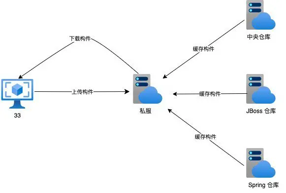
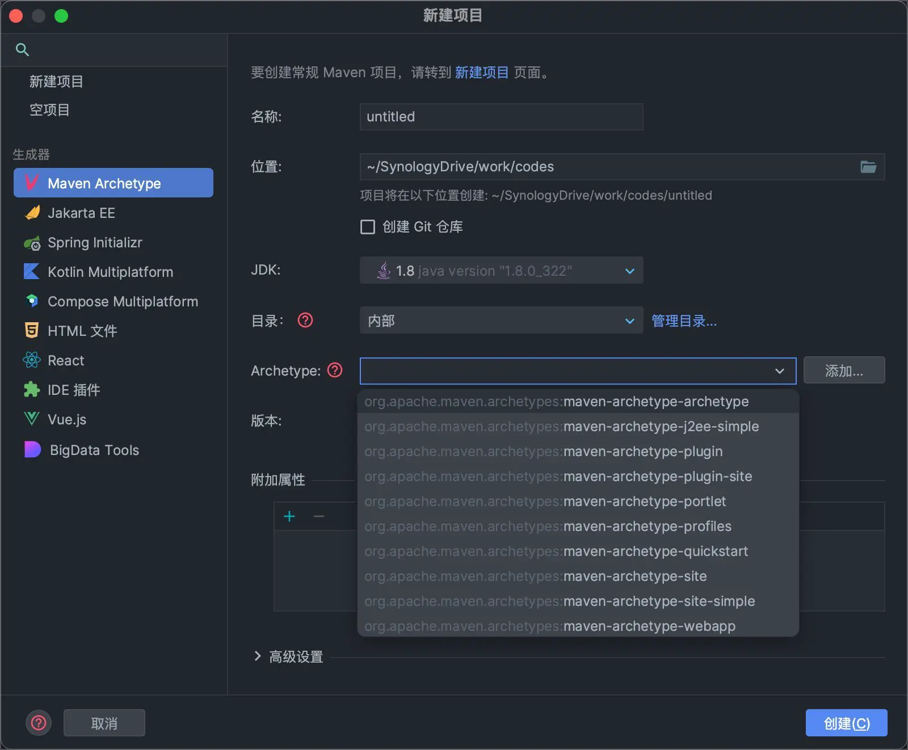

## 1. 为什么用构件管理工具

1. 一个项目就是一个工程

​ 如果项目非常庞大，就不适合使用 package 来划分模块，最好是每一个模块对应一个工程，利于分工协作。借助于构件管理工具就可以将一个项目拆分成多个工程

2. 项目中使用 jar 包，需要“复制”、“粘贴”项目的 lib 中

​ 同样的 jar 包重复的出现在不同的项目工程中，你需要做不停的复制粘贴的重复工作。借助于构件管理工具可以将 jar 包保存在“仓库”中，不管在哪个项目只要使用引用即可就行。

3. jar 包需要的时候每次都要自己准备好或到官网下载

​ 借助于构件管理工具我们可以使用统一的规范方式下载 jar 包 L

4. jar 包版本不一致的风险

​ 不同的项目在使用 jar 包的时候，有可能会导致各个项目的 jar 包版本不一致，导致未执行错误。借助于构件管理工具，所有的 jar 包都放在“仓库”中，所有的项目都使用仓库的一份 jar 包。

5. 一个 jar 包依赖其他的 jar 包需要自己手动的加入到项目中

​ FileUpload 组件->IO 组件，commons-fileupload-1.3.jar 依赖于 commons-io-2.0.1.jar

​ 极大的浪费了我们导入包的时间成本，也极大的增加了学习成本。借助于构件管理工具，它会自动的将依赖的 jar 包导入进来。

6. 不同的项目不同的构建方式

   在没有构件管理工具之前, 不同的项目可能有各种构建方式, 学习成本高, 不利于团队标准化建设;

## 2. 为什么选择 Maven

| 构建工具类型 | 优点     | 缺点                             |
| ------------ | -------- | -------------------------------- |
| 声明式       | 配置简单 | 灵活性不够                       |
| 过程式       | 灵活度高 | 编写复杂, 项目构建代码复用难度大 |

Maven 是一种**声明式**项目管理工具，通过在 POM 中配置 "who","what","where"等信息，即可满足编译、测试、打包、发布等项目构建需求。 声明式的好处是，用户无需关心构建工具的实现细节，只需在 `pom.xml` 中配置好项目名，依赖等基础信息即可。坏处是，实现自定义的构建逻辑，相对复杂。（Maven 也提供了插件，如：`maven-antrun-plugin`，来运行用户自定义脚本。当然，插件最终 apply 到 Maven 的方式最终仍然是**声明式**的，即需要在 POM 中声明插件运行时机和插件相关配置。）

相对应地，Make 和 Ant 等构建工具是**过程式**项目管理工具，用户需要编写构建脚本并组织各脚本的依赖关系。过程式项目管理工具好处是，用户自由度很大；坏处是，项目管理经验无法复用，构建脚本编写较为复杂。

**Spring Boot 把 Maven 干掉了，正式拥抱 Gradle**

## 3. Maven 是什么

### 3.1 名词解释

**1. 依赖：** 例如我们的项目中需要 servlet.jar，这个 jar 包就可以叫做依赖，或者说项目依赖 servlet.jar。我们在导入 a.jar 的时候发现还需要导入 b.jar，说明 a.jar 依赖 b.jar。

**2. 项目构建：** 项目构建描述的是代码的编译、运行、打包、部署等一系列**过程**。

- 1.项目清理：清理之前编译的代码。
- 2.编译：将程序源代码编译为虚拟机可执行的代码，也就是 class 文件。maven 可以帮我们批量编译一堆代码。
- 3.测试：maven 可以执行测试程序代码，验证你的功能是否正确。
- 4.打包：将所有的 class 文件、配置文件等资源放到一个压缩文件中。 对于 java 程序，压缩文件是 xx.jar，对于 web 应用，压缩文件扩展名是 xx.war。
- 5.安装：将 jar 文件或者 war 文件安装到本机仓库中。
- 6.部署：将程序部署到服务器上，我们可以通过网址进行访问。

### 3.2 Maven 的作用

Maven 是 Apache 软件基金会旗下一款**自动化构建工具**，专注于 Java 平台的**项目构建**和**依赖管理**。

- Maven 的官网： https://maven.apache.org/
- Maven 下载地址：https://maven.apache.org/download.cgi
- Maven 资源检索：https://search.maven.org/

**简单点说 Maven 就是一个好用的工具。我们以前做项目需要自己到网上找 jar 包，而用了 Maven 之后，我们只需要配置一下依赖的坐标，它会自动将 jar 包下载到我们电脑硬盘的某一个目录下。**

除了管理 jar 包，它还能帮我们干很多事情：

- 自动下载需要的 jar 包，管理 jar 包的版本以及它们之间的依赖关系
- 帮你编译程序, 打包程序, 部署程序;
- 生成 Javadoc site, 创建测试报告;
- 帮你管理项目中各个模块的关系
- 统一开发结构, 提供标准的, 统一的项目结构

### 3.3 主要特点和优势

1. 约定优于配置：Maven 遵循一定的目录结构和约定，降低了项目配置的复杂性。
2. 依赖管理：Maven 可以自动处理项目的依赖关系，包括下载、版本控制等。
3. 插件生态：Maven 拥有丰富的插件生态，提供了许多用于构建、测试、部署等任务的插件。
4. 生命周期管理：Maven 将项目构建过程划分为若干阶段，可以灵活地控制每个阶段的任务。
5. 多模块项目支持：Maven 支持多模块项目，可以方便地管理复杂的项目结构。

## 4. Maven 的安装

略

### 4.1 使用 Maven Wrapper

Maven Wrapper 是受到 Gradle Wrapper 的启发而来的。它使 Maven 的一些配置 wrap 到项目里面，同时赋予了项目使用执行 Maven 版本的能力。

```
.
├── .mvn
│   ├── wrapper
│   │		├── MavenWrapperDownloader.java									# 下载 maven 二进制文件(~/.m2/wrapper/dists)
│   │   └── maven-wrapper.proerties											# 下载地址配置
│   ├── jvm.properties																	# maven 的 JVM 参数配置
│   └── maven.config																		# mvn 命令的配置
├── mvnw																								# linux/unix 脚本
├── mvnw.cmd																						# Windows 脚本
└── pom.xml
```

## 5. 标准的项目结构

```
├── src
│   ├── main
│   │   ├── java
│   │   └── resources
│   └── test
│       ├── java
│       └── resources
├── target
│   ├── classes
│   └── generated-sources
└── pom.xml
```

1. `pom.xml`: pom 是 project object model 的首字母缩写，是 maven 的项目配置文件，也是 maven 工具的核心；
2. `src/main/java`: Java 项目的源代码目录；
3. `src/main/resources`: Java 项目的资源文件目录；
4. `src/test`: 项目的测试代码包，测试用例存储的位置；
5. `target/classes`: 输出的字节码文件目录;

## 6. POM

POM 文件是 Maven 的核心文件，包含项目构建相关的所有配置信息，如：项目源代码目录，class 文件输出目录等。Maven 执行 goal 时，会首先读取当前目录的 POM 文件，然后执行对应 goal。


```xml
<project>
  <modelVersion>4.0.0</modelVersion>
 	<!-- NOTE: 依赖 repo 和 插件 repo 默认仓库地址-->
  <repositories>
	<!-- ....默认 repo -->
  </repositories>
  <pluginRepositories>
    <pluginRepository>
		<!-- ....默认repo -->
    </pluginRepository>
  </pluginRepositories>
 	<!-- NOTE: 项目默认配置，如：mian代码目录，-->
  <build>
    <directory>${project.basedir}/target</directory>
    <outputDirectory>${project.build.directory}/classes</outputDirectory>
    <finalName>${project.artifactId}-${project.version}</finalName>
    <testOutputDirectory>${project.build.directory}/test-classes</testOutputDirectory>
    <sourceDirectory>${project.basedir}/src/main/java</sourceDirectory>
    <scriptSourceDirectory>${project.basedir}/src/main/scripts</scriptSourceDirectory>
    <testSourceDirectory>${project.basedir}/src/test/java</testSourceDirectory>
    <resources>
      <resource>
        <directory>${project.basedir}/src/main/resources</directory>
      </resource>
    </resources>
    <testResources>
      <testResource>
        <directory>${project.basedir}/src/test/resources</directory>
      </testResource>
    </testResources>
    <pluginManagement>
      <plugins>
			<!-- ....这里是一系列的默认插件 -->
      </plugins>
    </pluginManagement>
  </build>
</project>

```

### 6.1 继承与聚合

- Project Inheritance: 继承已有`pom.xml`，便于做公共配置管理。Super POM 是 `Project Inheritance` 的典型例子;
- Project Aggregation: 同一项目中存在多个`module`;

### 6.2 常用属性

用户可以使用该属性引用 POM 文件中对应元素的值，常用的 POM 属性包括：

- ${project.build.sourceDirectory}：项目的主源码目录，默认为 src/main/java
- ${project.build.testSourceDirectory}：项目的测试源码目录，默认为 src/test/java
- ${project.build.directory}：项目构件输出目录，默认为 target/
- ${project.outputDirectory}：项目主代码编译输出目录，默认为 target/classes/
- ${project.testOutputDirectory}：项目测试代码编译输出目录，默认为 target/test-classes/
- ${project.groupId}：项目的 groupId
- ${project.artifactId}：项目的 artifactId

### 6.3 version

#### 6.3.1 组成

我们在引入其他依赖的时候，经常看到，比如 1.2.1、1.7、1.0-SNAPSHOT、1.1-release、2.3-alpha 等的 version。但它们的组成比较简单，如下，maven 的版本构成：

    <主版本>.<次版本>.<增量版本> - <里程碑版本>

一般情况下，主版本和次版本会一直存在，增量版本和里程碑版本见到的相对少的多。

1. 主版本： 表示项目的重大架构变化。如 struts2 和 struts1 采用不同的架构。
2. 次版本： 较大范围功能增加和变化，及 bug 修复，并且不涉及到架构变化的。
3. 增量版本：表示重大 bug 的修复，如果发现项目发布之后，出现影响功能的 bug，及时修复，则应该是增量版本的变化。
4. 里程碑版本：往往表示某个版本的里程碑，经常见到 snapshot，另外还有 alpha、beta，比如：1.0-SNAPSHOT、3.0-alpha-1、1.1.2-beta-2。

#### 6.3.2 快照

SNAPSHOT 表示快照版，它不是个稳定版本，属于开发过程中使用的版本。当我们项目处于不停的迭代开发期，如果存在依赖关系，比如 A 项目组开发后发布的新包，被 B 项目组引用，这时候使用快照版本 SNAPSHOT，能够在 A 项目组发布到仓库后，自动转为最新时间戳的后缀，供 B 项目组自动引用成功。

这样的好处是，当我们有依赖关系的两个项目组同时开发时，可以互不影响，每次 A 项目组发布后，B 项目组都会刷新、重新编译的方式，自动更新到最新的 A 项目开发的依赖包。只有当准备进入测试阶段，才会将里程碑版本号的 SNAPSHOT 替换成 alpha 或 beta，即测试版本。

#### 6.3.3 版本范围

完整的版本号范围说明如下：（x 为具体使用的版本号）

```
(,1.0]          x <= 1.0
[1.0]           x = 1.0 跟直接指定1.0没有区别
[1.2,1.3]       1.2 <= x <= 1.3
[1.0,2.0)       1.0 <= x < 2.0
[1.5,)          x >= 1.5
(,1.0],[1.2,)   x <= 1.0 or x >= 1.2
(,1.1),(1.1,)   x < 1.1 or x > 1.1 即排除1.1的版本
```

## 7. 坐标和依赖

### 7.1 GAV

Maven 坐标为各种构件引入了秩序，任何一个构件都必须明确定义自己的坐标，而一组 Maven 坐标是通过一些元素定义的。Maven 坐标一般可以认为是一个五元组，即：（groupId，artifactId，version，type，classifier）。

- groupId：Maven 项目隶属的实际项目名称;
- artifactId：实际项目中的一个模块名称;
- version：版本号;
- type:
  - `jar`: jar 包，包含依赖项目主代码 class 文件;
  - `test-jar`: jar 包，classifier 为 tests，包含依赖项目测试代码 class 文件。用于复用测试代码;
- classifier: 用于区分从同一个 POM 中，构建出的不同 artifacts。比如：同一个项目可能同时提供 jdk11 和 jdk 8 对应的依赖;

上述五个元素中，groupId、artifactId、version 是必须定义的，type 是可选的（默认为 jar），而 classifier 是取决于对应依赖是否提供。

### 7.2 Scope

Scope 作用有两个:

1. 限制依赖传递;
2. 控制依赖是否出现在各个 classpath 中

#### 7.2.1 Dependency Scope

Maven 中有五种 Scope，分别是:

1. compile: 默认, 对于编译、测试、运行三种 classpath 都有效;
2. provided: 只在开发、测试阶段使用，目的是不让 Servlet 容器和你本地仓库的 jar 包冲突
3. runtime: 只在运行时使用，如 JDBC 驱动，适用运行和测试阶段;
4. test: 只对于测试 classpath 有效, 用于编译和运行测试代码, 不会随项目发布;
5. system: 类似 provided，需要显式提供包含依赖的 jar，Maven 不会在 Repository 中查找它;

Maven 中大致可以分成四类 class path：

- main 代码编译 classpath：编译 main 代码的 classpath
- main 代码运行 classpath：运行 main 代码的 classpath
- test 代码编译 classpath：编译测试代码的 classpath
- test 代码运行 classpath：运行测试代码的 classpath

结合依赖的 Scope 和四类 classpath 总结出 classpath 与依赖的关系:

| classpath        | 组成                                                                                                     | 备注                                                                                                                                                                          |
| ---------------- | -------------------------------------------------------------------------------------------------------- | ----------------------------------------------------------------------------------------------------------------------------------------------------------------------------- |
| main compile     | scope 为 compile, provided, system                                                                       |                                                                                                                                                                               |
| main run         | 主代码编译的输出目录+ scope 为 compile 和 runtime 的依赖组成                                             | 一般情况下需要指定 classpath, 这也是为什么我们在 IDEA 里面直接运行 main code 中使用了 provided 依赖的 main 方法会报错的原因, 因为 provided 依赖不会加入 main run classpath 中 |
| test run/compile | 主代码 class 输出目录 + scope 为 compile, provided, system, runtime, test 的依赖 + test class 的输出目录 |                                                                                                                                                                               |

#### 7.2.1 Dependency Management Scope

```xml
<dependencyManagement>
    <dependencies>
        <dependency>
            <groupId>com.xxx</groupId>
            <artifactId>xxx-center-dependencies</artifactId>
            <version>${xxx-center-dependencies.version}</version>
            <scope>import</scope>
            <type>pom</type>
        </dependency>
    </dependencies>
</dependencyManagement>
```

### 7.3 依赖传递

我们都知道依赖是会传递的，例如 B 模块引入了 A 模块，C 模块引入了 B 模块，就相当于 C 模块引入了 A 模块。

而在项目中我们知道 service 依赖 dao，controller 依赖 service。dao、service、controller 又都依赖 model 实体类，dao 和 service 又都需要用到 common 。但是我们不可能在他们三个中都添加 model 的依赖，在 dao 和 service 中都添加 common 的依赖。

根据依赖的传递性，我们可以在 common 模块中添加 model 的依赖，在 dao 中添加 common 的依赖，在 service 中添加 dao 的依赖，在 controller 中添加 service 的依赖。


依赖传递关系:

- A -> B (compile) 第一关系 : A 依赖 B compile
- B -> C (compile) 第二关系 : B 依赖 C compile

则 A 会自动依赖 C

详细的关系传递如下:

| A/B      | compile  | test | provided | runtime  |
| -------- | -------- | ---- | -------- | -------- |
| compile  | compile  | -    | -        | runtime  |
| test     | test     | -    | -        | test     |
| provided | provided | -    | provided | provided |
| runtime  | runtime  | -    | -        | runtime  |

**那么该如果禁止依赖传递?**

### 7.4 依赖调解

依赖调解遵循以下两大原则：路径最短优先、声明顺序优先，

- 第一原则：路径最近者优先。 把当前模块当作顶层模块，直接依赖的包则作为次层模块，间接依赖的包则作为次层模块的次层模块，依次递推...，最后构成一棵引用依赖树。假设当前模块是 A，两种依赖路径如下所示：

  ```
  A --> B --> X(1.1)         // 层级(A->X) = 2
  A --> C --> D --> X(1.0)   // 层级(A->X) = 3
  ```

  此时，Maven 可以按照第一原则自动调解依赖，结果是使用 X(1.1)作为依赖。

- 第二原则：第一声明者优先。若冲突依赖的路径长度相同，那么第一原则就无法起作用了。 假设当前模块是 A，两种依赖路径如下所示：

  ```
  A --> B --> X(1.1)   // 层级(A->X) = 2
  A --> C --> X(1.0)   // 层级(A->X) = 2
  ```

  当路径长度相同，则需要根据 A 直接依赖包在 pom 文件中的先后顺序来判定使用那条依赖路径，如果次级模块相同则向下级模块推，直至可以判断先后位置为止。

  ```
  <!-- A pom.xml -->
  <dependencies>
      ...
      dependency B
      ...
      dependency C
  </dependencies>
  ```

  假设依赖 B 位置在依赖 C 之前，则最终会选择 X(1.1)依赖。

其它情况：**覆盖策略**。若相同类型但版本不同的依赖存在于同一个 pom 文件，依赖调解两大原则都不起作用，需要采用覆盖策略来调解依赖冲突，最终会引入最后一个声明的依赖。

```xml
<dependencies>
  <dependency>
    <groupId>a</groupId>
    <artifactId>a</artifactId>
    <version>1.2</version>
  </dependency>
  <dependency>
    <groupId>a</groupId>
    <artifactId>a</artifactId>
    <version>1.4</version>
  </dependency>
  <dependency>
    <groupId>a</groupId>
    <artifactId>a</artifactId>
    <version>1.3</version>
  </dependency>
</dependencies>
```

### 7.5 ClassNotFoundException

为什么本地开发没问题, 一到线上就出现比如 class 找不到, 方法签名不正确等问题?

**maven healper**

## 8. 仓库


当通过 Maven 构建项目时，Maven 按照如下顺序查找依赖的构件。

1. 从本地仓库查找构件，如果没有找到，跳到第 2 步，否则继续执行其他处理。
2. 从远程仓库查找构件，如果没有找到，并且已经设置其他远程仓库，然后移动到第 4 步；如果找到，那么将构件下载到本地仓库中使用。
3. 如果没有设置其他远程仓库，Maven 则会停止处理并抛出错误。
4. 在远程仓库查找构件，如果找到，则会下载到本地仓库并使用，否则 Maven 停止处理并抛出错误。



## 9. 生命周期

Maven 有三套独立的 Lifecycle:`default`、`clean` 和 `site`，每个 Lifecycle 包含多个 Phase。下图详细的展示了 Lifecycle 和 Phase 的关系。


### 9.1 Clean

clean 生命周期的目的主要是清理项目。

- pre-clean: 执行一些清理前需要完成的工作。
- **clean**: 清理上一次构建生成的文件。
- post-clean: 执行一些清理后需要完成的工作。

### 9.2 Default

default 生命周期定义了真正构建时所需要执行的所有步骤，它是所有生命周期中最核心的部分，其包含的阶段如下：

- validate：验证项目是否合法以及项目构建信息是否完备。
- initialize：初始化。
- generate-sources: 生成源代码，如：`ANTLR` 插件会根据语法文件生成对应的 Java 源代码。
- process-sources: 处理项目主资源文件。一般来说，是对 src/main/resources 目录的内容进行变量替换等工作后，复制到项目输出的主 classpath 目录中。
- generate-resources：生成资源文件。
- process-resources：处理资源文件。
- **compile**：编译项目的主源码。一般来说，是编译 src/main/java 目录下的 Java 文件至项目输出的主 classpath 目录中。
- process-classes：处理 class 文件，如：字节码增强。
- generate-test-sources：生成测试源代码，如：`ANTLR`。
- process-test-sources：处理项目测试资源文件。一般来说，是对 src/test/resources 目录的内容进行变量替换等工作后，复制到项目输出的测试 classpath 目录中。
- generate-test-resources：生成测试资源文件。
- process-test-resources：拷贝或处理测试资源文件至目标测试目录。
- test-compile：编译项目的测试代码。一般来说，是编译 src/test/java 目录下的 Java 文件至项目输出的测试 classpath 目录中。
- process-test-classes：处理 test class 文件。
- **test**：使用单元测试框架运行测试，测试代码不会被打包或部署。
- prepare-package：打包前置工作。
- **package**：接受编译好的代码，打包成可发布的格式，如 JAR，WAR 等。
- pre-integration-test：集成测试的前置工作
- integration-test：集成测试。
- post-integration-test ：集成测试后，需要做的一些事情。
- **verify**：检测所有的集成测试结果是否符合预期，保障代码质量。
- **install**：将包安装到 Maven 本地仓库，供本地其他 Maven 项目使用。
- **deploy**：将最终的包复制到远程仓库，供其他开发人员和 Maven 项目使用。

### 9.3 Site

site 生命周期用于生成代码站点文档并发布至对应 Web Server。

- pre-site：前置工作。
- **site**：生成代码对应的站点文档。
- post-site：site 后置工作，deploy 前置工作。
- site-deploy：发布站点文档至对应的 Web Server。

## 10. 其他

### 10.1 排除全部依赖

```xml
<!-- 全局排除 默认的 logging 依赖, 使用 log4j2 -->
<dependency>
    <groupId>org.springframework.boot</groupId>
    <artifactId>spring-boot-starter</artifactId>
    <version>${spring-boot-dependencies.version}</version>
    <exclusions>
        <exclusion>
            <groupId>org.springframework.boot</groupId>
            <artifactId>spring-boot-starter-logging</artifactId>
        </exclusion>
    </exclusions>
</dependency>
<!-- 使用 log4j2 日志框架 (删除所有依赖，在 xxx-logsystem-spring-boot 模块中升级 log4j 版本以修复漏洞) -->
<dependency>
    <groupId>org.springframework.boot</groupId>
    <artifactId>spring-boot-starter-log4j2</artifactId>
    <version>${spring-boot-dependencies.version}</version>
    <exclusions>
        <exclusion>
            <groupId>*</groupId>
            <artifactId>*</artifactId>
        </exclusion>
    </exclusions>
</dependency>
<!-- 全局排除 spring-boot-starter-logging 内的所有依赖, 避免手动引入造成日志框架冲突 -->
<dependency>
    <groupId>org.springframework.boot</groupId>
    <artifactId>spring-boot-starter-logging</artifactId>
    <version>${spring-boot-dependencies.version}</version>
    <exclusions>
        <exclusion>
            <groupId>*</groupId>
            <artifactId>*</artifactId>
        </exclusion>
    </exclusions>
</dependency>
```

### 10.2 mvnd

maven-mvnd 是 A pache Maven 团队借鉴了 Gradle 和 Takari 后衍生出的更快的构建工具。mvnd 内嵌了 Maven，也正是因为这个原因我们可以无缝地将 Maven 切换 为 mvnd（也不需要单独安装 Maven）

- 运行构建的 JVM 不需要为每个构建重新启动。
- Maven 插件类的类加载器缓存在多个构建中，插件 jars 只会被读取和解析一次。
- JVM 中 JIT 生成的本机代码会被保留。与 Maven 相比，JIT 编译花费的时间更少。在重复构建期间，JIT 优化的代码立即可用。这不仅适用于来自 Maven 插件和 Maven 内核的代码，也适用于来自 JDK 本身的所有代码。

### 10.3 项目骨架



### 10.4 插件开发

参看 **xxx-maven-plugin**
