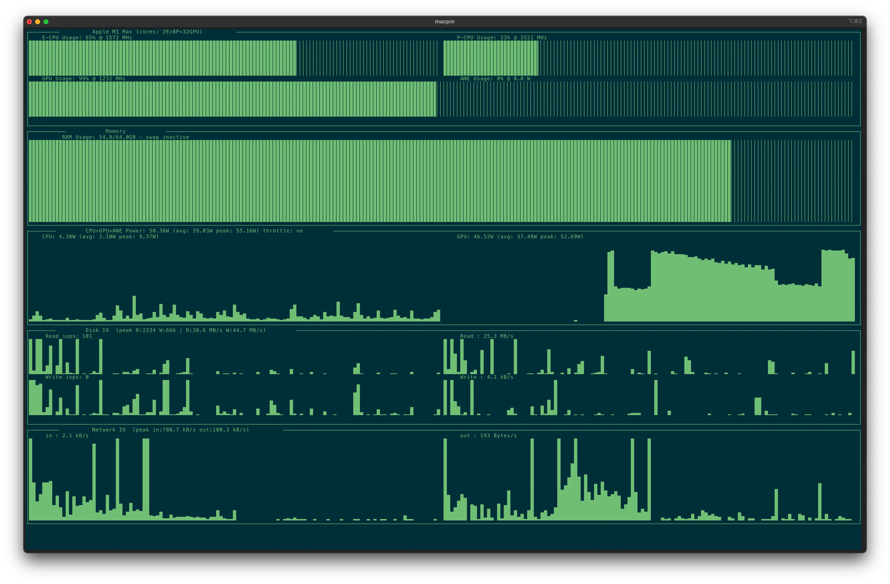

在上一篇 [[generate-blog-tags-using-ai|AI助力博客创作：自动生成摘要与标签的实战指南]] 中使用 AI 自动生成文章摘要和 Tags, 这次我们依旧利用 AI 来帮我们为文章进行智能分类.

## 参考:

- [博客文章怎么设计分类与标签](https://blog.jiumoz.com/archives/bo-ke-wen-zhang-zen-me-she-ji-fen-lei-yu-biao-qian)
- [如何规划blog的标签（tag）和分类](https://www.cnblogs.com/Leo_wl/archive/2012/11/05/2755677.html)
