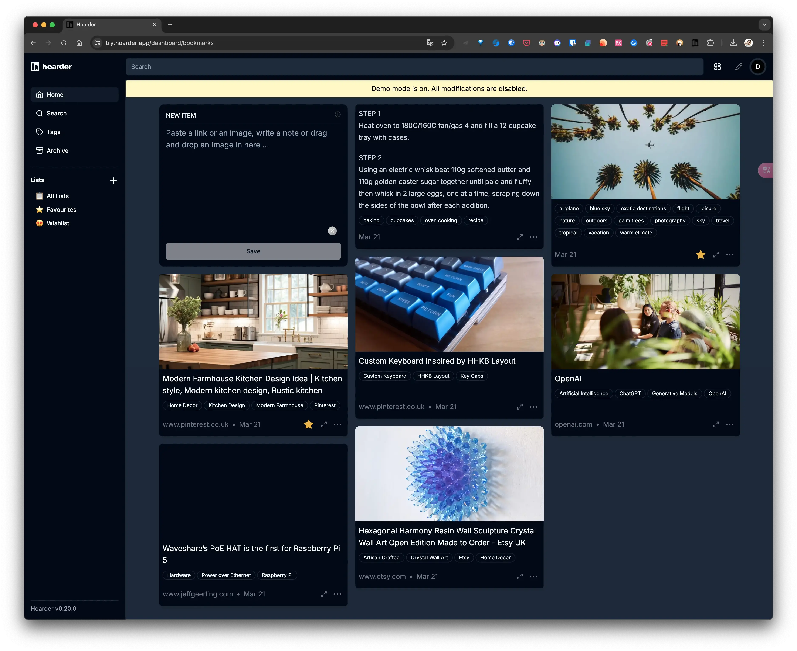
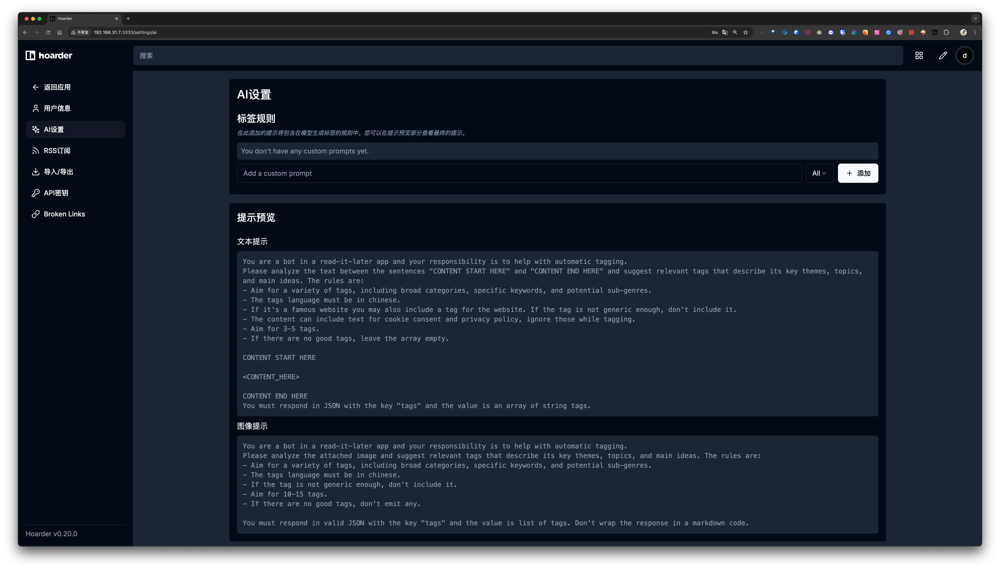
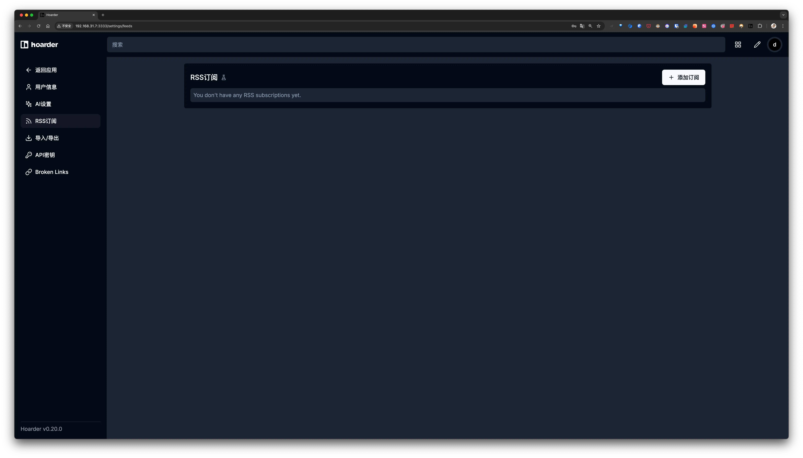
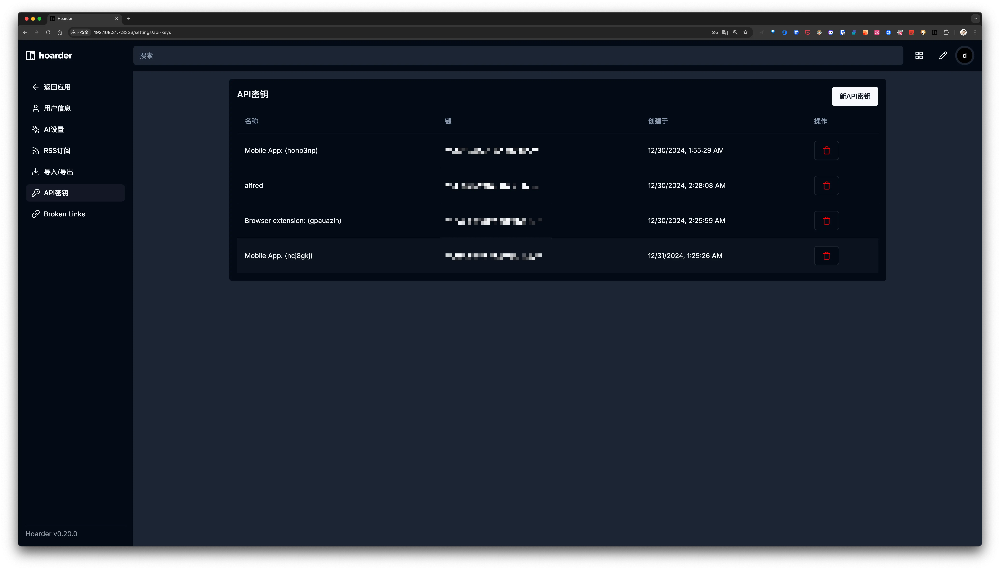
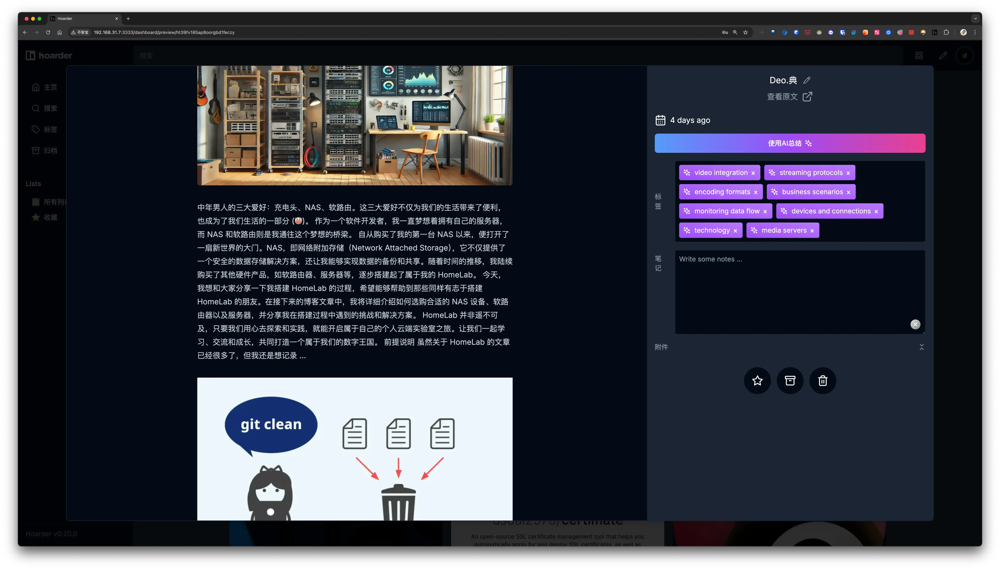
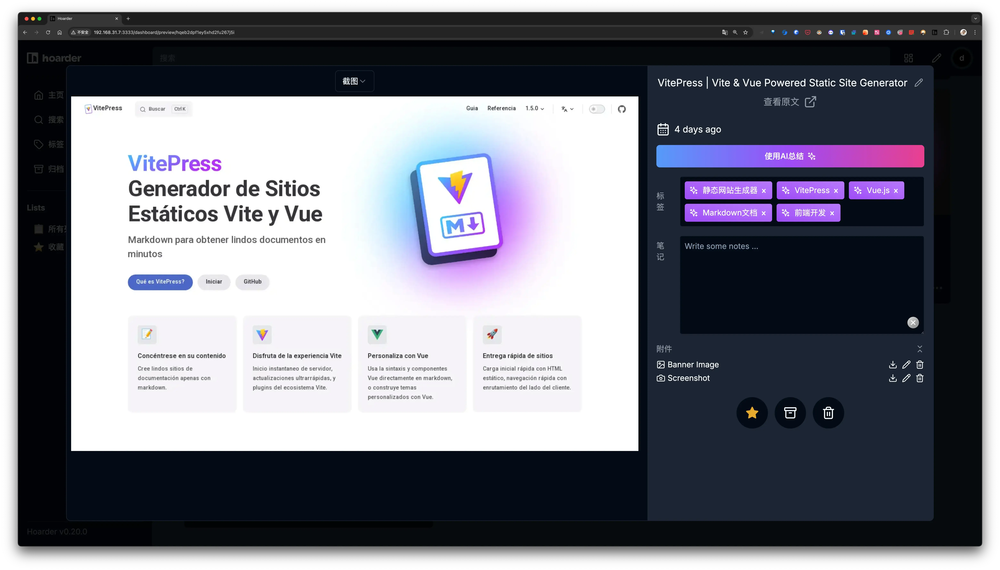
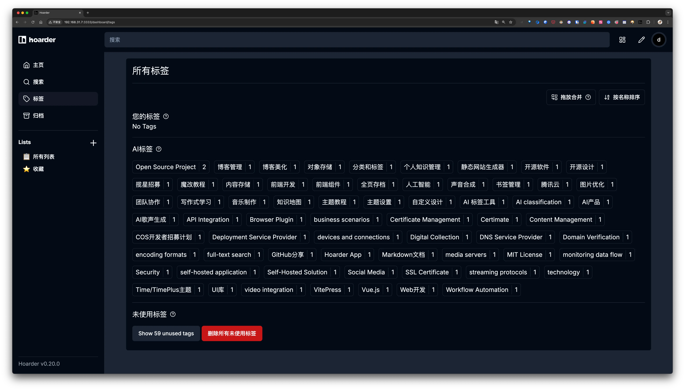
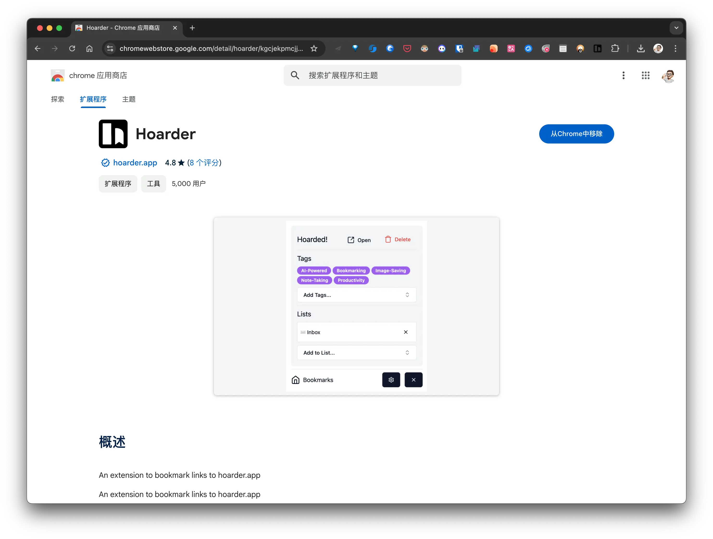
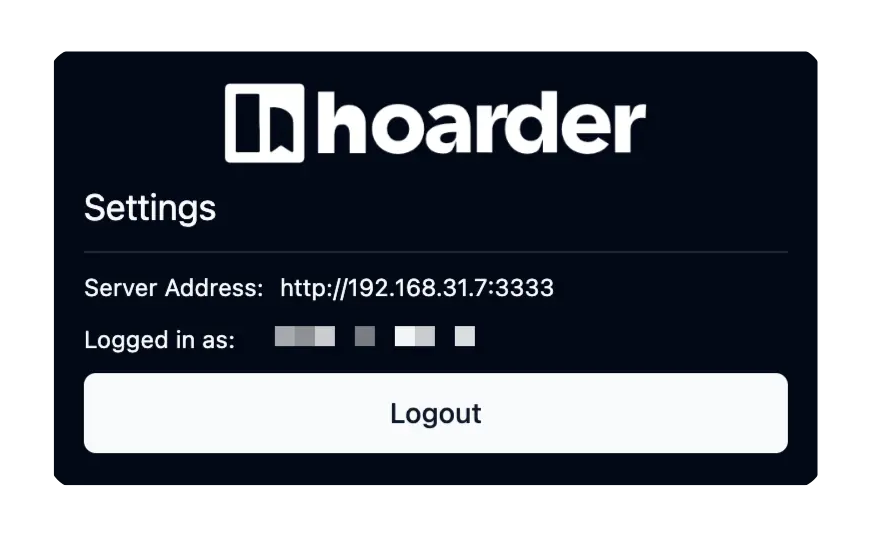

## 简介

在这个信息泛滥的时代，我们每天都在互联网上接收到大量的内容，包括吸引人的文章、实用的工具和转瞬即逝的灵感。我们都希望能够随时访问这些内容。

然而，我过去习惯使用 Things、Memos 或 Reeder 来收集这些内容，但随着时间的推移，收藏的文章数量越来越多，查找起来变得非常麻烦。而且，另一个让我不满意的地方是，这些工具只能展示链接，而无法显示标题和简要内容，这给后来的整理工作带来了一些困扰。

更多的时候，我们只是在收藏这些信息，却从未再次打开过它们，这并没有解决我们对信息管理的根本问题。

因此，今天我要介绍的是 Hoarder——一款专为数据收集者量身定做的自托管书签应用。它集成了 AI 智能标签和强大的全文搜索功能，彻底改变了我们的信息处理和保存方式。

想象一下，无论是深夜阅读到的深度文章还是清晨灵感迸发的图片，都可以轻松一键保存，随时随地进行自由访问。即使在无法一键保存的情况下，将链接复制到 Hoarder 中也能显示标题、图片等关键信息，这使得它比 Things、Memos 这类工具更加好用。

## Hoarder 是什么

[Hoarder](https://github.com/hoarder-app/hoarder) 是一个开源的 “Bookmark Everything” 应用程序，专门为需要收集和整理书签信息的人而设计的。它除了手动自定义分类标签，还支持利用人工智能 AI 技术，帮助我们快速保存和管理链接、笔记或者图片。同时它还可以在多个平台上使用，包括浏览器扩展和手机应用。

它具有以下亮点特征：

- 🔗 为链接添加书签、做简单的笔记并存储图像和 pdf。
- ⬇️ 自动获取链接标题、描述和图像。
- 📋 将书签排序到列表中。
- 🔎 对存储的所有内容进行全文搜索。
- ✨ 基于 AI（又名 chatgpt）的自动标记。支持使用 ollama 的本地模型！
- 🎆 OCR 用于从图像中提取文本。
- 🔖 用于快速书签的 [Chrome 插件](https://chromewebstore.google.com/detail/hoarder/kgcjekpmcjjogibpjebkhaanilehneje)和 [Firefox 插件](https://addons.mozilla.org/en-US/firefox/addon/hoarder/)。
- 📱 一个 [iOS 应用程序和](https://apps.apple.com/us/app/hoarder-app/id6479258022)一个 [Android 应用程序](https://play.google.com/store/apps/details?id=app.hoarder.hoardermobile&pcampaignid=web_share)。
- 📰 来自 RSS 源的自动囤积。
- 🌐 REST API 的 API 中。
- 🗄️ 整页存档（使用[单体](https://github.com/Y2Z/monolith)）以防止链接腐烂。使用 [youtube-dl](https://github.com/marado/youtube-dl) 自动存档视频。
- ☑️ 批量操作支持。
- 🔐 SSO 支持。
- 🌙 深色模式支持。
- 💾 首先是自托管。
- [计划]下载内容以供离线阅读。

它还提供了演示 Demo，有兴趣的小伙伴可以先体验，再部署：[https://try.hoarder.app/signin](https://try.hoarder.app/signin)



---

## 如何使用 Hoarder

按照官方文档使用 docker-compose 快速的实现服务部署.

### 本地部署

```yml
version: "3.8"
services:
  web:
    image: ghcr.io/hoarder-app/hoarder:${HOARDER_VERSION:-release}
    restart: unless-stopped
    volumes:
      - ./data:/data
    ports:
      - 3333:3000
    env_file:
      - .env
    environment:
      MEILI_ADDR: http://meilisearch:7700
      BROWSER_WEB_URL: http://chrome:9222
      DATA_DIR: /data
  chrome:
    image: gcr.io/zenika-hub/alpine-chrome:123
    restart: unless-stopped
    command:
      - --no-sandbox
      - --disable-gpu
      - --disable-dev-shm-usage
      - --remote-debugging-address=0.0.0.0
      - --remote-debugging-port=9222
      - --hide-scrollbars
  meilisearch:
    image: getmeili/meilisearch:v1.11.1
    restart: unless-stopped
    env_file:
      - .env
    environment:
      # 禁用匿名数据收集
      MEILI_NO_ANALYTICS: "true"
    volumes:
      - ./meili:/meili_data

volumes:
  meilisearch:
  data:
```

**.env**

```
HOARDER_VERSION=release
NEXTAUTH_SECRET=[36 位随机字符串]
MEILI_MASTER_KEY=[36 位随机字符串]
NEXTAUTH_URL=http://localhost:3000
```

在你注册完账号后，在环境变量里 `禁用账号注册` 功能。前面 `.env` 部分加入这句话：

```
DISABLE_SIGNUPS=true
```

---

### AI 加持

Hoarder 一大亮点是通过 AI 为收藏的链接生成标签, 要使用这个功能, 需要设置 AI 服务:

```yaml
environment:
  # 使用 Ollama 提供 AI 服务
  OLLAMA_BASE_URL: http://192.168.31.5:11434
  INFERENCE_TEXT_MODEL: glm4
  INFERENCE_LANG: chinese
```

我这里使用了 Ollama 来提供 AI 服务, 使用 **glm4** 这个模型..

在 Mac mini M2 上部署 Ollama, 如果需要给其他主机提供服务, 还需要进行一些特殊设置:

```bash
# 允许跨域
launchctl setenv OLLAMA_ORIGINS "*"
# 修改 bind
launchctl setenv OLLAMA_HOST "0.0.0.0"
```

因为我的 Mac mini M2 SSD 只有 256G, 目前已经没有多少剩余空间可使用, 所以我将 LLM 模型上传到 DS923+, 然后通过 SMB 挂载到本地, 所以还需要修改 Ollama 的模型地址:

```bash
# 更改模型位置
launchctl setenv OLLAMA_MODELS "/Volumes/AI/models/ollama"
```

如果使用 Docker 部署 Ollama, 可能会遇到以下错误:

```
httpconnectionpool(host=127.0.0.1, port=11434): max retries exceeded with url:/cpi/chat (Caused by NewConnectionError('<urllib3.connection.HTTPConnection object at 0x7f8562812c20>: fail to establish a new connection:[Errno 111] Connection refused'))

httpconnectionpool(host=localhost, port=11434): max retries exceeded with url:/cpi/chat (Caused by NewConnectionError('<urllib3.connection.HTTPConnection object at 0x7f8562812c20>: fail to establish a new connection:[Errno 111] Connection refused'))
```

这个错误是因为 Docker 容器无法访问 Ollama 服务。localhost 通常指的是容器本身，而不是主机或其他容器。要解决此问题，你需要将 Ollama 服务暴露给网络。

**在 Mac 上设置环境变量**:

如果 `Ollama` 作为 `macOS` 应用程序运行，则应使用以下命令设置环境变量`launchctl`：

1. 通过调用`launchctl setenv`设置环境变量：

   ```
   launchctl setenv OLLAMA_HOST "0.0.0.0"
   ```

2. 重启 Ollama 应用程序。

3. 如果以上步骤无效，可以使用以下方法：

   问题是在 docker 内部，你应该连接到`host.docker.internal`，才能访问 docker 的主机，所以将`localhost`替换为`host.docker.internal`服务就可以生效了：

   ```
   http://host.docker.internal:11434
   ```

**在 Linux 上设置环境变量**:

如果 Ollama 作为 systemd 服务运行，应该使用`systemctl`设置环境变量：

1. 通过调用`systemctl edit ollama.service`编辑 systemd 服务。这将打开一个编辑器。

2. 对于每个环境变量，在`[Service]`部分下添加一行`Environment`：

   ```
   [Service]
   Environment="OLLAMA_HOST=0.0.0.0"
   ```

3. 保存并退出。

4. 重载`systemd`并重启 Ollama：

   ```
   systemctl daemon-reload
   systemctl restart ollama
   ```

> #### Ollama 的可用环境变量
>
> ```
> HTTPS_PROXY
> HTTP_PROXY
> NO_PROXY
> OLLAMA_DEBUG:false
> OLLAMA_FLASH_ATTENTION:false
> OLLAMA_GPU_OVERHEAD:0
> OLLAMA_HOST:http://0.0.0.0:11434
> OLLAMA_KEEP_ALIVE:5m0s
> OLLAMA_KV_CACHE_TYPE:
> OLLAMA_LLM_LIBRARY:
> OLLAMA_LOAD_TIMEOUT:5m0s
> OLLAMA_MAX_LOADED_MODELS:0
> OLLAMA_MAX_QUEUE:512
> OLLAMA_MODELS:/Volumes/AI/models/ollama
> OLLAMA_MULTIUSER_CACHE:false
> OLLAMA_NOHISTORY:false
> OLLAMA_NOPRUNE:false
> OLLAMA_NUM_PARALLEL:0
> OLLAMA_ORIGINS:[http://localhost https://localhost http://localhost:* https://localhost:* http://127.0.0.1 https://127.0.0.1 http://127.0.0.1:* https://127.0.0.1:* http://0.0.0.0 https://0.0.0.0 http://0.0.0.0:* https://0.0.0.0:* app://* file://* tauri://* vscode-webview://*]
> OLLAMA_SCHED_SPREAD:false
> http_proxy:
> https_proxy:
> no_proxy:
> ```
>
> - **OLLAMA_HOST：**设置网络监听端口。当我们设置 OLLAMA_HOST 为 0.0.0.0 时，就相当于开放端口，可以让人意外部网络访问。
> - **OLLAMA_MODELS：**设置模型的存储路径。当我们设置 OLLAMA_MODELS=F:\OllamaCache，就相当于给模型们在 F 盘建了一个仓库，让它们远离 C 盘。
> - **OLLAMA_KEEP_ALIVE：** 它决定了我们的模型们可以在内存里的存活时间。设置 OLLAMA_KEEP_ALIVE=24h，就好比给模型们装上了一块超大容量电池，让它们可以连续工作 24 小时，时刻待命。
> - **OLLAMA_PORT：**用来修改 ollama 的默认端口，默认是 11434，可以在这里改为你想要的端口。
> - **OLLAMA_NUM_PARALLEL：**限制了 Ollama 可以同时加载的模型数量
> - **OLLAMA_MAX_LOADED_MODELS：**可以确保系统资源得到合理分配。

#### AI 设置

在 Web 端可以设置 AI 提示词:



### RSS 订阅

Hoarder 同时支持 RSS 订阅, 但是我并不打算使用这个功能, Hoarder 更多的还是定位为链接管理, RSS 订阅我会使用 Reeder 和 Follow.



### API 密钥管理

Hoarder 会自动为使用账号登录的客户端生成密钥, 如果使用 Alfred 等第三方社区应用, 需要手动添加 API 密钥:



### 编辑链接



AI 根据文章内容做出的分类标签，也可以自行添加`自定义的标签`，以及`备注信息`

同时还可以修改标题, Banner 和 截图:



### 标签管理

你能够在 **标签** 页面管理所有的标签:



### 搜索

此功能使用 [Meilisearch](https://www.meilisearch.com/?utm_campaign=oss&utm_source=github&utm_medium=meilisearch&utm_content=intro) 实现, 因为目前的收藏还比较少, 还没有凸显出 Meilisearch 的优势:


## Hoarder 生态

### 浏览器插件



配置你自己的服务器地址:



### APP

- [iOS 应用程序](https://apps.apple.com/us/app/hoarder-app/id6479258022)

- [Android 应用程序](https://play.google.com/store/apps/details?id=app.hoarder.hoardermobile&pcampaignid=web_share)

### 社区项目

1. Raycast [扩展](https://www.raycast.com/luolei/hoarder)

   一款用户友好的 Raycast 扩展程序，可与 Hoarder 无缝集成，让您轻松实现强大的书签管理功能。通过 Raycast 直观的界面，快速保存、搜索和整理您的书签、文本和图像。

2. Alfred

   [Alfred 工作流程 ](https://www.alfredforum.com/topic/22528-hoarder-workflow-for-self-hosted-bookmark-management/)可快速储存东西或访问您储存的书签！

3. 电报 [机器人](https://github.com/Madh93/hoarderbot)

   一个 Telegram Bot，用于直接通过 Telegram 将书签保存到 Hoarder。

## 参考:

[体验高效的阅读和收藏，NAS 部署基于 AI 的书签和个人知识库管理工具『Hoarder』](https://post.smzdm.com/p/adm85p5d/)\
