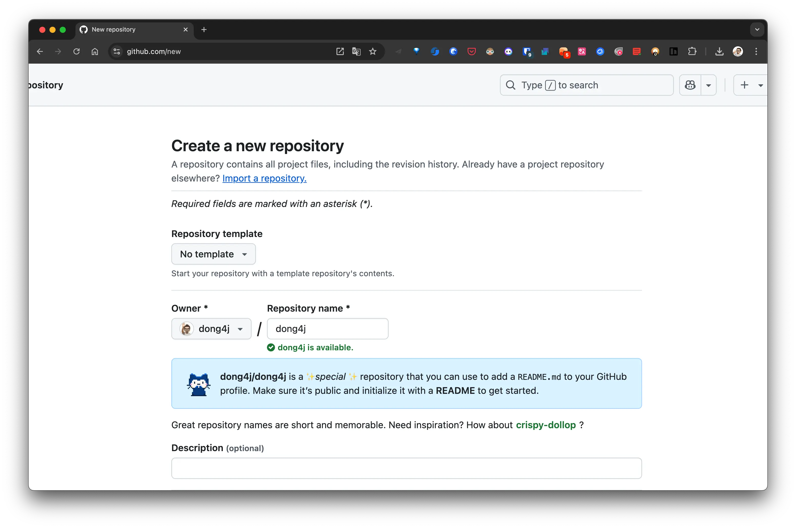
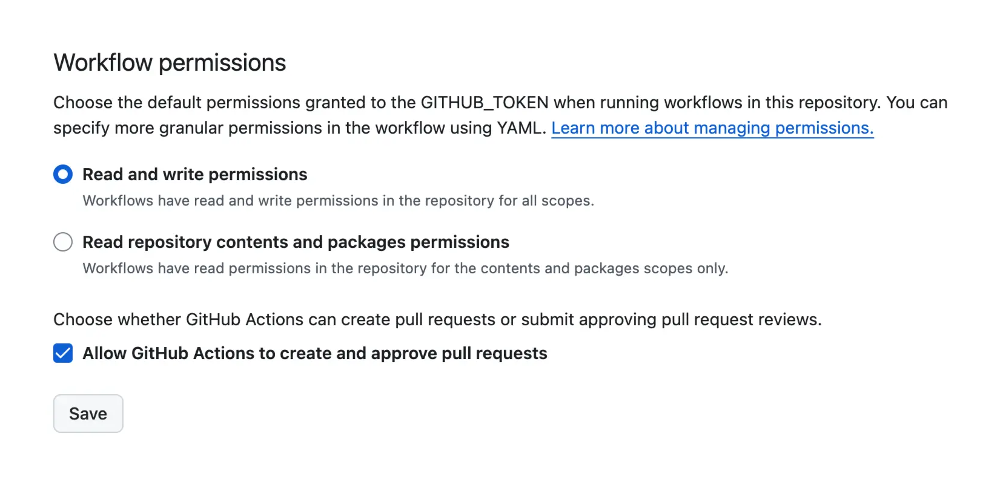

<!-- markdownlint-disable-next-line MD033 -->
<meta name="referrer" content="no-referrer"/>

## 简介

<!-- 
https://github.com/zylele/social-readme?tab=readme-ov-file

https://github.com/kautukkundan/Awesome-Profile-README-templates
https://github.com/anuraghazra/github-readme-stats
https://github.com/rahuldkjain/github-profile-readme-generator?tab=readme-ov-file

https://www.cnblogs.com/Cl0ud/p/13764921.html
https://zhuanlan.zhihu.com/p/454597068
https://github.com/abhisheknaiidu/awesome-github-profile-readme

https://github.com/anzhiyu-c/anzhiyu-c
https://github.com/anzhiyu-c/social-readme

-->

Token 地址: https://github.com/settings/tokens

添加 action 的变量: https://github.com/dong4j/dong4j/settings/secrets/actions

设置仓库 Action 权限

