<!-- markdownlint-disable-next-line MD033 -->
<meta name="referrer" content="no-referrer"/>


## 简介

最近在使用 Node.js 写一个数字名片的小项目, 直接使用 `npx dong4j` 就可以使用, 大概是这样的:

<script src="https://asciinema.org/a/yQWrglbOqUM44vi4MQ2ThpIp0.js" id="asciicast-yQWrglbOqUM44vi4MQ2ThpIp0" async="false"></script>

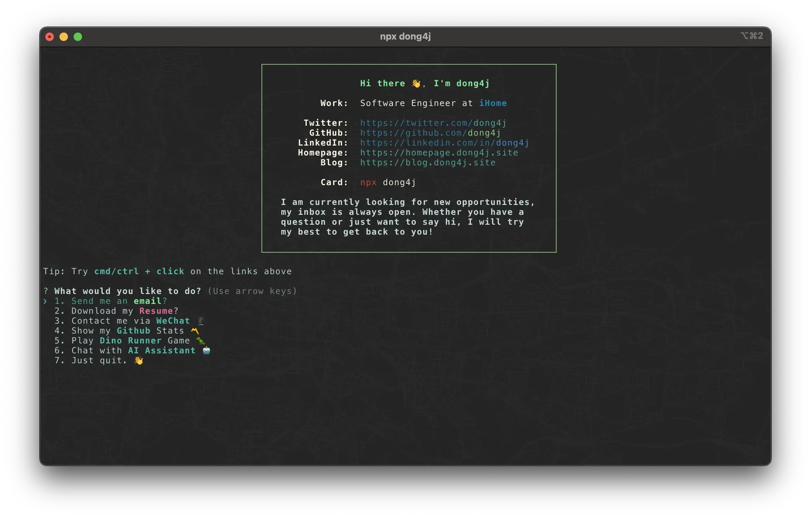

其中有一个 `Chat with AI Assistant 🤖` 的小功能:

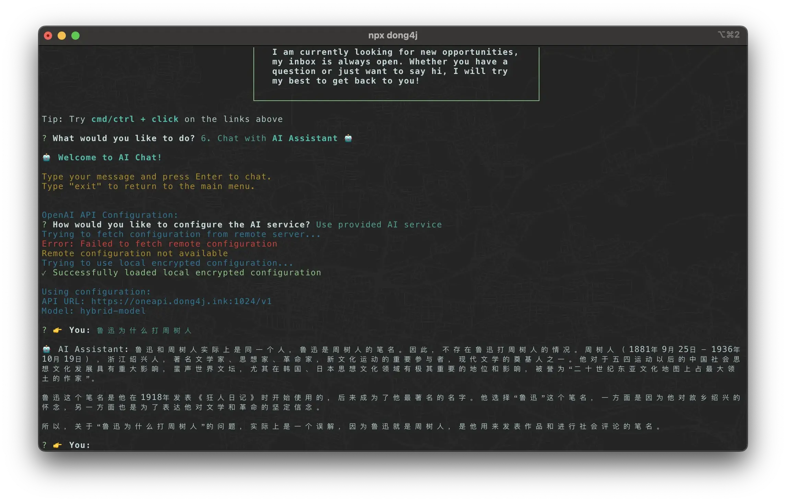

这个功能使用 one-api 对接各家 LLM 接口来提供 Chat 服务:


我的需求很简单:

- 用户能够免费使用;
- 我也不需要付费购买 token;

在 Github 找了一圈后, [LLM Red Team](https://github.com/LLM-Red-Team) 最符合需求, 所以这里记录一下这个 Chat 服务的搭建过程.

## one-api

[one-api](https://github.com/songquanpeng/one-api) 是一个 OpenAI API 接口管理工具, 相当于一个代理, 提供了多个渠道以及 key 管理功能, 它的衍生项目也非常多, 感兴趣的可以了解一下.

不过最近爆出来 one-api 镜像被 [投毒](https://github.com/songquanpeng/one-api/issues/2000)了, 还好我使用的是老版本:

> 2024 年 12 月 27 日,One API 项目的 Docker Hub 镜像被发现存在安全问题。攻击者获取了项目维护者的 Docker Hub 凭证,并重新推送了包含挖矿程序的恶意镜像版本(v0.6.5 至 v0.6.9)。这些被污染的镜像会导致服务器 CPU 使用率异常升高,影响系统正常运行。

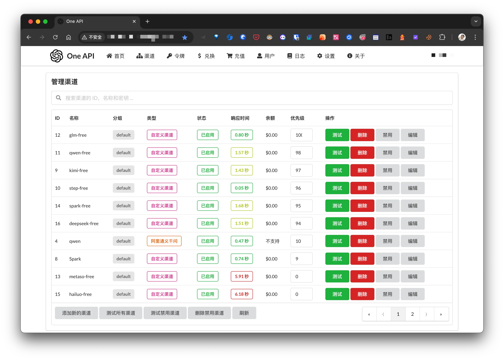

我上面接入了 [LLM Red Team](https://github.com/LLM-Red-Team) 提供的 free-api, 因为各大厂商注册就送 token 的活动, 重新使用小号注册了几个, 一起配置到 one-api, 应该会比 free-api 稳定一些.

## 接入 LLM

- 详细文档: [https://llm-red-team.github.io/free-api/](https://llm-red-team.github.io/free-api/)

我这里只记录一下获取 token 的关键步骤.

### Kimi

从 [kimi.moonshot.cn](https://kimi.moonshot.cn/) 获取 refresh_token

进入 kimi 随便发起一个对话，然后 F12 打开开发者工具，从 Application > Local Storage 中找到`refresh_token`的值，这将作为 Authorization 的 Bearer Token 值：`Authorization: Bearer TOKEN`

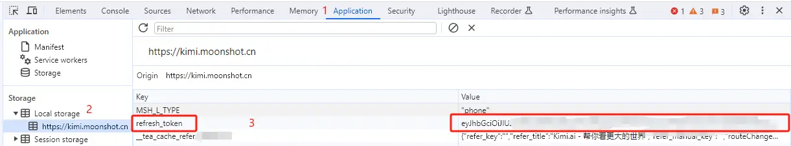

如果你看到的`refresh_token`是一个数组，请使用`.`拼接起来再使用。

### 跃问

从 [stepchat.cn](https://stepchat.cn/) 获取 Oasis-Token

进入 StepChat 随便发起一个对话，然后 F12 打开开发者工具，从 Application > Cookies 中找到`Oasis-Token`的值，这将作为 Authorization 的 Bearer Token 值：`Authorization: Bearer TOKEN`

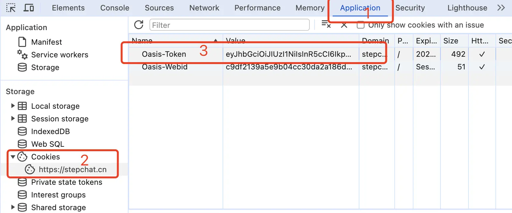

**多账号接入**

你可以通过提供多个账号的 refresh_token 并使用`,`拼接提供：

```
Authorization: Bearer TOKEN1,TOKEN2,TOKEN3
```

每次请求服务会从中挑选一个。

### 通义千问

从 [通义千问](https://tongyi.aliyun.com/qianwen) 登录

进入通义千问随便发起一个对话，然后 F12 打开开发者工具，从 Application > Cookies 中找到`login_tongyi_ticket`的值，这将作为 Authorization 的 Bearer Token 值：`Authorization: Bearer TOKEN`

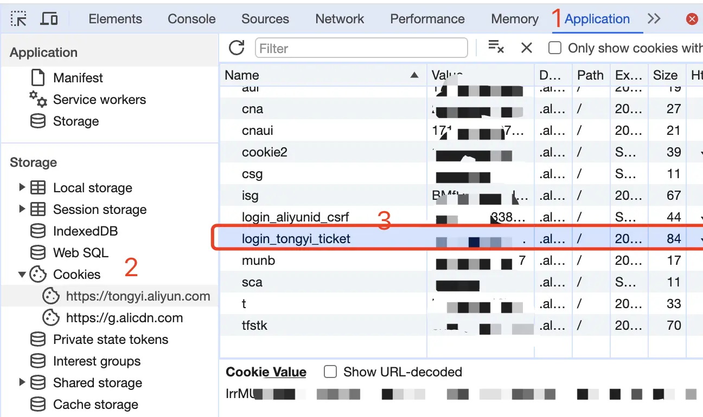

### 智谱清言

从 [智谱清言](https://chatglm.cn/) 获取 refresh_token

进入智谱清言随便发起一个对话，然后 F12 打开开发者工具，从 Application > Cookies 中找到`chatglm_refresh_token`的值，这将作为 Authorization 的 Bearer Token 值：`Authorization: Bearer TOKEN`

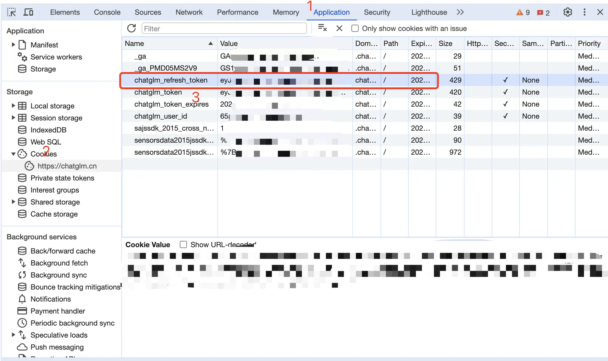

### 秘塔 AI

从 [秘塔 AI 搜索](https://metaso.cn/) 获取`uid`和`sid`并使用`-`拼接：

进入秘塔 AI 搜索，登录账号（**建议登录账号，否则可能遭遇奇怪的限制**），然后 F12 打开开发者工具，从 Application > Cookies 中找到`uid`和`sid`的值。

将 uid 和 sid 拼接：`uid-sid`，如 `65e91a6b2bac5b600dd8526a-5e7acc465b114236a8d9de26c9f41846`。

这将作为 Authorization 的 Bearer Token 值：`Authorization: Bearer uid-sid`

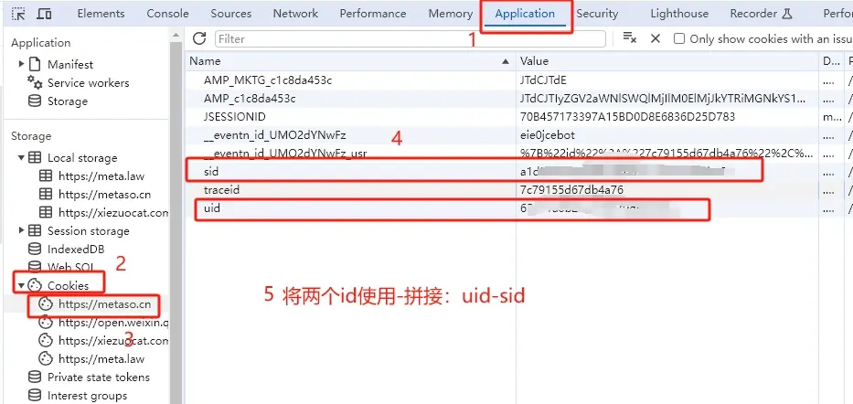

### 讯飞星火

从 [xinghuo.xfyun.cn](https://xinghuo.xfyun.cn/) 获取 ssoSessionId

进入 Spark 登录并发起一个对话，从 Cookie 获取 `ssoSessionId` 值，由于星火平台禁用 F12 开发者工具，请安装 `Cookie-Editor` 浏览器插件查看你的 Cookie。

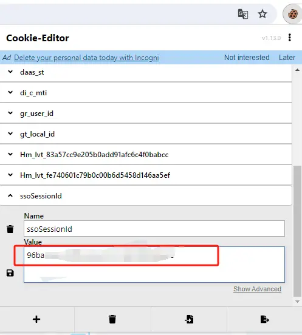

这个值将作为 Authorization 的 Bearer Token 值：`Authorization: Bearer TOKEN`

**注意：如果退出登录或重新登录将可能导致 ssoSessionId 失效！**

### 海螺 AI

从 [海螺 AI](https://hailuoai.com/) 获取 token

进入海螺 AI 随便发起一个对话，然后 F12 打开开发者工具，从 Application > LocalStorage 中找到`_token`的值，这将作为 Authorization 的 Bearer Token 值：`Authorization: Bearer TOKEN`

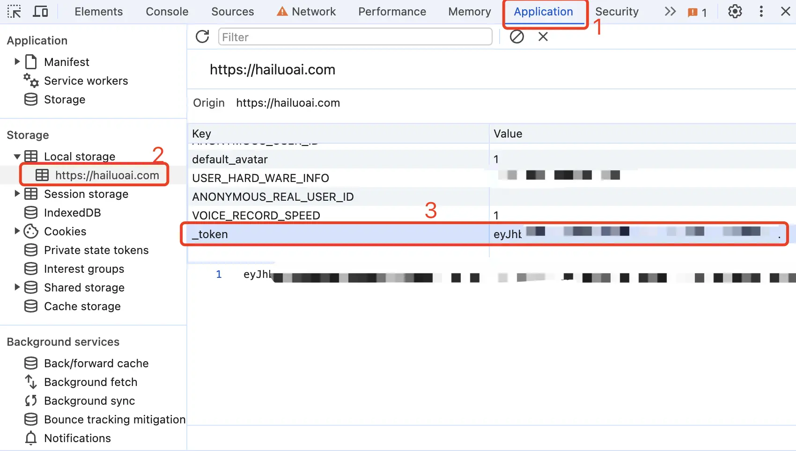

### DeepSeek

从 [DeepSeek](https://chat.deepseek.com/) 获取 userToken value

进入 DeepSeek 随便发起一个对话，然后 F12 打开开发者工具，从 Application > LocalStorage 中找到`userToken`中的 value 值，这将作为 Authorization 的 Bearer Token 值：`Authorization: Bearer TOKEN`

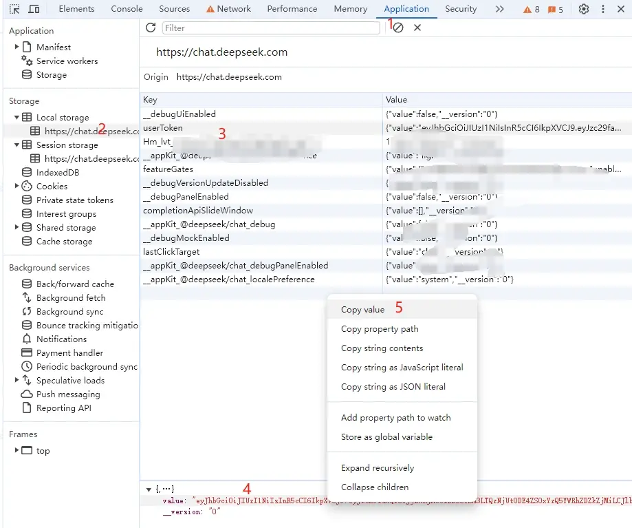

### docker 部署:

```yaml
services:
  kimi-free-api:
    container_name: kimi-free-api
    image: vinlic/kimi-free-api:latest
    restart: always
    ports:
      - "10001:8000"
    environment:
      - TZ=Asia/Shanghai
  step-free-api:
    container_name: step-free-api
    image: vinlic/step-free-api:latest
    restart: always
    ports:
      - "10002:8000"
    environment:
      - TZ=Asia/Shanghai
  qwen-free-api:
    container_name: qwen-free-api
    image: vinlic/qwen-free-api:latest
    restart: always
    ports:
      - "10003:8000"
    environment:
      - TZ=Asia/Shanghai
  glm-free-api:
    container_name: glm-free-api
    image: vinlic/glm-free-api:latest
    restart: always
    ports:
      - "10004:8000"
    environment:
      - TZ=Asia/Shanghai
  metaso-free-api:
    container_name: metaso-free-api
    image: vinlic/metaso-free-api:latest
    restart: always
    ports:
      - "10005:8000"
    environment:
      - TZ=Asia/Shanghai
  spark-free-api:
    container_name: spark-free-api
    image: vinlic/spark-free-api:latest
    restart: always
    ports:
      - "10006:8000"
    environment:
      - TZ=Asia/Shanghai
  hailuo-free-api:
    container_name: hailuo-free-api
    image: vinlic/hailuo-free-api:latest
    restart: always
    ports:
      - "10007:8000"
    environment:
      - TZ=Asia/Shanghai
  deepseek-free-api:
    container_name: deepseek-free-api
    image: vinlic/deepseek-free-api:latest
    restart: always
    ports:
      - "10008:8000"
    environment:
      - TZ=Asia/Shanghai
```

## 接入 one-api

### free-api 接入

以智谱清言为例, 说明一下如何将上面的 free-api 接入到 one-api 中. 假设 docker 部署在 192.168.1.2 服务器上, 智谱清言的 free-api 端口是: `10004`.

在 one-api 的渠道管理页面添加新的渠道:

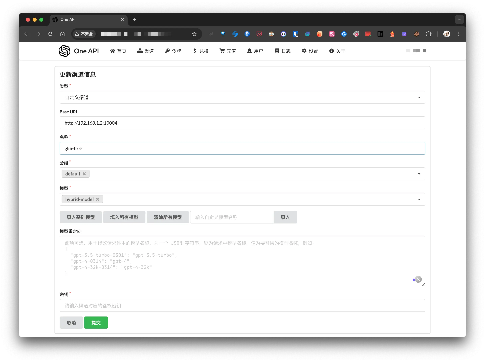

- 类型: 自定义渠道
- Base URL: docker 部署智谱清言的地址
- 名称: 随便
- 分组: 默认即可
- 模型: 我这里写的自定义的模型名称, 这个需要和 OpenAI client 中的 `model` 对应;
- 密钥: 前面获取的 `chatglm_refresh_token`

添加完成后可在渠道管理页面进行测试.

### 正常渠道接入

现在各大厂商为了推广自己的 AI API, 注册都会赠送一定额度的 Token, 还是以智谱清言为例, 讲讲如何接入到 one-api.

注册并登录 [智谱清言开放平台](https://bigmodel.cn/), 注册就送大礼包, 不过只有 1 个月有效期:

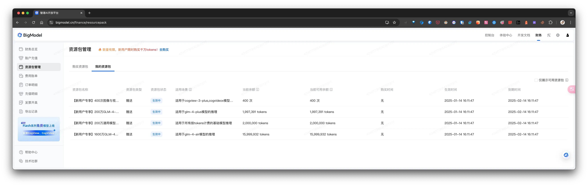

[智谱清言开放平台-个人中心-项目管理-API keys](https://bigmodel.cn/usercenter/proj-mgmt/apikeys) 获取 API key.

然后再 one-api 添加新的渠道:
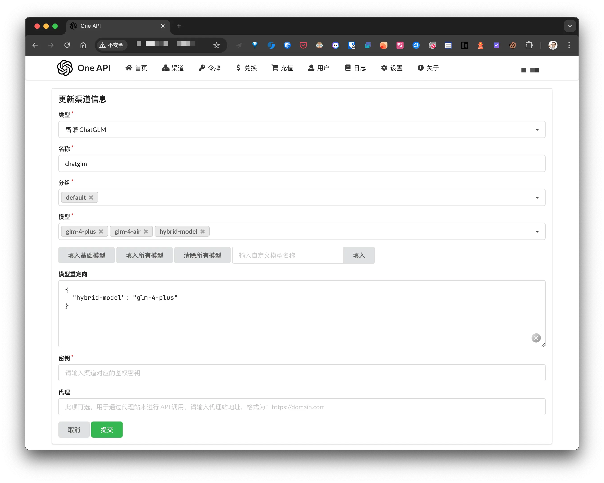

**密钥** 为智谱清言开放平台提供的 API key. 需要注意的是 **模型** 和 **模型重定向**:

- **模型**: OpenAI API 接口中的 `model` 名称会匹配 one-api 的模型名称, 只有匹配上了才能正常调用, npx-card 其实只会使用到 `hybrid-model`, 我是为了方便在 one-api 上测试, 所以添加了前面 2 个;
- **模型重定向**: one-api 会根据这里的配置修改最终的 `model` 名称, 这里的意思是将 client 传入的 `hybrid-model` 修改为 `glm-4-plus`, 最后调用智谱清言的接口.

最后就是在 npx 中使用了:

```javascript
// 初始化 OpenAI 客户端
this.openai = new OpenAI({
  apiKey: config.apiKey,
  baseURL: config.baseUrl,
});
this.model = config.model;

const stream = await this.openai.chat.completions.create({
  model: this.model,
  messages: [...this.context, { role: "user", content: message }],
  stream: true,
});

for await (const chunk of stream) {
  const content = chunk.choices[0]?.delta?.content || "";
  if (content) {
    process.stdout.write(content);
  }
}
```

---

## 安全防控

因为我将 one-api 暴露到公网为后面的 LLM 提供代理服务, 为保证服务器的安全, 需要做一定的安全设置.

我的服务通过 雷池 Safeline 进行代理, 而 Safeline 不允许直接修改 Nginx 配置(会定时覆盖), 所以需要为配置文件添加只读权限:

```bash
chattr +i 配置名
```

下面是具体的安全设置.

### 禁用注册

内网登录 one-api 控制台, 禁用注册功能:

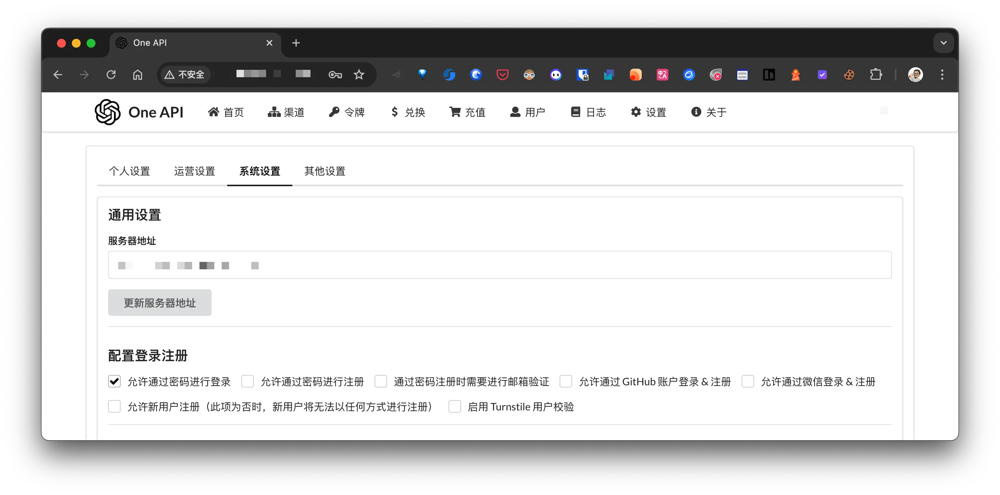

修改密码强度, 这个就不贴图了.

### 禁用主路径

因为 OpenAI API 只会访问 `/v1` 的接口, 所以禁用除 `/v1/**` 之外的其他所有路径:

```bash
server {
    listen 443 ssl;
    server_name oneapi.dong4j.ink;

    # SSL 证书配置
    ssl_certificate /path/to/certificate.crt;
    ssl_certificate_key /path/to/private.key;

    # 仅允许访问 /v1 和 /v1/** 路径
    location ^~ /v1 {
        proxy_pass http://backend_39;  # 转发到后端
        proxy_set_header Host $http_host;
        include proxy_params;
    }

    # 禁止访问其他路径
    location / {
        return 403;  # 返回 403 Forbidden
    }
}
```

### 只允许 POST

OpenAI API 只会使用 POST, 所以禁用其他请求方式:

```bash
location ^~ /v1 {
    limit_except POST {
        deny all; # 非 POST 请求返回 405 Method Not Allowed
    }
}
```

## 性能调优

```
# 允许访问 /v1 和 /v1/** 路径
location ^~ /v1 {
    limit_except POST {
        deny all; # 非 POST 请求返回 405 Method Not Allowed
    }
    proxy_pass http://backend_39;

    # 代理优化配置
    proxy_buffering off;
    chunked_transfer_encoding on;
    tcp_nopush on;
    tcp_nodelay on;
    keepalive_timeout 120;

		...
}

# 禁止访问其他路径，包括 /
location / {
    return 403; # 禁止访问
}
```

**解释如下:**

```
# 关闭代理缓冲。当设置为off时，Nginx会立即将客户端请求发送到后端服务器，并立即将从后端服务器接收到的响应发送回客户端。
proxy_buffering off;
# 启用分块传输编码。分块传输编码允许服务器为动态生成的内容分块发送数据，而不需要预先知道内容的大小。
chunked_transfer_encoding on;
# 开启TCP_NOPUSH，这告诉Nginx在数据包发送到客户端之前，尽可能地发送数据。这通常在sendfile使用时配合使用，可以提高网络效率。
tcp_nopush on;
# 开启TCP_NODELAY，这告诉Nginx不延迟发送数据，立即发送小数据包。在某些情况下，这可以减少网络的延迟。
tcp_nodelay on;
# 设置保持连接的超时时间，这里设置为120秒。如果在这段时间内，客户端和服务器之间没有进一步的通信，连接将被关闭。
keepalive_timeout 120;
```
