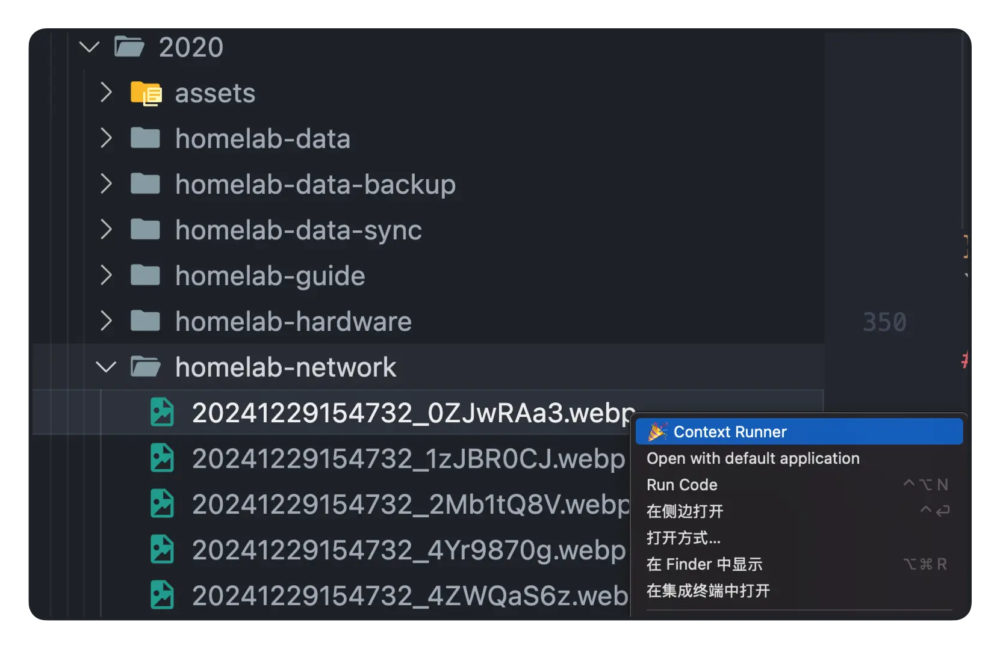
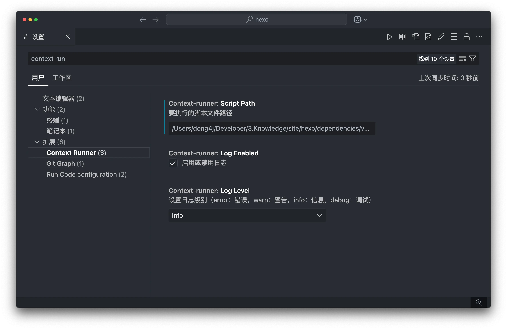

<!-- markdownlint-disable-next-line MD033 -->
<meta name="referrer" content="no-referrer"/>


## 引言

VSCode 插件开发可能对初学者来说有些陌生。本文将从最简单的 Hello World 插件开始，一步步带你实现一个实用的图片处理工具。我们会先开发一个最基础的插件，然后逐步添加功能，最终实现一个可以帮助博主快速处理图片的工具。

## 第一部分：Hello World 插件

### 1. 环境准备

首先，确保你的电脑上已安装：

- Node.js（建议 14.x 或更高版本）
- Visual Studio Code
- Git（可选）

### 2. 创建第一个插件

1. 安装 VSCode 插件生成器：

```bash
npm install -g yo generator-code
```

2. 创建插件项目：

```bash
yo code
```

3. 按照提示填写基本信息：

```
? What type of extension do you want to create? New Extension (TypeScript)
? What's the name of your extension? hello-world
? What's the identifier of your extension? hello-world
? What's the description of your extension? My first extension
? Initialize a git repository? Yes
? Which package manager to use? npm
```

### 3. 理解基础项目结构

生成的项目包含以下主要文件：

```
hello-world/
  ├── .vscode/                # VSCode 配置
  ├── src/
  │   └── extension.ts        # 插件主要代码
  ├── package.json           # 插件配置文件
  └── README.md              # 说明文档
```

### 4. 实现 Hello World

1. 修改 `package.json` 添加命令：

```json
{
  "contributes": {
    "commands": [
      {
        "command": "hello-world.helloWorld",
        "title": "Hello World"
      }
    ]
  }
}
```

2. 在 `src/extension.ts` 中实现命令：

```typescript
import * as vscode from "vscode";

export function activate(context: vscode.ExtensionContext) {
  let disposable = vscode.commands.registerCommand(
    "hello-world.helloWorld",
    () => {
      vscode.window.showInformationMessage("Hello World!");
    }
  );

  context.subscriptions.push(disposable);
}
```

3. 按 F5 运行插件，在命令面板（Cmd/Ctrl + Shift + P）输入 "Hello World" 测试。

## 第二部分：图片处理插件

在掌握了基础知识后，让我们来开发一个实用的图片处理插件。

### 1. 需求分析

- 在文件资源管理器中右键图片文件
- 执行自定义的图片处理脚本
- 支持配置不同的处理方式

### 2. 基础版本实现

1. 修改 `package.json` 添加右键菜单：

```json
{
  "contributes": {
    "commands": [
      {
        "command": "script-runner.run",
        "title": "处理图片"
      }
    ],
    "menus": {
      "explorer/context": [
        {
          "command": "script-runner.run",
          "when": "resourceExtname =~ /\\.(png|jpg|jpeg)$/"
        }
      ]
    }
  }
}
```

2. 实现基础功能：

```typescript
import * as vscode from "vscode";
import * as cp from "child_process";

export function activate(context: vscode.ExtensionContext) {
  let disposable = vscode.commands.registerCommand(
    "script-runner.run",
    (uri: vscode.Uri) => {
      // 获取文件路径
      const filePath = uri.fsPath;

      // 执行简单的压缩命令
      const command = `convert '${filePath}' -quality 85 '${filePath}'`;

      cp.exec(command, (error) => {
        if (error) {
          vscode.window.showErrorMessage("图片处理失败");
          return;
        }
        vscode.window.showInformationMessage("图片处理成功");
      });
    }
  );

  context.subscriptions.push(disposable);
}
```

### 3. 添加配置支持

1. 在 `package.json` 中添加配置项：

```json
{
  "contributes": {
    "configuration": {
      "title": "Script Runner",
      "properties": {
        "scriptRunner.imageQuality": {
          "type": "number",
          "default": 85,
          "description": "图片压缩质量"
        }
      }
    }
  }
}
```

2. 读取配置：

```typescript
const config = vscode.workspace.getConfiguration("scriptRunner");
const quality = config.get("imageQuality") || 85;
```

### 4. 进阶功能

逐步添加更多功能：

1. 支持多种图片处理命令
2. 添加进度提示
3. 支持取消操作
4. 错误处理

[完整代码实现见上文]

## 开发技巧和注意事项

1. **调试技巧**

   - 使用 `console.log` 输出调试信息
   - F5 启动调试环境
   - 使用 VSCode 的调试控制台查看输出

2. **常见问题**

   - 命令不显示：检查 `package.json` 的 `contributes` 配置
   - 脚本执行失败：检查命令路径和权限
   - 配置不生效：检查配置项名称是否正确

3. **最佳实践**
   - 使用 TypeScript 类型检查
   - 及时释放资源
   - 提供清晰的错误提示

## 总结

通过这个教程，我们从最简单的 Hello World 开始，逐步实现了一个实用的图片处理插件。这个过程展示了 VSCode 插件开发的基本流程和关键概念。建议初学者：

1. 先从简单的 Hello World 开始
2. 理解插件的基本结构
3. 掌握命令和菜单的配置
4. 逐步添加更复杂的功能

## 参考资源

- [VSCode 插件开发文档](https://code.visualstudio.com/api)
- [VSCode 插件示例](https://github.com/microsoft/vscode-extension-samples)
- [Publishing Extensions](https://code.visualstudio.com/api/working-with-extensions/publishing-extension)

## 实战案例：开发一个通用脚本执行助手

### 开发背景

在日常博客写作过程中，我遇到了以下问题：

1. 使用 CleanShot X 截图后，图片体积较大，需要压缩处理
2. 为了优化博客加载速度，需要将图片转换为 WebP 格式
3. 虽然有现成的脚本可以处理这些任务，但每次都需要：
   - 打开终端
   - 切换到正确的目录
   - 执行脚本命令
4. 这个流程很繁琐，影响写作效率

### 解决方案

开发一个 VSCode 插件，具有以下特点：

1. 通过右键菜单直接处理文件
2. 支持自定义脚本配置
3. 不限于图片处理，可以处理任何文件类型

### 具体实现

1. 配置文件设计：

```json
{
  "scriptRunner.scripts": {
    "compressImage": {
      "name": "压缩图片",
      "command": "convert '${file}' -quality 85 -resize '1920x1080>' '${file}'",
      "fileTypes": [".png", ".jpg", ".jpeg"],
      "showInContextMenu": true
    },
    "convertToWebp": {
      "name": "转换为WebP",
      "command": "cwebp -q 85 '${file}' -o '${file}.webp'",
      "fileTypes": [".png", ".jpg", ".jpeg"]
    },
    "formatMarkdown": {
      "name": "格式化Markdown",
      "command": "prettier --write '${file}'",
      "fileTypes": [".md"]
    }
  }
}
```

2. 动态注册命令：

```typescript
function registerScriptCommands(context: vscode.ExtensionContext) {
  const config = vscode.workspace.getConfiguration("scriptRunner");
  const scripts = config.get("scripts") as { [key: string]: ScriptConfig };

  Object.entries(scripts).forEach(([id, script]) => {
    const command = vscode.commands.registerCommand(
      `script-runner.${id}`,
      async (uri: vscode.Uri) => {
        await executeScript(uri, script);
      }
    );
    context.subscriptions.push(command);
  });
}
```

3. 脚本执行逻辑：

```typescript
async function executeScript(uri: vscode.Uri, script: ScriptConfig) {
  const filePath = uri.fsPath;
  const fileDir = path.dirname(filePath);

  // 替换命令中的变量
  const command = script.command
    .replace(/\${file}/g, filePath)
    .replace(/\${fileDir}/g, fileDir);

  try {
    await vscode.window.withProgress(
      {
        location: vscode.ProgressLocation.Notification,
        title: `执行脚本: ${script.name}`,
        cancellable: true,
      },
      async (progress, token) => {
        return new Promise((resolve, reject) => {
          const process = cp.exec(command, { cwd: fileDir }, (error) => {
            if (error) {
              reject(error);
              return;
            }
            resolve(null);
          });

          token.onCancellationRequested(() => {
            process.kill();
          });
        });
      }
    );

    vscode.window.showInformationMessage(`${script.name} 执行成功`);
  } catch (error) {
    vscode.window.showErrorMessage(`${script.name} 执行失败: ${error.message}`);
  }
}
```

### 使用效果



1. 在文件资源管理器中右键图片文件，可以看到配置的脚本命令
2. 点击命令后，插件会：
   - 显示进度提示
   - 执行相应的脚本
   - 显示执行结果

**配置**:



### 开发心得

1. **配置驱动开发**

   - 通过配置文件定义脚本，而不是硬编码
   - 用户可以根据需求自定义脚本
   - 支持多种文件类型和处理方式

2. **用户体验优化**

   - 添加进度提示
   - 支持取消操作
   - 清晰的成功/失败提示

3. **扩展性考虑**

   - 支持变量替换
   - 可配置工作目录
   - 灵活的文件类型匹配

4. **实际收益**
   - 大大提高了图片处理效率
   - 减少了重复操作
   - 提升了写作体验

通过这个插件的开发，不仅解决了实际问题，也积累了 VSCode 插件开发的经验。希望这个案例能给想要开发 VSCode 插件的同学一些参考。
